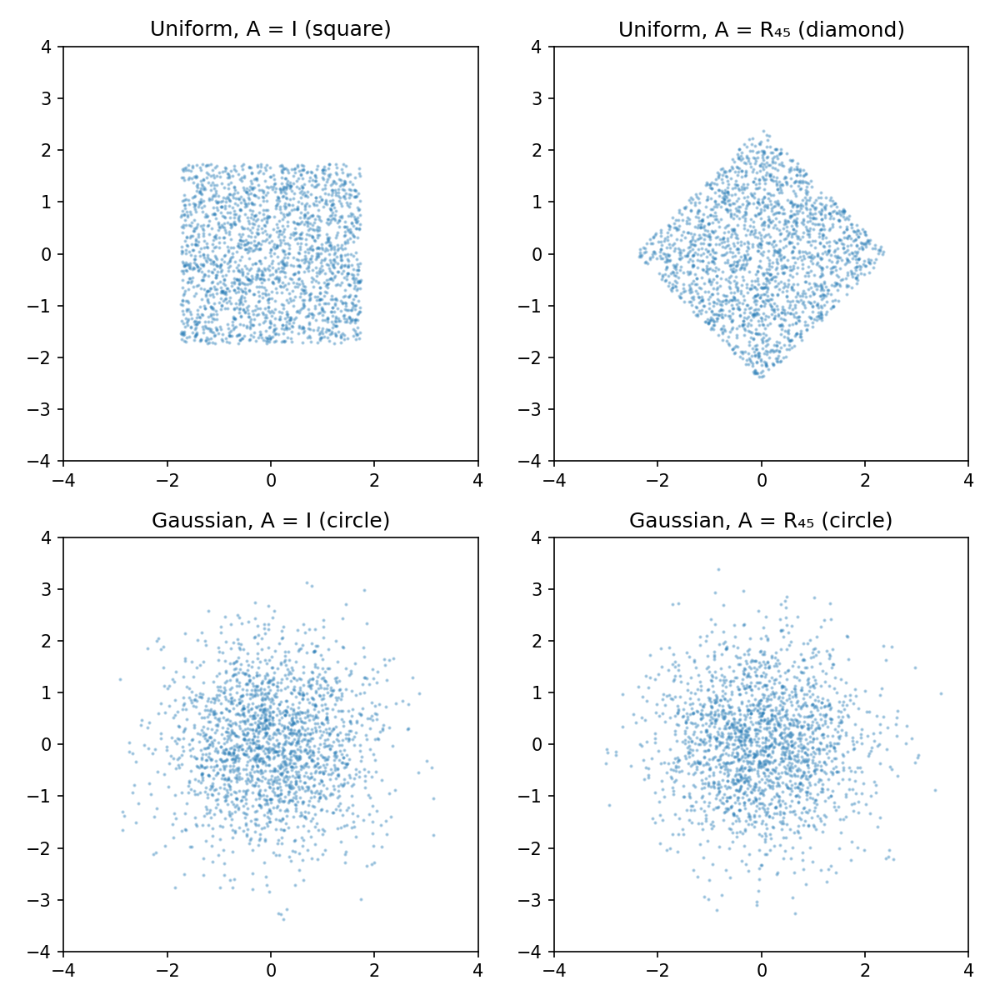
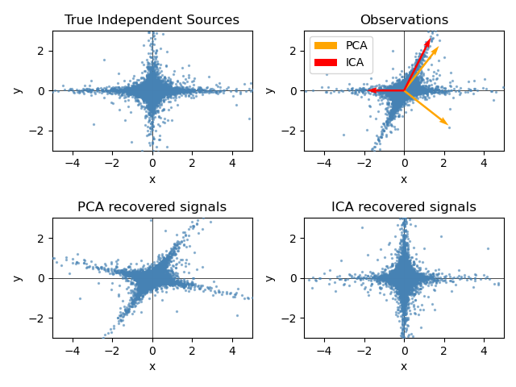

# Principal Component Analysis and Independent Component Analysis
### From Variance Maximization to Independent Sources
*OMSCS ML | Continuous Latent Variables Unit*

---

## Table of Contents

- [Principal Component Analysis and Independent Component Analysis](#principal-component-analysis-and-independent-component-analysis)
    - [From Variance Maximization to Independent Sources](#from-variance-maximization-to-independent-sources)
  - [Table of Contents](#table-of-contents)
  - [1. Motivation: Low-Dimensional Structure in High-Dimensional Data](#1-motivation-low-dimensional-structure-in-high-dimensional-data)
  - [2. PCA: Maximum Variance Formulation](#2-pca-maximum-variance-formulation)
    - [2.1 The Setup](#21-the-setup)
    - [2.2 Deriving the First Principal Component](#22-deriving-the-first-principal-component)
    - [2.3 Additional Components by Induction](#23-additional-components-by-induction)
  - [3. PCA: Minimum Reconstruction Error Formulation](#3-pca-minimum-reconstruction-error-formulation)
    - [3.1 The Setup](#31-the-setup)
    - [3.2 Optimizing the Projection Coordinates](#32-optimizing-the-projection-coordinates)
    - [3.3 Optimizing the Basis Directions](#33-optimizing-the-basis-directions)
    - [3.4 Why Both Formulations Agree](#34-why-both-formulations-agree)
  - [4. Applications of PCA](#4-applications-of-pca)
    - [4.1 Data Compression and Visualization](#41-data-compression-and-visualization)
    - [4.2 Whitening (Sphereing)](#42-whitening-sphereing)
  - [5. Probabilistic PCA](#5-probabilistic-pca)
    - [5.1 Motivation and the PPCA-to-VAE Arc](#51-motivation-and-the-ppca-to-vae-arc)
    - [5.2 The Generative Model](#52-the-generative-model)
    - [5.3 The Marginal Distribution $p(\\mathbf{x})$](#53-the-marginal-distribution-pmathbfx)
    - [5.4 Maximum Likelihood Solution](#54-maximum-likelihood-solution)
    - [5.5 The Posterior $p(\\mathbf{z} \\mid \\mathbf{x})$ and the Latent Projection](#55-the-posterior-pmathbfz-mid-mathbfx-and-the-latent-projection)
    - [5.6 EM for PPCA (Pointer)](#56-em-for-ppca-pointer)
    - [5.7 Factor Analysis: One Structural Difference](#57-factor-analysis-one-structural-difference)
  - [6. From PCA to ICA: Why Non-Gaussianity Matters](#6-from-pca-to-ica-why-non-gaussianity-matters)
    - [6.1 PCA's Fundamental Limitation: Rotational Ambiguity](#61-pcas-fundamental-limitation-rotational-ambiguity)
    - [6.2 The Cocktail Party Problem](#62-the-cocktail-party-problem)
    - [6.3 The ICA Model](#63-the-ica-model)
    - [6.4 Ambiguities Inherent in ICA](#64-ambiguities-inherent-in-ica)
    - [6.5 Why Gaussian Latents Are Forbidden](#65-why-gaussian-latents-are-forbidden)
    - [6.6 Independence vs. Uncorrelatedness](#66-independence-vs-uncorrelatedness)
  - [7. ICA Estimation: Finding Independent Components](#7-ica-estimation-finding-independent-components)
    - [7.1 The Core Idea: Non-Gaussianity as a Target](#71-the-core-idea-non-gaussianity-as-a-target)
    - [7.2 Kurtosis](#72-kurtosis)
    - [7.3 Negentropy](#73-negentropy)
    - [7.4 Mutual Information and the Infomax Principle](#74-mutual-information-and-the-infomax-principle)
    - [7.5 Preprocessing: Centering and Whitening](#75-preprocessing-centering-and-whitening)
    - [7.6 The FastICA Algorithm](#76-the-fastica-algorithm)
  - [8. Sources and Further Reading](#8-sources-and-further-reading)

---

## 1. Motivation: Low-Dimensional Structure in High-Dimensional Data

A recurring theme in machine learning is that high-dimensional data often lives on a much lower-dimensional subspace — or at least stays close to one. The data's *observed* dimensionality ($D$) is the number of features we measure; its *intrinsic* dimensionality is the number of degrees of freedom actually driving variation.

**A concrete example.** Consider a dataset of portrait photographs, each stored as a 256×256 grayscale image — $D = 65{,}536$ dimensions. Yet the space of natural-looking faces is controlled by a much smaller number of factors: lighting direction, head pose (left-right tilt, up-down), facial expression, and a set of identity-specific features. Empirically, somewhere between 50 and 200 directions account for almost all meaningful variation in a large face dataset; the remaining tens of thousands of pixel dimensions are largely redundant once those factors are fixed. The high dimensionality is an artifact of the pixel representation, not of the underlying structure.

The same pattern appears in motion capture data. Recording an actor walking attaches 50 markers to the body and tracks their 3D positions — $D = 150$ dimensions. But walking is a periodic, mechanically constrained motion: once you know the gait phase and a few parameters like stride length and speed, the positions of all 150 coordinates are largely determined. The intrinsic dimensionality is perhaps a handful; the rest is noise and redundancy.

**Why does this matter?** Two reasons. First, *computational efficiency*: algorithms that scale with $D$ are expensive when $D$ is large, but if the true structure is $M$-dimensional with $M \ll D$, we can work in the lower-dimensional space. Second, *generalization*: a model that exploits the manifold structure concentrates probability mass where data actually appears, rather than spreading it diffusely across all of $\mathbb{R}^D$.

**The modeling strategy.** Assume each observed data point $\mathbf{x} \in \mathbb{R}^D$ is generated from a lower-dimensional latent variable $\mathbf{z} \in \mathbb{R}^M$ with $M < D$, via some (possibly noisy) mapping. Finding this mapping — and the values of $\mathbf{z}$ for each observation — is the problem these notes address.

We start with the simplest possible version: a *linear* mapping and *Gaussian* latent distribution. This is PCA and its probabilistic generalization. We then ask what happens when we relax the Gaussian assumption, which leads to ICA.

---

## 2. PCA: Maximum Variance Formulation

### 2.1 The Setup

**Notation.** We have $N$ data points $\{\mathbf{x}_n\}_{n=1}^N$ with $\mathbf{x}_n \in \mathbb{R}^D$. We want to find a direction $\mathbf{u}_1 \in \mathbb{R}^D$ to project onto — intuitively, the direction along which the data varies most.

Define the sample mean:
$$\bar{\mathbf{x}} = \frac{1}{N} \sum_{n=1}^N \mathbf{x}_n$$

and the sample covariance matrix:
$$\mathbf{S} = \frac{1}{N} \sum_{n=1}^N (\mathbf{x}_n - \bar{\mathbf{x}})(\mathbf{x}_n - \bar{\mathbf{x}})^T \in \mathbb{R}^{D \times D}$$

Note that $\mathbf{S}$ is symmetric ($\mathbf{S}^T = \mathbf{S}$) and positive semidefinite. Both properties will matter shortly.

**Why maximize variance?** Picture dropping 2D data points perpendicularly onto a number line — each point lands at a single scalar value, its projection. If the line runs through the main spread of the data, the projected points land far apart and remain distinguishable. If the line runs perpendicular to the spread, all points collapse near the same value and the structure is lost. Maximizing the variance of the projected values is precisely the criterion that keeps the projected points as spread out and distinguishable as possible.

**The normalization convention.** We are searching for a *direction*, not a vector with a particular magnitude. We therefore constrain $\mathbf{u}_1$ to be a unit vector: $\mathbf{u}_1^T \mathbf{u}_1 = 1$. Without this, the optimization is unbounded — we could scale $\|\mathbf{u}_1\| \to \infty$ to inflate the projected variance arbitrarily.

**The projection.** Each data point $\mathbf{x}_n$ projects onto the scalar $\mathbf{u}_1^T \mathbf{x}_n$. The mean of the projected values is $\mathbf{u}_1^T \bar{\mathbf{x}}$, and the variance of the projected values is:

$$\frac{1}{N} \sum_{n=1}^N \left( \mathbf{u}_1^T \mathbf{x}_n - \mathbf{u}_1^T \bar{\mathbf{x}} \right)^2 = \frac{1}{N} \sum_{n=1}^N \left( \mathbf{u}_1^T (\mathbf{x}_n - \bar{\mathbf{x}}) \right)^2 = \mathbf{u}_1^T \mathbf{S} \mathbf{u}_1$$

The last step rewrites each squared scalar as a quadratic form: for $\mathbf{v}_n = \mathbf{x}_n - \bar{\mathbf{x}}$, we have $(\mathbf{u}_1^T\mathbf{v}_n)^2 = \mathbf{u}_1^T(\mathbf{v}_n\mathbf{v}_n^T)\mathbf{u}_1$. Summing over $n$ and dividing by $N$ gives $\mathbf{u}_1^T\mathbf{S}\mathbf{u}_1$ by definition of $\mathbf{S}$.

**So the problem is:**
$$\max_{\mathbf{u}_1} \; \mathbf{u}_1^T \mathbf{S} \mathbf{u}_1 \qquad \text{subject to} \qquad \mathbf{u}_1^T \mathbf{u}_1 = 1$$

This is a Lagrange-multiplier problem. (See the Lagrange Multipliers notes for the general method; here we apply it directly.)

### 2.2 Deriving the First Principal Component

**Forming the Lagrangian.** Introduce a multiplier $\lambda_1$ for the constraint $\mathbf{u}_1^T \mathbf{u}_1 - 1 = 0$. The Lagrangian is:

$$\mathcal{L}(\mathbf{u}_1, \lambda_1) = \mathbf{u}_1^T \mathbf{S} \mathbf{u}_1 + \lambda_1 \left(1 - \mathbf{u}_1^T \mathbf{u}_1\right)$$

**Taking the gradient.** Differentiate with respect to $\mathbf{u}_1$ and set to zero. For the first term, we use the identity $\nabla_{\mathbf{u}} (\mathbf{u}^T \mathbf{A} \mathbf{u}) = 2\mathbf{A}\mathbf{u}$, which holds whenever $\mathbf{A}$ is symmetric — which $\mathbf{S}$ is. To see why, write $f(\mathbf{u}) = \mathbf{u}^T\mathbf{A}\mathbf{u} = \sum_i \sum_j u_i A_{ij} u_j$ and differentiate with respect to a single component $u_k$. By the product rule, the $k$th partial derivative picks up two contributions — once when $i = k$ and once when $j = k$:

$$\frac{\partial f}{\partial u_k} = \sum_j A_{kj} u_j + \sum_i u_i A_{ik} = (\mathbf{A}\mathbf{u})_k + (\mathbf{A}^T\mathbf{u})_k$$

When $\mathbf{A}$ is symmetric ($\mathbf{A} = \mathbf{A}^T$), both terms are identical, giving $\partial f / \partial u_k = 2(\mathbf{A}\mathbf{u})_k$. Stacking all $k$ gives $\nabla_\mathbf{u} f = 2\mathbf{A}\mathbf{u}$. For the second term, $\nabla_{\mathbf{u}}(\mathbf{u}^T\mathbf{u}) = 2\mathbf{u}$. Setting the combined gradient to zero:

$$2\mathbf{S}\mathbf{u}_1 - 2\lambda_1 \mathbf{u}_1 = \mathbf{0}$$

$$\boxed{\mathbf{S}\mathbf{u}_1 = \lambda_1 \mathbf{u}_1}$$

This is the eigenvector equation for $\mathbf{S}$: at any stationary point of the constrained problem, $\mathbf{u}_1$ must be an eigenvector of the data covariance matrix with eigenvalue $\lambda_1$.

**Identifying the maximum.** Stationary points exist wherever $\mathbf{u}_1$ is any eigenvector of $\mathbf{S}$ — but which one maximizes the projected variance? Left-multiply the eigenvector equation by $\mathbf{u}_1^T$:

$$\mathbf{u}_1^T \mathbf{S} \mathbf{u}_1 = \lambda_1 \underbrace{\mathbf{u}_1^T \mathbf{u}_1}_{=1} = \lambda_1$$

The projected variance *equals the eigenvalue*. To see why this is meaningful: $\mathbf{u}_1^T\mathbf{S}\mathbf{u}_1$ is a quadratic form — it applies $\mathbf{S}$ to $\mathbf{u}_1$ to get a new vector $\mathbf{S}\mathbf{u}_1$, then asks how much of that vector points in the direction of $\mathbf{u}_1$. When $\mathbf{u}_1$ is an eigenvector, $\mathbf{S}\mathbf{u}_1 = \lambda_1\mathbf{u}_1$, so the answer is simply $\lambda_1$ — the eigenvalue is the factor by which $\mathbf{S}$ stretches $\mathbf{u}_1$ along its own direction, which is exactly the variance of the data in that direction. Choosing the direction of largest stretch therefore means choosing the direction of maximum data spread. Since $\mathbf{S}$ is positive semidefinite all eigenvalues are $\geq 0$, and the maximum is achieved by choosing $\mathbf{u}_1$ to be the eigenvector corresponding to the **largest eigenvalue** $\lambda_1$ of $\mathbf{S}$. This eigenvector is called the **first principal component**.

**So what?** The algebra has revealed something geometrically meaningful: the direction of maximum data spread is precisely the top eigenvector of the covariance matrix. The eigenvectors of $\mathbf{S}$ are the natural coordinate axes of the data's variance structure, and the eigenvalues tell us how much variance is captured in each direction. The covariance matrix *encodes* all pairwise spread information, and its eigenvectors diagonalize it, producing a coordinate system where the variables are uncorrelated.

### 2.3 Additional Components by Induction

For an $M$-dimensional projection, we want $M$ orthonormal directions $\mathbf{u}_1, \ldots, \mathbf{u}_M$ that jointly maximize total projected variance. The argument extends by induction (see Bishop Exercise 12.1 for the full proof):

- Assume the first $m$ directions are the top-$m$ eigenvectors of $\mathbf{S}$.
- To find the $(m+1)$th direction, maximize projected variance subject to normalization *and* orthogonality to all previous directions. Enforce these constraints via Lagrange multipliers.
- Using the orthonormality of the existing eigenvectors, the cross-constraint terms vanish and one again arrives at $\mathbf{S}\mathbf{u}_{m+1} = \lambda_{m+1}\mathbf{u}_{m+1}$.
- The maximum is achieved by the $(m+1)$th largest eigenvector.

**Why the cross-constraint terms vanish — a sketch.** The Lagrangian for the $(m+1)$th direction includes multipliers $\gamma_j$ for each orthogonality constraint $\mathbf{u}_{m+1}^T\mathbf{u}_j = 0$ ($j = 1, \ldots, m$), in addition to the normalization multiplier $\lambda_{m+1}$:

$$\mathcal{L} = \mathbf{u}_{m+1}^T\mathbf{S}\mathbf{u}_{m+1} - \lambda_{m+1}\!\left(\mathbf{u}_{m+1}^T\mathbf{u}_{m+1} - 1\right) - \sum_{j=1}^m \gamma_j\,\mathbf{u}_{m+1}^T\mathbf{u}_j$$

Setting $\partial\mathcal{L}/\partial\mathbf{u}_{m+1} = \mathbf{0}$ and dividing by 2:

$$\mathbf{S}\mathbf{u}_{m+1} - \lambda_{m+1}\mathbf{u}_{m+1} - \frac{1}{2}\sum_{j=1}^m \gamma_j\mathbf{u}_j = \mathbf{0}$$

Left-multiply by $\mathbf{u}_k^T$ for any $k \leq m$. Since $\mathbf{u}_k^T\mathbf{u}_{m+1} = 0$ (by the constraint) and $\mathbf{u}_k^T\mathbf{u}_j = \delta_{kj}$ (by inductive hypothesis), this becomes:

$$\mathbf{u}_k^T\mathbf{S}\mathbf{u}_{m+1} - 0 - \frac{\gamma_k}{2} = 0$$

The remaining term vanishes because $\mathbf{u}_k$ is already an eigenvector of $\mathbf{S}$ (inductive hypothesis): $\mathbf{u}_k^T\mathbf{S}\mathbf{u}_{m+1} = \mathbf{u}_{m+1}^T\mathbf{S}\mathbf{u}_k = \lambda_k\underbrace{\mathbf{u}_{m+1}^T\mathbf{u}_k}_{=\,0} = 0$, where symmetry of $\mathbf{S}$ was used to transpose. Therefore $\gamma_k = 0$ for every $k \leq m$ — all the cross-constraint multipliers are automatically zero — and the stationarity condition reduces to $\mathbf{S}\mathbf{u}_{m+1} = \lambda_{m+1}\mathbf{u}_{m+1}$. The maximum is achieved at the $(m+1)$th largest eigenvalue by the same argument as §2.2.

**The PCA result:** The optimal $M$-dimensional linear projection that maximizes variance of the projected data is the projection onto the $M$ eigenvectors $\mathbf{u}_1, \ldots, \mathbf{u}_M$ of $\mathbf{S}$ corresponding to the $M$ largest eigenvalues $\lambda_1 \geq \cdots \geq \lambda_M$. The resulting **principal subspace** is unique when eigenvalues are distinct.

---

## 3. PCA: Minimum Reconstruction Error Formulation

There is an equivalent way to derive PCA that gives direct intuition for what the projection *costs* when we discard dimensions. Instead of asking "which direction preserves the most variance?", we ask "which direction loses the least information when we project?"

### 3.1 The Setup

Introduce a complete orthonormal basis $\{\mathbf{u}_i\}_{i=1}^D$ for $\mathbb{R}^D$, satisfying $\mathbf{u}_i^T \mathbf{u}_j = \delta_{ij}$ (the Kronecker delta: 1 if $i=j$, else 0).

Because the basis is complete, every data point can be represented *exactly* as a linear combination of the basis vectors:
$$\mathbf{x}_n = \sum_{i=1}^D \alpha_{ni}\, \mathbf{u}_i$$

for some coefficients $\alpha_{ni}$. To find what those coefficients must be, take the inner product of both sides with a specific basis vector $\mathbf{u}_j$:

$$\mathbf{u}_j^T \mathbf{x}_n = \mathbf{u}_j^T \sum_{i=1}^D \alpha_{ni}\, \mathbf{u}_i = \sum_{i=1}^D \alpha_{ni}\, \underbrace{\mathbf{u}_j^T \mathbf{u}_i}_{=\,\delta_{ij}}$$

The orthonormality condition kills every term in the sum except $i = j$, leaving:

$$\mathbf{u}_j^T \mathbf{x}_n = \alpha_{nj}$$

So the coefficient of $\mathbf{u}_j$ in the expansion is simply the projection of $\mathbf{x}_n$ onto $\mathbf{u}_j$. Substituting back:

$$\mathbf{x}_n = \sum_{i=1}^D \left(\mathbf{x}_n^T \mathbf{u}_i\right) \mathbf{u}_i$$

We want to *approximate* $\mathbf{x}_n$ using only the first $M$ basis vectors, plus fixed offsets for the remaining $D - M$:

$$\tilde{\mathbf{x}}_n = \underbrace{\sum_{i=1}^M z_{ni} \mathbf{u}_i}_{\text{data-point-specific}} + \underbrace{\sum_{i=M+1}^D b_i \mathbf{u}_i}_{\text{shared across all points}}$$

Here $z_{ni}$ varies per data point (capturing what is individual about $\mathbf{x}_n$), and $b_i$ is a constant shared across all data points (our single best guess for the discarded directions). We choose the $\{\mathbf{u}_i\}$, $\{z_{ni}\}$, and $\{b_i\}$ to minimize the average squared reconstruction error:

$$J = \frac{1}{N} \sum_{n=1}^N \|\mathbf{x}_n - \tilde{\mathbf{x}}_n\|^2$$

### 3.2 Optimizing the Projection Coordinates

**Minimizing over $z_{nj}$ for the kept directions.** Write out $J$ explicitly with the approximation substituted:

$$J = \frac{1}{N}\sum_{n=1}^N \left\|\mathbf{x}_n - \sum_{i=1}^M z_{ni}\mathbf{u}_i - \sum_{i=M+1}^D b_i\mathbf{u}_i\right\|^2$$

Differentiating with respect to $z_{nj}$ (using the chain rule $\frac{\partial}{\partial z_{nj}}\|\mathbf{e}\|^2 = 2\mathbf{e}^T \frac{\partial \mathbf{e}}{\partial z_{nj}}$ where $\mathbf{e} = \mathbf{x}_n - \tilde{\mathbf{x}}_n$, and noting $\frac{\partial \tilde{\mathbf{x}}_n}{\partial z_{nj}} = \mathbf{u}_j$ since only the $j$th kept term depends on $z_{nj}$):

$$\frac{\partial J}{\partial z_{nj}} = \frac{2}{N}(\tilde{\mathbf{x}}_n - \mathbf{x}_n)^T\mathbf{u}_j = 0$$

Setting this to zero gives $\tilde{\mathbf{x}}_n^T\mathbf{u}_j = \mathbf{x}_n^T\mathbf{u}_j$. Now expand the left side using the definition of $\tilde{\mathbf{x}}_n$ and orthonormality:

$$\tilde{\mathbf{x}}_n^T\mathbf{u}_j = \left(\sum_{i=1}^M z_{ni}\mathbf{u}_i + \sum_{i=M+1}^D b_i\mathbf{u}_i\right)^T\mathbf{u}_j = \sum_{i=1}^M z_{ni}\underbrace{\mathbf{u}_i^T\mathbf{u}_j}_{=\,\delta_{ij}} + \sum_{i=M+1}^D b_i\underbrace{\mathbf{u}_i^T\mathbf{u}_j}_{=\,0} = z_{nj}$$

The second sum vanishes because $j \leq M$ and the discarded basis vectors are orthogonal to $\mathbf{u}_j$. Therefore:

$$z_{nj} = \mathbf{x}_n^T \mathbf{u}_j$$

The optimal per-point coefficient is the projection of $\mathbf{x}_n$ onto $\mathbf{u}_j$.

**Minimizing over $b_j$ for the discarded directions.** By the same chain rule, with $\frac{\partial \tilde{\mathbf{x}}_n}{\partial b_j} = \mathbf{u}_j$ (only the $j$th discarded term depends on $b_j$):

$$\frac{\partial J}{\partial b_j} = \frac{2}{N}\sum_{n=1}^N (\tilde{\mathbf{x}}_n - \mathbf{x}_n)^T\mathbf{u}_j = 0$$

By the same orthonormality argument, $\tilde{\mathbf{x}}_n^T\mathbf{u}_j = b_j$ for $j > M$. So:

$$\frac{1}{N}\sum_{n=1}^N (b_j - \mathbf{x}_n^T\mathbf{u}_j) = 0 \implies b_j = \frac{1}{N}\sum_{n=1}^N \mathbf{x}_n^T\mathbf{u}_j = \bar{\mathbf{x}}^T\mathbf{u}_j$$

The optimal constant for a discarded direction is the projection of the sample mean onto that direction — the best single guess for an entire dimension, in the least-squares sense.

**The displacement vector.** Now substitute both optimal solutions back and compute the error explicitly. Using the exact expansion $\mathbf{x}_n = \sum_{i=1}^D (\mathbf{x}_n^T\mathbf{u}_i)\mathbf{u}_i$:

$$\mathbf{x}_n - \tilde{\mathbf{x}}_n = \sum_{i=1}^D (\mathbf{x}_n^T\mathbf{u}_i)\mathbf{u}_i - \sum_{i=1}^M z_{ni}\mathbf{u}_i - \sum_{i=M+1}^D b_i\mathbf{u}_i$$

Split the first sum at $M$ and group terms:

$$= \sum_{i=1}^M \underbrace{(\mathbf{x}_n^T\mathbf{u}_i - z_{ni})}_{=\,0}\mathbf{u}_i \;+\; \sum_{i=M+1}^D (\mathbf{x}_n^T\mathbf{u}_i - b_i)\mathbf{u}_i$$

The kept-direction terms vanish because $z_{ni} = \mathbf{x}_n^T\mathbf{u}_i$. Substituting $b_i = \bar{\mathbf{x}}^T\mathbf{u}_i$ in the remaining terms:

$$\mathbf{x}_n - \tilde{\mathbf{x}}_n = \sum_{i=M+1}^D \left\{(\mathbf{x}_n - \bar{\mathbf{x}})^T \mathbf{u}_i\right\} \mathbf{u}_i$$

The reconstruction error lies entirely in the subspace spanned by the *discarded* basis vectors. Here is the geometric intuition for why this must be the case. Think of the principal subspace as a flat plane embedded in $\mathbb{R}^D$. Any point in $\mathbb{R}^D$ can be decomposed into two parts: its component *within* the plane, and its component *perpendicular* to the plane. The approximation $\tilde{\mathbf{x}}_n$ is constrained to lie on the plane — but within the plane, we have complete freedom: the $z_{ni}$ are free parameters we can tune independently for each data point. We used that freedom optimally by setting $z_{ni} = \mathbf{x}_n^T\mathbf{u}_i$, which places $\tilde{\mathbf{x}}_n$ at exactly the right in-plane position so that the in-plane error is zero. The only remaining error is the part of $\mathbf{x}_n$ that sticks out perpendicularly from the plane — the component in the discarded directions — which we have no freedom to correct because the $b_i$ are shared constants, not per-point variables. The minimum error is therefore always the perpendicular distance from $\mathbf{x}_n$ to the principal subspace, and the error vector always points orthogonally away from it.

### 3.3 Optimizing the Basis Directions

After substituting the optimal coordinates, $J$ depends only on the choice of basis directions. The squared norm of the displacement vector is:

$$\|\mathbf{x}_n - \tilde{\mathbf{x}}_n\|^2 = \left\|\sum_{i=M+1}^D \{(\mathbf{x}_n - \bar{\mathbf{x}})^T\mathbf{u}_i\}\mathbf{u}_i\right\|^2 = \sum_{i=M+1}^D\sum_{j=M+1}^D \{(\mathbf{x}_n-\bar{\mathbf{x}})^T\mathbf{u}_i\}\{(\mathbf{x}_n-\bar{\mathbf{x}})^T\mathbf{u}_j\}\,\underbrace{\mathbf{u}_i^T\mathbf{u}_j}_{=\,\delta_{ij}}$$

The orthonormality condition $\mathbf{u}_i^T\mathbf{u}_j = \delta_{ij}$ kills all cross-terms ($i \neq j$), leaving only diagonal terms:

$$= \sum_{i=M+1}^D \left[(\mathbf{x}_n - \bar{\mathbf{x}})^T\mathbf{u}_i\right]^2$$

Rewriting each squared scalar as a quadratic form (the same trick as in Section 2.1):

$$= \sum_{i=M+1}^D \mathbf{u}_i^T(\mathbf{x}_n - \bar{\mathbf{x}})(\mathbf{x}_n - \bar{\mathbf{x}})^T\mathbf{u}_i$$

Summing over $n$, dividing by $N$, and recognising $\mathbf{S} = \frac{1}{N}\sum_n (\mathbf{x}_n-\bar{\mathbf{x}})(\mathbf{x}_n-\bar{\mathbf{x}})^T$:

$$J = \sum_{i=M+1}^D \mathbf{u}_i^T \mathbf{S} \mathbf{u}_i$$

We want to minimize this over the discarded directions $\{\mathbf{u}_i\}_{i=M+1}^D$, subject to orthonormality. Stack them as columns of $\mathbf{U}_\perp \in \mathbb{R}^{D \times (D-M)}$. The full orthonormality constraint is $\mathbf{U}_\perp^T\mathbf{U}_\perp = \mathbf{I}$, so the Lagrangian uses a symmetric matrix of multipliers $\mathbf{\Lambda}$:

$$\mathcal{L} = \mathrm{Tr}\!\left(\mathbf{U}_\perp^T \mathbf{S} \mathbf{U}_\perp\right) - \mathrm{Tr}\!\left(\mathbf{\Lambda}(\mathbf{U}_\perp^T\mathbf{U}_\perp - \mathbf{I})\right)$$

Setting $\partial\mathcal{L}/\partial\mathbf{U}_\perp = 0$ gives the stationarity condition $\mathbf{S}\mathbf{U}_\perp = \mathbf{U}_\perp\mathbf{\Lambda}$. Left-multiplying by $\mathbf{U}_\perp^T$ (using $\mathbf{U}_\perp^T\mathbf{U}_\perp = \mathbf{I}$):

$$\mathbf{\Lambda} = \mathbf{U}_\perp^T\mathbf{S}\mathbf{U}_\perp$$

Since $\mathbf{S}$ is symmetric, $\mathbf{\Lambda}$ is symmetric too. Any symmetric matrix is diagonalizable by an orthogonal transformation: there exists an orthogonal $\mathbf{Q}$ such that $\mathbf{Q}^T\mathbf{\Lambda}\mathbf{Q}$ is diagonal. Replacing $\mathbf{U}_\perp$ with $\mathbf{U}_\perp\mathbf{Q}$ (which is still orthonormal and spans the same subspace) diagonalizes $\mathbf{\Lambda}$ — and once $\mathbf{\Lambda}$ is diagonal, the column equation $\mathbf{S}\mathbf{u}_i = \lambda_i\mathbf{u}_i$ holds for each discarded direction individually. The cross-direction multipliers are zero at the solution; each direction is an eigenvector of $\mathbf{S}$. Back-substituting $\mathbf{u}_i^T\mathbf{S}\mathbf{u}_i = \lambda_i$:

$$J = \sum_{i=M+1}^D \lambda_i$$

To *minimize* $J$, we choose the discarded directions to be the eigenvectors with the *smallest* eigenvalues.

### 3.4 Why Both Formulations Agree

Both formulations yield exactly the same principal subspace: the span of the $M$ eigenvectors with the *largest* eigenvalues.

- Maximum variance: keep the $M$ directions with the most variance (the $M$ largest eigenvalues).
- Minimum error: discard the $D-M$ directions with the least variance (the $D-M$ smallest eigenvalues).

These are two sides of the same coin. The total variance of the data equals $\sum_{i=1}^D \lambda_i$ (the trace of $\mathbf{S}$). Keeping the top $M$ eigenvalues to maximize retained variance is identical to discarding the bottom $D-M$ to minimize lost variance.

**So what?** The reconstruction error $J = \sum_{i=M+1}^D \lambda_i$ is a direct, interpretable diagnostic: it tells us exactly how much information we discard at each dimensionality.

To make this concrete: suppose your data lives in $D = 3$ dimensions but you suspect near-planar structure ($M = 2$). After running PCA you find eigenvalues $\lambda_1 = 5.0$, $\lambda_2 = 4.8$, $\lambda_3 = 0.02$. The reconstruction error from projecting to $M = 2$ is $J = 0.02$ — just 0.2% of the total variance $9.82$. You can safely discard the third dimension. If instead the eigenvalues were $\lambda_1 = 3.5$, $\lambda_2 = 3.3$, $\lambda_3 = 2.9$, projecting to 2D loses $J = 2.9$ out of $9.7$ — nearly 30% of the variance — and three dimensions are genuinely necessary. The eigenvalue spectrum is the readout: a sharp drop signals a natural cutoff; a flat spectrum signals that the data has no preferred low-dimensional structure.

---

## 4. Applications of PCA

### 4.1 Data Compression and Visualization

Once we have the principal components $\mathbf{u}_1, \ldots, \mathbf{u}_M$, the PCA approximation to any data point is:

$$\tilde{\mathbf{x}}_n = \bar{\mathbf{x}} + \sum_{i=1}^M \left(\mathbf{x}_n^T \mathbf{u}_i - \bar{\mathbf{x}}^T \mathbf{u}_i\right) \mathbf{u}_i$$

which reads as: "start at the sample mean, then move along each principal direction by the amount that $\mathbf{x}_n$ deviates from the mean in that direction." The compressed representation stores only the $M$ coordinates $z_{ni} = (\mathbf{x}_n - \bar{\mathbf{x}})^T\mathbf{u}_i$ per data point, replacing a $D$-dimensional vector with an $M$-dimensional one.

**Matrix form.** Stacking the top $M$ eigenvectors as columns of $\mathbf{U}_M \in \mathbb{R}^{D \times M}$, the two steps are:

$$\underbrace{\mathbf{z}_n = \mathbf{U}_M^T(\mathbf{x}_n - \bar{\mathbf{x}})}_{\text{compress: } D \to M} \qquad \underbrace{\tilde{\mathbf{x}}_n = \bar{\mathbf{x}} + \mathbf{U}_M\mathbf{z}_n}_{\text{reconstruct: } M \to D}$$

Substituting the first into the second gives the full round-trip: $\tilde{\mathbf{x}}_n = \bar{\mathbf{x}} + \mathbf{U}_M\mathbf{U}_M^T(\mathbf{x}_n - \bar{\mathbf{x}})$, where $\mathbf{U}_M\mathbf{U}_M^T$ is the orthogonal projection matrix onto the principal subspace.

**Connection to the pseudoinverse.** For a general (non-orthonormal) basis $\mathbf{W} \in \mathbb{R}^{D \times M}$, the least-squares projection onto the column space of $\mathbf{W}$ uses the Moore-Penrose pseudoinverse: $\mathbf{z} = (\mathbf{W}^T\mathbf{W})^{-1}\mathbf{W}^T(\mathbf{x} - \bar{\mathbf{x}})$. For PCA's orthonormal eigenvectors, $\mathbf{U}_M^T\mathbf{U}_M = \mathbf{I}_M$, so $(\mathbf{U}_M^T\mathbf{U}_M)^{-1} = \mathbf{I}_M$ and the pseudoinverse simplifies to just $\mathbf{U}_M^T$ — the transpose *is* the inverse because the columns are orthonormal. This distinction matters in Section 5.5, where the PPCA loading matrix $\mathbf{W}$ is *not* orthonormal and the full pseudoinverse (with an additional noise-correction term) is needed.

For visualization, we choose $M = 2$ and plot each point at $(\mathbf{x}_n^T\mathbf{u}_1, \mathbf{x}_n^T\mathbf{u}_2)$ — a scatterplot in the plane of maximum variance.

[FIG:ORIGINAL — PCA 2D projection visualization: a high-dimensional dataset (e.g. Iris or digits) shown both in its original feature space and as a 2D scatterplot after projection onto the first two principal components, with class labels colored to show that meaningful structure is preserved in the low-dimensional view]

**A limitation to note.** This projection is deterministic: it maps each $\mathbf{x}_n$ to a single point in $\mathbb{R}^M$ with no notion of uncertainty. It implicitly treats the data as noise-free — every deviation from the mean is attributed to signal, projected onto the subspace, and trusted completely. When there *is* noise (i.e., variation off the principal subspace), this projection can overcommit to noisy fluctuations. Section 5.5 introduces a noise-aware alternative via the PPCA posterior, which shrinks the projection toward the origin in proportion to how noisy the data is and provides an explicit uncertainty estimate for each latent code.

### 4.2 Whitening (Sphereing)

PCA can be used not for dimensionality reduction but for *normalization*. **Whitening** (also called sphereing) transforms data to have zero mean and identity covariance — decorrelating variables and placing them on a common scale. This is a prerequisite for many algorithms that assume spherical distributions, and it is standard preprocessing for ICA (see Section 7.5).

**The whitening transform.** Write the eigendecomposition of $\mathbf{S}$ in matrix form: $\mathbf{S} = \mathbf{U}\mathbf{L}\mathbf{U}^T$, where $\mathbf{U}$ is the $D \times D$ orthogonal matrix whose columns are eigenvectors, and $\mathbf{L} = \text{diag}(\lambda_1, \ldots, \lambda_D)$ is diagonal. Define:

$$\mathbf{y}_n = \mathbf{L}^{-1/2} \mathbf{U}^T (\mathbf{x}_n - \bar{\mathbf{x}})$$

where $\mathbf{L}^{-1/2} = \text{diag}(\lambda_1^{-1/2}, \ldots, \lambda_D^{-1/2})$ is the entry-wise inverse square root.

**Verifying the covariance.** The sample covariance of $\{\mathbf{y}_n\}$ is:

$$\frac{1}{N}\sum_{n=1}^N \mathbf{y}_n \mathbf{y}_n^T = \mathbf{L}^{-1/2}\mathbf{U}^T \left(\frac{1}{N}\sum_{n=1}^N (\mathbf{x}_n - \bar{\mathbf{x}})(\mathbf{x}_n - \bar{\mathbf{x}})^T\right) \mathbf{U}\mathbf{L}^{-1/2}$$

Substituting $\mathbf{S} = \mathbf{U}\mathbf{L}\mathbf{U}^T$:

$$= \mathbf{L}^{-1/2}\mathbf{U}^T (\mathbf{U}\mathbf{L}\mathbf{U}^T) \mathbf{U}\mathbf{L}^{-1/2} = \mathbf{L}^{-1/2}\underbrace{(\mathbf{U}^T\mathbf{U})}_{=\mathbf{I}}\mathbf{L}\underbrace{(\mathbf{U}^T\mathbf{U})}_{=\mathbf{I}}\mathbf{L}^{-1/2} = \mathbf{L}^{-1/2}\mathbf{L}\mathbf{L}^{-1/2} = \mathbf{I}$$

The whitened data has identity covariance. The zero mean follows from $\mathbb{E}[\mathbf{y}_n] = \mathbf{L}^{-1/2}\mathbf{U}^T\mathbb{E}[\mathbf{x}_n - \bar{\mathbf{x}}] = \mathbf{0}$.

**Intuition.** The transform does two things sequentially: $\mathbf{U}^T(\cdot)$ rotates the data into the eigenvector coordinate system, making the covariance diagonal (variables become uncorrelated); then $\mathbf{L}^{-1/2}$ rescales each axis to unit variance. The result is a spherical cloud of data — identical variance in every direction.

**A caution.** Near-zero eigenvalues lead to near-infinite scaling $\lambda_i^{-1/2}$, amplifying directions of negligible variance. In practice, eigenvalues below a threshold are typically discarded before whitening — this combines dimensionality reduction and normalization in a single step.

**The dual trick (high-dimensional data).** When $D \gg N$ (e.g., few images of millions of pixels), computing the full $D \times D$ covariance matrix costs $O(ND^2)$ and its eigenvectors cost $O(D^3)$. Since at most $N-1$ eigenvalues are nonzero (a set of $N$ points cannot vary independently in more than $N-1$ directions), one can instead work with the $N \times N$ matrix $\frac{1}{N}\tilde{\mathbf{X}}\tilde{\mathbf{X}}^T$ (where $\tilde{\mathbf{X}}$ is the centered data matrix), which has the same nonzero eigenvalues and can be solved in $O(N^3)$. The $D$-dimensional eigenvectors are recovered by a single matrix-vector multiplication. This is worth knowing exists; the derivation is in Bishop §12.1.4.

---

## 5. Probabilistic PCA

### 5.1 Motivation and the PPCA-to-VAE Arc

Standard PCA is a deterministic algorithm: given data, compute eigenvectors. It has no notion of probability, uncertainty, or missing observations. By recasting PCA as a probabilistic generative model — Probabilistic PCA, or PPCA — we gain a likelihood function, a proper density over observations, a natural EM algorithm, and a clean handle on the structure that modern deep generative models extend.

**Why PPCA matters for modern ML.** PPCA is the simplest member of a family: *linear-Gaussian latent variable models*. Its generative structure is a Gaussian prior over a latent variable $\mathbf{z}$, a linear map from $\mathbf{z}$ to the data mean, and Gaussian noise. Because everything is linear and Gaussian, every relevant quantity — the marginal $p(\mathbf{x})$, the posterior $p(\mathbf{z}|\mathbf{x})$, the ELBO (Evidence Lower BOund — the tractable optimization target derived in the EM algorithm notes) — has a closed-form expression. This is the *tractable* baseline.

The Variational Autoencoder (VAE) is exactly PPCA with the linear decoder $\mathbf{W}$ replaced by a neural network $f_\theta$. That single change breaks linearity and makes the posterior intractable, forcing us to use the ELBO and an approximate encoder — all the machinery derived in the EM algorithm notes. The prior, the ELBO structure, and the "encode-to-latent, decode-to-data" frame are *directly inherited* from PPCA. Understanding PPCA makes the VAE legible rather than mysterious.

### 5.2 The Generative Model

Standard PCA expresses the assumption "data lives near an $M$-dimensional subspace" as an optimization problem — find the subspace that maximizes variance or minimizes reconstruction error. To turn this into a probability model, we need a distribution $p(\mathbf{x})$ over $\mathbb{R}^D$ that assigns high probability to points near the subspace and low probability to points far from it.

**What "near a subspace" means geometrically.** An $M$-dimensional subspace is not a separate space — it is a flat $M$-dimensional surface *embedded inside* $\mathbb{R}^D$. For example, a plane ($M = 2$) through the origin in $\mathbb{R}^3$ ($D = 3$) is a 2-dimensional subspace sitting inside 3D space. Every point $\mathbf{x} \in \mathbb{R}^3$ can be decomposed into a component *on* the plane (its perpendicular projection) and a component *off* the plane (the residual). "Data lives near the subspace" means the off-subspace residuals are small — most of the structure in each observation is captured by just $M$ coordinates on the subspace, with only small perturbations in the remaining $D - M$ directions. In PPCA, the on-subspace component is $\mathbf{W}\mathbf{z}$ (an $M$-dimensional latent code mapped into $\mathbb{R}^D$ via the loading matrix $\mathbf{W}$) and the off-subspace perturbation is $\boldsymbol{\epsilon}$, controlled by $\sigma^2$.

The natural way to construct the distribution $p(\mathbf{x})$ with this geometry is through a generative process: write down a recipe for how each observation could have been produced, and then derive the distributions it implies ($p(\mathbf{x})$, $p(\mathbf{z}|\mathbf{x})$, etc.) from that recipe.

**Starting from the generative equation.** To generate a $D$-dimensional observation, we specify just $M$ coordinates on the subspace and then add noise. The most direct way to express this is:

$$\mathbf{x} = \mathbf{W}\mathbf{z} + \boldsymbol{\mu} + \boldsymbol{\epsilon}$$

where:
- $\mathbf{W} \in \mathbb{R}^{D \times M}$ is the *loading matrix* — its columns span the principal subspace. Multiplying the $M$-dimensional code $\mathbf{z}$ by $\mathbf{W}$ maps it into a point on the subspace inside $\mathbb{R}^D$.
- $\mathbf{z} \in \mathbb{R}^M$ is the latent code — a low-dimensional vector specifying *where on the subspace* the observation lives.
- $\boldsymbol{\mu} \in \mathbb{R}^D$ is the overall data mean, shifting the subspace to the right location in $\mathbb{R}^D$.
- $\boldsymbol{\epsilon} \in \mathbb{R}^D$ is noise capturing off-subspace variation.

This is the entire model. Everything else follows from completing the specification of $\mathbf{z}$ and $\boldsymbol{\epsilon}$.

**Choosing the noise distribution.** We take $\boldsymbol{\epsilon} \sim \mathcal{N}(\mathbf{0}, \sigma^2\mathbf{I})$ — *isotropic* Gaussian noise (*isotropic* meaning variance $\sigma^2$ is equal in every direction, enforced by the scalar multiple of the identity). This is a deliberate simplification: it says all directions perpendicular to the principal subspace are equally noisy. Section 5.7 discusses Factor Analysis, which relaxes this by giving each dimension its own noise variance. The payoff for the isotropic assumption is tractability — the marginal $p(\mathbf{x})$ and the posterior $p(\mathbf{z}|\mathbf{x})$ both have closed forms.

**Deriving $p(\mathbf{x} \mid \mathbf{z})$ from the generative equation.** Given a fixed value of $\mathbf{z}$, the generative equation becomes:

$$\mathbf{x} = \underbrace{(\mathbf{W}\mathbf{z} + \boldsymbol{\mu})}_{\text{fixed vector}} + \boldsymbol{\epsilon}, \qquad \boldsymbol{\epsilon} \sim \mathcal{N}(\mathbf{0}, \sigma^2\mathbf{I})$$

We are adding a fixed vector to a Gaussian random vector. Adding a constant to a Gaussian shifts its mean and leaves its covariance unchanged:

$$p(\mathbf{x} \mid \mathbf{z}) = \mathcal{N}(\mathbf{x} \mid \mathbf{W}\mathbf{z} + \boldsymbol{\mu},\; \sigma^2 \mathbf{I}), \qquad \mathbf{x} \in \mathbb{R}^D$$

**Choosing the prior on $\mathbf{z}$: why $\mathcal{N}(\mathbf{0}, \mathbf{I})$ without loss of generality.** We place a standard isotropic Gaussian prior over the latent code:

$$p(\mathbf{z}) = \mathcal{N}(\mathbf{z} \mid \mathbf{0}, \mathbf{I}), \qquad \mathbf{z} \in \mathbb{R}^M$$

This might seem restrictive. Why not a general Gaussian $\mathcal{N}(\mathbf{m}, \boldsymbol{\Sigma})$ with arbitrary mean and covariance? Because such a model is no more expressive — any general Gaussian prior is equivalent to a standard Gaussian prior with reparameterized loading matrix and mean.

To see this, suppose we used $p(\mathbf{z}) = \mathcal{N}(\mathbf{m}, \boldsymbol{\Sigma})$. Introduce the change of variables $\mathbf{z}' = \boldsymbol{\Sigma}^{-1/2}(\mathbf{z} - \mathbf{m})$. This is the whitening transform from Section 4.2 applied to the latent space: subtract the mean $\mathbf{m}$ (centering) and multiply by $\boldsymbol{\Sigma}^{-1/2}$ (decorrelate and normalize to unit variance). The result has mean $\mathbb{E}[\mathbf{z}'] = \boldsymbol{\Sigma}^{-1/2}(\mathbb{E}[\mathbf{z}] - \mathbf{m}) = \mathbf{0}$ and covariance $\text{Cov}(\mathbf{z}') = \boldsymbol{\Sigma}^{-1/2}\boldsymbol{\Sigma}\,\boldsymbol{\Sigma}^{-1/2} = \mathbf{I}$, so $p(\mathbf{z}') = \mathcal{N}(\mathbf{0}, \mathbf{I})$.

Now invert the change of variables — $\mathbf{z} = \boldsymbol{\Sigma}^{1/2}\mathbf{z}' + \mathbf{m}$ — and substitute into the generative equation:

$$\mathbf{x} = \mathbf{W}\mathbf{z} + \boldsymbol{\mu} + \boldsymbol{\epsilon} = \mathbf{W}(\boldsymbol{\Sigma}^{1/2}\mathbf{z}' + \mathbf{m}) + \boldsymbol{\mu} + \boldsymbol{\epsilon} = \underbrace{(\mathbf{W}\boldsymbol{\Sigma}^{1/2})}_{\mathbf{W}'}\mathbf{z}' + \underbrace{(\mathbf{W}\mathbf{m} + \boldsymbol{\mu})}_{\boldsymbol{\mu}'} + \boldsymbol{\epsilon}$$

The general-prior model with parameters $(\mathbf{W}, \boldsymbol{\mu}, \mathbf{m}, \boldsymbol{\Sigma})$ is identical to the standard-prior model with parameters $(\mathbf{W}', \boldsymbol{\mu}')$. The prior's covariance structure $\boldsymbol{\Sigma}$ is absorbed into the columns of $\mathbf{W}' = \mathbf{W}\boldsymbol{\Sigma}^{1/2}$ (reshaping which directions the loading matrix spans), and the prior's mean $\mathbf{m}$ is absorbed into the data-space offset $\boldsymbol{\mu}' = \mathbf{W}\mathbf{m} + \boldsymbol{\mu}$ (shifting the subspace center). No data can ever distinguish the two parameterizations. Fixing $p(\mathbf{z}) = \mathcal{N}(\mathbf{0}, \mathbf{I})$ is genuinely without loss of generality.

**Summary: the PPCA model.** Putting both pieces together:

$$p(\mathbf{z}) = \mathcal{N}(\mathbf{z} \mid \mathbf{0}, \mathbf{I})$$
$$p(\mathbf{x} \mid \mathbf{z}) = \mathcal{N}(\mathbf{x} \mid \mathbf{W}\mathbf{z} + \boldsymbol{\mu}, \sigma^2 \mathbf{I})$$

**The generative process.** To generate one data point:
1. Sample $\mathbf{z} \sim \mathcal{N}(\mathbf{0}, \mathbf{I})$ — pick a location in latent space
2. Compute the noiseless point $\mathbf{W}\mathbf{z} + \boldsymbol{\mu}$ — map it to the subspace in $\mathbb{R}^D$
3. Add noise $\boldsymbol{\epsilon} \sim \mathcal{N}(\mathbf{0}, \sigma^2\mathbf{I})$ — perturb off the subspace


**Intuition.** The model says every observation is a noisy version of a point on the $M$-dimensional principal subspace. The subspace is defined by $\mathbf{W}$; the location along the subspace is determined by $\mathbf{z}$; and $\sigma^2$ controls how far off-subspace observations can be. **When $\sigma^2 \to 0$, observations lie exactly on the subspace and we recover standard PCA.**

### 5.3 The Marginal Distribution $p(\mathbf{x})$

To fit the model, we need $p(\mathbf{x})$ — the marginal over observed data, obtained by integrating out the latent variable:

$$p(\mathbf{x}) = \int p(\mathbf{x} \mid \mathbf{z}) p(\mathbf{z}) \, d\mathbf{z}$$

Since $\mathbf{x} = \mathbf{W}\mathbf{z} + \boldsymbol{\mu} + \boldsymbol{\epsilon}$ is a linear function of two independent Gaussians, the marginal is also Gaussian (by the closure of Gaussian distributions under linear transformations: any affine function of jointly Gaussian variables is Gaussian). We find it by computing the mean and covariance of $\mathbf{x}$ directly.

**Mean of $\mathbf{x}$:**
$$\mathbb{E}[\mathbf{x}] = \mathbb{E}[\mathbf{W}\mathbf{z} + \boldsymbol{\mu} + \boldsymbol{\epsilon}] = \mathbf{W}\underbrace{\mathbb{E}[\mathbf{z}]}_{=\mathbf{0}} + \boldsymbol{\mu} + \underbrace{\mathbb{E}[\boldsymbol{\epsilon}]}_{=\mathbf{0}} = \boldsymbol{\mu}$$

**Covariance of $\mathbf{x}$.** The covariance is $\mathbb{E}[(\mathbf{x} - \boldsymbol{\mu})(\mathbf{x} - \boldsymbol{\mu})^T] = \mathbb{E}[(\mathbf{W}\mathbf{z} + \boldsymbol{\epsilon})(\mathbf{W}\mathbf{z} + \boldsymbol{\epsilon})^T]$. Expanding:

$$= \mathbb{E}[\mathbf{W}\mathbf{z}\mathbf{z}^T\mathbf{W}^T] + \mathbb{E}[\mathbf{W}\mathbf{z}\boldsymbol{\epsilon}^T] + \mathbb{E}[\boldsymbol{\epsilon}\mathbf{z}^T\mathbf{W}^T] + \mathbb{E}[\boldsymbol{\epsilon}\boldsymbol{\epsilon}^T]$$

Since $\mathbf{z}$ and $\boldsymbol{\epsilon}$ are independent with zero means, the cross terms $\mathbb{E}[\mathbf{z}\boldsymbol{\epsilon}^T] = \mathbb{E}[\mathbf{z}]\mathbb{E}[\boldsymbol{\epsilon}]^T = \mathbf{0}$ vanish. Therefore:

$$= \mathbf{W}\underbrace{\mathbb{E}[\mathbf{z}\mathbf{z}^T]}_{=\mathbf{I}}\mathbf{W}^T + \underbrace{\mathbb{E}[\boldsymbol{\epsilon}\boldsymbol{\epsilon}^T]}_{=\sigma^2\mathbf{I}} = \mathbf{W}\mathbf{W}^T + \sigma^2\mathbf{I}$$

The two expectations follow directly from the model distributions. For any random vector, the covariance is defined as $\mathbb{E}[(\mathbf{z} - \boldsymbol{\mu})(\mathbf{z} - \boldsymbol{\mu})^T]$. Expanding the outer product and using linearity of expectation gives $\mathbb{E}[\mathbf{z}\mathbf{z}^T] - \boldsymbol{\mu}\boldsymbol{\mu}^T$. Since $p(\mathbf{z}) = \mathcal{N}(\mathbf{0}, \mathbf{I})$ has mean $\boldsymbol{\mu} = \mathbf{0}$, the second term vanishes and the covariance equals $\mathbb{E}[\mathbf{z}\mathbf{z}^T]$ directly. Setting this equal to the known covariance matrix $\mathbf{I}$ gives $\mathbb{E}[\mathbf{z}\mathbf{z}^T] = \mathbf{I}$. The same argument applied to $p(\boldsymbol{\epsilon}) = \mathcal{N}(\mathbf{0}, \sigma^2\mathbf{I})$ gives $\mathbb{E}[\boldsymbol{\epsilon}\boldsymbol{\epsilon}^T] = \sigma^2\mathbf{I}$.

Therefore:
$$\boxed{p(\mathbf{x}) = \mathcal{N}(\mathbf{x} \mid \boldsymbol{\mu}, \mathbf{C}), \qquad \mathbf{C} = \mathbf{W}\mathbf{W}^T + \sigma^2\mathbf{I}}$$

![PPCA marginal covariance geometry: variance along the $M$ principal directions is $\sigma_i^2 + \sigma^2$ (signal + noise), while variance along all remaining $D-M$ orthogonal directions is $\sigma^2$ (noise only). The $\mathbf{WW}^T$ term inflates variance only within the principal subspace. [Source: UBC CPSC-540, https://www.youtube.com/watch?v=invkqcdSkco&t=938s]](images/proba_pca2.png)

**Unpacking $\mathbf{C}$.** The structured form $\mathbf{C} = \mathbf{W}\mathbf{W}^T + \sigma^2\mathbf{I}$ encodes a precise geometric picture. To unpack it, compute the variance of the data in an arbitrary unit direction $\mathbf{v}$. Since $\mathbb{E}[\mathbf{x}] = \boldsymbol{\mu}$, the scalar projection $\mathbf{v}^T\mathbf{x}$ has mean $\mathbf{v}^T\boldsymbol{\mu}$, so:

$$\text{Var}(\mathbf{v}^T\mathbf{x}) = \mathbb{E}\!\left[(\mathbf{v}^T\mathbf{x} - \mathbf{v}^T\boldsymbol{\mu})^2\right] = \mathbb{E}\!\left[(\mathbf{v}^T(\mathbf{x} - \boldsymbol{\mu}))^2\right]$$

The squared scalar $(\mathbf{v}^T\mathbf{a})^2$ can be rewritten as the quadratic form $\mathbf{v}^T\mathbf{a}\mathbf{a}^T\mathbf{v}$ (the same identity used in Section 2.1). Applying that here with $\mathbf{a} = \mathbf{x} - \boldsymbol{\mu}$ and pulling the constant $\mathbf{v}$ outside the expectation:

$$= \mathbb{E}\!\left[\mathbf{v}^T(\mathbf{x} - \boldsymbol{\mu})(\mathbf{x} - \boldsymbol{\mu})^T\mathbf{v}\right] = \mathbf{v}^T \underbrace{\mathbb{E}\!\left[(\mathbf{x} - \boldsymbol{\mu})(\mathbf{x} - \boldsymbol{\mu})^T\right]}_{=\,\mathbf{C}} \mathbf{v} = \mathbf{v}^T\mathbf{C}\mathbf{v}$$

Substituting $\mathbf{C} = \mathbf{W}\mathbf{W}^T + \sigma^2\mathbf{I}$ and using $\mathbf{v}^T\mathbf{v} = 1$:

$$\text{Var}(\mathbf{v}^T\mathbf{x}) = \mathbf{v}^T\mathbf{W}\mathbf{W}^T\mathbf{v} + \sigma^2\underbrace{\mathbf{v}^T\mathbf{v}}_{=1} = \|\mathbf{W}^T\mathbf{v}\|^2 + \sigma^2$$

where we used the identity $\mathbf{v}^T(\mathbf{A}^T\mathbf{A})\mathbf{v} = \|\mathbf{A}\mathbf{v}\|^2$ with $\mathbf{A} = \mathbf{W}^T$. The term $\|\mathbf{W}^T\mathbf{v}\|^2$ measures how much the probe direction $\mathbf{v}$ overlaps with the principal subspace: $\mathbf{W}^T\mathbf{v}$ is the vector of inner products between $\mathbf{v}$ and each column of $\mathbf{W}$, so its norm is large when $\mathbf{v}$ aligns with the subspace and zero when $\mathbf{v}$ is perpendicular to it.

**A concrete example.** Take $D = 3$, $M = 1$, with loading matrix $\mathbf{W} = (3, 0, 0)^T$ (a single principal direction along the $x$-axis) and $\sigma^2 = 0.1$:

- Probe along the subspace: $\mathbf{v} = (1, 0, 0)^T$. Then $\mathbf{W}^T\mathbf{v} = 3$, so $\text{Var} = 9 + 0.1 = 9.1$. The data is *spread out* in this direction — signal dominates.
- Probe perpendicular to it: $\mathbf{v} = (0, 1, 0)^T$. Then $\mathbf{W}^T\mathbf{v} = 0$, so $\text{Var} = 0 + 0.1 = 0.1$. The data is *thin* in this direction — only noise.

The pattern generalizes to arbitrary $D$ and $M$:

- **$\mathbf{v}$ lies in the principal subspace** (the column space of $\mathbf{W}$): $\|\mathbf{W}^T\mathbf{v}\|^2 > 0$, so the total variance is *signal* plus *noise*.
- **$\mathbf{v}$ is orthogonal to the principal subspace**: $\mathbf{v}$ is perpendicular to every column of $\mathbf{W}$, so each inner product is zero, $\mathbf{W}^T\mathbf{v} = \mathbf{0}$, and the total variance collapses to just $\sigma^2$ — pure noise, no signal.

**The pancake picture.** Imagine the data cloud in $\mathbb{R}^D$. In the $M$ directions spanned by $\mathbf{W}$, the cloud is stretched out (variance = signal + noise). In all $D - M$ remaining directions, the cloud is uniformly thin (variance = $\sigma^2$ only). The result is a pancake-shaped distribution: flat and extended along the subspace, thin in every perpendicular direction. As $\sigma^2 \to 0$ the pancake gets infinitely thin — the distribution collapses onto the subspace entirely, and we recover standard PCA. In the example above, the data forms a cigar along the $x$-axis: 9.1 units of spread lengthwise, only 0.1 in each perpendicular direction.

Also worth noting: $\mathbf{W}\mathbf{W}^T$ is rank $M$ (not full rank $D$), because $\mathbf{W}$ is $D \times M$ with $M < D$ — it maps $\mathbb{R}^M$ into $\mathbb{R}^D$ and can span at most $M$ directions. The $\sigma^2\mathbf{I}$ term is what fills in the remaining $D - M$ directions with nonzero variance, making $\mathbf{C}$ full rank and the Gaussian non-degenerate.

**So what?** It is worth pausing to ask why we computed $p(\mathbf{x})$ at all. After all, the generative process only requires $p(\mathbf{z})$ and $p(\mathbf{x}|\mathbf{z})$ — sample a latent code, then sample an observation. That is the *forward* direction: latent $\to$ data.

But to learn the model from data, we also need to run *backward*: data $\to$ parameters and latent codes. That backward direction requires $p(\mathbf{x})$ in two ways:

- **Fitting the model.** To estimate $\mathbf{W}$ and $\sigma^2$ from data, we maximize the likelihood of the observations — and the likelihood of each observation is exactly $p(\mathbf{x})$, since $\mathbf{z}$ has been integrated out. This is what Section 5.4 does.
- **Mapping observations back to latent codes.** By Bayes' theorem, $p(\mathbf{z}|\mathbf{x}) \propto p(\mathbf{x}|\mathbf{z})p(\mathbf{z})$, with $p(\mathbf{x})$ as the normalizing constant. Section 5.5 derives this posterior in closed form.

As a bonus, $p(\mathbf{x})$ lets you assign an actual probability to any observation — useful for anomaly detection and model comparison. Standard PCA can only tell you the distance from the subspace; PPCA tells you the full probability under the model. Computing $p(\mathbf{x})$ is what converts the generative story into a proper probabilistic model that can be fit, evaluated, and queried.

### 5.4 Maximum Likelihood Solution

**Setting up the log-likelihood.** Since $p(\mathbf{x}) = \mathcal{N}(\mathbf{x} \mid \boldsymbol{\mu}, \mathbf{C})$ and observations are i.i.d., the log-likelihood is a sum of individual log-densities. The log-density of a single multivariate Gaussian is:

$$\ln \mathcal{N}(\mathbf{x}_n \mid \boldsymbol{\mu}, \mathbf{C}) = -\frac{D}{2}\ln(2\pi) - \frac{1}{2}\ln|\mathbf{C}| - \frac{1}{2}(\mathbf{x}_n - \boldsymbol{\mu})^T\mathbf{C}^{-1}(\mathbf{x}_n - \boldsymbol{\mu})$$

Summing over $n$, the first two terms scale trivially to $-\frac{N}{2}(D\ln(2\pi) + \ln|\mathbf{C}|)$. The quadratic terms require more care. Each $(\mathbf{x}_n - \boldsymbol{\mu})^T\mathbf{C}^{-1}(\mathbf{x}_n - \boldsymbol{\mu})$ is a scalar, so we can apply the **trace trick**: for any scalar $a = \mathbf{v}^T\mathbf{A}\mathbf{v}$, we have $a = \text{Tr}(\mathbf{v}^T\mathbf{A}\mathbf{v}) = \text{Tr}(\mathbf{A}\mathbf{v}\mathbf{v}^T)$, where the second equality uses the cyclic property of the trace ($\text{Tr}(\mathbf{ABC}) = \text{Tr}(\mathbf{CAB})$). Applying this with $\mathbf{v} = \mathbf{x}_n - \boldsymbol{\mu}$ and $\mathbf{A} = \mathbf{C}^{-1}$:

$$\sum_{n=1}^N (\mathbf{x}_n - \boldsymbol{\mu})^T\mathbf{C}^{-1}(\mathbf{x}_n - \boldsymbol{\mu}) = \sum_{n=1}^N \text{Tr}\!\left(\mathbf{C}^{-1}(\mathbf{x}_n - \boldsymbol{\mu})(\mathbf{x}_n - \boldsymbol{\mu})^T\right) = \text{Tr}\!\left(\mathbf{C}^{-1} \sum_{n=1}^N (\mathbf{x}_n - \boldsymbol{\mu})(\mathbf{x}_n - \boldsymbol{\mu})^T\right)$$

where the last step pulls $\mathbf{C}^{-1}$ (constant in $n$) outside the sum using linearity of the trace. The remaining sum is $N$ times the sample covariance by definition: $\sum_n (\mathbf{x}_n - \boldsymbol{\mu})(\mathbf{x}_n - \boldsymbol{\mu})^T = N\mathbf{S}_\mu$ where $\mathbf{S}_\mu = \frac{1}{N}\sum_n (\mathbf{x}_n - \boldsymbol{\mu})(\mathbf{x}_n - \boldsymbol{\mu})^T$. Substituting gives a total contribution of $\text{Tr}(\mathbf{C}^{-1} \cdot N\mathbf{S}_\mu) = N\,\text{Tr}(\mathbf{C}^{-1}\mathbf{S}_\mu)$. Combining all terms:

$$\ln p(\mathbf{X} \mid \boldsymbol{\mu}, \mathbf{W}, \sigma^2) = -\frac{N}{2}\left\{D\ln(2\pi) + \ln|\mathbf{C}| + \text{Tr}\left(\mathbf{C}^{-1}\mathbf{S}_\mu\right)\right\}$$

**Solving for $\boldsymbol{\mu}$.** Since $\mathbf{C}$ does not depend on $\boldsymbol{\mu}$, maximizing over $\boldsymbol{\mu}$ reduces to minimizing $\text{Tr}(\mathbf{C}^{-1}\mathbf{S}_\mu)$. This is a standard least-squares argument: $\mathbf{S}_\mu$ is minimized when $\boldsymbol{\mu} = \bar{\mathbf{x}}$ (the sample mean is the point that minimizes total squared distance to the data). Substituting $\boldsymbol{\mu}_{\text{ML}} = \bar{\mathbf{x}}$ replaces $\mathbf{S}_\mu$ with $\mathbf{S}$:

$$\ln p(\mathbf{X} \mid \mathbf{W}, \sigma^2) = -\frac{N}{2}\left\{D\ln(2\pi) + \ln|\mathbf{C}| + \text{Tr}\left(\mathbf{C}^{-1}\mathbf{S}\right)\right\}$$

**The closed-form solution for $\mathbf{W}$ and $\sigma^2$.** Maximizing over $\mathbf{W}$ and $\sigma^2$ is non-trivial — it requires the matrix determinant lemma and the Woodbury identity, two standard tools for working with structured matrices of the form $\mathbf{C} = \mathbf{W}\mathbf{W}^T + \sigma^2\mathbf{I}$. The Woodbury identity expresses $\mathbf{C}^{-1}$ using the $M \times M$ matrix $(\mathbf{W}^T\mathbf{W} + \sigma^2\mathbf{I})^{-1}$ rather than inverting the full $D \times D$ matrix; the determinant lemma similarly computes $|\mathbf{C}|$ in $O(M^3)$. Both exploit the low-rank-plus-diagonal structure of $\mathbf{C}$. The full derivation is in Tipping and Bishop (1999); the result is:

$$\mathbf{W}_{\text{ML}} = \mathbf{U}_M (\mathbf{L}_M - \sigma^2_{\text{ML}}\mathbf{I})^{1/2} \mathbf{R}$$

where:
- $\mathbf{U}_M \in \mathbb{R}^{D \times M}$: columns are the $M$ eigenvectors of $\mathbf{S}$ with the $M$ largest eigenvalues.
- $\mathbf{L}_M = \text{diag}(\lambda_1, \ldots, \lambda_M)$: diagonal matrix of those eigenvalues.
- $\mathbf{R} \in \mathbb{R}^{M \times M}$: an *arbitrary* orthogonal matrix, reflecting rotational non-identifiability (discussed below).

**Reading the $\mathbf{W}_{\text{ML}}$ formula.** Setting $\mathbf{R} = \mathbf{I}$ for clarity, the $i$th column of $\mathbf{W}_{\text{ML}}$ is $\sqrt{\lambda_i - \sigma^2_{\text{ML}}}\,\mathbf{u}_i$. The scaling factor $\sqrt{\lambda_i - \sigma^2}$ is the key: $\lambda_i$ is the *total* observed variance in direction $\mathbf{u}_i$, but PPCA attributes $\sigma^2$ of that to noise. The remainder $\lambda_i - \sigma^2$ is the *signal* variance — the portion genuinely explained by the latent structure. The column is scaled by the signal standard deviation. As a sanity check, plug this $\mathbf{W}_{\text{ML}}$ back into the marginal covariance $\mathbf{C} = \mathbf{W}\mathbf{W}^T + \sigma^2\mathbf{I}$ from Section 5.3 and ask: what is the model's variance in direction $\mathbf{u}_i$? From the formula derived there, $\text{Var}(\mathbf{u}_i^T\mathbf{x}) = \|\mathbf{W}^T\mathbf{u}_i\|^2 + \sigma^2$. Since the $i$th column of $\mathbf{W}$ is $\sqrt{\lambda_i - \sigma^2}\,\mathbf{u}_i$ and all other columns are along orthogonal eigenvectors, $\mathbf{W}^T\mathbf{u}_i$ picks up only the $i$th component: $\|\mathbf{W}^T\mathbf{u}_i\|^2 = \lambda_i - \sigma^2$. The total model variance is $(\lambda_i - \sigma^2) + \sigma^2 = \lambda_i$ — exactly the observed data variance in that direction. Directions where $\lambda_i \approx \sigma^2$ (signal barely above noise) get near-zero columns; strongly expressed directions ($\lambda_i \gg \sigma^2$) get large ones.

The corresponding optimal noise variance is:

$$\sigma^2_{\text{ML}} = \frac{1}{D - M} \sum_{i=M+1}^D \lambda_i$$

In the discarded directions the model has no signal ($\mathbf{W}$ has no components there), so all variance in those directions is attributed to noise. The MLE sets $\sigma^2$ to the mean of the eigenvalues it cannot explain — the average residual variance across the $D - M$ discarded dimensions.

**The ML solution selects the top eigenvectors.** All other subsets of $M$ eigenvectors are saddle points, not maxima (Tipping and Bishop, 1999). This confirms that PPCA recovers exactly the same principal subspace as standard PCA, but via a principled maximum-likelihood procedure.

**Rotational non-identifiability.** The ML solution determines the subspace ($\mathbf{U}_M$), the signal strength ($\mathbf{L}_M - \sigma^2\mathbf{I}$), and the noise level ($\sigma^2$) — all from data. But it does *not* determine which basis to use *within* that subspace. That is what $\mathbf{R}$ controls: it rotates the coordinate axes inside the $M$-dimensional subspace without changing the subspace itself. Every choice of $\mathbf{R}$ gives a different $\mathbf{W}_{\text{ML}}$ but the exact same fit to the data. The ML solution is not a single matrix — it is a whole family $\{\mathbf{U}_M(\mathbf{L}_M - \sigma^2\mathbf{I})^{1/2}\mathbf{R} : \mathbf{R}^T\mathbf{R} = \mathbf{I}\}$, all equally optimal. In practice, one simply sets $\mathbf{R} = \mathbf{I}$.

**Why $\mathbf{R}$ cannot be recovered from data.** Here $\mathbf{R}$ is an **orthogonal matrix** — a square matrix satisfying $\mathbf{R}^T\mathbf{R} = \mathbf{R}\mathbf{R}^T = \mathbf{I}$, meaning its columns (and rows) are mutually orthonormal. Geometrically, multiplying by an orthogonal matrix performs a rigid rotation (or reflection) of space: it changes the orientation of coordinate axes without stretching, shrinking, or shearing. The defining property $\mathbf{R}^T = \mathbf{R}^{-1}$ is what makes the following cancellation work. Replacing $\mathbf{W}$ with $\tilde{\mathbf{W}} = \mathbf{W}\mathbf{R}$ and $\mathbf{z}$ with $\tilde{\mathbf{z}} = \mathbf{R}^T\mathbf{z}$ leaves the generative equation unchanged: $\tilde{\mathbf{W}}\tilde{\mathbf{z}} = \mathbf{W}\mathbf{R}\mathbf{R}^T\mathbf{z} = \mathbf{W}\mathbf{z}$. And since the prior $p(\mathbf{z}) = \mathcal{N}(\mathbf{0}, \mathbf{I})$ is spherically symmetric, $\tilde{\mathbf{z}} = \mathbf{R}^T\mathbf{z}$ has the same distribution $\mathcal{N}(\mathbf{0}, \mathbf{I})$. The two parameterizations therefore produce the exact same marginal: $\mathbf{C} = \mathbf{W}\mathbf{W}^T + \sigma^2\mathbf{I} = (\mathbf{W}\mathbf{R})(\mathbf{W}\mathbf{R})^T + \sigma^2\mathbf{I}$ (because $\mathbf{R}\mathbf{R}^T = \mathbf{I}$). The likelihood is identical for every possible dataset, no matter its size — the rotation $\mathbf{R}$ is fundamentally unrecoverable from observations.

This is the same non-identifiability that afflicts Factor Analysis (see Section 5.7) and is the reason ICA is needed when we want to pin down a specific basis within the subspace — i.e., interpretable individual components rather than just the subspace as a whole.

### 5.5 The Posterior $p(\mathbf{z} \mid \mathbf{x})$ and the Latent Projection

For visualization and compression, we want to map observations *back* to the latent space. Standard PCA does this via a deterministic orthogonal projection $\mathbf{U}_M^T(\mathbf{x} - \bar{\mathbf{x}})$ (Section 4.1), which trusts the data completely and has no notion of uncertainty. The question is: can we do better when we know the data is noisy?

PPCA answers this through the posterior $p(\mathbf{z}|\mathbf{x})$ — the distribution over latent codes given an observation. Since PPCA is a linear-Gaussian model, the posterior is Gaussian with a closed-form expression. The derivation applies the standard linear-Gaussian conditioning formula (Bishop §2.3, equation 2.116) to the joint distribution $p(\mathbf{z}, \mathbf{x})$; it is identical in structure to the general case derived in the EM algorithm notes, so we state the result here directly:

$$p(\mathbf{z} \mid \mathbf{x}) = \mathcal{N}\!\left(\mathbf{z} \;\Big|\; \mathbf{M}^{-1}\mathbf{W}^T(\mathbf{x} - \boldsymbol{\mu}), \; \sigma^2 \mathbf{M}^{-1}\right)$$

where $\mathbf{M} = \mathbf{W}^T\mathbf{W} + \sigma^2\mathbf{I} \in \mathbb{R}^{M \times M}$ is an $M \times M$ matrix (small and easily invertible).

**Comparing the two projections.** The difference between the standard PCA projection and the PPCA posterior mean is a single term:

$$\underbrace{(\mathbf{W}^T\mathbf{W})^{-1}\mathbf{W}^T(\mathbf{x} - \boldsymbol{\mu})}_{\text{standard PCA (pseudoinverse)}} \qquad \text{vs.} \qquad \underbrace{(\mathbf{W}^T\mathbf{W} + \sigma^2\mathbf{I})^{-1}\mathbf{W}^T(\mathbf{x} - \boldsymbol{\mu})}_{\text{PPCA posterior mean}}$$

The only difference is the $\sigma^2\mathbf{I}$ added to the denominator. When $\sigma^2 = 0$ (no noise), the two are identical. When $\sigma^2 > 0$, the extra term shrinks the estimate toward zero — the noisier the data, the less the model trusts the raw projection. The posterior also provides something the pseudoinverse never can: an *uncertainty estimate* for each latent code via the posterior covariance $\sigma^2\mathbf{M}^{-1}$.

**Reading the posterior mean.** The expression $\mathbf{M}^{-1}\mathbf{W}^T(\mathbf{x} - \boldsymbol{\mu})$ computes the best estimate of the latent code in two steps. First, $\mathbf{W}^T(\mathbf{x} - \boldsymbol{\mu})$ projects the centered observation into the $M$-dimensional latent space: each entry of the resulting vector is the inner product of $(\mathbf{x} - \boldsymbol{\mu})$ with the corresponding column of $\mathbf{W}$, measuring how strongly that principal direction is expressed in the data. Second, $\mathbf{M}^{-1}$ corrects this raw projection: $\mathbf{M} = \mathbf{W}^T\mathbf{W} + \sigma^2\mathbf{I}$ accounts for both the self-overlap of $\mathbf{W}$'s columns ($\mathbf{W}^T\mathbf{W}$) and the noise ($\sigma^2\mathbf{I}$), preventing the estimate from over-committing when the signal is noisy.

**Why the posterior covariance $\sigma^2\mathbf{M}^{-1}$ is the same for every observation.** This seems counterintuitive — shouldn't we be more uncertain about some data points than others? The key is that the uncertainty about $\mathbf{z}$ given $\mathbf{x}$ comes entirely from the noise $\sigma^2$: multiple latent codes $\mathbf{z}$ could have plausibly generated any particular $\mathbf{x}$ through the noise channel, and the *extent* of that ambiguity depends only on how noisy the channel is ($\sigma^2$) and how the loading matrix covers the latent space ($\mathbf{M}^{-1}$). Neither of these changes with the specific observation. Think of it like GPS uncertainty: the precision of your position fix depends on the receiver hardware and satellite geometry — not on where you actually are.

**Shrinkage toward the origin.** For $\sigma^2 > 0$, the posterior mean is pulled toward $\mathbf{0}$ relative to the raw projection. This is a Bayesian regularization effect: the prior $p(\mathbf{z}) = \mathcal{N}(\mathbf{0}, \mathbf{I})$ asserts that latent codes should cluster near the origin, and the posterior balances this prior belief against the data evidence. The larger $\sigma^2$, the less we trust the data and the more we shrink toward the prior mean. The $\sigma^2\mathbf{I}$ term in $\mathbf{M}$ is what produces the shrinkage — it inflates the denominator, pulling the estimate back.

**Connection to standard PCA.** In the limit $\sigma^2 \to 0$, $\mathbf{M} \to \mathbf{W}^T\mathbf{W}$ and the shrinkage vanishes. The posterior mean becomes $(\mathbf{W}^T\mathbf{W})^{-1}\mathbf{W}^T(\mathbf{x} - \boldsymbol{\mu})$, which is the Moore-Penrose pseudoinverse of $\mathbf{W}$ applied to $(\mathbf{x} - \boldsymbol{\mu})$ — equivalently, the least-squares solution to $\mathbf{W}\mathbf{z} \approx (\mathbf{x} - \boldsymbol{\mu})$, i.e., the orthogonal projection onto the column space of $\mathbf{W}$. This is exactly standard PCA. The posterior covariance $\sigma^2\mathbf{M}^{-1} \to \mathbf{0}$, collapsing all probability mass onto the subspace.

**So what?** The PPCA posterior is the closed-form version of what the VAE encoder approximates. In PPCA, $p(\mathbf{z}|\mathbf{x})$ is a tractable Gaussian because the model is linear-Gaussian. In the VAE, the decoder $f_\theta$ is a neural network, making $p(\mathbf{z}|\mathbf{x})$ intractable — the encoder $q_\phi(\mathbf{z}|\mathbf{x})$ is trained to approximate it, and the ELBO is maximized rather than the exact likelihood. The PPCA posterior is the anchor that makes this connection precise.

### 5.6 EM for PPCA (Pointer)

PPCA has a closed-form ML solution, but there are practical reasons to use EM instead: it avoids forming the $D \times D$ covariance matrix explicitly, handles missing data naturally, and extends to models like Factor Analysis where no closed form exists.

The EM algorithm for PPCA follows the standard pattern from the EM algorithm notes. The E-step computes the posterior sufficient statistics $\mathbb{E}[\mathbf{z}_n]$ and $\mathbb{E}[\mathbf{z}_n\mathbf{z}_n^T]$ under the current posterior (using the closed-form posterior from Section 5.5). The M-step maximizes the expected complete-data log-likelihood with respect to $\mathbf{W}$ and $\sigma^2$, yielding closed-form update equations analogous to the ML solution but with the posterior statistics $\mathbb{E}[\mathbf{z}_n]$ and $\mathbb{E}[\mathbf{z}_n\mathbf{z}_n^T]$ standing in for the unknown latent variables. For the detailed derivation and equations, see the EM algorithm notes.

A useful physical analogy makes the geometric meaning of the EM steps clear. Picture the data points as masses attached by springs to a rigid rod representing the principal subspace. In the E-step, the rod is held fixed and each mass slides along the rod to minimize its spring energy — this is orthogonal projection. In the M-step, the attachment points are fixed and the rod is released to settle at the minimum-energy position — this rotates the subspace to better fit the data. Iterating converges to the ML solution.

### 5.7 Factor Analysis: One Structural Difference

Factor Analysis (FA) differs from PPCA in a single assumption. In PPCA, the noise covariance is $\sigma^2\mathbf{I}$ — isotropic, the same in every direction. In FA:

$$p(\mathbf{x} \mid \mathbf{z}) = \mathcal{N}(\mathbf{x} \mid \mathbf{W}\mathbf{z} + \boldsymbol{\mu}, \boldsymbol{\Psi})$$

where $\boldsymbol{\Psi} = \text{diag}(\psi_1, \ldots, \psi_D)$ is *diagonal*, allowing each observed variable its own independent noise variance. The columns of $\mathbf{W}$ are called **factor loadings** (they capture correlations between observed variables); the diagonal elements $\psi_i$ are called **uniquenesses** (variance unique to each variable, unexplained by the shared factors).

This change has a concrete consequence for symmetry: FA is covariant under *component-wise rescaling* of the data (rescaling variable $i$ by $a_i$ is absorbed into rescaling $\psi_i$ and the $i$th row of $\mathbf{W}$), whereas PPCA is covariant under *rotations* of the data space. FA is therefore the right tool when different variables have inherently different noise levels; PPCA when the noise is isotropic.

Both models share the rotational non-identifiability of the latent space. This is the source of historical controversy in FA: analysts have tried to "interpret" individual factors, but any rotation $\mathbf{W} \to \mathbf{W}\mathbf{R}$ produces an equivalent model. The problem is not FA-specific — it is endemic to any latent variable model with a Gaussian (rotationally symmetric) latent prior.

---

## 6. From PCA to ICA: Why Non-Gaussianity Matters

PCA and ICA form a natural hierarchy in what they can recover. PCA finds the *subspace* of maximum variance, but within that subspace cannot determine a canonical orientation — any rotation is equally valid. ICA goes further: given non-Gaussian sources, it finds the specific rotation that makes the recovered components statistically *independent*, not just uncorrelated. The tool that makes ICA possible — and to which PCA is blind — is non-Gaussianity.


### 6.1 PCA's Fundamental Limitation: Rotational Ambiguity

As established in Section 5.4, the PPCA likelihood is invariant under any rotation $\mathbf{W} \to \mathbf{W}\mathbf{R}$ of the latent space. This is not a modeling weakness that more data can resolve — it is a fundamental property of Gaussian distributions.

**Why?** Recall from Section 5.2 that the PPCA latent prior is $\mathcal{N}(\mathbf{0}, \mathbf{I})$. The general multivariate Gaussian density is $p(\mathbf{z}) \propto \exp\!\bigl(-\tfrac{1}{2}(\mathbf{z} - \boldsymbol{\mu})^T \boldsymbol{\Sigma}^{-1}(\mathbf{z} - \boldsymbol{\mu})\bigr)$. Setting $\boldsymbol{\mu} = \mathbf{0}$ and $\boldsymbol{\Sigma} = \mathbf{I}$, the exponent reduces to $-\tfrac{1}{2}\mathbf{z}^T\mathbf{I}\,\mathbf{z} = -\tfrac{1}{2}\mathbf{z}^T\mathbf{z} = -\|\mathbf{z}\|^2/2$. So the density is proportional to $\exp(-\|\mathbf{z}\|^2/2)$, which depends only on the norm $\|\mathbf{z}\|$, not on the direction — it is *spherically symmetric*. Any rotation of $\mathbf{z}$ leaves the distribution unchanged. 

Now consider replacing the loading matrix $\mathbf{W}$ with $\mathbf{W}\mathbf{R}$ for any orthogonal $\mathbf{R}$. The new model generates data as $\mathbf{x} = (\mathbf{W}\mathbf{R})\mathbf{z}'$ where $\mathbf{z}' \sim \mathcal{N}(\mathbf{0}, \mathbf{I})$. But we can equivalently write $\mathbf{z}' = \mathbf{R}^T\mathbf{z}$, and since $\mathbf{z} \sim \mathcal{N}(\mathbf{0}, \mathbf{I})$ is spherically symmetric, $\mathbf{R}^T\mathbf{z}$ has covariance $\mathbf{R}^T\mathbf{I}\,\mathbf{R} = \mathbf{I}$ — it is still $\mathcal{N}(\mathbf{0}, \mathbf{I})$. So $(\mathbf{W}\mathbf{R})\mathbf{z}' \sim \mathcal{N}\bigl(\mathbf{0},\; (\mathbf{W}\mathbf{R})\mathbf{I}(\mathbf{W}\mathbf{R})^T\bigr) = \mathcal{N}\bigl(\mathbf{0},\; \mathbf{W}\mathbf{R}\mathbf{R}^T\mathbf{W}^T\bigr) = \mathcal{N}(\mathbf{0},\; \mathbf{W}\mathbf{W}^T)$, which is exactly the same distribution as the original model $\mathbf{W}\mathbf{z}$. No dataset can distinguish the two — the rotation $\mathbf{R}$ is absorbed into the latent variable without a trace.

PCA finds the subspace of maximum variance, but within that subspace it returns an arbitrary basis. The principal components are unique only when eigenvalues are distinct — and even then, the signs of the eigenvectors are undetermined.

**The question this raises.** Is there a *preferred* rotation — one that reveals meaningful structure? If the latent variables have non-Gaussian marginals and are *genuinely statistically independent*, then the distribution is no longer spherically symmetric and a preferred orientation exists. This is the motivation for ICA.

### 6.2 The Cocktail Party Problem

The canonical motivation for ICA (following Hyvärinen and Oja, 2000):

Two speakers talk simultaneously in a room. Two microphones at different positions record their voices. Each microphone captures a weighted mixture of the two speech signals. Let $s_1(t)$ and $s_2(t)$ be the speech signals (sources) and $x_1(t)$, $x_2(t)$ the microphone recordings. Then:

$$x_j(t) = \sum_k a_{jk} s_k(t), \qquad j = 1, 2$$

or in matrix form: $\mathbf{x}(t) = \mathbf{A}\mathbf{s}(t)$.

The mixing coefficients $a_{jk}$ depend on the distances and acoustic properties of the room. Given only the recorded signals $\mathbf{x}(t)$ — without knowing $\mathbf{A}$ or the original sources — can we recover $s_1$ and $s_2$?

This is **blind source separation** ("blind" because neither the sources nor the mixing matrix are observed). ICA solves it by exploiting the statistical independence of the sources: the activity of one speaker does not provide information about the other.

### 6.3 The ICA Model

**The model.** We observe $n$ linear mixtures of $n$ independent components:

$$\mathbf{x} = \mathbf{A}\mathbf{s}$$

where $\mathbf{x} \in \mathbb{R}^n$ is the vector of observations, $\mathbf{s} \in \mathbb{R}^n$ is the vector of independent sources, and $\mathbf{A} \in \mathbb{R}^{n \times n}$ is the unknown *mixing matrix*, assumed square and invertible. Both $\mathbf{s}$ and $\mathbf{A}$ are unknown; we observe only $\mathbf{x}$.

**Goal.** Estimate the *demixing matrix* $\mathbf{W} = \mathbf{A}^{-1}$ such that $\hat{\mathbf{s}} = \mathbf{W}\mathbf{x}$ recovers the sources.

**The key assumption.** The components $s_1, \ldots, s_n$ are *statistically independent*: their joint density factorizes as:
$$p(\mathbf{s}) = \prod_{j=1}^n p_j(s_j)$$

Each source has its own marginal density $p_j$; knowing the value of one source gives no information about any other.


**Relationship to PPCA.** In PPCA, the latent variable also has a factored prior — $\mathcal{N}(\mathbf{0}, \mathbf{I}) = \prod_j \mathcal{N}(0, 1)$ — but the marginals are Gaussian. ICA allows non-Gaussian marginals and assumes a noise-free model ($\mathbf{x} = \mathbf{A}\mathbf{s}$ exactly). When the marginals are non-Gaussian, the rotational ambiguity vanishes: there is a unique mixing matrix (up to permutation and scaling) that makes the recovered components independent.

### 6.4 Ambiguities Inherent in ICA

Even with non-Gaussian sources, two fundamental ambiguities remain:

**Scaling ambiguity.** We cannot determine the variance of the independent components, because any scalar factor absorbed into $s_i$ can be cancelled by the corresponding column of $\mathbf{A}$. Concretely, replacing $s_1 \to 2s_1$ and $\mathbf{a}_1 \to \tfrac{1}{2}\mathbf{a}_1$ (where $\mathbf{a}_1$ is the first column of $\mathbf{A}$) leaves $\mathbf{A}\mathbf{s}$ unchanged. *Convention*: fix the variance of each $s_i$ to 1, i.e., $\mathbb{E}[s_i^2] = 1$. A sign ambiguity persists ($s_i$ and $-s_i$ are indistinguishable).

**Permutation ambiguity.** We cannot determine the order of the components, because any permutation of the sources can be absorbed into the columns of $\mathbf{A}$. Concretely, swapping $s_1 \leftrightarrow s_2$ and simultaneously swapping columns 1 and 2 of $\mathbf{A}$ leaves $\mathbf{A}\mathbf{s}$ unchanged. *Convention*: accept whatever ordering the algorithm produces.

These ambiguities are fundamental and unavoidable without additional prior information. In practice they are rarely consequential: the goal is usually to identify the sources and their mixing structure, not to order them in any particular way.

### 6.5 Why Gaussian Latents Are Forbidden

This is the central constraint of ICA, and it deserves a precise explanation.

**The argument.** Suppose all sources $s_1, \ldots, s_n$ are Gaussian, independent, and unit-variance, and let $\mathbf{A}$ be any invertible mixing matrix. Then $\mathbf{x} = \mathbf{A}\mathbf{s}$ is a linear transformation of independent Gaussians and is therefore Gaussian with covariance:

$$\text{Cov}(\mathbf{x}) = \mathbf{A}\,\mathbb{E}[\mathbf{s}\mathbf{s}^T]\,\mathbf{A}^T = \mathbf{A}\mathbf{I}\mathbf{A}^T = \mathbf{A}\mathbf{A}^T$$

A Gaussian distribution is fully characterized by its mean and covariance — that is the *only* information the data can provide about $\mathbf{A}$. But $\mathbf{A}\mathbf{A}^T$ does not uniquely determine $\mathbf{A}$: for any orthogonal matrix $\mathbf{R}$, the matrix $\mathbf{A}' = \mathbf{A}\mathbf{R}$ satisfies $\mathbf{A}'\mathbf{A}'^T = \mathbf{A}\mathbf{R}\mathbf{R}^T\mathbf{A}^T = \mathbf{A}\mathbf{A}^T$. So infinitely many mixing matrices $\{\mathbf{A}\mathbf{R} : \mathbf{R}^T\mathbf{R} = \mathbf{I}\}$ all produce observations with the same Gaussian distribution. No data can distinguish them — the mixing matrix is not identifiable.

**Why non-Gaussian sources escape this trap: a concrete example.** The argument above showed that when sources are Gaussian, the *only* information the data provides about $\mathbf{A}$ is the covariance $\mathbf{A}\mathbf{A}^T$ — and that's not enough to pin down $\mathbf{A}$. The key question is: does this limitation go away with non-Gaussian sources? The covariance is *still* $\mathbf{A}\mathbf{A}^T$ regardless of the source distribution (it's just a second-moment calculation — all you need is zero mean and unit variance, not Gaussianity). What changes is that non-Gaussian distributions carry information *beyond* second moments — shape, kurtosis, higher-order structure — and that extra information *does* depend on $\mathbf{A}$ directly, not just on $\mathbf{A}\mathbf{A}^T$.

Here is the cleanest illustration. Let $s_1, s_2 \sim \text{Uniform}(-\sqrt{3}, \sqrt{3})$ independently — mean 0, variance 1. Their joint distribution is uniform on a **square** in the $(s_1, s_2)$ plane. Now consider two mixing matrices that produce observations with the same covariance $\mathbf{A}\mathbf{A}^T = \mathbf{I}$:

$$\mathbf{A}_1 = \mathbf{I}, \qquad \mathbf{A}_2 = \frac{1}{\sqrt{2}}\begin{pmatrix}1 & -1\\ 1 & 1\end{pmatrix} \quad \text{(45° rotation)}$$

Under $\mathbf{A}_1$: $\mathbf{x} = \mathbf{s}$, so data is uniform on a square aligned with the axes. Under $\mathbf{A}_2$: the square is rotated 45° into a **diamond** shape. The covariance is $\mathbf{I}$ in both cases — second moments can't tell them apart. But the *shapes* are visibly different: a square has flat edges along the axes while a diamond has corners there. That shape difference is the higher-order information that Gaussians don't have, and it's enough to determine which $\mathbf{A}$ was used. $\mathbf{A}$ is identifiable.

Now run the same experiment with Gaussian sources. The joint distribution of $s_1, s_2 \sim \mathcal{N}(0,1)$ is a circle of equal-probability contours. Under $\mathbf{A}_1$ you see a circle; under $\mathbf{A}_2$ you see the same circle rotated 45° — which is still a circle. Same covariance, same shape, same everything. The two mixing matrices produce identical distributions because Gaussians have *no* higher-order structure to distinguish them. This is the unidentifiability made geometric: *you can tell which way a square is oriented, but not a circle*.

The following snippet generates all four cases — run it to see the square, diamond, and two identical circles side by side:

```python
import numpy as np
import matplotlib.pyplot as plt

rng = np.random.default_rng(0)
N = 2000
R45 = np.array([[1, -1], [1, 1]]) / np.sqrt(2)

s_uniform = rng.uniform(-np.sqrt(3), np.sqrt(3), (2, N))
s_gauss   = rng.standard_normal((2, N))

fig, axes = plt.subplots(2, 2, figsize=(8, 8))
cases = [
    (s_uniform, np.eye(2), "Uniform, $A = I$ (square)"),
    (s_uniform, R45,       "Uniform, $A = R_{45°}$ (diamond)"),
    (s_gauss,   np.eye(2), "Gaussian, $A = I$ (circle)"),
    (s_gauss,   R45,       "Gaussian, $A = R_{45°}$ (circle)"),
]
for ax, (s, A, title) in zip(axes.flat, cases):
    x = A @ s
    ax.scatter(x[0], x[1], s=1, alpha=0.3)
    ax.set(xlim=(-4, 4), ylim=(-4, 4), aspect="equal", title=title)
plt.tight_layout()
plt.savefig("images/ica_identifiability_square_vs_circle.png", dpi=150)
plt.show()
```



**Intuition.** The distinction comes down to symmetry. A Gaussian distribution is spherically symmetric — its contours are circles, and every direction looks the same. Rotating the coordinate axes changes nothing visible, so $\mathbf{A}$ is hidden. Non-Gaussian sources break this symmetry: their joint distribution has preferred orientations (edges of the square, spikes of the Laplace, etc.) that are aligned with the independent component directions. Rotating $\mathbf{A}$ rotates these features to new positions, producing a visibly different distribution. ICA works by finding the rotation that aligns these features back to the coordinate axes — recovering the original sources.

**Why Gaussians collapse algebraically.** The geometric intuition above has a precise algebraic counterpart. Since $\mathbf{x} = \mathbf{A}\mathbf{s}$, we can recover the sources as $\mathbf{s} = \mathbf{W}\mathbf{x}$ where $\mathbf{W} = \mathbf{A}^{-1}$. To write down $p(\mathbf{x})$, we use the multivariate change-of-variables formula. In general, if $\mathbf{s} = \mathbf{g}(\mathbf{x})$, then:

$$p(\mathbf{x}) = p_\mathbf{s}(\mathbf{g}(\mathbf{x})) \cdot \left|\det \frac{\partial \mathbf{g}}{\partial \mathbf{x}}\right|$$

The second factor is the absolute determinant of the **Jacobian matrix** $\frac{\partial \mathbf{g}}{\partial \mathbf{x}}$ — the matrix of all partial derivatives $\frac{\partial g_i}{\partial x_j}$. It accounts for how the transformation stretches or compresses volume: if $\mathbf{g}$ maps a small region of $\mathbf{x}$-space to a larger region of $\mathbf{s}$-space, the density must decrease proportionally (probability mass is conserved). In our case $\mathbf{g}(\mathbf{x}) = \mathbf{W}\mathbf{x}$ is linear, so the Jacobian matrix is simply $\mathbf{W}$ itself (each $\frac{\partial g_i}{\partial x_j} = W_{ij}$), and its determinant is $\det\mathbf{W}$. Combining with the independence of the sources ($p_\mathbf{s}(\mathbf{s}) = \prod_j p_j(s_j)$):

$$p(\mathbf{x}) = \underbrace{|\det\mathbf{W}|}_{\text{Jacobian (constant)}} \;\prod_j p_j(\underbrace{\mathbf{w}_j^T \mathbf{x}}_{= s_j})$$

Note: $p_j(\mathbf{w}_j^T\mathbf{x})$ is just $p_j(s_j)$ — the $j$-th source density evaluated at the $j$-th recovered source. We write it in terms of $\mathbf{x}$ because this gives us the observation density as a function of the data, which is what the likelihood requires.

The Jacobian $|\det\mathbf{W}|$ is a single scalar that accounts for how $\mathbf{A}$ stretches volumes — it depends on $\mathbf{A}$ as a whole but not on its individual columns, so it plays no role in the identifiability argument. The product term is what matters: each factor $p_j(\mathbf{w}_j^T\mathbf{x})$ evaluates the $j$-th source density along the $j$-th row of $\mathbf{W}$, so this product *does* depend on the individual directions in $\mathbf{A}$. When each source is Gaussian — $p_j(u) \propto \exp(-u^2/2)$ — this product telescopes:

$$\prod_{j=1}^n \exp\!\Bigl(-\tfrac{1}{2}(\mathbf{w}_j^T\mathbf{x})^2\Bigr) = \exp\!\Bigl(-\tfrac{1}{2}\sum_j (\mathbf{w}_j^T\mathbf{x})^2\Bigr) = \exp\!\Bigl(-\tfrac{1}{2}\|\mathbf{W}\mathbf{x}\|^2\Bigr) = \exp\!\Bigl(-\tfrac{1}{2}\mathbf{x}^T\underbrace{(\mathbf{A}\mathbf{A}^T)^{-1}}_{\text{no trace of individual } \mathbf{w}_j}\mathbf{x}\Bigr)$$

The first equality moves the product inside the exponent (sum of logs). The second recognizes the sum of squared projections as the squared norm $\|\mathbf{W}\mathbf{x}\|^2$. The third uses $\mathbf{W}^T\mathbf{W} = (\mathbf{A}^{-1})^T\mathbf{A}^{-1} = (\mathbf{A}\mathbf{A}^T)^{-1}$. The result is a single quadratic form in $\mathbf{A}\mathbf{A}^T$ — all information about the individual rows $\mathbf{w}_j$ (equivalently, the individual columns of $\mathbf{A}$) has been erased. For *any* non-Gaussian $p_j$, this telescoping fails: the product $\prod_j p_j(\mathbf{w}_j^T\mathbf{x})$ retains dependence on each $\mathbf{w}_j$ separately, so rotating $\mathbf{A}$ changes $p(\mathbf{x})$ — different mixing matrices produce observably different distributions, making $\mathbf{A}$ recoverable.

**Comon's identifiability theorem (Comon, 1994).** The ICA model is identifiable — meaning $\mathbf{A}$ can be recovered up to the unavoidable scaling and permutation ambiguities — *if and only if at most one source is Gaussian*. This is a theorem, not merely a practical guideline: a single Gaussian source is tolerable because the non-Gaussian sources still break the rotational symmetry enough to determine $\mathbf{A}$; two or more Gaussian sources restore enough symmetry to make $\mathbf{A}$ unidentifiable. Real-world signals — speech, images, financial returns — are typically *supergaussian* (heavier tails and a sharper peak than a Gaussian, i.e. positive excess kurtosis), which is why ICA is effective for them.

### 6.6 Independence vs. Uncorrelatedness

A crucial and commonly confused distinction:

**Uncorrelated**: $\text{Cov}(s_i, s_j) = \mathbb{E}[s_i s_j] - \mathbb{E}[s_i]\mathbb{E}[s_j] = 0$ for $i \neq j$. The covariance measures *linear* association between two variables — it captures how much knowing one variable helps you predict the other *via a linear relationship*. Zero covariance means no linear relationship, but says nothing about nonlinear dependencies. This is a *second-order* property (it involves only products of two variables), so it constrains only pairwise second moments.

**Independent**: $p(s_i, s_j) = p(s_i)p(s_j)$ for all $i \neq j$. This constrains the entire joint distribution, not just second moments.

**Independence implies uncorrelatedness, but the converse fails.** A clean discrete counterexample: draw $(y_1, y_2)$ uniformly from $\{(0,1),(0,-1),(1,0),(-1,0)\}$. These four points form a "plus" shape — the two variables take turns being nonzero, so they carry information about each other. Indeed $\mathbb{E}[y_1 y_2] = 0$ (uncorrelated), but knowing $y_1 = 1$ forces $y_2 = 0$ (dependent). The factorization condition is violated at higher moments: $\mathbb{E}[y_1^2 y_2^2] = 0 \neq \frac{1}{4} = \mathbb{E}[y_1^2]\mathbb{E}[y_2^2]$.

**Relevance to PCA vs. ICA.** This distinction is exactly the gap between what PCA achieves and what ICA aims for.

PCA finds an orthogonal rotation that *decorrelates* the data: after projecting onto the principal components, the covariance matrix is diagonal — each pair of components has zero covariance. But that's a second-order guarantee only. The components may still have nonlinear dependencies that covariance can't see. To use the "plus" counterexample above: PCA would look at those four points, compute $\text{Cov}(y_1, y_2) = 0$, and declare the two variables unrelated — even though knowing one completely determines the other.

ICA goes further: it seeks a transformation where the components are *statistically independent* — the joint density fully factorizes as $p(s_1, \ldots, s_n) = \prod_j p_j(s_j)$. This is a much stronger condition. Independence means not just zero covariance, but zero dependence at *every* order: no nonlinear relationships, no conditional structure, nothing. Enforcing this requires looking beyond second moments, which is why ICA needs non-Gaussianity measures (kurtosis, negentropy, etc.) that capture higher-order structure.

The practical upshot: PCA and ICA both produce uncorrelated components, but only ICA's are independent. For Gaussian data this distinction vanishes — uncorrelated Gaussians *are* independent (the joint Gaussian is fully determined by its mean and covariance, so zero covariance forces factorization). For non-Gaussian data the distinction is real, and it's precisely what allows ICA to recover the original sources where PCA cannot.

This gap — between second-order statistics (PCA) and full statistical independence (ICA) — is what makes ICA both harder and more powerful. The practical question is: *how do we measure and enforce independence from data?* Since non-Gaussian sources are precisely those that break the rotational symmetry and make the problem solvable (Section 6.5), the answer turns on measuring *non-Gaussianity*. The next section develops three concrete measures — kurtosis, negentropy, and mutual information — and shows they all point to the same algorithmic strategy: find directions that are as non-Gaussian as possible.

---

## 7. ICA Estimation: Finding Independent Components

### 7.1 The Core Idea: Non-Gaussianity as a Target

**The key idea in one sentence:** mixing makes things more Gaussian, so the least-Gaussian direction in the data points back at an original source.

**Why mixing → more Gaussian.** Start with a familiar fact: the Central Limit Theorem says that the sum of many independent variables tends toward a Gaussian. A related but distinct principle applies even for a *fixed, small* number of sources: any non-trivial linear combination of independent non-Gaussian variables is *strictly more Gaussian* than any individual variable in the mix. Mixing destroys structure; only isolating a single source preserves its non-Gaussian character.

Here is a concrete way to see this. Suppose you have two independent sources — say $s_1 \sim \text{Laplace}$ (sharp peak, heavy tails) and $s_2 \sim \text{Uniform}$ (flat, bounded). Each has a distinctive, non-Gaussian shape. Now form a 50/50 mixture $y = \frac{1}{\sqrt{2}}(s_1 + s_2)$. The sharp peak of $s_1$ gets smeared by the flat spread of $s_2$; the hard edges of $s_2$ get softened by the tails of $s_1$. The result is smoother, more bell-shaped — closer to Gaussian. The individual "personalities" of the sources partially cancel out. The *only* way to avoid this cancellation is to put all the weight on one source: $y = s_1$ or $y = s_2$.

**Turning this into an algorithm.** Now connect this to the ICA setup. Each observed signal is $\mathbf{x} = \mathbf{A}\mathbf{s}$, so any linear projection $y = \mathbf{w}^T\mathbf{x} = \mathbf{w}^T\mathbf{A}\mathbf{s} = \mathbf{z}^T\mathbf{s}$ (where $\mathbf{z} = \mathbf{A}^T\mathbf{w}$) is a weighted combination of the original sources. By the principle above, this combination is *most non-Gaussian* when $\mathbf{z}$ has only one nonzero entry — meaning $y$ equals a single source (up to a scale factor). So to recover one independent component, find the direction $\mathbf{w}$ that makes $\mathbf{w}^T\mathbf{x}$ *as non-Gaussian as possible*. The resulting $\mathbf{w}$ selects exactly one source.

To find all $n$ components, maximize non-Gaussianity repeatedly, constraining each new direction to be orthogonal (in the whitened space) to all previously found ones. This ensures the recovered components are uncorrelated — and, under the ICA model, genuinely independent.



The figure above walks through the full ICA pipeline and shows exactly where PCA fails:

- **Top-left (True Independent Sources).** The two original sources are independent and clearly non-Gaussian — the joint distribution has a distinctive cross/star shape with sharp spikes along the axes. This is the ground truth we're trying to recover.

- **Top-right (Observations).** After mixing by $\mathbf{A}$, the cross is rotated and skewed into an oblique shape. The arrows show the directions found by each method. The orange PCA arrows point along the axes of maximum variance — the "long" and "short" directions of the data cloud. The red ICA arrows point along the axes of maximum non-Gaussianity — the directions where the spiky, non-Gaussian structure is strongest. Notice that the two sets of arrows point in *different* directions: variance and non-Gaussianity are not the same thing.

- **Bottom-left (PCA recovered signals).** Projecting onto the PCA directions decorrelates the data (the axes are orthogonal and the covariance is diagonal), but the recovered shape is *not* the original cross. PCA rotated to align with the variance ellipse, which doesn't correspond to the independent source directions. The components are uncorrelated but still mixed — each one is a blend of both original sources.

- **Bottom-right (ICA recovered signals).** Projecting onto the ICA directions recovers the original cross shape — the spikes realign with the coordinate axes. ICA found the directions where $\mathbf{w}^T\mathbf{x}$ is most non-Gaussian, which, as Section 7.1 argued, correspond to the individual sources. The components are not just uncorrelated but *independent*.

This is the decorrelation-vs-independence gap from Section 6.6 made visible: PCA achieves the first but not the second; ICA achieves both.

**When to use which.** PCA and ICA answer different questions, so the choice depends on what you need:

- **Use PCA** when the goal is *dimensionality reduction* — compressing high-dimensional data into fewer variables that capture the most variance. PCA is the right tool for visualization, denoising, and preprocessing (e.g. whitening before feeding data into another algorithm). It doesn't assume anything about the data beyond second-order statistics, works on Gaussian and non-Gaussian data alike, and scales easily to very high dimensions.

- **Use ICA** when the goal is *source separation* — recovering the original, physically meaningful signals that were mixed together. The classic example is the Cocktail Party Problem (separating overlapping speakers from microphone recordings), but it applies broadly: separating neural signals in EEG/fMRI, isolating artifacts in financial data, or decomposing images into independent features. ICA requires that the underlying sources are non-Gaussian and independent — a stronger assumption than PCA needs, but one that buys you a stronger result.

In short: PCA finds the directions of greatest *spread*; ICA finds the directions of greatest *structure*. If you just need a compact representation, PCA is simpler and sufficient. If the data is a mixture of distinct signals and you need to pull them apart, ICA is what you want.

### 7.2 Kurtosis

Section 7.1 established that ICA recovers sources by finding directions of maximum non-Gaussianity. But "non-Gaussianity" is an abstract target — we need a concrete, computable measure to optimize. Kurtosis is the simplest such measure: it quantifies how much a distribution's shape departs from a Gaussian using only the fourth moment.

**Quick refresher on moments.** The $k$-th moment of a random variable $y$ is $\mathbb{E}[y^k]$. The first moment ($k=1$) is the mean — where the distribution is centered. The second moment ($k=2$) is $\mathbb{E}[y^2]$, which equals the variance when the mean is zero (since $\text{Var}(y) = \mathbb{E}[y^2] - (\mathbb{E}[y])^2$) — how spread out the distribution is. ICA assumes centered data, so the two coincide throughout this section. The third moment ($k=3$) captures skewness — asymmetry between left and right tails. The fourth moment ($k=4$) captures *kurtosis* — how the distribution's mass is allocated between the center, the intermediate region, and the far tails relative to a Gaussian. Each higher moment adds finer detail about the distribution's shape. For ICA, the key insight is that *the Gaussian is fully determined by its first two moments* — so any departure from Gaussianity must show up in the third moment or higher. Kurtosis (the fourth moment) is the most commonly used because many distributions of interest are symmetric (zero skewness), making the fourth moment the first place non-Gaussianity appears.

**Definition.** For a zero-mean, unit-variance random variable $y$:

$$\text{kurt}(y) = \mathbb{E}[y^4] - 3$$

**Why $-3$?** For a standard Gaussian, $\mathbb{E}[y^4] = 3$. A quick way to see this is via the moment-generating function (MGF). For $y \sim \mathcal{N}(0,1)$, the MGF is $M(t) = \mathbb{E}[e^{ty}] = e^{t^2/2}$. The $k$-th moment is obtained by differentiating $k$ times and evaluating at $t=0$: $\mathbb{E}[y^k] = M^{(k)}(0)$. Expanding $e^{t^2/2} = 1 + \frac{t^2}{2} + \frac{t^4}{8} + \cdots$ and reading off coefficients:

$$\mathbb{E}[y^2] = M''(0) = 1, \qquad \mathbb{E}[y^4] = M^{(4)}(0) = 3$$

(The general pattern for a standard Gaussian is $\mathbb{E}[y^{2k}] = (2k-1)!! = 1 \cdot 3 \cdot 5 \cdots (2k-1)$, and all odd moments are zero by symmetry.)

Subtracting 3 normalizes kurtosis to zero for Gaussians, so the measure directly reads "how far from Gaussian." For general (not necessarily unit-variance) zero-mean $y$, the definition is $\mathbb{E}[y^4] - 3(\mathbb{E}[y^2])^2$, which reduces to the formula above when $\mathbb{E}[y^2] = 1$.

**What kurtosis really measures: tail weight.** The intuition behind $\mathbb{E}[y^4]$ is that raising $y$ to the fourth power disproportionately amplifies extreme values. If $y = 3$ contributes $81$ to $\mathbb{E}[y^4]$ while $y = 1$ contributes just $1$, then the fourth moment is overwhelmingly driven by how much probability mass lives far from the center. Kurtosis is therefore fundamentally a comparison of tail weight: does the distribution put more or less mass in the extremes than a Gaussian with the same variance?

**Supergaussian vs. subgaussian.** The sign of kurtosis tells you the answer:

- **Positive kurtosis → supergaussian** (leptokurtic): compared to a Gaussian with the same variance, more mass is concentrated at the center (sharper spike) and in the far tails (heavier extremes), with less mass in the intermediate region (~1–2 standard deviations out). The Laplace distribution is the canonical example — its tails decay like $e^{-|x|}$ instead of $e^{-x^2/2}$, so extreme values are much more likely.
- **Negative kurtosis → subgaussian** (platykurtic): the opposite pattern — mass is spread more evenly, with a flatter center and lighter tails than a Gaussian. The uniform distribution is the canonical example — it's completely flat across its range with hard cutoffs and no tails at all.
- **Zero kurtosis → Gaussian**: the reference point.

Both supergaussian and subgaussian sources are exploitable for ICA — what matters is that kurtosis is *nonzero*, not its sign.

**Why kurtosis extrema recover sources.** Here is the key result: if you search over all unit-norm directions $\mathbf{w}$ and find the one where $|\text{kurt}(\mathbf{w}^T\mathbf{x})|$ is largest, that direction aligns with an independent source. This is the connection to Section 7.1 made precise — "maximize non-Gaussianity" becomes "maximize $|\text{kurt}|$."

The reason this works comes from two linearity properties of kurtosis (Hyvärinen and Oja, 2000). For independent $x_1, x_2$ and scalar $\alpha$:

$$\text{kurt}(x_1 + x_2) = \text{kurt}(x_1) + \text{kurt}(x_2), \qquad \text{kurt}(\alpha x_1) = \alpha^4 \, \text{kurt}(x_1)$$

Now consider a linear combination of two sources: $y = z_1 s_1 + z_2 s_2$ with the unit-variance constraint $z_1^2 + z_2^2 = 1$. Applying the linearity properties:

$$|\text{kurt}(y)| = |z_1^4\,\text{kurt}(s_1) + z_2^4\,\text{kurt}(s_2)|$$

When is this maximized? On the unit circle, $z_1^4 + z_2^4 = (z_1^2 + z_2^2)^2 - 2z_1^2 z_2^2 = 1 - 2z_1^2 z_2^2$. The constraint $z_1^2 + z_2^2 = 1$ fixes the *variance* of $y$ (second moments), but the *fourth moments* still vary around the circle. A concrete example: suppose both sources have $\text{kurt}(s_1) = \text{kurt}(s_2) = 6$. Then $|\text{kurt}(y)| = 6(z_1^4 + z_2^4)$.

- **Coordinate axis** ($z_1 = 1,\; z_2 = 0$): $\;z_1^4 + z_2^4 = 1$, so $|\text{kurt}(y)| = 6$ — single source, **maximum**.
- **45° diagonal** ($z_1 = z_2 = 1/\sqrt{2}$): $\;z_1^4 + z_2^4 = 1/2$, so $|\text{kurt}(y)| = 3$ — equal mix, **minimum**.

The kurtosis is *twice as large* at the axis as at the diagonal. Maximum kurtosis occurs when $z_1 z_2 = 0$ — one weight is $\pm 1$ and the other is zero — which is exactly when $y$ reduces to a single source. The equal mix *minimizes* kurtosis, consistent with the mixing-destroys-structure principle from 7.1.

**Which axis do we pick?** In the two-source case, both coordinate axes give a valid source. We find whichever one the optimizer converges to first, call it $\hat{s}_1$, and then the orthogonality constraint forces the second direction to be perpendicular — which is the other axis, recovering $\hat{s}_2$. With $n > 2$ sources, the same idea applies iteratively: find the highest-kurtosis direction, lock it in, search for the next direction orthogonal to all previous ones, and repeat. The order doesn't matter — you recover the same set of sources regardless.

**Drawbacks.** Kurtosis is simple and analytically tractable, but it has a serious practical weakness: sensitivity to outliers. Because it depends on $\mathbb{E}[y^4]$, a single extreme observation gets raised to the fourth power and can dominate the entire estimate. This is particularly problematic for heavy-tailed (supergaussian) data like financial returns, where the sample kurtosis is unreliable. In practice, more robust measures of non-Gaussianity are preferred — which brings us to negentropy.

### 7.3 Negentropy

Kurtosis gives us a simple, closed-form measure of non-Gaussianity — but as Section 7.2 showed, its reliance on the fourth moment makes it fragile in practice. Negentropy is the information-theoretically principled alternative: it measures non-Gaussianity using the full shape of the distribution rather than a single moment, making it robust to outliers while retaining the same "most non-Gaussian direction = independent source" property.

**Setup: Entropy and the Gaussian maximum.** The differential entropy of a continuous random vector $\mathbf{y}$ with density $f(\mathbf{y})$ is:
$$H(\mathbf{y}) = -\int f(\mathbf{y}) \log f(\mathbf{y}) \, d\mathbf{y}$$

A fundamental result of information theory (Cover and Thomas, 1991) states: *among all continuous random variables with the same covariance matrix, the Gaussian has the largest differential entropy*. The Gaussian is the "most spread out" or "most random" distribution given fixed second-order statistics.

**Why does the Gaussian maximize entropy?** The intuition is a minimum-assumptions argument: the Gaussian is the distribution that encodes *only* the information contained in the mean and covariance — nothing more. Any non-Gaussian distribution with the same variance must have some additional structure (sharper peaks, heavier tails, asymmetry) that concentrates probability mass in specific regions, reducing the "randomness" and thus the entropy. In other words, structure = predictability = lower entropy.

A clean one-line proof: the KL divergence from any density $f$ to $\mathcal{N}(\mathbf{0}, \boldsymbol{\Sigma})$ satisfies $\mathrm{KL}(f \| \mathcal{N}) \geq 0$ (a fundamental property of KL divergence). Expanding this gives $H(f) \leq H(\mathcal{N})$ for any $f$ with the same covariance — the Gaussian wins. (See Cover and Thomas 2006, Theorem 8.6.5 for the full treatment.)

**Negentropy.** To get a non-Gaussianity measure that is zero for Gaussians and positive otherwise, define:
$$J(\mathbf{y}) = H(\mathbf{y}_{\text{gauss}}) - H(\mathbf{y})$$

where $\mathbf{y}_{\text{gauss}}$ is a Gaussian with the same covariance as $\mathbf{y}$. Since the Gaussian maximizes entropy, $J(\mathbf{y}) \geq 0$ always, with equality if and only if $\mathbf{y}$ is Gaussian. This is the *entropy gap* between the best-case (Gaussian) and the actual distribution.

**Negentropy is the theoretically ideal measure of non-Gaussianity.** It has two key properties that kurtosis lacks:

1. **It uses the full distribution, not just one moment.** Kurtosis looks at $\mathbb{E}[y^4]$ only — a single number. Negentropy compares the entire density $f(y)$ to the Gaussian reference, so it captures *any* form of non-Gaussianity (heavy tails, sharp peaks, asymmetry, multimodality, etc.), not just the kind that shows up in the fourth moment.
2. **It is invariant to invertible linear transformations.** If $\mathbf{y}' = \mathbf{B}\mathbf{y}$ for some invertible matrix $\mathbf{B}$, then $J(\mathbf{y}') = J(\mathbf{y})$. Why? Because a linear transformation changes both $H(\mathbf{y})$ and $H(\mathbf{y}_\text{gauss})$ by the same amount ($\log|\det\mathbf{B}|$, the Jacobian term), so the *gap* between them — the negentropy — is unchanged. This means negentropy measures a property of the distribution's *shape* that is unaffected by scaling, rotation, or any other linear remapping — exactly what we want for ICA, where the goal is to undo an unknown linear mixing.

The catch is computational: computing $J(y)$ exactly requires knowing the full density $f(y)$, which is expensive to estimate from data. This motivates the practical approximations below.

**From negentropy to KL divergence.** Negentropy is actually a familiar quantity in disguise — it equals the KL divergence from $f$ to the Gaussian reference $\phi$ with the same variance:

$$J(y) = H(y_\text{gauss}) - H(y) = \text{KL}(f \| \phi)$$

Why? Start from $\text{KL}(f\|\phi) = \mathbb{E}_f[\log f(y)] - \mathbb{E}_f[\log \phi(y)]$. The second term involves $\log\phi(y) = -\frac{1}{2}\log(2\pi\sigma^2) - \frac{y^2}{2\sigma^2}$, where the only $y$-dependent piece is $y^2$. Since $f$ and $\phi$ have the same variance, $\mathbb{E}_f[y^2] = \mathbb{E}_\phi[y^2]$, so $\mathbb{E}_f[\log\phi(y)] = \mathbb{E}_\phi[\log\phi(y)] = -H(\phi)$. Substituting back: $\text{KL}(f\|\phi) = -H(f) + H(\phi) = H(y_\text{gauss}) - H(y) = J(y)$.

**The cumulant approximation (connecting kurtosis to negentropy).** Since $J(y) = \text{KL}(f\|\phi)$, we can Taylor-expand the log-density ratio when $f$ is close to Gaussian. The leading terms are the third and fourth cumulants:

$$J(y) \approx \frac{1}{12}\text{skew}(y)^2 + \frac{1}{48}\text{kurt}(y)^2$$

This is revealing: **kurtosis is literally a crude approximation to negentropy**. Maximizing $|\text{kurt}|$ (Section 7.2) is an approximation to maximizing $J$ — it captures the fourth-moment contribution but ignores everything else. For symmetric distributions ($\text{skew} = 0$), the kurtosis term is all that remains at this order.

**Practical approximations** (Hyvärinen, 1998). The cumulant expansion above relies on polynomial moments ($y^3$, $y^4$), which inherit kurtosis's outlier sensitivity. Hyvärinen's key idea is to replace these polynomials with *bounded* nonlinear functions $G$, while keeping the same structure: compute $\mathbb{E}\{G(y)\}$, compare to what a Gaussian would give, and measure the gap. If $y$ is Gaussian, the two expectations match and the approximation returns zero; the bigger the gap, the more non-Gaussian $y$ is. Formally:

$$J(y) \approx \sum_i k_i \left[\mathbb{E}\{G_i(y)\} - \mathbb{E}\{G_i(\nu)\}\right]^2$$

where $\nu \sim \mathcal{N}(0,1)$ is the Gaussian reference, the $k_i$ are positive constants, and the $G_i$ are nonquadratic functions chosen for robustness. Two particularly effective choices are:

$$G_1(u) = \frac{1}{a_1} \log \cosh(a_1 u) \quad (a_1 \approx 1), \qquad G_2(u) = -\exp\!\left(-\frac{u^2}{2}\right)$$

**Why these specific functions?** The key is that they measure non-Gaussianity through *bounded* nonlinearities rather than polynomial moments. Kurtosis uses $u^4$, which is unbounded and amplifies outliers. By contrast, $G_1$ grows like $|u|$ for large $u$ (since $\log\cosh(u) \approx |u| - \log 2$ for large $|u|$) and $G_2$ saturates to a constant — neither lets a single extreme value dominate the estimate. $G_1$ is sensitive to supergaussian structure (heavy tails, sharp peaks), while $G_2$ is more sensitive to subgaussian structure (light tails, flat center). Together, these approximations combine the computational tractability of moment-based measures with the robustness of information-theoretic ones, making them the practical default in ICA.

So far we have two concrete measures — kurtosis (simple but fragile) and negentropy (robust but requires approximation) — both designed to find *one* independent component at a time by maximizing non-Gaussianity. The next section takes a step back and asks: is there a single objective that finds *all* components simultaneously? The answer is mutual information, and it turns out to unify everything we've seen so far.

### 7.4 Mutual Information and the Infomax Principle

Kurtosis and negentropy both find *one* independent component at a time — you maximize non-Gaussianity along a single direction, lock it in, then search for the next orthogonal direction. Mutual information provides a different perspective: a single objective function over *all* components simultaneously, and it turns out to unify everything we've seen so far.

**Mutual information** between $n$ scalar variables $y_1, \ldots, y_n$ is:
$$I(y_1, \ldots, y_n) = \sum_{i=1}^n H(y_i) - H(\mathbf{y})$$

The intuition: $\sum_i H(y_i)$ is the total entropy you'd compute if you *assumed* the variables were independent — just summing up each marginal's entropy separately, ignoring any relationships between them. $H(\mathbf{y})$ is the actual joint entropy, which accounts for dependencies. If the variables truly are independent, these are equal. To see why: independence means $f(\mathbf{y}) = \prod_i f_i(y_i)$, so $H(\mathbf{y}) = -\mathbb{E}[\log \prod_i f_i(y_i)] = -\sum_i \mathbb{E}[\log f_i(y_i)] = \sum_i H(y_i)$, and the gap is zero. If they're dependent, the joint entropy is *lower* — knowing one variable reduces your uncertainty about the others — so the gap $I > 0$ measures exactly how much dependence exists. Formally, $I = \text{KL}(f(\mathbf{y}) \| \prod_i f_i(y_i)) \geq 0$, with equality if and only if the $y_i$ are statistically independent.

**ICA as mutual information minimization.** Define the ICA transformation as $\mathbf{y} = \mathbf{W}\mathbf{x}$. Minimizing $I(y_1, \ldots, y_n)$ over $\mathbf{W}$ finds the transformation that makes the outputs as independent as possible.

**Connection to negentropy.** When the $y_i$ are constrained to be uncorrelated and unit-variance (which whitening ensures), the following holds:

$$I(y_1, \ldots, y_n) = C - \sum_i J(y_i)$$

where $C$ is a constant independent of $\mathbf{W}$. Here is the derivation. Start from the definition $I = \sum_i H(y_i) - H(\mathbf{y})$ and insert a Gaussian reference with the same covariance as $\mathbf{y}$:

$$I = \sum_i H(y_i) - H(\mathbf{y}) = \underbrace{\sum_i H(y_i) - H(\mathbf{y}_\text{gauss})}_{\text{rearranged below}} + \underbrace{\bigl[H(\mathbf{y}_\text{gauss}) - H(\mathbf{y})\bigr]}_{J(\mathbf{y})}$$

Under whitening, the joint covariance is $\mathbf{I}$ for all $\mathbf{W}$, so $\mathbf{y}_\text{gauss} = \mathcal{N}(\mathbf{0},\mathbf{I})$, which factorizes: $H(\mathbf{y}_\text{gauss}) = \sum_i H(y_{i,\text{gauss}})$. Substituting this into the first term:

$$\sum_i H(y_i) - H(\mathbf{y}_\text{gauss}) = \sum_i H(y_i) - \sum_i H(y_{i,\text{gauss}}) = -\sum_i \underbrace{\bigl[H(y_{i,\text{gauss}}) - H(y_i)\bigr]}_{J(y_i)}$$

so:

$$I = -\sum_i J(y_i) + J(\mathbf{y})$$

**Why $J(\mathbf{y})$ is constant across all valid $\mathbf{W}$.** Recall $J(\mathbf{y}) = H(\mathbf{y}_\text{gauss}) - H(\mathbf{y})$. We need to show that *neither* term changes as we vary $\mathbf{W}$:

- $H(\mathbf{y}_\text{gauss})$ **is fixed** because whitening pins the joint covariance to $\mathbf{I}$ regardless of which orthogonal $\mathbf{W}$ we choose. The Gaussian with covariance $\mathbf{I}$ always has the same entropy.
- $H(\mathbf{y})$ **is also fixed.** The entropy change-of-variables formula says $H(\mathbf{y}) = H(\mathbf{x}) + \log|\det\mathbf{W}|$. After whitening, $\mathbf{W}$ is constrained to be orthogonal ($\mathbf{W}^T\mathbf{W} = \mathbf{I}$), so $|\det\mathbf{W}|^2 = \det(\mathbf{W}^T\mathbf{W}) = \det(\mathbf{I}) = 1$, giving $|\det\mathbf{W}| = 1$. The Jacobian term vanishes: $H(\mathbf{y}) = H(\mathbf{x}) + 0 = H(\mathbf{x})$, which doesn't depend on $\mathbf{W}$.

Since both terms are constant, $J(\mathbf{y})$ is constant. Setting $C = J(\mathbf{y})$:

$$\boxed{I(y_1, \ldots, y_n) = C - \sum_i J(y_i)}$$

Therefore *minimizing mutual information is equivalent to maximizing the sum of negentropies* — the components' individual non-Gaussianities. This gives rigorous justification for the heuristic idea of finding "maximally non-Gaussian" directions.

**Maximum likelihood formulation.** There is a third route to the same solution, starting from classical statistical estimation. In the ICA model $\mathbf{x} = \mathbf{A}\mathbf{s}$ with $\mathbf{s} = \mathbf{W}\mathbf{x}$, the change-of-variables formula (the same one we used in Section 6.5) gives the observation density:

$$p(\mathbf{x}) = |\det \mathbf{W}| \prod_{j=1}^n p_j(\mathbf{w}_j^T \mathbf{x})$$

where $\mathbf{w}_j$ is the $j$th row of $\mathbf{W}$ and $p_j$ is the marginal density of source $j$. The log-likelihood over $N$ i.i.d. samples is:

$$\mathcal{L}(\mathbf{W}) = N\log|\det\mathbf{W}| + \sum_{i=1}^N \sum_{j=1}^n \log p_j(\mathbf{w}_j^T \mathbf{x}_i)$$

**Under whitening, ML reduces to MI minimization.** When $\mathbf{W}$ is constrained to be orthogonal (all that remains after whitening), $|\det\mathbf{W}| = 1$, so the Jacobian term $N\log|\det\mathbf{W}| = 0$ drops out. The ML objective reduces to maximizing $\sum_j \mathbb{E}[\log p_j(\mathbf{w}_j^T\mathbf{x})]$ — which is exactly the same as minimizing mutual information. The three roads lead to the same place.

**Connection to FastICA.** The gradient of $\mathcal{L}$ with respect to $\mathbf{W}$ involves the *score functions* $g_j(u) = -\frac{d}{du}\log p_j(u) = -p_j'(u)/p_j(u)$ of the source densities. When the nonlinearities in FastICA are chosen to match these score functions, gradient ascent on $\mathcal{L}$ is precisely the FastICA fixed-point update. This is why the choice of $G$ function in FastICA (Section 7.3) matters: it implicitly assumes a source density.

**The Infomax Principle** (Bell and Sejnowski, 1995) arrives at the same objective from a neural network perspective. The idea: pass the observations through a single-layer network $\mathbf{y} = \sigma(\mathbf{W}\mathbf{x})$, where $\sigma$ is an elementwise nonlinear activation (e.g. a sigmoid), and maximize the output entropy $H(\mathbf{y})$. Maximizing output entropy forces the network to spread its outputs as uniformly as possible, which requires undoing the mixing — the network has to learn $\mathbf{W} = \mathbf{A}^{-1}$ to make the outputs independent. When the nonlinearities are chosen as the CDFs of the source densities, the infomax gradient is identical to the ML gradient. This is a historical note — infomax was one of the first practical ICA algorithms and helped popularize the technique, but it is mathematically equivalent to the ML formulation above.

**Result: three equivalent formulations of ICA.** Under whitening, the following three objectives yield the same optimal demixing matrix $\mathbf{W}$:

| Formulation | Objective | Interpretation |
|---|---|---|
| **Maximum likelihood** | Maximize $\sum_j \mathbb{E}[\log p_j(\mathbf{w}_j^T\mathbf{x})]$ | Fit a factored density model to the data |
| **Mutual information** | Minimize $I(y_1, \ldots, y_n)$ | Make outputs as statistically independent as possible |
| **Infomax** | Maximize output entropy $H(\sigma(\mathbf{W}\mathbf{x}))$ | Maximize information throughput of a nonlinear network |

Each formulation suggests different algorithmic approaches and generalizations — ML connects to score functions and natural gradient, MI to negentropy maximization, infomax to neural network learning rules — but they converge on the same solution.

### 7.5 Preprocessing: Centering and Whitening

Before applying ICA, two preprocessing steps are standard.

**Centering.** Subtract the sample mean: $\mathbf{x} \leftarrow \mathbf{x} - \mathbb{E}[\mathbf{x}]$. The ICA model can be estimated on centered data; the source means are recovered afterward via $\mathbf{A}^{-1}\mathbb{E}[\mathbf{x}]$.

**Whitening.** Transform $\mathbf{x}$ to $\tilde{\mathbf{x}}$ such that $\mathbb{E}[\tilde{\mathbf{x}}\tilde{\mathbf{x}}^T] = \mathbf{I}$. Using the PCA transform from Section 4.2, $\tilde{\mathbf{x}} = \mathbf{L}^{-1/2}\mathbf{U}^T\mathbf{x}$ achieves this.

**Why whitening helps.** After whitening, the transformed mixing matrix $\tilde{\mathbf{A}}$ must satisfy $\tilde{\mathbf{A}}\tilde{\mathbf{A}}^T = \mathbf{I}$ — it must be *orthogonal*. This is because:
$$\mathbb{E}[\tilde{\mathbf{x}}\tilde{\mathbf{x}}^T] = \tilde{\mathbf{A}}\,\mathbb{E}[\mathbf{s}\mathbf{s}^T]\,\tilde{\mathbf{A}}^T = \tilde{\mathbf{A}}\mathbf{I}\tilde{\mathbf{A}}^T = \mathbf{I} \implies \tilde{\mathbf{A}}\tilde{\mathbf{A}}^T = \mathbf{I}$$

where we used the unit-variance assumption on sources. An orthogonal $n \times n$ matrix has $n(n-1)/2$ free parameters (the angles parameterizing $n$-dimensional rotations), compared to $n^2$ for a general matrix. **Whitening solves half the ICA problem**: it reduces the search from all invertible matrices to the much smaller space of orthogonal ones. The remaining task — finding the right rotation within this space — is what the ICA algorithm must do.

### 7.6 The FastICA Algorithm

The FastICA algorithm (Hyvärinen and Oja, 1997) is a fixed-point iteration for finding the unit-weight vector $\mathbf{w}$ that maximizes the negentropy approximation $J(\mathbf{w}^T\tilde{\mathbf{x}})$.

**Deriving the fixed-point update.** We want to maximize $F(\mathbf{w}) = \mathbb{E}\{G(\mathbf{w}^T\tilde{\mathbf{x}})\}$ (the negentropy proxy) subject to $\|\mathbf{w}\|^2 = 1$, where $g = G'$. The Lagrangian stationarity condition is:

$$\mathbb{E}\{\tilde{\mathbf{x}}\,g(\mathbf{w}^T\tilde{\mathbf{x}})\} = \lambda\mathbf{w}$$

To solve this via Newton's method, we need the Jacobian (w.r.t. $\mathbf{w}$) of the left-hand side. Differentiating inside the expectation:

$$\mathbf{J} = \frac{\partial}{\partial\mathbf{w}}\mathbb{E}\{\tilde{\mathbf{x}}\,g(\mathbf{w}^T\tilde{\mathbf{x}})\} = \mathbb{E}\{\tilde{\mathbf{x}}\tilde{\mathbf{x}}^T g'(\mathbf{w}^T\tilde{\mathbf{x}})\}$$

**The whitening simplification.** Whitening ensures $\mathbb{E}[\tilde{\mathbf{x}}\tilde{\mathbf{x}}^T] = \mathbf{I}$. The key approximation is that the scalar $g'(\mathbf{w}^T\tilde{\mathbf{x}})$ is treated as approximately independent of the outer-product matrix $\tilde{\mathbf{x}}\tilde{\mathbf{x}}^T$ in expectation, so the expectation factorizes. This approximation improves as the algorithm converges: when $\mathbf{w}$ points along a true source direction, $\mathbf{w}^T\tilde{\mathbf{x}}$ is a single independent component and is genuinely independent of the remaining directions in $\tilde{\mathbf{x}}\tilde{\mathbf{x}}^T$. Far from convergence the approximation is rougher, but the resulting iteration is still a valid descent direction:

$$\mathbf{J} \approx \mathbb{E}\{g'(\mathbf{w}^T\tilde{\mathbf{x}})\} \cdot \underbrace{\mathbb{E}[\tilde{\mathbf{x}}\tilde{\mathbf{x}}^T]}_{=\,\mathbf{I}} = \mathbb{E}\{g'\}\,\mathbf{I}$$

This is the key step: the full $D \times D$ Jacobian collapses to a scalar multiple of the identity, enabling O(D) Newton steps instead of O(D²) general matrix inversions.

**The update.** The Newton step for finding the zero of $\mathbb{E}\{\tilde{\mathbf{x}}g\} - \lambda\mathbf{w}$ (scaled by $\mathbb{E}\{g'\} - \lambda$, then the sign and constant absorbed by subsequent normalization) yields:

$$\mathbf{w}^+ = \mathbb{E}\left\{\tilde{\mathbf{x}} \, g(\mathbf{w}^T\tilde{\mathbf{x}})\right\} - \mathbb{E}\left\{g'(\mathbf{w}^T\tilde{\mathbf{x}})\right\} \mathbf{w}$$

followed by normalization $\mathbf{w} \leftarrow \mathbf{w}^+ / \|\mathbf{w}^+\|$. The Lagrange multiplier $\lambda$ does not appear in the final formula because it is absorbed by normalization. Note the structure: the first term pulls $\mathbf{w}$ toward the data direction where $G$ is large; the second term projects away components already in $\mathbf{w}$, acting as a self-deflation step. For the two practical choices from Section 7.3:

$$g_1(u) = \tanh(a_1 u), \qquad g_2(u) = u \exp(-u^2/2)$$

The algorithm for one component: initialize $\mathbf{w}$ randomly (unit length), then iterate the update above until $|\mathbf{w}_{\text{new}}^T \mathbf{w}_{\text{old}}| \approx 1$ (new and old $\mathbf{w}$ are colinear modulo sign).

**Code.** The cocktail-party demo below runs the full pipeline — mix two sources, whiten, run FastICA with $g_1$, and plot:

```python
import numpy as np
import matplotlib.pyplot as plt

rng = np.random.default_rng(42)
N = 2000
t = np.linspace(0, 20, N)

# Two visually distinct non-Gaussian sources
s1 = np.sin(5 * t)                   # sine wave
s2 = 2 * ((3 * t) % 1) - 1          # sawtooth wave (different frequency)

S = np.vstack([s1, s2])
S -= S.mean(axis=1, keepdims=True)

A = np.array([[0.6, 0.4], [0.3, 0.7]])  # mixing matrix
X = A @ S                               # 2 x N observed mixtures

# ── Whiten ──────────────────────────────────────────────────
C = (X @ X.T) / N
eigenvalues, V = np.linalg.eigh(C)
W_white = np.diag(eigenvalues**-0.5) @ V.T
X_tilde = W_white @ X  # whitened data (covariance = I)

# ── Symmetric FastICA (g = tanh, both components at once) ──
n_comp = 2
W = rng.standard_normal((n_comp, n_comp))
for iteration in range(200):
    W_new = np.zeros_like(W)
    for i in range(n_comp):
        w = W[i]
        y = w @ X_tilde
        W_new[i] = (X_tilde * np.tanh(y)).mean(axis=1) \
                    - (1 - np.tanh(y)**2).mean() * w
    # Symmetric orthogonalization: W <- (WW^T)^{-1/2} W
    D, P = np.linalg.eigh(W_new @ W_new.T)
    W_new = P @ np.diag(D**-0.5) @ P.T @ W_new
    if np.max(np.abs(np.abs(np.diag(W_new @ W.T)) - 1)) < 1e-8:
        W = W_new
        break
    W = W_new

recovered = W @ X_tilde

fig, axes = plt.subplots(3, 2, figsize=(10, 7))
labels = [("Source 1 (sine)", "Source 2 (sawtooth)"),
          ("Mixture 1", "Mixture 2"),
          ("Recovered 1", "Recovered 2")]
for row, (data, (l1, l2)) in enumerate(zip([S, X, recovered], labels)):
    for col, (signal, label) in enumerate(zip(data, [l1, l2])):
        axes[row, col].plot(signal[:500], lw=0.8)
        axes[row, col].set_title(label)
        axes[row, col].set_yticks([])
plt.tight_layout()
plt.savefig("images/fastica_cocktail_party.png", dpi=150)
plt.show()
```


**Finding multiple components.** To find $p$ components, run the single-component algorithm $p$ times, deflating after each one by projecting out the already-found directions (Gram-Schmidt). Alternatively, use *symmetric decorrelation*: update all $p$ weight vectors simultaneously, then orthogonalize the full matrix via $\mathbf{W} \leftarrow (\mathbf{W}\mathbf{W}^T)^{-1/2}\mathbf{W}$, so no component is privileged over others.

**Choosing $g$ for the source type.** The two standard choices have different regimes of applicability. $g_1(u) = \tanh(a_1 u)$ (derivative of $G_1 = \frac{1}{a_1}\log\cosh$) is appropriate for **supergaussian** sources with heavy tails, such as speech signals and natural image patches — the vast majority of real-world signals fall here. $g_2(u) = u\exp(-u^2/2)$ (derivative of $G_2 = -\exp(-u^2/2)$) is better for **subgaussian** sources with light tails, such as approximately uniform distributions. When the source type is unknown, $g_1$ is the safer default.

**Properties.** FastICA converges cubically — faster than the quadratic convergence of standard Newton's method. The extra order comes from the whitening-induced diagonal Jacobian approximation: near a fixed point, the mismatch between the approximated and exact Jacobian turns out to be third-order, so the error cubes each iteration rather than squares (Hyvärinen, 1999a). Practically, this means convergence in a handful of iterations rather than dozens. The algorithm has no step-size parameter to tune, can estimate components one-by-one when only a subset is needed, and is the standard practical choice for ICA in signal processing (EEG/MEG artifact removal), image processing (natural image feature extraction), and financial data analysis.

**So what?** FastICA operationalizes the entire ICA theory: given centered, whitened data, it iteratively rotates coordinate axes to maximize non-Gaussianity, converging to the demixing matrix that recovers the original independent sources.

---

## 8. Sources and Further Reading

**Assigned readings:**

- **Bishop, *Pattern Recognition and Machine Learning* (2006), Chapter 12.** Primary source for Sections 1–5. Sections 12.1 (PCA), 12.2 (Probabilistic PCA, EM, Bayesian PCA, Factor Analysis), and 12.4.1 (ICA as nonlinear latent variable model). All numbered equations in Sections 2–5 follow Bishop's derivations directly.

- **Hyvärinen and Oja, "Independent Component Analysis: Algorithms and Applications," *Neural Networks* 13(4-5):411–430, 2000.** Primary source for Sections 6–7. The FastICA derivation, negentropy approximations, measures of non-Gaussianity, and the three-formulations equivalence follow this paper closely.

- **Isbell and Viola, "Restructuring Sparse High Dimensional Data for Effective Retrieval," *NIPS* 1999.** Assigned reading; provides empirical illustration of the PCA vs. ICA distinction through text retrieval. The key observation — that ICA axes yield highly kurtotic (non-Gaussian) document projections while PCA axes yield near-Gaussian ones — illustrates Section 7.1 in a concrete application domain.

**Key results and their attributions:**

- The PCA derivation as a constrained eigenvector problem (Sections 2–3) is standard; the treatment here follows Bishop §12.1.

- The maximum likelihood solution for PPCA (Section 5.4) — including the closed-form $\mathbf{W}_{\text{ML}}$ and the result that $\sigma^2_{\text{ML}}$ equals the average of discarded eigenvalues — was proved by Tipping and Bishop (1999b). The result that all other stationary points are saddle points is also from Tipping and Bishop (1999b). A related conjecture was made independently by Roweis (1998).

- The result that Gaussian latents are unidentifiable in ICA (Section 6.5) is standard; the proof via rotational symmetry follows Hyvärinen and Oja §3.3.

- The infomax principle was introduced by Bell and Sejnowski (1995); equivalence between infomax and maximum likelihood was proved by Cardoso (1997) and Pearlmutter and Parra (1997).

- The FastICA fixed-point algorithm and its convergence analysis are from Hyvärinen (1999a); the connection to maximum likelihood is proved in Hyvärinen (1999b).

- The additivity of kurtosis for independent variables and the kurtosis-based optimization landscape analysis (Section 7.2) follow Delfosse and Loubaton (1995), cited in Hyvärinen and Oja.

- Results in Section 5.5 for the PPCA posterior follow the general linear-Gaussian result of Bishop §2.3 (equation 2.116); the derivation is not reproduced here.

**For deeper reading:**

- **Tipping and Bishop (1999b), "Probabilistic Principal Component Analysis," *J. Royal Statistical Society B*.** The original PPCA paper; contains the proof of the closed-form ML solution and the saddle-point characterization.

- **Bell and Sejnowski (1995), "An Information-Maximization Approach to Blind Separation and Blind Deconvolution," *Neural Computation* 7:1129–1159.** The original infomax ICA paper.

- **Comon (1994), "Independent Component Analysis — A New Concept?", *Signal Processing* 36:287–314.** Provides the formal definition of ICA and proves identifiability for non-Gaussian sources.

- **Cover and Thomas, *Elements of Information Theory*, 2nd ed. (2006).** Standard reference for the maximum-entropy property of the Gaussian (Section 7.3) and the properties of differential entropy and mutual information used throughout Section 7.
