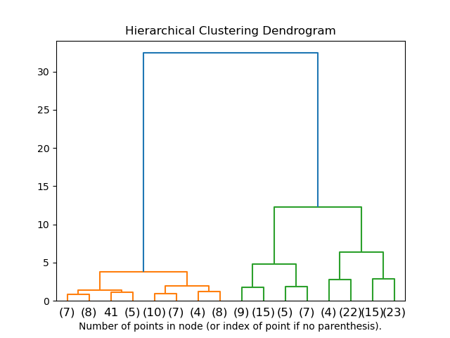
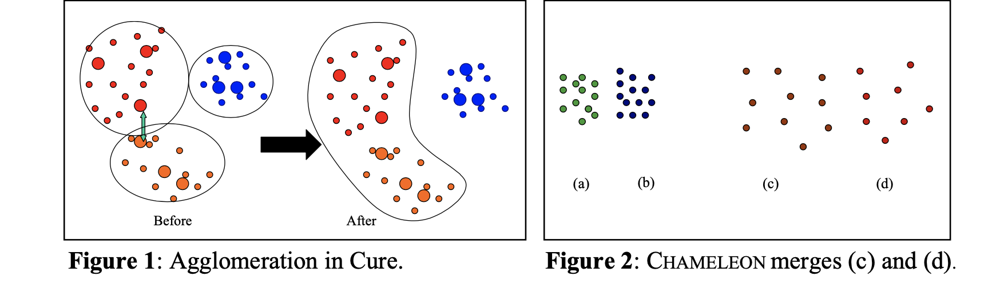
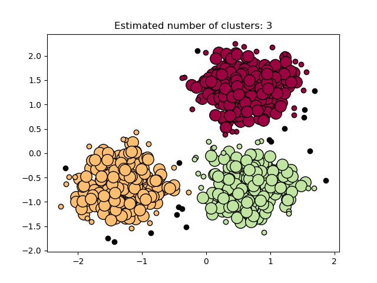
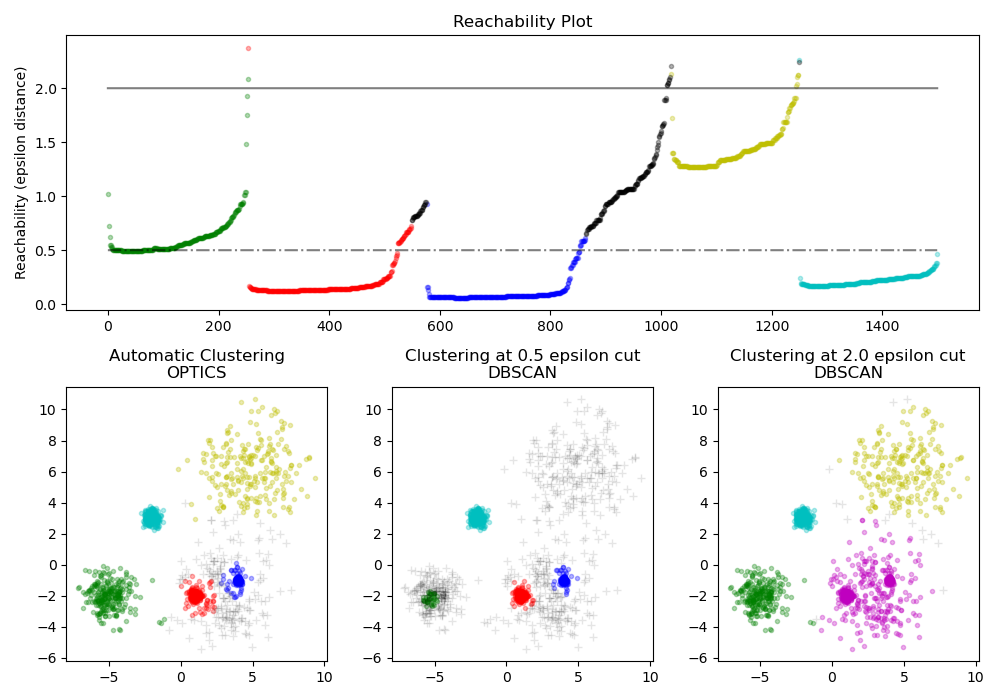

# Clustering: Algorithms, Theory, and Fundamental Limits

### A Complete Reference from First Principles
*OMSCS ML | Unsupervised Learning Unit*

---

## Table of Contents

1. [Introduction: What Is Clustering, and Why Is It Hard?](#1-introduction)
2. [Formal Setup and a Taxonomy of Approaches](#2-formal-setup)
3. [Hierarchical Clustering](#3-hierarchical-clustering)
   - 3.1 Agglomerative vs. Divisive
   - 3.2 Linkage Metrics and the Lance-Williams Formula
   - 3.3 Clusters of Arbitrary Shape: CURE and CHAMELEON
   - 3.4 Other Developments: COBWEB, Ward's Method, Divisive SVD
4. [Partitioning Methods: Relocation Clustering](#4-partitioning)
   - 4.1 K-Means: The Workhorse Algorithm
   - 4.2 K-Medoids Methods: PAM, CLARA, CLARANS
   - 4.3 Probabilistic Clustering: Mixture Models and EM
5. [Density-Based Clustering](#5-density-based)
   - 5.1 DBSCAN: Core Objects and Density-Connectivity
   - 5.2 OPTICS: Variable-Density Extensions
   - 5.3 DENCLUE: Density as a Continuous Function
6. [Grid-Based Methods](#6-grid-based)
7. [Scalability: Handling Very Large Datasets](#7-scalability)
8. [High-Dimensional Clustering](#8-high-dimensional)
   - 8.1 The Curse of Dimensionality in Clustering
   - 8.2 Dimensionality Reduction
   - 8.3 Subspace Clustering: CLIQUE and MAFIA
   - 8.4 Co-Clustering
9. [General Algorithmic Issues](#9-general-issues)
   - 9.1 How Many Clusters?
   - 9.2 Proximity Measures
   - 9.3 Outliers
   - 9.4 Data Preparation
10. [Kleinberg's Impossibility Theorem](#10-kleinberg)
    - 10.1 Motivation: An Axiomatic Framework
    - 10.2 The Three Properties
    - 10.3 The Impossibility Theorem: Statement and Proof
    - 10.4 Two of Three: How Major Algorithms Trade Off
    - 10.5 K-Means, K-Median, and the Failure of Consistency
    - 10.6 Relaxations and What They Reveal
11. [Summary: A Comparative View](#11-summary)
12. [Sources and Further Reading](#12-sources)

---

## 1. Introduction: What Is Clustering, and Why Is It Hard? {#1-introduction}

### The basic goal

**Clustering** is the task of partitioning a dataset into groups — called *clusters* — such that points within a group are similar to each other and dissimilar to points in other groups. No labels are given. The algorithm must discover the structure from the data alone. This makes clustering an instance of **unsupervised learning**: you are not fitting a model to a known target, but trying to reveal hidden structure that you believe exists but cannot directly observe.

This goal is intuitively compelling but vague. "Similar" can mean many different things — close in Euclidean distance, connected through dense regions, correlated in distribution — and different formalizations lead to profoundly different algorithms that often disagree on the same data. There is no universally accepted answer to "what is a cluster?", which is part of what makes clustering both rich and technically challenging.

### Clustering as data compression

One useful way to think about clustering is as **lossy compression**: instead of representing all $N$ data points individually, you represent the dataset by $k \ll N$ cluster summaries (centroids, medoids, probability distributions, etc.). Fine-grained detail is lost, but the essential structure is retained. How much detail is acceptable to lose, and what structure counts as "essential"? Different algorithms embody different answers to these questions.

### Why is this harder than supervised learning?

In supervised learning, the loss function is grounded in prediction error on labeled examples. Feedback from the target variable regularizes the problem — you cannot succeed by memorizing arbitrary structure. In clustering, there is no analogous external signal. Any partition of the data into $k$ groups is a valid output from a formal standpoint. This creates two hard problems:

1. **What to optimize?** Choosing an objective function already commits you to a particular notion of what a cluster is. Sum-of-squared-distances to centroids (k-means) and density-connectivity (DBSCAN) are both defensible, but they find completely different things.

2. **How to evaluate results?** Without ground-truth labels, you cannot simply compute accuracy. Evaluation requires either external criteria (comparing to known labels if they exist) or internal criteria (measuring cluster compactness and separation using the data itself). Both have significant limitations.

We will encounter a deep manifestation of these difficulties in Section 10, where Kleinberg's impossibility theorem shows — through a simple axiomatic argument — that no single clustering function can simultaneously satisfy three entirely reasonable desiderata.

---

## 2. Formal Setup and a Taxonomy of Approaches {#2-formal-setup}

### Notation

Let $X = \{x_1, \ldots, x_N\}$ be a dataset of $N$ points in an attribute space $A = \prod_{l=1}^d A_l$, where each attribute $A_l$ may be numerical or categorical. The goal is to assign points to a system of $k$ clusters $\{C_1, \ldots, C_k\}$ such that:

$$X = C_1 \cup C_2 \cup \cdots \cup C_k \cup C_{\text{outliers}}, \qquad C_i \cap C_j = \emptyset \text{ for } i \neq j$$

In the most common setting the clusters partition the data (every point goes exactly one cluster, with a possible exception for declared outliers). Algorithms that allow points to belong to multiple clusters with varying degrees of membership are called **soft** or **fuzzy** clustering algorithms; all others are **hard** or **crisp**.

A **distance function** $d: X \times X \to \mathbb{R}_{\geq 0}$ assigns pairwise dissimilarities between points. When $d$ satisfies the triangle inequality $d(x,z) \leq d(x,y) + d(y,z)$, it is a proper metric. Many algorithms only require a distance function satisfying non-negativity and symmetry — not necessarily the triangle inequality.

### A taxonomy of clustering algorithms

Clustering algorithms can be organized along several axes. The most useful high-level division for OMSCS ML purposes is:

**Hierarchical methods** build a tree of nested clusters (a *dendrogram*) without committing to a particular number of clusters in advance. They produce a full hierarchy from which a flat partition can be extracted by cutting at the desired level. The key sub-division is between *agglomerative* (bottom-up: start with singletons, merge) and *divisive* (top-down: start with one cluster, split).

**Partitioning methods** directly seek a flat partition into $k$ clusters, typically by iteratively relocating points between clusters to optimize an objective function. The major sub-families are k-medoids (representing each cluster by a data point), k-means (representing each cluster by a centroid), and probabilistic clustering (representing each cluster by a probability distribution, fitted by EM).

**Density-based methods** define clusters as dense connected regions in the data space, separated by sparse regions. They do not require specifying $k$ in advance and can find clusters of arbitrary shape. They are robust to noise and outliers by construction — sparse points simply are not part of any cluster.

**Grid-based methods** discretize the attribute space into a grid and compute cluster statistics over cells, then aggregate cells into clusters. They are fast and order-independent, and handle outliers well through density thresholds on cells.

Several other families exist — constraint-based clustering, co-occurrence methods for categorical data, neural-network-based methods, evolutionary methods — which we survey briefly in later sections.

**So what does the taxonomy tell you?** The choice of family is a direct commitment to a definition of "cluster." Each family is well-suited to different practical conditions:

- *Hierarchical methods* are best when $k$ is unknown, the data is small-to-medium ($N \lesssim 10^4$), and a nested summary of structure at multiple granularities is valuable — e.g., taxonomic analysis, phylogenetics, or exploratory data analysis where you want to inspect the whole dendrogram.
- *Partitioning methods (k-means/k-medoids)* are best when $k$ is known or can be estimated, clusters are expected to be roughly convex and similarly sized, and scalability is important. K-means is often the right default for large numerical datasets.
- *Probabilistic methods (EM)* are best when you want interpretable cluster models (each cluster is a named distribution), explicit uncertainty quantification (soft assignments), or principled model selection for $k$. They are the right choice when downstream decisions need calibrated cluster probabilities, not just hard labels.
- *Density-based methods* are best when cluster shapes are irregular or unknown, outliers are present and must be identified explicitly, and $k$ is unknown. DBSCAN is the default when you suspect non-convex structure.
- *Grid-based methods* are best for very large $N$ (millions of points) in low-to-moderate dimensions where linear scalability is required.

No single family dominates. Section 10 will give this a precise theoretical foundation: Kleinberg's impossibility theorem shows that the trade-offs between these families are not engineering limitations but fundamental properties of what clustering can mean.

---

## 3. Hierarchical Clustering {#3-hierarchical-clustering}

### 3.1 Agglomerative vs. Divisive

**Agglomerative clustering** begins with each data point as its own singleton cluster, and iteratively merges the two most similar clusters until a stopping criterion is reached (typically a specified number of clusters $k$, or a distance threshold). Each merge decision is based on a **linkage metric** — a way of computing distance between clusters rather than individual points.

**Divisive clustering** begins with all points in a single cluster, and iteratively splits the least cohesive cluster. Divisive methods are less common in practice because the search over possible splits is computationally expensive.

The output of either approach is a **dendrogram**: a binary tree in which leaves are individual points and internal nodes represent merged or split clusters. The height of an internal node encodes the distance at which the merge (or split) occurred. Cutting the dendrogram at a given height yields a flat partition.

*Dendrogram over the Iris dataset (top three merge levels shown, Ward's linkage). The y-axis records merge distance; the colour change at each height shows where a horizontal cut produces a flat partition. Cutting lower (orange level) gives three clusters; cutting higher (blue level) gives two. Source: scikit-learn documentation.*

**Strengths of hierarchical clustering:**
- No need to specify $k$ in advance; the dendrogram encodes all granularities simultaneously.
- Works with any similarity or distance measure.
- Produces interpretable structure useful for exploratory analysis.

**Weaknesses:**
- Most agglomerative algorithms do not revisit past merges — once two clusters are merged, the decision is permanent, even if it proves suboptimal later. This greedy commitment is the main limitation.
- Time complexity is $O(N^2)$ or worse under most linkage metrics.
- Most methods work with a pairwise distance matrix of size $N \times N$, which is memory-intensive for large $N$.

### 3.2 Linkage Metrics and the Lance-Williams Formula

The behavior of agglomerative clustering is determined almost entirely by the choice of linkage metric. Given two clusters $C_i$ and $C_j$, the major inter-cluster distance definitions are:

**Single linkage** (nearest neighbor):
$$d(C_i, C_j) = \min_{x \in C_i,\, y \in C_j} d(x, y)$$

**Complete linkage** (furthest neighbor):
$$d(C_i, C_j) = \max_{x \in C_i,\, y \in C_j} d(x, y)$$

**Average linkage** (Group-Average Method):
$$d(C_i, C_j) = \frac{1}{|C_i||C_j|} \sum_{x \in C_i} \sum_{y \in C_j} d(x, y)$$

**Centroid linkage**: distance between cluster centroids $\bar{x}_i$ and $\bar{x}_j$.

**Ward's minimum variance**: choose the merge that minimizes the increase in total within-cluster sum of squared errors (the same objective as k-means). (Ward's connection to the k-means objective is developed further in §3.4.)

**What each captures intuitively:** Single linkage measures how close two clusters come at their nearest points — it is sensitive to "chaining," where two elongated clusters can be merged because their endpoints happen to be close even though the bulk of the clusters are far apart. Complete linkage measures the worst-case distance between clusters — it produces more compact, roughly spherical clusters, but is sensitive to outliers (a single distant point can prevent a merge). Average linkage is a compromise. Ward's method is the only one that explicitly optimizes a global quality criterion; it tends to produce compact, balanced clusters and is among the most widely used in practice. (See §3.4 for Ward's precise connection to the k-means objective.)

*Each column applies one linkage method to the same six toy datasets (rows): nested circles, two moons, blobs with varied variance, anisotropic blobs, balanced blobs, and random noise. The first two rows are the most diagnostic: single linkage correctly separates the circles and moons; complete and Ward's fail because they optimize for compact spherical clusters. Conversely, on the balanced blob rows (row 5–6), Ward's produces cleanly separated clusters while single linkage chains. Source: scikit-learn documentation.*

#### The Lance-Williams Unifying Formula

All of the above linkage metrics can be expressed as special cases of a single update formula. When clusters $C_i$ and $C_j$ are merged to form $C_{ij}$, the distance from the new merged cluster to any third cluster $C_k$ is:

$$d(C_{ij}, C_k) = \alpha_i \, d(C_i, C_k) + \alpha_j \, d(C_j, C_k) + \beta \, d(C_i, C_j) + \gamma \, |d(C_i, C_k) - d(C_j, C_k)|$$

where $\alpha_i$, $\alpha_j$, $\beta$, $\gamma$ are coefficients specific to each linkage method. For example, single linkage has $\alpha_i = \alpha_j = \frac{1}{2}$, $\beta = 0$, $\gamma = -\frac{1}{2}$, which recovers $d(C_{ij}, C_k) = \min(d(C_i, C_k), d(C_j, C_k))$.

**Complete coefficient table.** The following table gives the Lance-Williams parameters for all five standard linkage metrics. Here $n_i = |C_i|$, $n_j = |C_j|$, $n_k = |C_k|$ are cluster sizes at the time of the merge, and the new cluster $C_{ij}$ has size $n_i + n_j$.

| Linkage | $\alpha_i$ | $\alpha_j$ | $\beta$ | $\gamma$ |
|---|---|---|---|---|
| Single (nearest nbr) | $\tfrac{1}{2}$ | $\tfrac{1}{2}$ | $0$ | $-\tfrac{1}{2}$ |
| Complete (furthest nbr) | $\tfrac{1}{2}$ | $\tfrac{1}{2}$ | $0$ | $+\tfrac{1}{2}$ |
| Average (UPGMA) | $\tfrac{n_i}{n_i+n_j}$ | $\tfrac{n_j}{n_i+n_j}$ | $0$ | $0$ |
| Centroid (UPGMC) | $\tfrac{n_i}{n_i+n_j}$ | $\tfrac{n_j}{n_i+n_j}$ | $-\tfrac{n_i n_j}{(n_i+n_j)^2}$ | $0$ |
| Ward's | $\tfrac{n_k+n_i}{n_k+n_i+n_j}$ | $\tfrac{n_k+n_j}{n_k+n_i+n_j}$ | $\tfrac{-n_k}{n_k+n_i+n_j}$ | $0$ |

**Quick check — single linkage:** With $\alpha_i = \alpha_j = \frac{1}{2}$ and $\gamma = -\frac{1}{2}$:
$$d(C_{ij}, C_k) = \tfrac{1}{2}d(C_i,C_k) + \tfrac{1}{2}d(C_j,C_k) - \tfrac{1}{2}|d(C_i,C_k) - d(C_j,C_k)| = \min(d(C_i,C_k),\,d(C_j,C_k))$$
since $\frac{a+b}{2} - \frac{|a-b|}{2} = \min(a,b)$. For complete linkage, $\gamma = +\frac{1}{2}$ flips the sign, recovering $\max(a,b)$.

**Ward's $\beta < 0$:** The negative $\beta$ term penalizes the distance between the two merging clusters $C_i$ and $C_j$ — clusters that were already far apart receive a higher effective distance to $C_k$. This discourages merging distant clusters and is what drives Ward's to produce compact, balanced dendrograms.

**Why does this matter?** The Lance-Williams formula means that once an $N \times N$ distance matrix is computed, all subsequent cluster distances can be updated incrementally in $O(N)$ work per merge step, without recomputing distances from scratch. This is what makes agglomerative clustering computationally feasible. The algorithm SLINK (Sibson 1973) implements single linkage in $O(N^2)$ time using this principle; algorithms for other linkage metrics achieve the same complexity under mild conditions.

### 3.3 Hierarchical Clusters of Arbitrary Shape: CURE and CHAMELEON

Linkage metrics based on Euclidean distance tend to produce convex, roughly spherical clusters because they measure inter-cluster distance in a way that is dominated by the overall shape of the cluster's convex hull. Two algorithms address this by allowing clusters of arbitrary shape.

#### CURE: Clustering Using Representatives

The key idea in CURE (Guha et al. 1998) is to represent each cluster not by a single centroid (one point) or all of its points (every point), but by a **fixed number $c$ of representative points** scattered across the cluster's extent. The inter-cluster distance used in agglomeration is the minimum distance between the representative sets of two clusters.

This is a deliberate middle ground: single-linkage uses the globally closest pair (two points), centroid-based uses the two centroids (one point each), and CURE uses $c$ scattered representatives. By distributing representatives spatially, CURE can represent non-spherical shapes.

One additional device: after representatives are selected, they are **shrunk toward the cluster centroid** by a user-specified factor $\alpha \in (0,1)$. This means representatives are moved to the position $r' = r + \alpha(\bar{x} - r) = (1-\alpha)r + \alpha\bar{x}$, i.e., a convex combination that moves the representative $\alpha$ fraction of the way from its original position to the centroid. Outliers, which tend to lie far from the centroid, are displaced most strongly by this operation.

**Why does the shrinkage improve cluster quality?** Without it, a spurious outlier in cluster $C_i$ could become a representative, placing one representative in an extreme position. That outlier representative might then be the nearest representative to some cluster $C_j$ across the gap — causing CURE to merge $C_i$ and $C_j$ purely on the basis of the outlier, not the bulk of the clusters. Shrinking all representatives inward means the inter-cluster distance between $C_i$ and $C_j$ is determined by the cluster bodies, not their fringes. The parameter $\alpha$ controls the trade-off: $\alpha = 0$ means no shrinkage (representatives stay in place, fully sensitive to outliers); $\alpha = 1$ means full shrinkage to the centroid (equivalent to centroid linkage, losing the multi-representative benefit). In practice, $\alpha \approx 0.2$–$0.3$ gives robust results.

CURE also uses sampling and partitioning for scalability. For low-dimensional data, its complexity is approximately $O(N_{\text{sample}}^2)$.

#### CHAMELEON: Dynamic Modeling

CHAMELEON (Karypis et al. 1999) takes a more sophisticated approach. It first builds a sparse graph by keeping only the $K$ nearest neighbors of each point (a K-nearest-neighbor graph). It then applies graph partitioning to produce many small, tight sub-clusters. In the second stage, these sub-clusters are merged agglomeratively — but the merge decision is based on two *locally-normalized* measures.

**Relative inter-connectivity** $RI(C_i, C_j)$ asks: how many edges cross the $C_i$–$C_j$ boundary, relative to the internal connectivity of the two clusters?

$$RI(C_i, C_j) = \frac{2 \cdot |EC(C_i, C_j)|}{\overline{|EC|}(C_i) + \overline{|EC|}(C_j)}$$

where $|EC(C_i, C_j)|$ is the number of edges in the KNN graph crossing between $C_i$ and $C_j$, and $\overline{|EC|}(C_i)$ is the average number of edges crossing a minimum bisection *within* $C_i$ (its internal edge-cut). A value of $RI = 1$ means the boundary between $C_i$ and $C_j$ is exactly as well-connected as the typical internal split of each cluster — higher values suggest strong inter-cluster connectivity.

**Relative closeness** $RC(C_i, C_j)$ asks: how close are the edges crossing the $C_i$–$C_j$ boundary, relative to the internal edge weights?

$$RC(C_i, C_j) = \frac{\overline{d}(C_i, C_j)}{\dfrac{|C_i|}{|C_i|+|C_j|}\,\overline{d}(C_i) + \dfrac{|C_j|}{|C_i|+|C_j|}\,\overline{d}(C_j)}$$

where $\overline{d}(C_i, C_j)$ is the average weight of edges crossing between the clusters, and $\overline{d}(C_i)$ is the average weight of internal edges. The denominator is a size-weighted average of the two clusters' internal average edge weights. Both measures normalize locally: $RI$ and $RC$ are computed relative to each cluster's own internal structure, not to any global threshold — which is what makes CHAMELEON adaptive to varying local density.

The merge criterion $RI(C_i, C_j) \times RC(C_i, C_j)^{\alpha}$ (for user-specified $\alpha$) is used to rank candidate pairs; the pair with the highest score is merged. This adaptivity allows CHAMELEON to find clusters of different shapes, densities, and sizes — something CURE struggles with when density varies.

*Figure from Berkhin (2006). Left (Fig. 1): CURE agglomeration — representatives (large circles) are shrunk toward the centroid before the merge decision; the arrow shows the shrinkage direction. The "After" panel shows the correctly merged non-convex cluster. Right (Fig. 2): CHAMELEON decides to merge clusters (c) and (d) based on their relative inter-connectivity and closeness — not their raw proximity.*

**Takeaway on CURE vs. CHAMELEON:** CURE is simpler and more scalable. CHAMELEON makes better merge decisions in complex geometries because it adapts to local structure, but it relies heavily on the HMETIS graph partitioning library and is harder to tune.

### 3.4 Other Developments

**Ward's method**, introduced in 1963, is a linkage metric defined not in terms of point-to-point distances, but in terms of an objective function: at each step, merge the pair of clusters whose fusion causes the smallest increase in total within-cluster sum of squares. Because this criterion is identical to the k-means objective function, Ward's method can be seen as a hierarchical approximation to k-means. It produces compact, balanced clusters and tends to work well in practice.

**COBWEB** (Fisher 1987) is an incremental hierarchical algorithm for categorical data. Rather than building a dendrogram in batch mode, COBWEB processes one data point at a time, dynamically updating a classification tree. Each node in the tree is associated with a Naïve Bayes-style set of conditional probabilities $\Pr(A_l = v \mid C)$ for each attribute value given the cluster. Decisions about where to place each new point (insert, create new cluster, split a node, merge two nodes) are driven by maximizing **category utility**:

$$CU(\{C_1, \ldots, C_k\}) = \frac{1}{k} \sum_{j=1}^k P(C_j) \left[ \sum_l \sum_v P(A_l = v \mid C_j)^2 - \sum_l \sum_v P(A_l = v)^2 \right]$$

**Reading the formula.** The term $\sum_v P(A_l = v \mid C_j)^2$ is the expected probability of correctly guessing attribute $l$'s value for a point known to be in cluster $C_j$ (under a maximum-likelihood guess strategy). Subtracting $\sum_v P(A_l = v)^2$ — the same quantity for the overall population — gives the *improvement* in predictability from knowing the cluster membership. Summing over all attributes and weighting by cluster size $P(C_j)$ gives the total expected gain. Dividing by $k$ normalizes for the number of clusters, which otherwise would always favor fine-grained partitions.

**Connection to Gini.** The inner term $\sum_v P(A_l = v \mid C_j)^2$ is exactly $1 - \text{Gini}(A_l \mid C_j)$, where the Gini impurity is $1 - \sum_v p_v^2$. So category utility rewards clusters that reduce Gini impurity — the same criterion used in CART decision trees for split selection. The distinction is context: CART minimizes impurity to discriminate a target variable; COBWEB maximizes expected impurity reduction averaged over *all* attributes, since in unsupervised learning there is no designated target.

**Binary divisive partitioning** using SVD is implemented by PDDP (Principal Direction Divisive Partitioning, Boley 1998). Each cluster is split by a hyperplane through its centroid, orthogonal to the first principal component (largest singular value direction) of the mean-centered data matrix. Bisecting k-means is a related and empirically strong alternative for document clustering.

---

## 4. Partitioning Methods: Relocation Clustering {#4-partitioning}

Unlike hierarchical methods, partitioning algorithms directly produce a flat partition into $k$ clusters, typically by starting from an initial configuration and iteratively improving it. The key advantage is that cluster memberships can be revised at each iteration, correcting early mistakes.

### 4.1 K-Means: The Workhorse Algorithm

K-means is almost certainly the most widely used clustering algorithm in the world. Its dominance comes from simplicity, solid theoretical grounding, and surprisingly strong practical performance despite known limitations.

#### The objective function

K-means seeks a partition $\{C_1, \ldots, C_k\}$ of $X$ and centroids $\{c_1, \ldots, c_k\}$ (where $c_j$ is the mean of cluster $C_j$) that minimize the **total within-cluster sum of squared errors**:

$$E(C) = \sum_{j=1}^{k} \sum_{x_i \in C_j} \|x_i - c_j\|^2$$

This is also known as the SSE (sum of squared errors), or the total intra-cluster variance. Each term $\|x_i - c_j\|^2$ is the squared distance from point $x_i$ to its cluster's centroid — the representative of the cluster computed as the mean of all its members. This is the **operational form**: it is what the algorithm computes directly at each iteration (assign each point to its nearest centroid, then recompute centroids).

**Indicator variable notation.** An equivalent and often more compact way to write the same objective uses **assignment indicators** $z_{nk} \in \{0,1\}$, where $z_{nk} = 1$ if and only if point $x_n$ is assigned to cluster $k$, and 0 otherwise. Exactly one $z_{nk}$ equals 1 for each $n$ — a **1-hot encoding** of the assignment. With this notation:

$$J = \sum_{n=1}^N \sum_{k=1}^K z_{nk}\, \|x_n - \mu_k\|^2$$

This form makes the structure of the algorithm explicit: $J$ is a function of both the discrete assignments $\mathbf{z}$ and the continuous centroids $\boldsymbol{\mu}$. The two algorithmic steps optimize over one while holding the other fixed — the E-step optimizes $\mathbf{z}$ (which cluster each point belongs to), and the M-step optimizes $\boldsymbol{\mu}$ (where each centroid is placed).

However, this form has a limitation: it is not obvious what is being optimized geometrically, because the centroids are themselves derived from the partition. The following identity rewrites the SSE purely in terms of pairwise distances between data points — no centroids appear — making the geometric meaning transparent.

**Algebraic identity:** The SSE is equivalently:

$$E(C) = \frac{1}{2} \sum_{j=1}^k \frac{1}{|C_j|} \sum_{x_i, x_{i'} \in C_j} \|x_i - x_{i'}\|^2$$

Here $\|x_i - x_{i'}\|^2$ is the squared distance between two *data points* $x_i$ and $x_{i'}$ within the same cluster — no centroid involved. The inner double sum averages all such pairwise distances within cluster $C_j$; the outer sum adds this up across all clusters.

**Derivation.** We start from the pairwise-distance form and show it equals the centroid-distance SSE. Fix a single cluster $C_j$ with centroid $c_j = \frac{1}{|C_j|}\sum_{x_i \in C_j} x_i$.

**Step 1 — Expand the squared norm:**
$$\frac{1}{2|C_j|}\sum_{i,i'} \|x_i - x_{i'}\|^2 = \frac{1}{2|C_j|}\sum_{i,i'}\left(\|x_i\|^2 - 2\,x_i \cdot x_{i'} + \|x_{i'}\|^2\right)$$

**Step 2 — Sum each term separately** over the $|C_j|^2$ index pairs:

- *Squared-norm terms:* $\sum_{i,i'} \|x_i\|^2 = |C_j|\sum_i \|x_i\|^2$ (for each $i$, there are $|C_j|$ choices of $i'$). The $\|x_{i'}\|^2$ term contributes the same, giving $2|C_j|\sum_i\|x_i\|^2$ combined.
- *Cross term:* $\sum_{i,i'} x_i \cdot x_{i'} = \bigl(\sum_i x_i\bigr)\cdot\bigl(\sum_{i'} x_{i'}\bigr) = \bigl\|\sum_i x_i\bigr\|^2$. This factoring — the double sum of dot products equals the squared norm of the sum — is the key step.

Substituting:
$$\frac{1}{2|C_j|}\sum_{i,i'}\|x_i - x_{i'}\|^2 = \frac{1}{2|C_j|}\left(2|C_j|\sum_i\|x_i\|^2 - 2\Bigl\|\sum_i x_i\Bigr\|^2\right) = \sum_i\|x_i\|^2 - \frac{\|\sum_i x_i\|^2}{|C_j|}$$

**Step 3 — Recognise the centroid.** Since $c_j = \frac{1}{|C_j|}\sum_i x_i$, we have $\frac{\|\sum_i x_i\|^2}{|C_j|} = |C_j|\|c_j\|^2$, and $\sum_i x_i \cdot c_j = |C_j|\|c_j\|^2$. Therefore:
$$\sum_i\|x_i\|^2 - |C_j|\|c_j\|^2 = \sum_i\bigl(\|x_i\|^2 - 2\,x_i\cdot c_j + \|c_j\|^2\bigr) = \sum_i\|x_i - c_j\|^2 \qquad \square$$

**Reading both forms together.** The centroid-distance form tells you *how* k-means works: assign each point to the nearest centroid, then move each centroid to the mean of its assigned points. The pairwise-distance form tells you *what* k-means is actually optimizing: minimize the average spread of points within each cluster, measured directly as the average squared distance between all pairs of cluster members. Both expressions compute the exact same number — the identity says they are one object, not two.

**Why minimizing SSE also maximizes inter-cluster separation.** This follows from a separate but simple observation: the total sum of all pairwise squared distances across the entire dataset is a constant $T$ — it depends only on the data, not on how points are partitioned:

$$T = \sum_{i \neq i'} \|x_i - x_{i'}\|^2 = \underbrace{\sum_j \sum_{i,i' \in C_j} \|x_i - x_{i'}\|^2}_{\text{within-cluster}} + \underbrace{\sum_{j \neq j'} \sum_{\substack{i \in C_j \\ i' \in C_{j'}}} \|x_i - x_{i'}\|^2}_{\text{between-cluster}}$$

Since $T$ is fixed by the data, minimizing the within-cluster term forces the between-cluster term to increase by exactly the same amount. Tight clusters and well-separated clusters are not two goals to balance — they are two sides of the same coin.

#### Two versions of the iterative algorithm

We now have a precise statement of what k-means optimizes. The question is how to actually minimize $E(C)$ — this is not obvious, since the partition $\{C_1, \ldots, C_k\}$ is a discrete combinatorial object and gradient-based methods do not apply directly. K-means sidesteps this by alternating between two steps that each provably decrease $E$, until no further improvement is possible.

**Forgy's algorithm (batch update):**
1. Initialize $k$ centroids $c_1, \ldots, c_k$ (randomly or by heuristic)
2. **Assignment step:** Assign each point $x_i$ to the nearest centroid: $C_j \leftarrow \{ x_i : j = \arg\min_{j'} \|x_i - c_{j'}\|^2 \}$
3. **Update step:** Recompute each centroid as the mean of its assigned points: $c_j \leftarrow \frac{1}{|C_j|} \sum_{x_i \in C_j} x_i$
4. Repeat steps 2–3 until no assignments change (or another stopping criterion is met)

**Online update (classic iterative optimization):**
Instead of reassigning all points then recomputing centroids, this version reassigns *one point at a time*: evaluate whether moving a point from its current cluster to a different cluster decreases $E$; if so, move it and immediately update the two affected centroids. This is analogous to the difference between batch gradient descent and stochastic gradient descent.

Despite appearing more computationally expensive (it seems to require recomputing $E$ for each potential move), an algebraic reduction for the $L_2$ objective shows that all the necessary quantities reduce to computing a single distance — so both versions have the same per-iteration complexity. Empirically, the online version often finds better local optima because the centroid updates propagate information more quickly.

*K-means convergence on a two-dimensional dataset. Each frame shows one assignment step (points coloured by nearest centroid, shown as crosses) followed by one update step (centroids move to the mean of their assigned points). The algorithm stabilises in a few iterations once centroid positions stop changing. Source: Wikimedia Commons (CC BY-SA 3.0).*

#### Convergence and the local optimum problem

**Why each step is exact.** Using the indicator-variable form $J = \sum_n \sum_k z_{nk}\|x_n - \mu_k\|^2$, we can see why each step solves its sub-problem *exactly*, not approximately.

*M-step (fixed $\mathbf{z}$):* With assignments held fixed, $J$ is a **convex** function of each $\mu_k$ — it is a sum of squared terms in $\mu_k$, so it has a unique global minimum. Setting the gradient to zero:

$$\frac{\partial J}{\partial \mu_k} = -2\sum_{n=1}^N z_{nk}(x_n - \mu_k)^T = 0 \implies \mu_k = \frac{\sum_n z_{nk}\, x_n}{\sum_n z_{nk}}$$

the centroid is the weighted mean of the assigned points — exactly the update rule stated above.

*E-step (fixed $\boldsymbol{\mu}$):* With centroids fixed, $J$ decomposes into $N$ independent terms, one per point. Minimizing over $\mathbf{z}$ (subject to the 1-hot constraint $\sum_k z_{nk} = 1$) assigns each point to its nearest centroid — also an exact minimization.

Each step globally solves its sub-problem. The joint problem of optimizing over $(\mathbf{z}, \boldsymbol{\mu})$ simultaneously is non-convex — it is the interplay between the discrete $\mathbf{z}$ and continuous $\boldsymbol{\mu}$ that makes the global problem hard.

Both versions are guaranteed to converge in finite iterations, because each step either decreases $E$ or leaves it unchanged, and there are finitely many distinct partitions. However, convergence is to a **local minimum**, not the global minimum. The global minimum of the k-means SSE is NP-hard to compute in general (it is NP-hard even in two dimensions for $k \geq 2$). In practice, k-means is run multiple times from different initializations, and the best result (lowest SSE) is retained.

**Why does k-means get stuck?** Local optima arise when no single-point move or centroid update can decrease $E$, but a coordinated reassignment of multiple points could. Think of two banana-shaped clusters interlocked — k-means with $k = 2$ will cut them badly (with a near-straight dividing plane) because the only locally stable configuration is the planar cut, not the curved one that correctly separates them.

#### Initialization: the Bradley-Fayyad method

The most dangerous source of bad local optima is poor initialization. A common bad outcome is having two initialized centroids that are very close together, effectively wasting one of the $k$ slots on the same region of the data.

Bradley and Fayyad (1998) proposed a principled initialization strategy:
1. Draw several small random samples from the data
2. Run k-means on each sample independently, producing several candidate centroid sets
3. Use each candidate centroid set as initialization for k-means run on the union of all the samples
4. Select the best result, and use those centroids as the initialization for the full dataset

This tends to find centroids that are well-separated and representative of the actual cluster structure before committing to the expensive full-data run.

A simpler but highly effective modern alternative is **k-means++** (Arthur & Vassilvitskii 2007, going beyond this reading). Let $D(x)$ denote the distance from point $x$ to its nearest already-chosen centroid. The algorithm is:
1. Choose the first centroid uniformly at random from the data.
2. Choose each subsequent centroid with probability proportional to $D(x)^2$ — the squared distance to the nearest already-chosen centroid. Points far from all existing centroids are most likely to be chosen next.
3. Repeat step 2 until $k$ centroids have been selected, then run standard k-means from this initialization.

This **$D^2$-weighted sampling** guarantees that the expected SSE is within $O(\log k)$ of optimal — far better than random initialization.

**Why does this help?** The main cause of bad local optima in random initialization is *centroid collision* — two initial centroids fall in the same true cluster, effectively wasting one of the $k$ slots. When this happens, the wasted centroid and its nearest neighbor centroid both compete for the same cluster's points, while some other true cluster is forced to share a centroid with a completely different region. The $D^2$-weighted sampling makes collisions exponentially unlikely: once a centroid has been placed in a dense region, all nearby points receive very low probability of hosting the next centroid (their $D^2$ is small), so subsequent centroids are strongly steered away. Concretely, if your data has two obvious clusters separated by a large gap, the second centroid lands in the other cluster with high probability — because the gap means all points in the second cluster are far from the first centroid and therefore have large $D^2$ values.

#### Practical limitations of k-means

- **Requires specifying $k$:** The number of clusters must be provided in advance. How to choose $k$ is a separate problem (addressed in Section 9).
- **Sensitive to outliers:** A single outlier can pull a centroid far from the bulk of its cluster. K-medoids (Section 4.2) addresses this.
- **Assumes convex, isometric clusters:** To understand this limitation, two geometric concepts are needed.

  **Convex sets.** A set $S$ is *convex* if for any two points $x, y \in S$, the entire straight-line segment connecting them lies within $S$ — formally, $\lambda x + (1-\lambda)y \in S$ for all $\lambda \in [0,1]$. Intuitively: a shape is convex if you can connect any two interior points with a straight line that never exits the shape. Circles, ellipses, and rectangles are convex; crescents, rings, and C-shapes are not. (This is the same underlying idea as function convexity — a function $f$ is convex when its epigraph, the set of points above it, is a convex set.)

  A **convex cluster** is simply a cluster whose boundary encloses a convex set: no cluster member is "hidden behind" another cluster. Any cluster you can describe as "all points within distance $r$ of some center" is convex.

  **Voronoi cells.** Because k-means assigns each point to its *nearest* centroid, it implicitly partitions the space into **Voronoi cells** — one per centroid:
  $$V_j = \{x : \|x - c_j\| \leq \|x - c_{j'}\| \text{ for all } j' \neq j\}$$
  The boundary between $V_j$ and $V_{j'}$ is the perpendicular bisector between $c_j$ and $c_{j'}$ — a flat hyperplane. Each Voronoi cell is the intersection of $k-1$ half-spaces (one per competing centroid), and intersections of half-spaces are always convex. In 2D, the cells are convex polygons; in higher dimensions, convex polytopes (the generalization of a polygon to $d$ dimensions: a shape bounded by flat hyperplanes).

  **Why this matters.** Since every cluster that k-means can produce is a Voronoi cell — and every Voronoi cell is convex — k-means is structurally incapable of finding non-convex clusters such as rings, crescents, or interlocking spirals, regardless of initialization or the number of restarts. The cluster boundaries are always straight cuts through space. The linkage comparison figure in §3.2 illustrates this: on the two-moon dataset, k-means always produces a straight dividing line rather than following the curved structure.
- **Only works well with numerical attributes:** The centroid $c_j = \frac{1}{|C_j|} \sum x_i$ requires vector arithmetic; it is not meaningful for categorical data.
- **Non-deterministic:** Results depend on initialization.

#### Application: image compression

K-means has an elegant application to **lossy image compression**. An image is an $H \times W$ grid of pixels, each described by three values $(R, G, B) \in [0, 255]^3$ — a point in a 3-dimensional color space. Storing a full-color image requires $3HW$ bytes.

K-means with $K$ clusters finds $K$ representative colors (the centroids in RGB space). Instead of storing the full RGB triple for every pixel, you store:

- A **palette** of $K$ centroid colors: $3K$ values.
- For each pixel, a **cluster index** $k \in \{1, \ldots, K\}$: $\lceil \log_2 K \rceil$ bits per pixel.

With $K = 16$, each pixel requires only 4 bits instead of 24 bits — a 6:1 compression ratio in the color data. The compression is lossy (each pixel is quantized to its nearest centroid color), but perceptual quality is often acceptable for moderate $K$.

This application also illustrates k-means' convexity limitation: the "clusters" in RGB space are the dominant color regions of the image. For smooth color gradients (skies, skin), these regions are roughly spherical and k-means works well. For images with complex or irregular color distributions, the hard Voronoi boundaries may produce visible banding — more flexible vector quantization methods are preferred in those cases.

**Connection to probabilistic clustering.** K-means has a deeper interpretation: its SSE objective is the negative log-likelihood of a Gaussian mixture model with isotropic covariance and equal mixing weights, and its two-step algorithm is a hard-assignment approximation of the EM algorithm applied to that model. This connection is developed fully in §4.3, where it explains both k-means' convergence guarantees and its sensitivity to initialization.

### 4.2 K-Medoids Methods: PAM, CLARA, CLARANS

In k-medoids methods, each cluster is represented by a **medoid** — an actual data point, selected as the most centrally located member of the cluster. The objective function is the sum of dissimilarities from each point to its assigned medoid:

$$E_{\text{medoid}}(C) = \sum_{j=1}^k \sum_{x_i \in C_j} d(x_i, m_j)$$

where $m_j$ is the medoid of cluster $C_j$.

**Advantages over k-means:**
- Works with any distance function, including non-Euclidean and distances over categorical data.
- Robust to outliers: the medoid is a member of the cluster, so a single extreme outlier cannot shift the representative the way a centroid can. Peripheral points in a cluster don't strongly influence which point is elected medoid.

**PAM (Partitioning Around Medoids, Kaufman & Rousseeuw 1990)** is the basic iterative k-medoids algorithm. It alternates between considering all possible swaps of (current-medoid, non-medoid) pairs and accepting swaps that reduce the objective. Its main limitation is $O(N^2)$ cost per iteration.

**CLARA** uses subsampling: run PAM on five random samples of $40 + 2k$ points each, assign the full dataset to the resulting medoids, and retain the best configuration. This is much faster but can miss optimal medoids if they happen not to appear in any sample.

**CLARANS** (Ng & Han 1994) uses random search on a graph whose nodes are possible $k$-medoid sets, with edges connecting sets that differ by one medoid. Starting from a random node, it evaluates up to $\text{maxneighbor}$ randomly chosen neighbors, moves to a better one if found, and otherwise declares a local minimum. Multiple restarts give the best overall result. Complexity is $O(N^2)$.

### 4.3 Probabilistic Clustering: Mixture Models and EM

The probabilistic approach frames clustering as a **density estimation problem** under a mixture model. The core assumption is that the data is generated by:

1. Choose a component $j \in \{1, \ldots, k\}$ with probability $\tau_j$ (the *mixing weight*)
2. Draw a point $x$ from the component distribution $p(x \mid C_j; \theta_j)$

The observable data distribution is then:

$$p(x; \theta) = \sum_{j=1}^k \tau_j \, p(x \mid C_j; \theta_j)$$

Each component corresponds to one cluster, and the parameters $\theta_j$ describe the shape of that cluster's distribution (e.g., mean and covariance for a Gaussian component).

Given data $X = \{x_1, \ldots, x_N\}$, we want to find the parameters $\theta = (\tau_1, \ldots, \tau_k, \theta_1, \ldots, \theta_k)$ that maximize the log-likelihood:

$$\ell(\theta) = \sum_{i=1}^N \log p(x_i; \theta) = \sum_{i=1}^N \log \sum_{j=1}^k \tau_j \, p(x_i \mid C_j; \theta_j)$$

As we saw in the EM notes, this *log of a sum* has no closed-form maximum for mixture models — the component assignments (which $x_i$ came from which component) are latent, and marginalizing over them couples the parameters in a way that prevents analytic solution.

The **Expectation-Maximization (EM) algorithm** resolves this. At each iteration:

**E-step:** Compute the **responsibility** $r_{ij}$ — the posterior probability that point $x_i$ belongs to component $j$:

$$r_{ij} = \frac{\tau_j \, p(x_i \mid C_j; \theta_j)}{\sum_{j'=1}^k \tau_{j'} \, p(x_i \mid C_{j'}; \theta_{j'})}$$

This is a *soft* assignment: every point has partial membership in every cluster, weighted by how well it fits each component's distribution.

**M-step:** Update parameters to maximize the expected complete-data log-likelihood. First define the **effective number of points in cluster $j$**:

$$N_j = \sum_{i=1}^N r_{ij}$$

$N_j$ is the total "soft count" of data points assigned to cluster $j$ — each point contributes its responsibility $r_{ij} \in [0,1]$ rather than a hard 0 or 1. Note that $\sum_j N_j = N$ (every point's responsibility mass sums to 1 across clusters).

The M-step updates are:

$$\tau_j \leftarrow \frac{N_j}{N}, \qquad \theta_j \leftarrow \arg\max_{\theta_j} \sum_{i=1}^N r_{ij} \log p(x_i \mid C_j; \theta_j)$$

For Gaussian components, the closed-form M-step updates take a clean weighted-average form:

$$\mu_j = \frac{\sum_i r_{ij}\, x_i}{N_j}, \qquad \Sigma_j = \frac{\sum_i r_{ij}\, (x_i - \mu_j)(x_i - \mu_j)^T}{N_j}$$

Each update is a responsibility-weighted average of the data, normalized by the effective cluster size $N_j$. The mixing weight $\tau_j = N_j/N$ is simply the fraction of the total responsibility mass assigned to cluster $j$. (These follow from differentiating the expected complete-data log-likelihood with respect to $\mu_j$ and $\Sigma_j$ and setting to zero; the full derivation is in the EM notes.)

**So what is the cluster assignment?** After EM converges, assign each point to the component with highest responsibility: $C(x_i) = \arg\max_j r_{ij}$. Alternatively, retain the soft assignments $r_{ij}$ as a fuzzy partition.

**Comparison with k-means:** K-means is a hard-assignment, isotropic-Gaussian special case of EM for Gaussian mixtures. The k-means assignment step corresponds to the EM E-step in the limit where cluster variances $\sigma^2 \to 0$ (assignments become hard, since the nearest centroid wins with probability approaching 1). The centroid recomputation step corresponds to the EM M-step. This connection means that k-means inherits all the convergence guarantees of EM (monotone increase of a lower bound on the log-likelihood) while also inheriting its sensitivity to initialization and local optima.

A practical consequence: k-means is commonly used to **initialize GMM parameters**. Running a few iterations of k-means provides good starting values for $\mu_k$ (the centroid of each k-means cluster), which seeds the EM algorithm and avoids the worst local optima that arise from purely random Gaussian initialization. This is the default strategy in most GMM implementations.

**Connection to supervised learning.** GMM is structurally identical to **Quadratic Discriminant Analysis (QDA)** — both model the class-conditional distributions as $p(x \mid C_k) = \mathcal{N}(x;\, \mu_k, \Sigma_k)$ with distinct means and covariance matrices per class, and both classify by computing posteriors $p(C_k \mid x)$ via Bayes' rule. The sole distinction is supervision: in QDA, class labels are *observed*, so the parameters are estimated by straightforward per-class maximum likelihood (no EM needed). In GMM, class labels are *latent*, so EM supplies exactly the information that observed labels would otherwise provide. You can think of GMM as "QDA for unlabeled data" — same model, same inference procedure, just with the labels missing. This connection also means that a fitted GMM is a natural generative classifier: if labels are later acquired for some points, the model parameters can be updated in a principled Bayesian way.

**Key implementations:**
- **AUTOCLASS** (Cheeseman & Stutz 1996) uses a Bayesian framework to automatically search over different model types and different values of $k$, reporting the most probable model. It handles Bernoulli, Poisson, Gaussian, and log-normal components.
- **MCLUST** (Fraley & Raftery 1999) fits Gaussian mixture models with components whose covariance matrices can differ in volume, shape, and orientation. It uses BIC (see Section 9.1) for model selection.
- **SNOB** (Wallace & Dowe 1994) uses the Minimum Message Length (MML) principle for model selection.

**Key advantage of probabilistic clustering:** The cluster model is explicit and interpretable. Each cluster is a probability distribution with named parameters. Points near cluster boundaries get soft assignments that reflect genuine uncertainty. Model selection criteria (BIC, MML) give principled methods for choosing $k$.

**When to prefer k-means over GMM.** GMM is strictly more general — k-means is a special case of it. So why use k-means at all?

- **Speed.** K-means' inner loop is $O(kN)$ distance computations with no matrix operations. GMM's M-step inverts $k$ covariance matrices of size $d \times d$ every iteration. For large $N$ or $d$, this difference is substantial — often orders of magnitude.
- **Singularity.** GMM's EM can degenerate when a Gaussian collapses onto a single data point (variance $\to 0$, likelihood $\to \infty$). K-means has no analogous failure mode. Robust GMM implementations require variance floors or regularization to prevent it.
- **High dimensions.** Reliably estimating a full $d \times d$ covariance matrix requires roughly $O(d^2)$ data points *per cluster*. In practice, high-dimensional GMMs use diagonal or spherical covariance — but spherical-covariance GMM is essentially soft k-means, so you pay extra cost for little gain.
- **Hard assignments are all you need.** If your downstream task requires a single cluster label per point (segmentation, compression, preprocessing), the soft responsibilities are discarded anyway. K-means gives the same result faster.
- **Fewer hyperparameters.** K-means has one hyperparameter: $k$. GMM adds a choice of covariance structure (spherical, diagonal, full, tied) — a separate model selection problem.

**The rule of thumb:** if clusters are roughly spherical and similarly sized, k-means gives nearly identical hard assignments at a fraction of the cost — the $\sigma^2 \to 0$ connection tells you exactly when this approximation is tight. Use GMM when you need soft assignments, non-spherical cluster shapes, or principled model selection for $k$.

---

## 5. Density-Based Clustering {#5-density-based}

The defining idea of density-based clustering is that **clusters are dense connected regions of the data space, separated by sparse regions**. This means:

- Clusters can have arbitrary shape — they grow along whatever directions density leads.
- Sparse points are explicitly declared **noise** or **outliers** — not forced into any cluster.
- No need to specify $k$ in advance — the number of clusters is determined by the data's density structure.

The price is that density-based algorithms require a metric space (distances must be meaningful), work best in low to moderate dimensions, and require the user to tune density-related parameters.

### 5.1 DBSCAN: Core Objects and Density-Connectivity

**DBSCAN** (Ester et al. 1996) is the canonical density-based clustering algorithm. It requires two parameters:
- $\varepsilon > 0$: the neighborhood radius
- $\text{MinPts} \geq 1$: the minimum number of points required for a neighborhood to be considered "dense"

With these, DBSCAN defines:

**$\varepsilon$-neighborhood of $x$:**
$$N_\varepsilon(x) = \{y \in X : d(x, y) \leq \varepsilon\}$$

**Core object:** A point $x$ is a *core object* if $|N_\varepsilon(x)| \geq \text{MinPts}$. Core objects are in the interior of dense regions.

**Density-reachability:** A point $y$ is *density-reachable* from $x$ if there exists a chain of core objects $x = p_1, p_2, \ldots, p_n = y$ such that each consecutive $p_{i+1} \in N_\varepsilon(p_i)$. Intuitively, you can "walk" from $x$ to $y$ by hopping between $\varepsilon$-neighborhoods of core objects.

**Density-connectivity:** Two points $x$ and $y$ are *density-connected* if there exists some core object $z$ from which both $x$ and $y$ are density-reachable.

**Cluster definition:** A cluster is a maximal set of mutually density-connected points. Points not density-connected to any core object are declared **outliers** (noise).

#### What DBSCAN actually does

The algorithm builds these connected components procedurally. Starting from an unvisited core object, it flood-fills along density-reachable paths to collect the entire connected component. Non-core points that fall within $\varepsilon$ of a core object are boundary points of the cluster; they do not themselves generate further connections. Points that are not $\varepsilon$-close to any core object are outliers and receive no cluster label.

A key property: **the partition of core points is order-independent**. Unlike k-means (where the order in which points are processed can affect convergence) or COBWEB (which is explicitly incremental), DBSCAN assigns every core point to the same cluster regardless of traversal order. One caveat: *border points* that fall within ε of core points from two different clusters may be assigned to different clusters depending on which flood-fill reaches them first. In practice this is rare and most implementations handle it deterministically, but the strict theoretical guarantee of order-independence applies only to core points.

#### Complexity

Naively, computing $N_\varepsilon(x)$ for each of $N$ points requires $O(N^2)$ total. For low-dimensional spatial data, indexing structures (R*-trees, KD-trees) reduce each neighborhood query to $O(\log N)$ expected time, giving an overall complexity of $O(N \log N)$.

#### Strengths and limitations

**Strengths:**
- Finds clusters of arbitrary shape (rings, crescents, interlocking spirals) that k-means cannot.
- Handles noise and outliers naturally — they are simply not assigned to any cluster.
- Does not require specifying $k$.

**Limitations:**
- **Parameter sensitivity**: the choice of $\varepsilon$ and $\text{MinPts}$ strongly affects results. There is no automatic way to choose them — different regions of data may have different appropriate density scales.
- **Variable-density data**: when clusters have significantly different densities, no single $(\varepsilon, \text{MinPts})$ pair works well for all of them. A region that is "dense" by one cluster's standard might look sparse to another's.
- **High dimensions**: $\varepsilon$-neighborhoods become very sparsely populated as dimensionality grows (the curse of dimensionality), making the density concept fragile above ~15 dimensions.

#### Geometric intuition

*DBSCAN applied to three-blob data (ε = 0.3, MinPts = 10). Large dots are core points — they have ≥ MinPts neighbours within ε and sit in the interior of each cluster. Small dots of the same colour are boundary points — within ε of a core point but not themselves dense enough to be core. Black dots are noise — not density-reachable from any core point. Source: scikit-learn documentation.*

### 5.2 OPTICS: Handling Variable Density

**OPTICS** (Ankerst et al. 1999) extends DBSCAN to handle the variable-density limitation. With the same parameters $\varepsilon$ and $\text{MinPts}$, OPTICS produces an *augmented ordering* of the data points that encodes the density structure at all density scales simultaneously — not just the scale specified by $\varepsilon$, but all scales $\varepsilon' \leq \varepsilon$.

#### How the ordering is built

OPTICS processes points using a priority queue (the *seed list*) sorted by current reachability distance. Starting from any unvisited point:
1. Mark the point as processed; record its reachability distance.
2. If it is a core point, compute reachability distances from it to all unprocessed $\varepsilon$-neighbors; insert them into the seed list (or update existing entries if a shorter path was found).
3. Extract the lowest-reachability-distance point from the seed list and repeat.

When the seed list empties — meaning the current cluster is exhausted — the algorithm jumps to the next unvisited point, resetting the reachability distance to $\infty$. This jump is what produces a **spike** in the reachability plot between clusters. Because the priority queue always processes the most reachable (nearest) unvisited neighbor first, density-connected points naturally end up adjacent in the ordering.

#### The two annotated quantities

Each point $p$ is annotated with:

- **Core-distance of $p$:** the distance from $p$ to its $\text{MinPts}$-th nearest neighbor within $\varepsilon$. This is the smallest $\varepsilon'$ at which $p$ qualifies as a core object. If fewer than $\text{MinPts}$ neighbors exist within $\varepsilon$, core-dist$(p)$ is undefined and $p$ is not a core point.

- **Reachability-distance of $p$ from predecessor $o$:**
$$\text{reach-dist}(p, o) = \max\!\bigl(\text{core-dist}(o),\; d(o, p)\bigr)$$

The $\max$ imposes a **floor**: even if $p$ sits physically very close to $o$, the reachability distance is at least $o$'s core-distance. Why? Because $o$'s core-distance is the radius of $o$'s dense neighborhood — you cannot "arrive cheaply" at $p$ from $o$ without passing through that neighborhood first. Without the floor, a non-core fringe point sitting just inside a dense cluster could appear very cheap to reach, distorting the density picture. With the floor, all points reachable from inside a cluster share the same minimum cost (the cluster's core-distance), making the valley flat rather than noisy.

#### A concrete mini-example

Consider six points on a line: $A=1$, $B=1.2$, $C=1.4$ (cluster 1) and $D=8$, $E=8.2$, $F=8.4$ (cluster 2), with $\text{MinPts}=3$ and $\varepsilon=1.0$.

**Core-distances.** Every point has two $\varepsilon$-neighbors beside itself, so all six are core points:
- core-dist$(A)$ = distance to 3rd nearest = $d(A,C) = 0.4$; core-dist$(B) = 0.2$; core-dist$(C) = 0.4$ (symmetric with $A$).
- Similarly: core-dist$(D) = 0.4$, core-dist$(E) = 0.2$, core-dist$(F) = 0.4$.

**Building the ordering (starting from $A$):**
- Process $A$ (reach-dist = $\infty$, no predecessor). Seed list: reach-dist$(B, A) = \max(0.4, 0.2) = 0.4$; reach-dist$(C, A) = \max(0.4, 0.4) = 0.4$.
- Extract $B$ (reach-dist 0.4). Update $C$: reach-dist$(C, B) = \max(0.2, 0.2) = 0.2 < 0.4$ → update to 0.2.
- Extract $C$ (reach-dist 0.2). No unprocessed $\varepsilon$-neighbors. Seed list empty → **jump to $D$**.
- Process $D$ (reach-dist = $\infty$). Seed: reach-dist$(E, D) = \max(0.4, 0.2) = 0.4$; reach-dist$(F, D) = \max(0.4, 0.4) = 0.4$.
- Extract $E$ (reach-dist 0.4). Update $F$: $\max(0.2, 0.2) = 0.2$.
- Extract $F$ (reach-dist 0.2).

**Resulting plot** (ordering → reachability distance): $A\!:\infty,\; B\!: 0.4,\; C\!: 0.2,\;\; D\!: \infty,\; E\!: 0.4,\; F\!: 0.2$.

Two valleys of heights 0.2–0.4, each preceded by a spike at $\infty$. A cut at height $r^* = 0.5$ recovers both clusters; a cut at $r^* = 0.15$ finds nothing (below the floor). Notice the floor effect: $B$ is only 0.2 from $A$, but its reachability distance is 0.4 — the core-distance of $A$ sets the minimum cost.

#### Why valleys correspond to clusters

In the reachability plot, each cluster appears as a **valley** — a contiguous region of low values, bounded on the left by a spike:

- **The spike (start of a new cluster):** When the algorithm jumps to a new cluster, the first point has no predecessor in the same cluster, so its reachability distance is $\infty$ (or very large). This spike marks the left wall of the valley.
- **The valley floor (cluster interior):** Each subsequent point is processed from its nearest already-processed neighbor in the same dense cluster. Both core-dist$(o)$ and $d(o,p)$ are small → reachability distances stay low → valley floor.
- **The right wall:** The valley ends when the cluster is exhausted — the next spike belongs to the next cluster (or marks noise).

The *depth* of a valley encodes density (deeper = smaller core-distances = denser cluster); the *width* encodes size (more points = wider valley). Cuts at different heights $r^*$ correspond exactly to running DBSCAN with $\varepsilon' = r^*$ — one OPTICS run encodes all such results simultaneously.

Experimentally, OPTICS runs at roughly 1.6 times the DBSCAN runtime.

*Top: OPTICS reachability plot for six clusters of varying density. Each coloured segment is a valley corresponding to one cluster — the red and blue valleys are deep and narrow (dense, compact clusters); the green, yellow, and cyan valleys are shallower (looser clusters). The solid horizontal line at ε = 2.0 and the dashed line at ε = 0.5 are two cut heights: cutting at 2.0 merges some loose clusters together (bottom-right panel), while cutting at 0.5 recovers more fine-grained structure (bottom-centre). The bottom-left panel shows OPTICS automatic clustering. Source: scikit-learn documentation.*

### 5.3 DENCLUE: Density as a Continuous Function

**DENCLUE** (Hinneburg & Keim 1998) takes a fundamentally different approach: instead of working with discrete neighborhoods, it constructs a smooth **density function** over the attribute space as a superposition of kernel functions centered at each data point:

$$\hat{f}(x) = \sum_{y \in X} K_\sigma(x - y)$$

where $K_\sigma$ is a kernel (influence function) with bandwidth $\sigma$. A common choice is the Gaussian kernel $K_\sigma(x - y) = \exp(-\|x-y\|^2 / 2\sigma^2)$.

Clusters are then defined as sets of points whose gradient-ascent paths lead to the same **density attractor** (local maximum of $\hat{f}$).

#### The gradient ascent procedure

For the Gaussian kernel $K_\sigma(x - y) = \exp(-\|x-y\|^2/2\sigma^2)$, the gradient of the density estimate is:

$$\nabla_x \hat{f}(x) = \frac{1}{\sigma^2} \sum_{y \in X} (y - x)\, K_\sigma(x - y)$$

This is a weighted average of the vectors from $x$ to each data point, with weights proportional to the kernel value — so nearby points exert strong attraction and distant points negligible attraction. The gradient ascent step from the current position $x^{(t)}$ is:

$$x^{(t+1)} = x^{(t)} + \eta \cdot \nabla_x \hat{f}(x^{(t)}) = \frac{\sum_{y \in X} y \cdot K_\sigma(x^{(t)} - y)}{\sum_{y \in X} K_\sigma(x^{(t)} - y)}$$

where the second equality (choosing step size $\eta = \sigma^2 / \hat{f}(x^{(t)})$) reveals that each step moves $x$ to the *weighted mean* of the data points, with weights given by their kernel distances to the current position. This is exactly the **mean-shift** update (Comaniciu & Meer 2002), which DENCLUE independently derived and which converges to a local maximum of $\hat{f}$.

**Cluster assignment:** Each data point $y_i$ is assigned to the cluster of its density attractor $x^*_i = \lim_{t\to\infty} x^{(t)}$ starting from $y_i$. Two points belong to the same cluster if and only if their gradient ascent paths converge to the same local maximum. Points whose attractor has density below a user-specified threshold $\xi$ (i.e., $\hat{f}(x^*) < \xi$) are declared noise.

For the square-wave kernel (which counts points within radius $\sigma$), the gradient ascent recovers DBSCAN's density-connectivity; for the Gaussian kernel, it recovers a smooth variant closely related to k-means. DENCLUE thus unifies several existing algorithms under a kernel density estimation framework.

**So what does this unification give you?** It means that DBSCAN and k-means are not fundamentally different algorithms — they are two points on a continuum parameterized by the choice of kernel and bandwidth $\sigma$. A narrow-bandwidth Gaussian kernel concentrates influence very locally, so gradient ascent terminates at many distinct local maxima (many clusters, irregular shapes — DBSCAN-like behavior). A wide-bandwidth kernel smooths the density function heavily, so gradient ascent tends to converge to a small number of global maxima (few clusters, roughly convex — k-means-like behavior). This gives a principled way to interpolate: if you suspect your data lies somewhere between "cleanly separated blobs" and "irregularly shaped regions," tuning $\sigma$ lets you explore that spectrum without switching algorithms entirely.

DENCLUE pre-processes data using a grid of hypercubes with edge length $2\sigma$, making it scalable — the bulk of computation involves only highly populated grid cells, so runtime scales sub-linearly with $N$ in practice despite the $O(N)$ formal lower bound.

---

## 6. Grid-Based Methods {#6-grid-based}

Grid-based methods partition the **attribute space** into a grid of cells, accumulate statistics over cells, and then apply a clustering algorithm over the grid structure rather than directly over points. The main benefits are order-independence (statistics are accumulated regardless of the order in which points arrive), $O(N)$ complexity, and good handling of outliers through density thresholds.

**STING** (Wang et al. 1997) constructs a hierarchical tree of grid cells with statistics (count, mean, standard deviation, distribution type) stored at each cell. Cluster construction proceeds top-down: cells at a requested resolution that meet a density threshold are identified, and adjacent qualifying cells are connected into clusters. Runtime for the cluster-construction phase depends on the number of grid cells $K$, not on $N$ — once the grid is built, finding clusters costs $O(K)$.

**WaveCluster** (Sheikholeslami et al. 1998) applies discrete wavelet transforms to the grid. High-frequency wavelet components correspond to cluster boundaries, while low-frequency high-amplitude components correspond to cluster interiors. The transform naturally suppresses noise (low-density regions) and sharpens cluster boundaries. After applying appropriate filters, connected components in the transformed space are identified as clusters, then points are assigned. WaveCluster achieves $O(N)$ complexity, produces high-quality clusters, handles outliers well, and works in moderately high dimensions — though complexity grows exponentially with dimension.

**BANG** builds a hierarchical grid directory with support for different resolutions and defines cluster density relative to cell volume. Adjacent high-density cells are merged into clusters via a dendrogram.

Grid-based and density-based methods are complementary: density methods define density relative to data points (local), while grid methods define density relative to cells (global). DENCLUE, in fact, uses grid preprocessing as part of its density function implementation.

---

## 7. Scalability: Handling Very Large Datasets {#7-scalability}

Data mining commonly involves datasets too large to fit in memory, let alone to run $O(N^2)$ algorithms on. Three main strategies have emerged:

### BIRCH: Data Squashing via CF-Trees

**BIRCH** (Zhang et al. 1996) is the most influential scalability development in hierarchical clustering. The core idea is to compress data into a **CF-tree** (Cluster Feature tree) — a height-balanced tree where each node (called a Cluster Feature or CF) stores only three numbers summarizing the points it represents:

- $N_{\text{CF}}$: count of points
- $\text{LS}$: linear sum $\sum x_i$
- $\text{SS}$: sum of squares $\sum \|x_i\|^2$

From $N_{\text{CF}}$, LS, and SS, one can compute the centroid, radius, and diameter of the represented group — sufficient for most distance computations. The CF-tree is built in one data pass: each new point descends to the closest leaf, and if the leaf remains sufficiently tight, its statistics are updated. Otherwise, a new leaf is created, potentially triggering splits. When the tree exceeds the available memory budget, it is rebuilt at coarser granularity.

The resulting leaf CFs are then fed to any clustering algorithm of choice (e.g., agglomerative clustering). A final optional pass reassigns all original points to the best cluster. Overall complexity is $O(N)$.

**So what?** BIRCH decouples the heavy lifting of data summarization (linear in $N$, single pass) from the expensive clustering step (quadratic in the number of CFs, which is much smaller than $N$). This is the prototypical "divide and conquer" strategy for making $O(N^2)$ algorithms tractable on large data.

### Sampling

Random sampling is the simplest scalability strategy: run the algorithm on a sample, then assign the full dataset to the resulting clusters. The Hoeffding (Chernoff) bound guarantees that for a bounded random variable $Y \in [0, R]$, the sample mean lies within $\varepsilon = R\sqrt{\ln(1/\delta)/2n}$ of the true mean with probability $\geq 1 - \delta$. This bound is *distribution-free* (applies regardless of what distribution $Y$ follows), making it useful for rigorous sample-size analysis. CURE uses sampling this way.

### Incremental Methods

DIGNET and similar methods process one data point at a time and discard it afterwards — a true streaming algorithm. For each incoming point $x$, the algorithm:

1. Find the nearest centroid $c^*$ (the "winner").
2. **Pull** $c^*$ toward $x$: $c^* \leftarrow c^* + \eta (x - c^*)$ for a learning rate $\eta \in (0,1)$.
3. **Push** all other centroids away from $x$: $c_j \leftarrow c_j - \beta (x - c_j)$ for a (smaller) repulsion rate $\beta$, to maintain separation.

The pull step moves the winning centroid toward the new point, updating it to better represent that region of space. The push step prevents all centroids from collapsing onto a single dense region by repelling non-winning centroids. This is closely related to the neural gas and self-organizing map algorithms. The resulting clusters depend strongly on data order — the first points encountered disproportionately shape the centroid positions — which is the main limitation. But such methods work in $O(k)$ fixed memory per observation and can handle dynamically evolving data where the underlying distribution shifts over time.

---

## 8. High-Dimensional Clustering {#8-high-dimensional}

### 8.1 The Curse of Dimensionality in Clustering

High dimensionality creates a specific problem for clustering that is more severe than for supervised learning. The core issue is that **nearest-neighbor distances become unstable**: in high dimensions, the distance to the nearest neighbor and the distance to the furthest neighbor converge to the same value as dimensionality grows. More precisely, Beyer et al. (1999) showed that for data drawn uniformly from a hypercube:

$$\frac{d_{\max} - d_{\min}}{d_{\min}} \to 0 \quad \text{as } d \to \infty$$

In other words, all points become approximately equidistant from any query point. This makes proximity-based clustering fundamentally unreliable above roughly 15–20 dimensions.

There is a second problem specific to clustering (not supervised learning): **irrelevant attributes destroy clustering tendency**. In a decision tree, irrelevant attributes simply don't get selected for splits — they are harmless. But in clustering, an irrelevant attribute adds noise to every distance computation, diluting the signal from the relevant attributes. With enough irrelevant attributes, genuine clusters become invisible.

Practical dimensions are much larger than 15–20: 50–100 for customer profiling, 200–1000 for web page clustering, 2000–5000+ for genomic data, 10,000+ for text mining. So high-dimensional clustering is a genuinely pressing problem.

### 8.2 Dimensionality Reduction

The classical approach is to reduce dimensionality before clustering. **PCA** (Principal Component Analysis) projects onto the directions of maximum variance; **SVD** is closely related and is used for text mining (Latent Semantic Indexing). **DFT** and wavelets can be used for time-series data. These methods reduce the representation while preserving as much variance as possible.

The limitation of generic dimensionality reduction for clustering is that **variance is not the same as clustering signal**. PCA maximizes the variance of the projection, but the directions of high variance may not be the directions along which clusters are best separated. This leads to poor cluster interpretability (the principal components are not the original attributes) and potentially misses important cluster structure.

### 8.3 Subspace Clustering: CLIQUE and MAFIA

A better approach is to find the subspaces in which clusters actually exist, rather than projecting globally.

**CLIQUE** (Agrawal et al. 1998) combines density-based and grid-based ideas with an Apriori-style bottom-up dimension search:

1. Bin each dimension into equal-width intervals to form a grid.
2. Identify *dense units* in 1-dimensional subspaces: grid cells whose point density exceeds a threshold $\tau$.
3. Extend to $q$-dimensional dense units by self-joining $(q-1)$-dimensional units that share their first $q-2$ dimensions (Apriori pruning: any $q$-dimensional dense unit must project down to dense $(q-1)$-dimensional units in all sub-dimensions).
4. A cluster is a maximal connected set of dense units. Represent each cluster as a DNF (disjunctive normal form) expression — a union of maximal rectangular regions.

CLIQUE's key feature is that it does **attribute selection automatically**: it reports clusters in each subspace where density structure exists, potentially finding different clusters in different subspaces. Different clusters can be in different low-dimensional subspaces of a high-dimensional space. The result is not a single partition but a family of cluster systems, one per relevant subspace — more like data description than data partitioning.

**MAFIA** (Goil et al. 1999) modifies CLIQUE by using *adaptive* grids (variable bin widths determined by data histograms) rather than equal-width bins, and a density criterion relative to average cell density (the "cluster dominance factor" $\delta$) rather than an absolute threshold. This makes it less sensitive to the absolute density scale.

**PROCLUS** (Aggarwal et al. 1999) takes a different approach: associate each cluster with a low-dimensional subspace, where the cluster's projection is tight. It uses a medoid-based greedy search to find $k$ medoids each paired with their own subspace.

**ORCLUS** (Aggarwal & Yu 2000) allows non-axis-aligned subspaces: each cluster is associated with $l$ eigenvectors of its local covariance matrix (found via SVD), and the cluster is defined as a tight set of points in this projected space. This handles cases where clusters are elongated along oblique directions.

### 8.4 Co-Clustering

Standard clustering groups rows (data points) of the data matrix $X$. **Co-clustering** simultaneously groups both rows and columns — data points and their attributes. This is also called *biclustering*, *simultaneous clustering*, or the *information bottleneck method* in different communities.

The motivation: attributes themselves can be grouped by similarity. If two attributes (e.g., two words in text mining, or two gene expression conditions in genomics) behave identically on all data points, they are redundant. Grouping similar attributes into "meta-attributes" reduces dimensionality in a way that is principled (based on information content) and produces interpretable output (both the point clusters and attribute clusters have meaning).

Formally, co-clustering finds a joint assignment of rows to $k$ groups and columns to $m$ groups that minimizes information loss — where information loss is measured by the Kullback-Leibler (KL) divergence between the original data distribution and the compressed one. This is the **information bottleneck** framework of Tishby et al. (1999). The connection to k-means: Berkhin & Becher (2002) showed that applying k-means with KL-distance (rather than Euclidean distance) as the dissimilarity measure is an effective iterative step for co-clustering.

---

## 9. General Algorithmic Issues {#9-general-issues}

### 9.1 How Many Clusters?

Choosing $k$ is one of the most important and most difficult practical problems in clustering. As $k$ increases, the within-cluster SSE decreases monotonically (with $k = N$, each point is its own cluster and SSE = 0). This means you cannot simply choose $k$ to minimize the clustering objective.

**Separation-based criteria** measure how well-separated the clusters are from each other. The **Silhouette coefficient** is widely used:

$$s(x) = \frac{b(x) - a(x)}{\max\{a(x), b(x)\}}$$

where:
- $a(x) = \frac{1}{|C(x)| - 1} \sum_{y \in C(x), y \neq x} d(x, y)$ is the mean distance from $x$ to other points *in its own cluster* (measuring cohesion)
- $b(x) = \min_{G \neq C(x)} \frac{1}{|G|} \sum_{y \in G} d(x, y)$ is the mean distance from $x$ to all points in the *nearest other cluster* (measuring separation)

$s(x) \in [-1, 1]$: values near $+1$ indicate the point is well-placed (much closer to its own cluster than any other); values near $0$ indicate it is on the boundary; values below $0$ indicate it might belong to a different cluster. The overall average of $s(x)$ over all points is used to assess the quality of a partition for a given $k$. Plot the average Silhouette against $k$ and choose the $k$ where it is highest. Complexity is $O(N^2)$.

**Concrete example.** Suppose point $x$ has $a(x) = 0.2$ (its cluster is very tight — average distance to cluster-mates is only 0.2) and $b(x) = 0.8$ (the nearest foreign cluster is well-separated — average distance to its points is 0.8). Then:
$$s(x) = \frac{0.8 - 0.2}{\max(0.8, 0.2)} = \frac{0.6}{0.8} = 0.75$$
A score of 0.75 indicates a well-clustered point. Now suppose instead $a(x) = 0.7$ and $b(x) = 0.8$ (the point sits near the boundary between two clusters — its own cluster is only slightly tighter than the nearest foreign one):
$$s(x) = \frac{0.8 - 0.7}{0.8} = 0.125$$
Near zero — this point is ambiguous. Finally, if $a(x) = 0.9$ and $b(x) = 0.6$ (the point is closer on average to a different cluster than to its own):
$$s(x) = \frac{0.6 - 0.9}{0.9} \approx -0.33$$
Negative — the point is probably misassigned. Scanning for points with negative silhouette scores is a useful diagnostic for finding mislabeled observations.

**Information-theoretic model selection criteria** penalize model complexity. For mixture models, comparing different values of $k$ can be framed as a model selection problem. The **Bayesian Information Criterion (BIC)** is:

$$\text{BIC}(k) = \ell(k) - \frac{p}{2} \log N$$

where $\ell(k)$ is the maximized log-likelihood for $k$ components and $p$ is the number of free parameters (proportional to $k$). The two terms are in direct tension: larger $k$ increases $\ell(k)$ (more components always fit the data better), but the $-\frac{p}{2}\log N$ penalty grows with both complexity and sample size. Choose $k^* = \arg\max_k \text{BIC}(k)$. BIC is used by MCLUST and X-means.

**Theoretical basis.** BIC is not an ad-hoc penalty — it emerges from Bayesian model selection. The principled goal is to choose the model $M_k$ with the highest *marginal likelihood*, the probability of the data with parameters integrated out:

$$\log p(X \mid M_k) = \log \int p(X \mid \theta, M_k)\, p(\theta \mid M_k)\, d\theta$$

This integral has no closed form, but for large $N$ the **Laplace approximation** (a Gaussian approximation to the posterior centered at the MLE $\hat\theta$) gives:

$$\log p(X \mid M_k) \approx \underbrace{\ell(\hat\theta)}_{\text{MLE fit}} - \underbrace{\frac{p}{2}\log N}_{\text{Occam factor}} + O(1)$$

The $O(1)$ terms (the prior, additive constants) grow much more slowly than $\frac{p}{2}\log N$ and are dropped. BIC is exactly this approximation.

**Where does $\frac{p}{2}\log N$ come from?** The Laplace approximation involves a Gaussian integral whose variance is the inverse Fisher information. The Fisher information — the curvature of the log-likelihood in parameter space — scales as $N \cdot \mathbf{I}(\hat\theta)$, where $\mathbf{I}(\hat\theta)$ is the per-sample Fisher information. For $p$ parameters this gives a determinant scaling as $N^p$, and $\log N^p = p \log N$. Halving it gives the $\frac{p}{2}\log N$ term.

**Geometric meaning.** More complex models have wider posteriors — the parameters aren't pinned down as precisely. Integrating the likelihood over a wide posterior dilutes it across a large parameter space. BIC's penalty captures exactly how much this "Occam's razor" dilution costs as $N$ grows. The $\log N$ factor is what makes BIC asymptotically consistent: as $N \to \infty$, the penalty grows without bound, so the correct (true) simpler model is eventually preferred over any overfitted alternative. AIC's fixed penalty of $p$ does not grow with $N$, which is why it tends to overfit $k$ on large datasets.

The **MDL (Minimum Description Length)** criterion penalizes more strongly: $\text{MDL}(k) = -\ell + \frac{p}{2} \log(p)$, choose $k$ to minimize. **MML (Minimum Message Length)** is similar and is used by SNOB. **AIC** penalizes less strongly than BIC: $\text{AIC}(k) = \ell(k) - p$.

These criteria all express the same tradeoff: more clusters fit the data better (higher likelihood) but are more complex (more parameters). The specific penalty term determines how heavily complexity is penalized.

**Which criterion to use?** The penalty term determines how aggressively complexity is punished: AIC penalizes least (tends to overfit $k$, selecting more clusters than the true number), BIC penalizes more strongly (the $\log N$ factor makes the penalty grow with the sample size — asymptotically consistent for model selection under regularity conditions), and MDL/MML penalize most strongly (appropriate when you expect the true model to be genuinely sparse). In practice: use BIC as the default for mixture models with moderate $N$; use AIC when you would rather overestimate $k$ than underestimate it (e.g., in exploratory settings where missing a cluster is costly); use MDL/MML when you have a strong prior that the data has few real clusters. For small $N$, AICc (corrected AIC) is preferred over AIC as it accounts for finite-sample bias.

**Elbow method:** Plot SSE vs. $k$ and look for an "elbow" — a value of $k$ where the marginal reduction in SSE becomes small. This is intuitive but subjective.

**External validity measures.** All the criteria above are *internal* — they assess cluster quality using the data alone. When ground-truth labels are available (e.g., for benchmarking on a labeled dataset), *external* criteria compare the clustering output to the known partition:

- **Rand index:** For every pair of points $(x_i, x_j)$, there are four possible outcomes — a 2×2 contingency table over all $\binom{N}{2}$ pairs:

  |  | Same cluster (ground truth) | Different clusters (ground truth) |
  |---|---|---|
  | **Same cluster (algorithm)** | $n_{11}$ — correctly grouped | $n_{10}$ — incorrectly grouped |
  | **Different clusters (algorithm)** | $n_{01}$ — incorrectly split | $n_{00}$ — correctly separated |

  The Rand index is simply the fraction of pairs where the algorithm agrees with the ground truth — the "accuracy" over the pair-classification task:

  $$RI = \frac{n_{11} + n_{00}}{\binom{N}{2}}$$

  $n_{11}$ counts pairs correctly kept together; $n_{00}$ counts pairs correctly kept apart. The two off-diagonal cells — $n_{10}$ (wrongly merged) and $n_{01}$ (wrongly split) — are the errors and do not contribute. RI ranges from 0 to 1; higher is better.

  **The adjusted Rand index (ARI)** corrects for the fact that a random clustering will still accumulate $n_{11}$ and $n_{00}$ by chance (especially $n_{00}$, which grows large when $k$ is small and most pairs are in different clusters):

  $$ARI = \frac{RI - \mathbb{E}[RI]}{\max(RI) - \mathbb{E}[RI]}$$

  **Computing $\mathbb{E}[RI]$.** The expected RI is derived under a **hypergeometric null model**: given that both the ground truth and the algorithm produce clusters of fixed sizes, what is the expected number of agreeing pairs if the algorithm's assignments were drawn uniformly at random while preserving those sizes?

  Build the overlap matrix $a_{ij}$ = number of points in ground-truth cluster $i$ *and* algorithm cluster $j$. The row sums $a_{i\cdot}$ are ground-truth cluster sizes; column sums $a_{\cdot j}$ are algorithm cluster sizes. Under this null:

  $$\mathbb{E}[n_{11}] = \frac{\displaystyle\sum_i \binom{a_{i\cdot}}{2} \cdot \sum_j \binom{a_{\cdot j}}{2}}{\dbinom{N}{2}}$$

  Intuitively: $\sum_i \binom{a_{i\cdot}}{2}$ counts pairs sharing a ground-truth cluster; $\sum_j \binom{a_{\cdot j}}{2}$ counts pairs sharing an algorithm cluster. Their product, normalized by total pairs, gives the expected co-occurrence by chance alone.

  Substituting into the $ARI$ formula and simplifying (Hubert & Arabie 1985) gives the closed-form expression used in practice:

  $$ARI = \frac{\displaystyle\sum_{ij}\binom{a_{ij}}{2} - \dfrac{\sum_i \binom{a_{i\cdot}}{2}\,\sum_j \binom{a_{\cdot j}}{2}}{\binom{N}{2}}}{\dfrac{1}{2}\!\left[\sum_i \binom{a_{i\cdot}}{2} + \sum_j \binom{a_{\cdot j}}{2}\right] - \dfrac{\sum_i \binom{a_{i\cdot}}{2}\,\sum_j \binom{a_{\cdot j}}{2}}{\binom{N}{2}}}$$

  Numerator: observed agreement minus chance agreement. Denominator: maximum possible agreement minus chance agreement. This is structurally identical to Cohen's $\kappa$ — a normalized excess over chance. ARI equals 0 for a random assignment, 1 for perfect agreement, and can be negative (worse than chance). It is the standard metric for benchmarking.

- **Normalized Mutual Information (NMI):** measures how much knowing the cluster assignment reduces uncertainty about the ground-truth label (and vice versa). Using the same overlap matrix $a_{ij}$ from above:

  $$I(Y;\hat{Y}) = \sum_{i,j} \frac{a_{ij}}{N} \log \frac{a_{ij} \cdot N}{a_{i\cdot}\, a_{\cdot j}}$$

  This is the KL divergence between the joint distribution $p(Y, \hat{Y})$ and the product of marginals $p(Y)\,p(\hat{Y})$ — it equals zero when the clustering is independent of the ground truth, and is maximised when each cluster maps one-to-one onto a ground-truth class.

  Raw MI grows with the number of clusters regardless of quality (more clusters = more bits), so it is normalised by the geometric mean of the marginal entropies:

  $$NMI = \frac{I(Y; \hat{Y})}{\sqrt{H(Y)\, H(\hat{Y})}}, \qquad H(Y) = -\sum_i \frac{a_{i\cdot}}{N}\log\frac{a_{i\cdot}}{N}$$

  NMI $\in [0,1]$: 0 when the clustering is independent of the labels, 1 when they agree perfectly.

  **When to prefer NMI over ARI.** ARI's hypergeometric null is designed for the case where the algorithm produces exactly $k$ clusters matching the ground truth. When the number of clusters in the output differs from the ground truth (e.g., the algorithm finds 8 clusters but the true partition has 5), NMI handles the rectangular contingency table more gracefully. ARI tends to be harsher in this setting, penalising the mismatch in cluster count even when the assignments are semantically reasonable.

  **Limitation.** Like purity, NMI is still biased toward solutions with more clusters — splitting each ground-truth cluster into two perfect sub-clusters increases NMI even though the partition is finer than necessary. An adjusted NMI (ANMI) correcting for this bias exists but is less widely used in practice.

- **Purity:** Assign each cluster the majority ground-truth label, then compute the fraction of points correctly "classified." Simple and interpretable, but not adjusted for chance and biased toward many small clusters (with $k = N$, purity is 1 trivially).

The internal criteria (silhouette, BIC) are what you use when deploying clustering on unlabeled data; the external criteria (ARI, NMI) are what you use when evaluating whether a new algorithm correctly recovers known structure.

### 9.2 Proximity Measures

The choice of distance function is an often-underappreciated design decision in clustering. Different data types call for different families of measures.

#### Numerical data: $L_p$ norms

The standard family for continuous attributes:

$$d_p(x, y) = \left( \sum_{l=1}^d |x_l - y_l|^p \right)^{1/p}$$

- **Euclidean** ($p = 2$): straight-line distance. The most common default; compatible with centroid-based methods and has clear geometric meaning.
- **Manhattan** ($p = 1$): sum of absolute coordinate differences. More robust to outliers than Euclidean — a single extreme coordinate difference is not squared, so it has proportionally less influence.
- **Chebyshev** ($p = \infty$): maximum coordinate difference across all attributes. Useful when the worst-case attribute deviation is the relevant signal.

#### Numerical data: beyond $L_p$

These measures are not $L_p$ norms but are widely used for numerical data when the cluster geometry or data representation calls for it.

- **Cosine similarity**: $\dfrac{x \cdot y}{\|x\|\,\|y\|}$ — the cosine of the angle between two vectors, ranging from $-1$ to $1$. Used when direction matters but magnitude does not (e.g., text mining, where two documents about the same topic should be similar regardless of length). Note: this is a *similarity*, not a distance; the corresponding distance is $1 - \cos\theta$.

- **Mahalanobis distance**: $d(x,y) = \sqrt{(x-y)^T S^{-1} (x-y)}$, where $S$ is the sample covariance matrix. Designed for ellipsoidal clusters and mixed-scale attributes.

  *What does $S^{-1}$ do?* It **whitens** the feature space: (a) scales each attribute by the inverse of its standard deviation, removing the effect of different measurement units, and (b) decorrelates the attributes so that a step along a highly correlated direction does not count double. Geometrically, the natural "unit ball" under Mahalanobis distance is the covariance ellipsoid $\{z : z^T S^{-1} z \leq 1\}$ — points equidistant from the mean lie on this ellipsoid rather than a sphere. Use Mahalanobis when clusters are elongated or attributes have very different scales (e.g., height in cm and income in thousands of dollars).

  *Note:* requires $S$ to be invertible — with more attributes than observations, or collinear features, use $S + \lambda I$ instead.

#### Categorical and structured data

- **Jaccard index** (set/binary data): $J(x, y) = \dfrac{|A_x \cap A_y|}{|A_x \cup A_y|}$, where $A_x$ is the set of attributes equal to 1 in $x$. Jaccard ignores shared absences — if neither point has a feature, that is not evidence of similarity. This asymmetry makes it appropriate for sparse transactional data (market baskets, document-term matrices).

- **Hamming distance** (fixed-length strings or binary vectors): the number of positions at which two vectors differ. Symmetric and easy to compute; treats all attribute positions equally.

- **Edit distance / Levenshtein distance** (variable-length strings): the minimum number of single-character insertions, deletions, or substitutions needed to transform one string into another. Standard for DNA sequences, natural language tokens, and any sequence data where alignment matters.

For structured or heterogeneous data (mixed numerical and categorical), custom distance functions are usually required. EM-based probabilistic methods handle this naturally by blending Gaussian and multinomial components per attribute.

### 9.3 Outliers

An **outlier** is a point that does not fit any cluster well. The practical definition depends on the algorithm:
- In DBSCAN: a point not density-reachable from any core object.
- In k-means: there is no formal outlier concept; extreme points are simply forced into the nearest cluster, potentially distorting the centroid.
- In BIRCH: points that do not fit any CF-leaf within the threshold are set aside.

The **local outlier factor (LOF)** by Breunig et al. (2000) gives each point a continuous degree of "outlier-ness" based on comparison of its local density to its neighbors' local densities. A point in a dense region is not an outlier even if it is far from points in other (sparser) regions. This handles the case where different parts of the data have different natural density scales.

### 9.4 Data Preparation

Good clustering results depend heavily on preprocessing:

- **Attribute selection:** Irrelevant attributes are fatal to clustering. Attribute selection should precede clustering, but most selection methods are designed for supervised settings and do not directly apply. This is an open research problem.
- **Scaling/standardization:** Attributes measured in very different units (height in centimeters, income in thousands of dollars) should be standardized before clustering, otherwise high-variance attributes dominate distance computations. For k-means specifically, weights can be applied to each attribute.
- **Handling mixed types:** Many applications have both numerical and categorical attributes. EM-based probabilistic methods handle this naturally (blend Gaussian and multinomial components). K-means variants like k-prototypes (Huang 1998) adapt the objective function for mixed data.

---

## 10. Kleinberg's Impossibility Theorem {#10-kleinberg}

### 10.1 Motivation: An Axiomatic Framework

Why do so many different clustering algorithms exist, each with its own adherents? One answer is that different algorithms are suited to different data types and application requirements. But there is a deeper answer: clustering is fundamentally underdetermined, and different algorithms embody genuinely incompatible assumptions about what "cluster" means.

Kleinberg (2002) makes this precise through an **axiomatic analysis** — the same methodology that produced Arrow's Impossibility Theorem in social choice theory. Arrow showed that no voting system can simultaneously satisfy a small set of completely natural axioms; Kleinberg shows the analogous result for clustering: **no clustering function can simultaneously satisfy three natural properties.**

This is not a limitation of current algorithms or computational power. It is a fundamental structural result about what clustering can mean.

The setup: a **clustering function** $f$ takes a finite set $S$ of $n \geq 2$ points with pairwise distances $d : S \times S \to \mathbb{R}_{\geq 0}$ (symmetric, non-negative, zero on diagonal) and returns a partition $\Gamma$ of $S$. No ambient space is assumed — the only information is the pairwise distance function.

### 10.2 The Three Properties

**Scale-Invariance.** For any distance function $d$ and any $\alpha > 0$:
$$f(\alpha \cdot d) = f(d)$$
where $\alpha \cdot d$ denotes the distance function with all distances scaled by $\alpha$ (i.e., $(\alpha \cdot d)(i,j) = \alpha \cdot d(i,j)$).

*Plain language:* The clustering should not change if you switch units — from meters to kilometers, from dollars to cents. A clustering function that treats 100cm gaps differently from 1m gaps (which are the same physical distance) has a built-in, arbitrary length scale. Scale-invariance rules this out.

*Example:* K-means satisfies scale-invariance, because multiplying all distances by $\alpha$ multiplies the SSE by $\alpha^2$ but does not change which partition minimizes it.

---

**Richness.** The range of $f$ is the set of *all* partitions of $S$: for every partition $\Gamma$ of $S$, there exists some distance function $d$ such that $f(d) = \Gamma$.

*Plain language:* No clustering outcome should be ruled out a priori by the algorithm. Whatever configuration of points you give me, I should be able to construct distances that make the algorithm produce that configuration. If single-linkage with $k=2$ clusters always produces exactly 2 clusters regardless of the data, then partitions into 3 or more groups are never achievable — not rich.

*Example:* The partition into $n$ singleton clusters ("every point is its own cluster") and the partition into one cluster ("all points together") are both in $S$'s partition set. A rich clustering function must be capable of returning both.

*What fails richness?* Any algorithm that fixes $k$ in advance fails richness: it can only return partitions into exactly $k$ groups, so all other partitions are unreachable.

---

**Consistency.** Let $\Gamma = f(d)$. Let $d'$ be any **$\Gamma$-transformation** of $d$: a modified distance function where within-cluster distances may only decrease ($d'(i,j) \leq d(i,j)$ for $i,j$ in the same cluster) and between-cluster distances may only increase ($d'(i,j) \geq d(i,j)$ for $i,j$ in different clusters). Then $f(d') = \Gamma$.

*Plain language:* If you have a partition $\Gamma$ under distance $d$, and then you make the clusters even more cohesive (tighten within-cluster distances) and more separated (stretch between-cluster distances), the algorithm should return the same partition. The configuration has become *more consistent* with $\Gamma$, so the clustering should not change.

*Example:* If two cities (London and Paris) are in the same cluster and you move them closer together, while simultaneously moving London further from Tokyo (a different cluster), then London and Paris should remain in the same cluster under the modified distances.

*What fails consistency?* We will see in Section 10.5 that k-means and k-median fail consistency.

### 10.3 The Impossibility Theorem: Statement and Proof

**Theorem (Kleinberg 2002).** For each $n \geq 2$, there is no clustering function $f$ on $n$ points that simultaneously satisfies Scale-Invariance, Richness, and Consistency.

**Proof.**

We prove the stronger result (Theorem 3.1 in the paper) that if $f$ satisfies Scale-Invariance and Consistency, then $\text{Range}(f)$ must be an **antichain** — a collection of partitions no one of which is a refinement of another.

*Definition:* Partition $\Gamma'$ is a **refinement** of $\Gamma$ if every cluster in $\Gamma'$ is a subset of some cluster in $\Gamma$. Equivalently, $\Gamma'$ is "finer" — it cuts the data into smaller pieces. For example, $\{\{1,2\},\{3,4\}\}$ is a refinement of $\{\{1,2,3,4\}\}$, and is itself refined by $\{\{1\},\{2\},\{3\},\{4\}\}$.

*Definition:* A collection $\mathcal{A}$ of partitions is an **antichain** if it contains no two distinct partitions such that one refines the other. (This is standard order-theory terminology for a collection with no comparable elements under the partial order.)

**Step 1: Show that any $\Gamma \in \text{Range}(f)$ has a "forcing pair."**

Since $\Gamma \in \text{Range}(f)$, there exists some $d$ with $f(d) = \Gamma$. Let:
- $a' = $ maximum pairwise distance among points *within* the same cluster of $\Gamma$ under $d$
- $b' = $ minimum pairwise distance among points *in different* clusters of $\Gamma$ under $d$

These are properties of the *specific* distance function $d$ that witnesses $\Gamma \in \text{Range}(f)$. They tell us how tight and how separated the clusters actually are under $d$: $a'$ is the diameter of the widest cluster, $b'$ is the narrowest gap between clusters. For a well-separated partition, $a' < b'$.

Now choose any $a < b$ satisfying $a \leq a'$ and $b \geq b'$. The unprimed pair $(a, b)$ is our *chosen* threshold pair — we are free to pick any values that respect these inequalities. We say $(a, b)$ is **$\Gamma$-forcing** if every distance function $d^*$ satisfying "within-cluster distances $\leq a$, between-cluster distances $\geq b$" (called $(a,b)$-conforming to $\Gamma$) satisfies $f(d^*) = \Gamma$.

**Variable guide for this proof:**
- $a', b'$: bounds read off from a specific $d$ witnessing $\Gamma \in \text{Range}(f)$ — fixed, determined by $d$.
- $a, b$: our chosen forcing thresholds — free to pick, subject to $a \leq a'$, $b \geq b'$, $a < b$.
- In Step 2: $(a_0, b_0)$ and $(a_1, b_1)$ are the forcing pairs for $\Gamma_0$ and $\Gamma_1$ respectively; $a_2$ is an auxiliary construction constant introduced to control a scaling factor.

*Why does this hold?* Any $(a,b)$-conforming $d^*$ has within-cluster distances $\leq a \leq a'$ and between-cluster distances $\geq b \geq b'$. This means $d^*$ is a $\Gamma$-transformation of $d$ (it has shrunk all within-cluster distances and expanded all between-cluster distances, relative to $d$). By Consistency, $f(d^*) = f(d) = \Gamma$.

So every reachable partition has a forcing pair — a "safe zone" of distance configurations that all produce it.

**Step 2: Derive a contradiction from two nested reachable partitions.**

Suppose (for contradiction) $\Gamma_0$ and $\Gamma_1$ are both in $\text{Range}(f)$, and $\Gamma_0$ is a strict refinement of $\Gamma_1$ (i.e., every cluster of $\Gamma_0$ is contained in some cluster of $\Gamma_1$, but they are not equal). This means there exist two points $p, q$ that are in the same cluster under $\Gamma_1$ but in different clusters under $\Gamma_0$.

Let $(a_0, b_0)$ be $\Gamma_0$-forcing, and $(a_1, b_1)$ be $\Gamma_1$-forcing, both with $a_i < b_i$.

We construct a specific distance function $d$ as follows. Let $a_2$ be a constant with $0 < a_2 \leq a_1$; its precise value will be chosen later to make the scaling argument go through. Assign distances:
- Points in the same cluster of $\Gamma_0$: set $d(i,j) \leq \varepsilon$ (very small; $\varepsilon$ to be chosen)
- Points in the same cluster of $\Gamma_1$ but *different* clusters of $\Gamma_0$: set $a_2 \leq d(i,j) \leq a_1$
- Points in different clusters of $\Gamma_1$: set $d(i,j) \geq b_1$

*Note:* The three groups are well-defined because $\Gamma_0$ is a refinement of $\Gamma_1$ — any two points in the same $\Gamma_0$ cluster are also in the same $\Gamma_1$ cluster, but not vice versa.

This $d$ is $(a_1, b_1)$-conforming to $\Gamma_1$ (within-$\Gamma_1$ distances are $\leq a_1$, between-$\Gamma_1$ distances are $\geq b_1$), so by the $\Gamma_1$-forcing property: $f(d) = \Gamma_1$.

Now define $\alpha = b_0 / a_2$ and let $d' = \alpha \cdot d$. The role of $a_2$ is precisely to set the scaling factor $\alpha$: we need $\alpha$ large enough that the cross-$\Gamma_0$ distances in $d'$ are all $\geq b_0$ (forcing $\Gamma_0$), which requires $\alpha \cdot a_2 \geq b_0$, i.e., $\alpha = b_0 / a_2$.

By Scale-Invariance: $f(d') = f(d) = \Gamma_1$.

But let's check what $d'$ looks like:
- For points in the same $\Gamma_0$ cluster: $d'(i,j) = \alpha \cdot d(i,j) \leq \alpha \varepsilon = \frac{b_0}{a_2} \varepsilon$. If we chose $\varepsilon < \frac{a_0 a_2}{b_0}$, then $d'(i,j) < a_0$.
- For points in different $\Gamma_0$ clusters: $d'(i,j) = \alpha \cdot d(i,j) \geq \alpha \cdot a_2 = b_0$ (since $d(i,j) \geq a_2$ for all pairs not in the same $\Gamma_0$ cluster — either they're in different $\Gamma_1$ clusters with $d \geq b_1 \geq a_2$, or they're in the same $\Gamma_1$ cluster but different $\Gamma_0$ clusters with $d \geq a_2$).

So $d'$ is $(a_0, b_0)$-conforming to $\Gamma_0$. By the $\Gamma_0$-forcing property: $f(d') = \Gamma_0$.

But we also derived $f(d') = \Gamma_1$. Since $\Gamma_0 \neq \Gamma_1$, this is a contradiction. $\square$

**Completing the proof of the main theorem:** The set of all partitions of $S$ does *not* form an antichain — for any $n \geq 2$, the partition into singletons $\{\{1\},\{2\},\ldots,\{n\}\}$ is a refinement of the partition into one cluster $\{1, 2, \ldots, n\}$. So if $f$ satisfies Scale-Invariance and Consistency, then $\text{Range}(f)$ is an antichain, which means it cannot contain all partitions, which means $f$ cannot be rich. $\square$

#### Intuition for the proof

The proof is essentially a "double vision" argument. The key move is constructing a single distance function $d$ that is simultaneously "barely forcing" for the coarser partition $\Gamma_1$ — the within-cluster distances are small enough to trigger $\Gamma_1$, but only just. When you scale $d$ to create $d' = \alpha \cdot d$, the scale-invariance forces the output to still be $\Gamma_1$. But the scaling was chosen so that the fine-grained distances (within $\Gamma_0$ clusters) become tiny while the cross-$\Gamma_0$ distances blow up — so $d'$ now forces $\Gamma_0$. Both forcing conditions apply to $d'$, producing a contradiction.

The deeper intuition: Scale-Invariance and Consistency together impose a strong "rigidity" on the clustering function. Once $\Gamma$ is achieved under some $d$, it is also achieved under all transformations that make $\Gamma$ more "obvious" (Consistency) and under all uniform rescalings (Scale-Invariance). This rigidity means the range of $f$ cannot contain two partitions at different levels of refinement — which limits the range to an antichain — which means not all partitions can be achievable — which violates Richness.

### 10.4 Two of Three: How Major Algorithms Trade Off

The impossibility theorem shows that every clustering function must violate at least one property. Kleinberg proves (Theorem 2.2) that single-linkage with different stopping conditions can achieve any two of the three:

**Scale-Invariance + Consistency (violates Richness):** Single-linkage with the **$k$-cluster stopping condition** — stop when $k$ connected components remain. This satisfies Scale-Invariance because multiplying all distances by $\alpha$ does not change the order of edge weights, so the same edges are added and the same components form. It satisfies Consistency because adding edges between nearby points and removing edges between far points preserves the connected component structure. But it only outputs partitions into exactly $k$ groups — violating Richness.

**Scale-Invariance + Richness (violates Consistency):** Single-linkage with the **scale-$\alpha$ stopping condition** — stop when all added edges have weight $\leq \alpha \cdot \rho^*$, where $\rho^* = \max_{i,j} d(i,j)$ is the maximum pairwise distance. This is scale-invariant because $\rho^*$ scales with $d$. It is rich because by adjusting the data (making some distances very large or very small), any partition can be produced. But it violates Consistency: after a $\Gamma$-transformation, $\rho^*$ might change (between-cluster distances can grow), shifting the threshold $\alpha \rho^*$ and changing the clustering.

**Richness + Consistency (violates Scale-Invariance):** Single-linkage with the **distance-$r$ stopping condition** — stop when all added edges have weight $\leq r$, for a fixed $r > 0$. This violates Scale-Invariance because multiplying all distances by $\alpha$ is equivalent to replacing $r$ with $r/\alpha$ — different $\alpha$ values produce different clusterings. But it satisfies Consistency (the threshold $r$ doesn't change under distance transformations) and Richness (for any partition, choose $r$ between the within-cluster and between-cluster distances).

| Stopping Condition | Scale-Invariance | Richness | Consistency |
|---|---|---|---|
| $k$-cluster | ✓ | ✗ | ✓ |
| Scale-$\alpha$ | ✓ | ✓ | ✗ |
| Distance-$r$ | ✗ | ✓ | ✓ |

**So what does this mean for practitioners?** The three stopping conditions correspond to common algorithmic choices with clear semantic interpretations:

- *$k$-cluster stopping* corresponds to any algorithm that requires $k$ as input. These algorithms are scale-invariant (unit changes don't matter) and consistent (they reinforce existing structure), but they cannot discover the appropriate $k$ from data alone — the range is limited to $k$-group partitions.

- *Distance-$r$ stopping* corresponds to algorithms with a built-in length scale (like DBSCAN's $\varepsilon$). These can discover the appropriate number of clusters (rich) and reinforce existing structure (consistent), but they are sensitive to the units of measurement — you must choose $r$ appropriately for the scale of your data.

- *Scale-$\alpha$ stopping* is less common in practice; it corresponds to cutting the dendrogram at a fraction of its height. These are unit-free and can produce any number of clusters, but the resulting partitions can be surprising under distance transformations.

### 10.5 K-Means, K-Median, and the Failure of Consistency

Kleinberg shows (Theorem 4.1) that for any $k \geq 2$, the $(k,g)$-centroid family — which includes k-means ($g(d) = d^2$) and k-median ($g(d) = d$) — does not satisfy Consistency.

**Proof sketch (for $k = 2$):** Consider a point set $S$ divided into a large group $X$ (with $m$ points, pairwise distance $r$) and a small group $Y$ (with $\gamma m$ points, pairwise distance $\varepsilon \ll r$, with $Y$ far from $X$). With appropriate parameters, the optimal 2-means solution places one centroid in $X$ and one in $Y$, producing clusters $X$ and $Y$ as $\Gamma$.

Now split $X$ into two equal halves $X_0$ and $X_1$, and reduce the within-half distances to $r' \ll r$. The new distances are a $\Gamma$-transformation of the original (within-$\Gamma$ distances decreased, between-$\Gamma$ distances unchanged). But now the optimal 2-means solution places one centroid in $X_0$ and one in $X_1$ — a completely different partition that no longer respects $\Gamma$.

**Intuition:** Consistency requires that tightening within-cluster distances and loosening between-cluster distances should reinforce the current partition. But for centroid-based methods, creating dense sub-clusters *within* an existing cluster is exactly what triggers a re-partition — the algorithm reassigns the dense sub-cluster to its own centroid rather than sharing one centroid with the rest of the original cluster. K-means is fundamentally a method for finding sub-structure, and sub-structure within a cluster is exactly what the algorithm will exploit. This is unavoidable given the centroid-based objective.

**So what?** This failure has practical consequences. If you run k-means and then collect more data that makes your existing clusters more cohesive (without changing their separation), the clustering can change entirely. K-means has no "memory" of the previous structure — it only sees the current distance function and optimizes from scratch. For applications that require stable, reproducible clusterings under minor data adjustments, this is a genuine limitation.

### 10.6 Relaxations and What They Reveal

**Refinement-Consistency**: relax Consistency to require only that if $d'$ is a $\Gamma$-transformation of $d$, then $f(d')$ is a *refinement* of $f(d)$ — the clusters may split but cannot merge. Kleinberg shows this relaxation still yields an impossibility, but it is "brittle": a function satisfying Scale-Invariance and Refinement-Consistency that misses only the all-singletons partition satisfies a "near-Richness" property. So the impossibility is barely maintained.

**Weak Consistency**: require only that $f(d')$ and $f(d)$ are comparable (one refines the other) — either finer or coarser. This admits clustering functions satisfying all three properties simultaneously, so the impossibility fully dissolves.

These relaxations reveal that the tension lives specifically in the requirement that a $\Gamma$-transformation preserve the clustering *exactly* rather than just preserving it in direction. The distinction between "same clustering" and "consistent direction of change" is where the impossibility lives.

**Characterization theorem (Theorem 3.2):** Kleinberg also proves a positive result: for *any* antichain of partitions $\mathcal{A}$, there exists a clustering function satisfying Scale-Invariance and Consistency with $\text{Range}(f) = \mathcal{A}$. This completely characterizes the achievable ranges: exactly the antichains. The proof constructs a variant of the sum-of-pairs objective minimized only over partitions in $\mathcal{A}$, rather than all partitions. The $k$-cluster single-linkage stopping condition is a special case: its range is exactly the antichain of all $k$-way partitions.

---

## 11. Summary: A Comparative View {#11-summary}

The following table summarizes the major algorithm families across the key dimensions from Berkhin's survey:

| Family | Representative | Shape | Requires $k$? | Handles Outliers | Numerical/Categorical | Complexity |
|---|---|---|---|---|---|---|
| Hierarchical (linkage) | SLINK, Ward's | Convex | No | Moderate | Either | $O(N^2)$ |
| Hierarchical (arbitrary) | CURE, CHAMELEON | Arbitrary | No | Good (CURE) | Numerical | $\approx O(N^2)$ |
| K-means | Forgy, k-means++ | Convex | Yes | Poor | Numerical | $O(kNI)$ |
| K-medoids | CLARANS | Convex | Yes | Good | Either | $O(N^2)$ |
| EM/Probabilistic | MCLUST | Ellipsoidal | Yes | Moderate | Either | $O(kNI)$ |
| Density-based | DBSCAN | Arbitrary | No | Excellent | Numerical | $O(N \log N)$ |
| Grid-based | WaveCluster | Arbitrary | No | Good | Numerical | $O(N)$ |
| Subspace | CLIQUE | Hyper-rectangular | No | Excellent | Numerical | $O(N^d)$ |

(Here $I$ denotes the number of iterations; $d$ the dimension in CLIQUE's worst case for high $d$.)

**Kleinberg's theorem** explains why no entry dominates all others: every algorithm sacrifices at least one of Scale-Invariance, Richness, or Consistency. Algorithms requiring $k$ up front (k-means, k-medoids, EM) sacrifice Richness. Algorithms with a built-in length scale (DBSCAN's $\varepsilon$, grid cell size) sacrifice Scale-Invariance. No widely used algorithm satisfies Consistency (k-means provably does not; DBSCAN with fixed $\varepsilon$ does, but at the cost of Scale-Invariance).

There is no universally "best" clustering algorithm. The right choice depends on the expected cluster shapes, the importance of outlier detection, whether $k$ is known, the dimensionality of the data, the computational budget, and whether interpretability or mathematical elegance is prioritized.

---

## 12. Sources and Further Reading {#12-sources}

### Assigned Readings

- **Berkhin, P.** (2006). *Survey of Clustering Data Mining Techniques.* Grouping Multidimensional Data, Springer. The primary survey covering the full taxonomy of clustering algorithms — hierarchical, partitioning, density-based, grid-based, categorical, scalability, and high-dimensional methods. All algorithmic content in Sections 2–9 follows this survey unless otherwise noted.

- **Kleinberg, J.** (2002). *An Impossibility Theorem for Clustering.* NIPS 2002. The source for Section 10 in its entirety. All proofs follow Kleinberg directly; the intuitive explanations are expanded.

### Standard References and Further Reading

- **Jain, A.K., Murty, M.N., and Flynn, P.J.** (1999). Data clustering: a review. *ACM Computing Surveys*, 31(3), 264–323. Comprehensive and widely cited; covers validation criteria in depth.

- **Kaufman, L. and Rousseeuw, P.** (1990). *Finding Groups in Data: An Introduction to Cluster Analysis.* Wiley. The standard reference for k-medoids (PAM, CLARA) and silhouette coefficients.

- **Arthur, D. and Vassilvitskii, S.** (2007). k-means++: The Advantages of Careful Seeding. SODA 2007. The k-means++ initialization with $O(\log k)$ approximation guarantee — going beyond the Berkhin survey.

- **Ester, M., Kriegel, H.-P., Sander, J., and Xu, X.** (1996). A density-based algorithm for discovering clusters in large spatial databases with noise. SIGKDD 1996. The original DBSCAN paper.

- **Fraley, C. and Raftery, A.** (1998). How many clusters? Which clustering method? Answers via model-based cluster analysis. *The Computer Journal*, 41(8). Covers BIC-based model selection and MCLUST in depth.

- **Dempster, A., Laird, N., and Rubin, D.** (1977). Maximum likelihood from incomplete data via the EM algorithm. *JRSS-B*, 39(1). The foundational EM paper; probabilistic clustering (Section 4.3) is a direct application.

- **Tishby, N., Pereira, F.C., and Bialek, W.** (1999). The information bottleneck method. *37th Allerton Conference on Communication, Control, and Computing*. The information-theoretic foundation of co-clustering.

- **Beyer, K., Goldstein, J., Ramakrishnan, R., and Shaft, U.** (1999). When is nearest neighbor meaningful? ICDT 1999. The formal analysis of nearest-neighbor instability in high dimensions.
