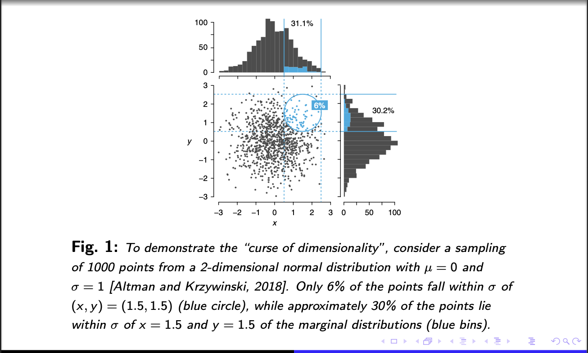
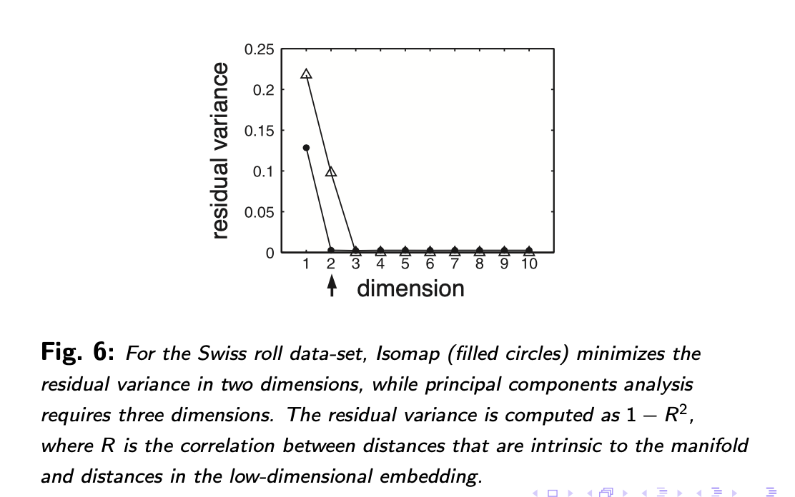

# Non-Linear Manifold Learning

## Table of Contents

1. [Motivation: The Problem with High-Dimensional Data](#1-motivation)
2. [The Manifold Hypothesis](#2-the-manifold-hypothesis)
3. [Why Linear Methods Fail on Curved Manifolds](#3-why-linear-methods-fail)
4. [The General Manifold Learning Recipe](#4-the-general-recipe)
5. [Multidimensional Scaling (MDS)](#5-multidimensional-scaling)
6. [Sammon Mapping](#6-sammon-mapping)
7. [Isomap](#7-isomap)
8. [Laplacian Eigenmaps](#8-laplacian-eigenmaps)
9. [t-SNE](#9-t-sne)
10. [UMAP](#10-umap)
11. [Autoencoders as Manifold Learners](#11-autoencoders)
12. [Practical Comparison](#12-practical-comparison)
13. [Sources and Further Reading](#13-sources)

---

## 1. Motivation: The Problem with High-Dimensional Data

### Why Reduce Dimensionality?

High-dimensional data is everywhere in machine learning: a 32×32 grayscale image lives in $\mathbb{R}^{1024}$; a gene expression profile might have 20,000 dimensions; a bag-of-words document vector could have tens of thousands. Intuitively, more information should be better. But as dimensionality grows, several things go badly wrong:

- **Visualization becomes impossible.** Humans perceive the world in 2 or 3 dimensions. To understand the structure of data — where the clusters are, what the outliers look like, how classes separate — we need to project into a space we can actually see.
- **Distance-based methods degrade.** Classification, clustering, and nearest-neighbor search all rely on distances being meaningful. In high dimensions, they stop being meaningful (see below).
- **Noise accumulates.** Many features may be irrelevant or redundant; projecting onto a lower-dimensional signal space can suppress noise and regularize downstream models.

### The Curse of Dimensionality

The pathologies of high-dimensional geometry are collectively called the **curse of dimensionality** — a term due to Bellman (1957). Two effects matter most.

**Effect 1: Distances grow and become indistinguishable.** Suppose $n$ points are sampled i.i.d. from $\mathcal{N}(0, I_p)$ — the standard Gaussian in $p$ dimensions. The squared distance between any two such points $x, y$ is:

$$\|x - y\|^2 = \sum_{i=1}^{p}(x_i - y_i)^2$$

Since $(x_i - y_i) \sim \mathcal{N}(0, 2)$, each term has $\mathbb{E}[(x_i - y_i)^2] = 2$. By linearity of expectation:

$$\mathbb{E}[\|x - y\|^2] = 2p$$

So the expected pairwise distance scales as $\sqrt{2p}$. This in itself is not catastrophic — distances just get large. What is catastrophic is that *all* distances converge to essentially the same value.

To see why, we compute $\mathrm{Var}[(x_i - y_i)^2]$ in three steps.

**Step 1 — Apply the variance identity.** Let $Z = (x_i - y_i)^2$. The standard identity $\mathrm{Var}[Z] = \mathbb{E}[Z^2] - (\mathbb{E}[Z])^2$ gives:

$$\mathrm{Var}[(x_i - y_i)^2] = \mathbb{E}[(x_i-y_i)^4] - \bigl(\mathbb{E}[(x_i-y_i)^2]\bigr)^2$$

**Step 2 — The squared second moment.** For any zero-mean random variable, $\mathbb{E}[X^2] = \mathrm{Var}[X]$. Since $(x_i - y_i) \sim \mathcal{N}(0, 2)$, we have $\mathbb{E}[(x_i-y_i)^2] = 2$, so $\bigl(\mathbb{E}[(x_i-y_i)^2]\bigr)^2 = 4$.

**Step 3 — The fourth moment.** For any $X \sim \mathcal{N}(0, \sigma^2)$, the fourth moment satisfies $\mathbb{E}[X^4] = 3\sigma^4$. This is a standard result from the Gaussian moment formula $\mathbb{E}[X^{2k}] = (2k-1)!! \cdot \sigma^{2k}$, where $(2k-1)!! = 1 \cdot 3 \cdot 5 \cdots (2k-1)$ is the double factorial; setting $k = 2$ gives $(3)!! \cdot \sigma^4 = 3\sigma^4$. Here $\sigma^2 = 2$, so $\sigma^4 = 4$, and:

$$\mathbb{E}[(x_i - y_i)^4] = 3 \cdot 4 = 12$$

**Combining:** $\mathrm{Var}[(x_i-y_i)^2] = 12 - 4 = 8$. Since the $p$ coordinates are independent, their variances add:

$$\mathrm{Var}[\|x-y\|^2] = \sum_{i=1}^p \mathrm{Var}[(x_i - y_i)^2] = 8p$$

Now apply the **delta method** — a first-order approximation stating that if $Y$ has mean $\mu$ and variance $\sigma^2$, then $\sqrt{Y}$ has variance $\approx \sigma^2/(4\mu)$. Setting $Y = \|x-y\|^2$ with $\mu = 2p$ and $\sigma^2 = 8p$:

$$\mathrm{SD}[\|x-y\|] \approx \frac{\sqrt{8p}}{2\sqrt{2p}} = 1$$

The absolute spread in pairwise distances stays constant at $\approx 1$ regardless of $p$, while the mean grows as $\sqrt{2p}$. The **coefficient of variation** (SD divided by mean) $= 1/\sqrt{2p} \to 0$ — distances concentrate ever more tightly around a single value. In other words, the *relative spread* of distances shrinks to zero — all points become roughly equidistant.

Concretely: in 2D, a nearest neighbor at distance 1 and a farthest neighbor at distance 10 are clearly distinguishable. In 1000D, you might find your nearest neighbor at distance 44.7 and your farthest neighbor at distance 45.1 — essentially impossible to tell apart. Distance-based methods (k-NN classifiers, clustering) become useless.

**Effect 2: Data becomes sparse.** For points from $\mathcal{N}(0, I_p)$, the fraction of data lying within a fixed-radius ball around any given point decreases exponentially in $p$.

**The $\ell_\infty$ argument.** The probability that a standard normal point falls within $[-1, 1]$ in a single coordinate is $\Phi(1) - \Phi(-1) \approx 0.683$. Because the $p$ coordinates are independent, the probability of simultaneously falling within $[-1, 1]$ in all coordinates — i.e., within the $\ell_\infty$ ball of side 2 — is $0.683^p$. In ten dimensions this is $0.683^{10} \approx 0.022$; in 100 dimensions it is $0.683^{100} \approx 4 \times 10^{-18}$.

**Why the same decay holds for Euclidean balls.** For a Euclidean ball the base factor is different, but the exponential decay in $p$ is the same: the probability shrinks geometrically at a rate that depends only on the radius and the tail behavior of the marginal distribution, not on $p$ itself, while the total number of dimensions — and therefore the number of ways the data can escape the ball — grows linearly.

**Concrete illustration.** Among 1000 points from a 2D standard normal, only about 6% fall within $\sigma$ of the point $(1.5, 1.5)$. The marginal distributions show about 30% within $\sigma$ of 1.5 in either dimension alone — the joint requirement makes density plummet.

As dimensionality increases, the average pairwise distance grows as $\sqrt{p}$ while the density of any fixed ball shrinks exponentially. The data is simultaneously far from everything and everywhere the same distance.

![Fig. 2: As dimension p increases, mean pairwise distance grows as √p (a) while the fraction of points within σ of the mean drops exponentially (b). [Altman and Krzywinski, 2018]](images/fig02_curse_dimensionality_pairwise_distance.png)

**So what?** The curse of dimensionality makes raw high-dimensional representations fundamentally hostile to learning. Dimensionality reduction is not an optional preprocessing step — it is often a prerequisite for any method that relies on meaningful distances or local structure.

---

## 2. The Manifold Hypothesis

The curse of dimensionality would be fatal if data truly filled all of high-dimensional space. But in practice, real data does not. This observation motivates the central assumption underlying all manifold learning:

> **The manifold hypothesis:** High-dimensional data generated by real processes tends to lie on or near a low-dimensional curved surface (a manifold) embedded within the high-dimensional ambient space.

**Definition.** A **manifold** (specifically, a smooth $k$-dimensional manifold) is a topological space such that every point has a neighborhood homeomorphic to $\mathbb{R}^k$. In plain terms: it locally looks flat, even if globally it is curved. $k$ is called the **intrinsic dimension** of the manifold. Examples:

- A circle $S^1$ is a 1-dimensional manifold: every small arc looks like a line segment.
- A sphere $S^2$ is a 2-dimensional manifold: every small patch looks like a flat disk.
- The "Swiss roll" — a sheet of paper rolled into a spiral — is a 2-dimensional manifold embedded in $\mathbb{R}^3$.

**Concrete example.** Consider a dataset of 32×32 grayscale images of the letter "A" at various rotations and sizes. Each image is a point in $\mathbb{R}^{1024}$. But there are really only two degrees of freedom — rotation angle and scale — so the images lie on a 2-dimensional surface inside $\mathbb{R}^{1024}$. The manifold is curved (rotating an "A" is not a linear operation on pixel values), but it has intrinsic dimension 2. The *apparent* dimensionality (1024) is an artifact of the chosen representation, not an intrinsic property of the data.

![Letter "A" at varying rotations and sizes (left), mapped to a 2D manifold (right). Despite living in ℝ^1024, the data has only two intrinsic degrees of freedom. [Image from Wikipedia]](images/letter_a_manifold.png)

**So what?** If the manifold hypothesis holds, there exists a coordinate system for the data with only $k \ll p$ dimensions, where $k$ reflects the true number of degrees of variation. The goal of manifold learning is to discover this coordinate system. Once found, the embedded representation discards the irrelevant ambient dimensions and retains only the intrinsic variation — making distances meaningful again and enabling visualization, clustering, and downstream learning.

---

## 3. Why Linear Methods Fail on Curved Manifolds

The most widely used dimensionality reduction method is **Principal Component Analysis (PCA)**, which finds the $k$ orthogonal directions of maximum variance in the data and projects onto them. Equivalently, PCA finds the best rank-$k$ linear approximation to the data. The key word is *linear*: PCA can only find flat hyperplanes.

**When data lies on a flat manifold**, PCA is provably optimal — no linear method can do better (Fodor §2). But when the manifold is curved, forcing the data onto a flat plane destroys its structure.

**The crowding problem.** When a curved manifold is projected linearly, points that are far apart along the manifold surface but close in Euclidean space (because the manifold loops back on itself) end up projected to nearby points. Simultaneously, points that are genuinely close on the manifold may project far apart if the manifold curves away. The resulting projection is crowded and uninformative — neighborhood relationships are scrambled.

![Fig. 4: A 2D Swiss roll manifold embedded in 3D (A). Noisy data on the manifold (B). After nonlinear dimensionality reduction, the 2D structure is cleanly recovered (C). Black outlines show the neighborhood of a single point. [Roweis and Saul, 2000]](images/fig04_swiss_roll_nonlinear_dr.png)

**Multi-Dimensional Scaling (MDS)**, the other classical method, attempts to preserve pairwise *Euclidean* distances between all points. But Euclidean distance in the ambient space does not respect the curved geometry of the manifold. Consider two points on opposite ends of a Swiss roll: their Euclidean distance (straight line cutting through the roll's interior) is small, but their distance *along the roll's surface* (the path you'd have to walk on it) is large. MDS conflates these, mapping the two points as neighbors when they should be far apart.

**The fundamental requirement** for a method to work on curved manifolds is that it measure distances *along the manifold*, not through the ambient space. This requires a different approach — one that captures the geometry of the curved surface rather than the geometry of the flat ambient space it sits in.

---

## 4. The General Manifold Learning Recipe

Despite their diversity, manifold learning algorithms share a common blueprint (following Whitfield slides §General steps):

**Step 1 — Build a neighborhood graph** in the high-dimensional space. Connect points that are nearby (within $\varepsilon$ of each other, or within the $K$ nearest neighbors). For sufficiently close points, Euclidean distance in the ambient space approximates the manifold distance — the locality assumption makes this safe.

**Step 2 — Compute distances or similarities on the neighborhood structure.** Different algorithms do very different things here: Isomap computes shortest-path distances on the graph; Laplacian Eigenmaps computes spectral properties of the graph Laplacian; t-SNE and UMAP compute probability distributions over neighborhoods directly from raw pairwise Euclidean distances (using Gaussian or related kernels), without explicitly computing shortest paths. Note that t-SNE and UMAP deviate from a strict "graph distance" framing — they work with all-pairs Gaussian similarities, using the per-point bandwidth $\sigma_i$ as a soft neighborhood selector rather than a hard graph cutoff.

**Step 3 — Construct a low-dimensional embedding.** Place points in $\mathbb{R}^k$ such that the low-dimensional distances match the manifold distances from Step 2.

**Step 4 — Optimize a cost function** measuring the discrepancy between Step 2 distances and Step 3 coordinates.

The algorithms in this document are distinguished by their choices in Steps 2, 3, and 4 — and the tradeoffs those choices imply.

---

## 5. Multidimensional Scaling (MDS)

Before examining the manifold learning algorithms, we need to understand MDS, since almost every algorithm in this document is either MDS, a variant of it, or a reaction against its shortcomings. (Following Fodor §8.3 and Whitfield slides.)

### 5.1 The MDS Problem

**The setup.** Given $n$ data points $\{x_i\}_{i=1}^n \in \mathbb{R}^p$ and their pairwise distances $\delta_{ij}$, find $k$-dimensional coordinates $\{y_i\}_{i=1}^n \in \mathbb{R}^k$ such that the distances $d_{ij} = \|y_i - y_j\|$ are as close as possible to $\delta_{ij}$.

*In plain terms: you have a table of "how far apart is every point from every other point" in the original high-dimensional space. MDS asks — can I place these points in a low-dimensional space (say, a 2D map) such that points that were far apart are still far apart, and points that were close are still close? It's like trying to draw an accurate map of cities given only a table of driving distances between them.*

**The stress function.** MDS minimizes the **normalized stress** (Kruskal's stress):

$$\text{stress}(\{y_i\}) = \sqrt{\frac{\sum_{i < j} (d_{ij} - \delta_{ij})^2}{\sum_{i < j} \delta_{ij}^2}}$$

The numerator is the total squared discrepancy between low-dimensional and original distances; the denominator normalizes by the scale of the original distances so the result is **dimensionless** — it doesn't depend on whether you measure in meters or kilometers, and it can be compared across datasets.

### 5.2 Classical MDS = PCA

When the $\delta_{ij}$ are Euclidean distances in $\mathbb{R}^p$ and we want an exact (not approximate) embedding, the optimal solution is given by an eigendecomposition. This is **classical MDS**, and it is equivalent to PCA.

The key challenge is that MDS starts from distances, but eigendecomposition (and PCA) requires **inner products**. The route from one to the other is **double-centering**.

**Step 1 — The centering matrix $H$.** Define:

$$H = I - \frac{1}{n}\mathbf{1}\mathbf{1}^\top$$

where $\mathbf{1} = (1,1,\ldots,1)^\top \in \mathbb{R}^n$ is the all-ones column vector. The product $\mathbf{1}\mathbf{1}^\top$ is the **outer product** of $\mathbf{1}$ with itself — an $n\times 1$ column times a $1\times n$ row — giving an $n\times n$ matrix where every entry equals 1:

$$\mathbf{1}\mathbf{1}^\top = \begin{pmatrix}1\\1\\\vdots\\1\end{pmatrix}\begin{pmatrix}1&1&\cdots&1\end{pmatrix} = \begin{pmatrix}1&1&\cdots&1\\1&1&\cdots&1\\\vdots&\vdots&\ddots&\vdots\\1&1&\cdots&1\end{pmatrix}$$

So $\tfrac{1}{n}\mathbf{1}\mathbf{1}^\top v = \bar{v}\cdot\mathbf{1}$ for any vector $v$ — it replaces every entry with the mean. Therefore $Hv = v - \bar{v}\mathbf{1}$: it mean-centers $v$. Applying $H$ from both sides of a matrix ($HDH$) mean-centers both the rows and columns — that is double-centering.

**Step 2 — Construct the Gram matrix.** Let $D$ be the matrix of squared distances: $D_{ij} = \delta_{ij}^2$. Define:

$$B = -\tfrac{1}{2} H D H$$

**Claim:** $B_{ij} = y_i \cdot y_j$ — the matrix of inner products between the (unknown) embedding coordinates.

**Step 3 — Derive the claim.** Assume the embedding is mean-centered: $\sum_i y_i = 0$, so $\bar{y} = 0$ (this is exactly what $H$ enforces). Expand $D_{ij} = \|y_i - y_j\|^2 = \|y_i\|^2 + \|y_j\|^2 - 2y_i \cdot y_j$. Let $\overline{\|y\|^2} = \frac{1}{n}\sum_i \|y_i\|^2$. Computing the row mean of $D$:

$$\bar{D}_{i\cdot} = \frac{1}{n}\sum_j D_{ij} = \frac{1}{n}\sum_j\bigl(\|y_i\|^2 + \|y_j\|^2 - 2y_i \cdot y_j\bigr) = \|y_i\|^2 + \overline{\|y\|^2} - 2y_i \cdot \underbrace{\bar{y}}_{=0} = \|y_i\|^2 + \overline{\|y\|^2}$$

By symmetry, $\bar{D}_{\cdot j} = \|y_j\|^2 + \overline{\|y\|^2}$ and $\bar{D}_{\cdot\cdot} = 2\overline{\|y\|^2}$. Double-centering:

$$(HDH)_{ij} = D_{ij} - \bar{D}_{i\cdot} - \bar{D}_{\cdot j} + \bar{D}_{\cdot\cdot}$$
$$= \bigl(\|y_i\|^2 + \|y_j\|^2 - 2y_i \cdot y_j\bigr) - \bigl(\|y_i\|^2 + \overline{\|y\|^2}\bigr) - \bigl(\|y_j\|^2 + \overline{\|y\|^2}\bigr) + 2\overline{\|y\|^2} = -2y_i \cdot y_j$$

The $\|y_i\|^2$, $\|y_j\|^2$, and $\overline{\|y\|^2}$ terms all cancel, leaving only $-2y_i \cdot y_j$. Therefore $B = -\frac{1}{2}HDH$ gives $B_{ij} = y_i \cdot y_j$ as claimed.

**Step 4 — Eigendecompose to recover coordinates.** Eigendecomposing $B = V\Lambda V^\top$ and taking the top $k$ eigenvectors/values gives the embedding $Y = V_k \Lambda_k^{1/2}$ — exactly the PCA solution. Here is why each piece works.

**Why $B = YY^T$.** We just showed $B_{ij} = y_i \cdot y_j$. If $Y \in \mathbb{R}^{n \times k}$ is the matrix whose $i$-th row is $y_i^\top$, then the $(i,j)$ entry of $YY^T$ is exactly $y_i \cdot y_j = B_{ij}$. So $B = YY^T$ — $B$ is the Gram matrix of the embedding.

**Why eigendecomposition recovers $Y$.** Any positive semidefinite matrix (and $B = YY^T$ is always PSD) has an eigendecomposition $B = V\Lambda V^T$ with $\Lambda \geq 0$. Since $B = YY^T$, we can factor $Y = V\Lambda^{1/2}$ — check: $V\Lambda^{1/2}(V\Lambda^{1/2})^T = V\Lambda V^T = B$ ✓. This recovery is unique up to an orthogonal rotation of $Y$ (replacing $Y$ with $YR$ for any orthogonal $R$ gives the same $B$), but rotation is unobservable: a rotated coordinate system represents the same geometry.

**Why the top-$k$ eigenvectors give the best $k$-dimensional embedding.** We can't generally recover the full $p$-dimensional $Y$ from $B$ — we want the best rank-$k$ approximation. The **Eckart-Young theorem** states that the best rank-$k$ approximation to any matrix $B$ (in the Frobenius norm sense) is obtained by keeping only the top $k$ eigenvalues and their eigenvectors: $B_k = V_k \Lambda_k V_k^T$. This gives the embedding $Y_k = V_k \Lambda_k^{1/2}$ that minimizes the inner-product reconstruction error $\|B - Y_k Y_k^T\|_F^2$ over all rank-$k$ matrices. Concretely: the first eigenvector captures the direction of greatest spread in the data, the second captures the next most, and so on — exactly what PCA does.

**The two paths to the same answer.** Classical MDS and PCA are computing the same thing via different routes:

$$\underbrace{X \xrightarrow{\text{compute}} XX^T = B \xrightarrow{\text{eigendecompose}} V_k\Lambda_k^{1/2}}_{\text{PCA route (needs raw data } X \text{)}}$$

$$\underbrace{\delta_{ij} \xrightarrow{\text{square}} D \xrightarrow{-\frac{1}{2}HDH} B \xrightarrow{\text{eigendecompose}} V_k\Lambda_k^{1/2}}_{\text{MDS route (needs only distances)}}$$

The two paths give identical embeddings whenever distances are Euclidean and data is centered. The practical implication: if you only have a table of pairwise distances (no raw coordinates), classical MDS recovers the PCA solution exactly — you never need the original data matrix $X$.

### 5.3 The Key Weakness

The stress function gives equal weight to every pairwise distance. Since there are far more distant pairs than nearby pairs in typical data, the optimization is dominated by large distances. Small, local distances — which encode the actual neighborhood structure of the manifold — are swamped.

This is the **large-distance dominance problem** in MDS: the method optimizes global geometry at the expense of local structure. Nearby points may end up crowded together or scrambled because their pairwise distances account for only a tiny fraction of the total stress. (Note: this is a different failure mode from the *crowding problem* discussed in §9.3 — that problem arises from a geometric volume mismatch in high dimensions, and is specific to methods that try to compress data into 2D.)

---

## 6. Sammon Mapping

Sammon Mapping (Sammon, 1969) is a direct response to MDS's weakness. It is widely considered the first nonlinear dimensionality reduction method.

### 6.1 The Weighted Stress

The key insight is to **weight each pairwise term by the reciprocal of the original distance**:

$$E = \frac{1}{\sum_{i < j} \delta^*_{ij}} \sum_{i < j} \frac{(\delta^*_{ij} - d_{ij})^2}{\delta^*_{ij}}$$

where $\delta^*_{ij}$ is the high-dimensional pairwise distance and $d_{ij}$ is the low-dimensional distance.

**Why does this help?** Consider the contribution of a single pair. In MDS, the contribution is $(d_{ij} - \delta^*_{ij})^2$ — the same regardless of how close the points are. In Sammon Mapping, it's $(d_{ij} - \delta^*_{ij})^2 / \delta^*_{ij}$.

For a pair at $\delta^*_{ij} = 0.1$, an absolute error of 0.05 contributes $0.05^2 / 0.1 = 0.025$. For a pair at $\delta^*_{ij} = 10$, the same absolute error contributes $0.05^2 / 10 = 0.00025$ — a factor of 100 smaller. The optimization places much more weight on getting small distances right, which is precisely what matters for preserving local manifold structure.

### 6.2 So What?

Sammon Mapping genuinely improves on MDS for locally structured data. By up-weighting errors on nearby pairs, it better preserves the neighborhood structure that characterizes the manifold's local geometry.

But it is not a complete solution. The method still uses Euclidean distances $\delta^*_{ij}$ — measured in the ambient space, not along the manifold. On strongly curved manifolds (like the Swiss roll), Euclidean distance is a poor proxy for manifold distance even between nearby points, so the weighted stress is optimizing a quantity that doesn't reflect the true geometry. Sammon Mapping is an improvement over MDS in practice, but it doesn't fix the root problem.

**Limitations:**
- Still uses ambient Euclidean distance — fails on strongly curved manifolds.
- No convex optimization guarantee; prone to local minima.
- $O(n^2)$ pairwise distances; scales poorly.

---

## 7. Isomap

Isomap (Tenenbaum, de Silva, and Langford, 2000) makes the conceptually decisive step: replace Euclidean distances with **geodesic distances** — distances measured along the manifold.

### 7.1 Geodesic Distance

**Definition.** The **geodesic distance** between two points on a manifold is the length of the shortest path *along the manifold surface* connecting them. On a flat plane, geodesic distance equals Euclidean distance. On a curved surface, they differ.

Consider the Swiss roll. Two points on opposite edges of the roll can be very close in Euclidean distance (the straight line cuts through the roll's interior), but far in geodesic distance (you must walk along the spiral surface). MDS treats them as neighbors; Isomap correctly identifies them as distant.

![Fig. 5: Isomap on the Swiss roll. (A) 3D data with geodesic path (red, along the surface) vs. Euclidean shortcut (blue). (B) Neighborhood graph with shortest path highlighted in red. (C) Resulting graph structure used to construct the low-dimensional embedding. [Tenenbaum et al., 2000]](images/fig05_isomap_geodesic_swiss_roll.png)

We cannot directly compute geodesic distances on an *unknown* manifold. But we can approximate them: if we build a graph connecting nearby points (using Euclidean distance for only these short hops), the shortest path in this graph approximates the true geodesic. The approximation improves as data density increases and neighborhood sizes shrink.

### 7.2 The Isomap Algorithm

*(Following Tenenbaum et al. (2000) Table 1, reproduced in Whitfield slides.)*

**Input:** Distances $d_X(i,j)$ between all $n$ data points; neighborhood parameter $K$ (or $\varepsilon$); target dimension $d$.

---

**Step 1 — Construct neighborhood graph $G$.**

For **K-Isomap**: connect $i$ and $j$ if $i$ is among the $K$ nearest neighbors of $j$ (or vice versa).
For **$\varepsilon$-Isomap**: connect $i$ and $j$ if $d_X(i,j) < \varepsilon$.

Set edge lengths equal to $d_X(i,j)$.

*Intuition:* We only trust Euclidean distances to approximate geodesic distances for nearby points. The graph encodes which pairs are "locally connected" — close enough that the Euclidean distance is a good approximation to the manifold distance.

---

**Step 2 — Compute shortest paths (Floyd-Warshall).**

Initialize $d_G(i,j) = d_X(i,j)$ if $i,j$ are connected; $d_G(i,j) = \infty$ otherwise. Then for $k = 1, 2, \ldots, n$, update all entries:

$$d_G(i,j) \leftarrow \min\bigl\{d_G(i,j),\ d_G(i,k) + d_G(k,j)\bigr\}$$

After all $n$ iterations, $D_G = \{d_G(i,j)\}$ contains the shortest-path distances between all pairs of points in $G$.

*What is Floyd-Warshall?* A dynamic programming algorithm for all-pairs shortest paths. The update at step $k$ asks: "Is there a shorter path from $i$ to $j$ that passes through node $k$ as an intermediate stop?" If $d_G(i,k) + d_G(k,j) < d_G(i,j)$, update. After considering all possible intermediate nodes, every $d_G(i,j)$ contains the length of the shortest path in $G$. Time complexity: $O(n^3)$.

*Why does this approximate geodesic distance?* Each edge in $G$ connects nearby points, so its length is a trustworthy local Euclidean distance. Chaining these short hops gives a path that stays on (or near) the manifold. The shortest such path approximates the manifold geodesic. For dense data and small $K$, the approximation is provably accurate (Tenenbaum et al. show it converges to the true geodesic as $n \to \infty$ and $K$ grows slowly).

---

**Step 3 — Construct $d$-dimensional embedding via MDS.**

Apply classical MDS to the geodesic distance matrix $D_G$:

1. Double-center: $B = -\tfrac{1}{2} H D_G^{(2)} H$, where $D_G^{(2)}$ denotes elementwise squaring of $D_G$ and $H = I - \tfrac{1}{n}\mathbf{1}\mathbf{1}^\top$.
2. Eigendecompose: $B = V\Lambda V^\top$.
3. Set the $p$-th coordinate of $y_i$ to $\sqrt{\lambda_p}\, v^p_i$, where $\lambda_p$ is the $p$-th eigenvalue and $v^p_i$ is the $i$-th component of the $p$-th eigenvector.

*What is the double-centering doing?* As explained in §5.2, it converts a squared distance matrix into the Gram matrix (inner products), enabling the eigendecomposition to recover coordinates directly.

---

![Swiss roll comparison: original 3D data (left), PCA projection showing colors scrambled by crowding (center), Isomap embedding cleanly unrolling the manifold (right). [UBC CPSC-340]](images/isomap_vs_pca_swiss_roll.png)

### 7.3 So What? — The Payoff

By substituting geodesic distances for Euclidean distances, Isomap correctly "unfolds" curved manifolds. Two points on opposite sides of the Swiss roll, which Euclidean MDS would map as neighbors, are now correctly placed far apart. The resulting embedding respects the intrinsic geometry of the data.

**Why does MDS on geodesic distances give a faithful embedding?** This is not obvious — after all, we're still running MDS, which we criticized for failing on curved manifolds. The key is a theorem from Tenenbaum et al. (2000): if the manifold $\mathcal{M}$ is **isometric** to a convex subset of $\mathbb{R}^k$ — meaning it can be "unrolled" into a flat $k$-dimensional region without any stretching or tearing — then the geodesic distances on $\mathcal{M}$ are exactly Euclidean distances in the intrinsic coordinate system. Since classical MDS exactly recovers Euclidean coordinates from Euclidean distances (§5.2), it follows that MDS on geodesic distances exactly recovers the intrinsic coordinates.

The Swiss roll satisfies this condition: it is a flat 2D sheet that has been bent into a spiral. Unrolling it produces a flat rectangle, and the geodesic distances on the roll are exactly the Euclidean distances in the unrolled rectangle. So Isomap exactly recovers a 2D coordinate system for the Swiss roll.

**Scope condition:** Isomap is exact for isometrically flat manifolds and approximate otherwise. For manifolds with intrinsic curvature (e.g., a sphere, which cannot be flattened without distortion), geodesic distances are not globally Euclidean and the embedding will be approximate. In practice, many real-world manifolds are "approximately flat" locally and Isomap works well, but this assumption should be kept in mind.

Moreover, Isomap inherits MDS's optimization properties: the final embedding is computed via an eigendecomposition with a guaranteed global optimum. There is no gradient descent, no local minima, no hyperparameter tuning beyond $K$ and $d$.

### 7.4 Residual Variance and Intrinsic Dimensionality

A useful diagnostic: the **residual variance**, defined as $1 - R^2$ where $R$ is the correlation between geodesic distances and low-dimensional distances, measures how well the embedding preserves manifold geometry. Plotting residual variance against $d$ produces an "elbow" curve; the elbow marks the true intrinsic dimension.

For the Swiss roll, Isomap's residual variance drops to near zero at $d = 2$, correctly identifying it as a 2-dimensional manifold. PCA's residual variance doesn't reach zero until $d = 3$, because it needs an extra dimension to approximate the curved surface with a flat hyperplane.

### 7.5 Limitations

- **Short-circuiting.** Suppose a noisy data point $x_\text{bad}$ lands in the interior of a Swiss roll — spatially between two turns that should be geodesically far apart. When the neighborhood graph is built, $x_\text{bad}$ connects to points on *both* turns (they are all nearby in Euclidean distance), effectively bridging the two turns with a very short edge. Now every shortest path that passes through $x_\text{bad}$ uses this shortcut: Floyd-Warshall finds a route from turn 1 to turn 2 via $x_\text{bad}$ with nearly the Euclidean cost, whereas the true geodesic should trace the long spiral path between them. Since Floyd-Warshall propagates these shortened paths globally — $d_G(i,j) \leftarrow \min\{d_G(i,j), d_G(i,k) + d_G(k,j)\}$ for every $k$ — the corruption from one bad node spreads to all pairs whose shortest path happens to route through it. The resulting distance matrix has a cluster of anomalously small entries, and MDS maps the two affected turns as neighbors. Isomap has no mechanism to detect or repair this.
- Requires a connected neighborhood graph; disconnected components cannot be jointly embedded.
- $O(n^3)$ complexity (Floyd-Warshall) makes it slow for large $n$.
- Preserves global geodesic distances (via MDS), but pays relatively little attention to very local structure.

---

## 8. Laplacian Eigenmaps

Laplacian Eigenmaps (Belkin and Niyogi, 2003) takes a different approach. Instead of approximating geodesic distances and running MDS, it directly encodes local neighborhood relationships in a graph and finds the embedding by solving an eigenvalue problem on that graph.

### 8.1 The Core Objective

**What do we want from an embedding?** At minimum: if $x_i$ and $x_j$ are close in the original space, their embeddings $y_i$ and $y_j$ should also be close. We can formalize this as the objective:

$$\min_{f: \{x_i\} \to \mathbb{R}} \sum_{i,j} W_{ij}(f_i - f_j)^2$$

where $W_{ij}$ is the weight between points $i$ and $j$ — large if they are close, small or zero if they are far. This penalizes placing nearby points far apart in the embedding. We want to minimize this over all (non-trivial) embedding functions $f$.

The matrix structure encoding this objective is the **graph Laplacian**.

### 8.2 The Graph Laplacian

**Definition.** Given a weighted graph with $n$ nodes and weight matrix $W$ (where $W_{ij}$ is the edge weight between nodes $i$ and $j$, set to 0 if not connected), define:

- **Degree matrix** $D$: a diagonal matrix with $D_{ii} = \sum_j W_{ij}$ (the sum of all edge weights incident to node $i$).
- **Graph Laplacian** $L = D - W$.

**Key identity.** For any vector $f \in \mathbb{R}^n$:

$$f^\top L f = \frac{1}{2} \sum_{i,j} W_{ij}(f_i - f_j)^2$$

*Proof.* Expand the right side:
$$\frac{1}{2}\sum_{i,j} W_{ij}(f_i^2 - 2f_if_j + f_j^2) = \frac{1}{2}\left(2\sum_i f_i^2 \sum_j W_{ij} - 2\sum_{i,j} W_{ij}f_if_j\right) = f^\top D f - f^\top W f = f^\top(D-W)f = f^\top L f$$

This identity is fundamental: it shows that $f^\top L f$ is exactly the weighted sum of squared differences we want to minimize. So minimizing our embedding objective is equivalent to minimizing $f^\top L f$.

**Properties of $L$:**
1. $L$ is symmetric and positive semi-definite ($f^\top Lf \geq 0$ for all $f$, which follows directly from the identity above since $W_{ij} \geq 0$).
2. The constant vector $\mathbf{1} = (1,1,\ldots,1)^\top$ is always an eigenvector with eigenvalue 0 (since $L\mathbf{1} = (D-W)\mathbf{1} = D\mathbf{1} - W\mathbf{1} = 0$ because $W_{ij}$'s row sums equal $D_{ii}$).
3. The number of zero eigenvalues equals the number of connected components.

   *Why?* Recall $f^\top Lf = \frac{1}{2}\sum_{ij}W_{ij}(f_i - f_j)^2$. A vector $f$ achieves $f^\top Lf = 0$ if and only if $W_{ij}(f_i - f_j)^2 = 0$ for every pair — i.e., $f$ must be constant within each connected component (since $W_{ij} > 0$ for any connected edge). If there are $k$ components, you can assign *any* constant value to each component independently, giving exactly $k$ linearly independent zero-eigenvectors (one indicator vector per component). For a single connected graph there is only one such vector, the constant vector $\mathbf{1}$, so there is exactly one zero eigenvalue. Practically: if you see multiple near-zero eigenvalues in a Laplacian eigenmaps solution, the graph is nearly or exactly disconnected — usually a sign that the $K$-NN bandwidth is too small.

### 8.3 The Algorithm

**Step 1 — Build weighted graph.** Connect nearby points using $\varepsilon$-neighborhoods or $K$-nearest neighbors. Assign weights using either:
- **Binary weights:** $W_{ij} = 1$ if connected, 0 otherwise.
- **Heat kernel weights:** $W_{ij} = \exp(-\|x_i - x_j\|^2 / t)$ for bandwidth parameter $t$. Gaussian decay: closer points receive higher weight.

**Step 2 — Compute the graph Laplacian.** Form $D$ (diagonal, $D_{ii} = \sum_j W_{ij}$) and $L = D - W$.

**Step 3 — Solve the generalized eigenproblem.** Find eigenvectors and eigenvalues satisfying:

$$Lf = \lambda Df$$

This is the **generalized eigenproblem** — it differs from the standard eigenproblem $Lf = \lambda f$ by having $D$ on the right-hand side. This form arises directly from the constrained optimization via Lagrange multipliers: the problem $\min_f f^\top Lf$ subject to $f^\top Df = 1$ has Lagrangian

$$\mathcal{L}(f, \lambda) = f^\top Lf - \lambda(f^\top Df - 1)$$

Setting $\partial \mathcal{L}/\partial f = 0$ gives $2Lf - 2\lambda Df = 0$, i.e., $Lf = \lambda Df$. The solutions are the generalized eigenvectors of $(L, D)$, and the corresponding eigenvalue $\lambda = f^\top Lf$ is the value of the objective at that solution — so the eigenvector with the *smallest* $\lambda$ solves the minimization. The normalization $f^\top Df = 1$ accounts for node degree: a node with many high-weight neighbors contributes more to the graph, so it is normalized more heavily than an isolated node.

**Step 4 — Form the embedding.** Let $f_0, f_1, \ldots, f_{n-1}$ be the eigenvectors sorted by increasing eigenvalue $\lambda_0 \leq \lambda_1 \leq \cdots$. Discard $f_0$ (the constant vector with $\lambda_0 = 0$ — it carries no information about relative positions). The $d$-dimensional embedding of $x_i$ is:

$$y_i = (f_1(i),\ f_2(i),\ \ldots,\ f_d(i))$$

**Why the smallest eigenvectors?** Recall $f^\top L f = \frac{1}{2}\sum_{ij} W_{ij}(f_i - f_j)^2$. Eigenvectors with small eigenvalues have small $f^\top Lf$ — they assign similar values to connected (nearby) nodes. They vary *smoothly* across the graph, making them ideal as embedding coordinates that keep neighbors together. Eigenvectors with large eigenvalues oscillate rapidly between neighbors and would scatter nearby points in the embedding.

**Intuition:** Think of the eigenvectors as the "natural vibration modes" of the graph. Low-frequency modes (small eigenvalues) are like long, gentle waves across the graph — slowly varying, so similar points get similar values. High-frequency modes are like rapid oscillations — nearby nodes get very different values. The Laplacian Eigenmap embedding uses only the low-frequency modes.

![Laplacian Eigenmaps toy example: 4 points connected as a star graph (left). W, D, and L = D − W computed explicitly. Solving Lf = λDf gives eigenvector f₁ = (0,−3,1,2), embedding the points on the real line in order of their graph position. [PyData Berlin 2018]](images/laplacian_eigenmaps_4_nodes.png)

### 8.4 So What? — The Spectral Payoff

Laplacian Eigenmaps differs from Isomap in a philosophically important way. Isomap asks: *what are the geodesic distances between every pair of points, and can we find coordinates that reproduce them globally?* Laplacian Eigenmaps asks only: *can we find coordinates that keep neighboring points together?* The global question requires accurately estimating geodesic distances across the entire manifold — a task that fails whenever the graph is noisy, the manifold has intrinsic curvature, or the data is unevenly sampled. The local question requires only that short-range edges carry reliable similarity information, which is a far weaker assumption.

The spectral solution is elegant because it provides the answer in closed form: the low-frequency eigenvectors of the graph Laplacian are, by construction, the smoothest possible functions on the graph — they vary as gently as possible between connected nodes. There is no gradient descent, no risk of local minima, and no sensitivity to initialization. The solution is globally optimal for the stated objective.

There is also a deeper theoretical grounding. Belkin and Niyogi (2003) show that as the number of data points grows and the bandwidth shrinks appropriately, the graph Laplacian $L$ converges to the **Laplace-Beltrami operator** — the natural generalization of the Laplacian to Riemannian manifolds. The Laplace-Beltrami operator measures how quickly a function varies intrinsically along the manifold surface, accounting for curvature. So in the limit, Laplacian Eigenmaps discovers the eigenfunctions of the manifold's own geometry — an intrinsic coordinate system that is as natural to the manifold as Fourier modes are to the circle.

This spectral perspective also motivates UMAP: UMAP's default initialization is a Laplacian Eigenmap on the same $k$-NN graph it builds for the full optimization. Starting from a spectral embedding (rather than a random one) gives the gradient optimization a principled, roughly correct starting point, reducing the variation between runs and avoiding grossly wrong local minima.

### 8.5 Limitations

- Only encodes local neighborhoods; no explicit mechanism for global structure preservation.
- Sensitive to the choice of $K$, $\varepsilon$, and heat kernel bandwidth $t$.
- Sensitive to noise, which can corrupt edge weights and distort the eigenvectors.

---

## 9. t-SNE

Laplacian Eigenmaps gives a spectrally clean answer to local neighborhood preservation, but it offers no explicit mechanism for visualization: embedding high-dimensional data into 2D produces a crowded map where clusters overlap and structure is lost. The next algorithm was designed specifically to solve that problem.

t-SNE (t-Distributed Stochastic Neighbor Embedding; van der Maaten and Hinton, 2008) is the most widely used algorithm for visualizing high-dimensional data. It produces strikingly clear cluster structure in 2D embeddings, and understanding *why* it works — and where it fails — requires following a chain of ideas: SNE → the crowding problem → the t-distribution fix.

### 9.1 Stochastic Neighbor Embedding (SNE)

SNE (Hinton and Roweis, 2002) starts from a different philosophy than distance-preservation methods. Instead of matching distances, it matches **probability distributions over neighborhoods**.

**High-dimensional similarities.** For each data point $x_i$, define a conditional probability $p_{j \mid i}$ — the probability that $x_i$ would "pick" $x_j$ as its neighbor, if neighbors were chosen proportional to a Gaussian density centered at $x_i$:

$$p_{j \mid i} = \frac{\exp\bigl(-\|x_i - x_j\|^2 / 2\sigma_i^2\bigr)}{\sum_{k \neq i} \exp\bigl(-\|x_i - x_k\|^2 / 2\sigma_i^2\bigr)} \tag{9.1}$$

Reading this: the numerator is the Gaussian density at $x_j$ with mean $x_i$ and bandwidth $\sigma_i$; the denominator normalizes so that $\sum_{j \neq i} p_{j|i} = 1$. Points close to $x_i$ get high probability; distant points get near-zero probability. This gives a **soft neighborhood**: it doesn't just say who the neighbors are, but how neighborly they are, on a continuous scale. The bandwidth $\sigma_i$ is chosen separately for each point (see §9.6).

**Low-dimensional similarities.** For the map points $y_i \in \mathbb{R}^d$, define $q_{j|i}$ analogously with a fixed bandwidth $\sigma = 1/\sqrt{2}$:

$$q_{j \mid i} = \frac{\exp\bigl(-\|y_i - y_j\|^2\bigr)}{\sum_{k \neq i} \exp\bigl(-\|y_i - y_k\|^2\bigr)}$$

*Why $\sigma = 1/\sqrt{2}$?* Substituting into the Gaussian $\exp(-\|y_i - y_j\|^2 / 2\sigma^2)$ gives $\exp(-\|y_i - y_j\|^2 / 2 \cdot \tfrac{1}{2}) = \exp(-\|y_i - y_j\|^2)$ — the exponent simplifies to just the squared distance. The specific value $1/\sqrt{2}$ is a notational convenience, not a meaningful choice; any fixed constant would work and be equivalent up to rescaling the embedding. What matters is that the bandwidth is *fixed* (not per-point adaptive like $\sigma_i$): since all map points live in a two-dimensional space where the total range of distances is controlled by the optimizer, a single shared bandwidth is appropriate.

**Objective.** Find $\{y_i\}$ such that $q_{j|i} \approx p_{j|i}$ for all $i,j$. The mismatch is measured by the sum of KL divergences:

$$C = \sum_i \mathrm{KL}(P_i \| Q_i) = \sum_i \sum_j p_{j|i} \log \frac{p_{j|i}}{q_{j|i}}$$

where $P_i$ is the conditional distribution over all other points given $x_i$ in high-D, and $Q_i$ is the same for $y_i$ in low-D.

**Why KL divergence?** Recall $\mathrm{KL}(P\|Q) = \sum_j p_j \log(p_j/q_j)$. KL divergence is asymmetric: it assigns large cost when $p_{j|i}$ is large but $q_{j|i}$ is small (nearby points placed too far apart in the map), and small cost when $p_{j|i}$ is small but $q_{j|i}$ is large (far-apart points placed too close). This asymmetry means the cost function strongly enforces that *nearby* pairs are placed nearby — at the mild expense of caring less about the arrangement of distant pairs.

**So what does this buy over MDS and Sammon?** Two things. First, the per-point bandwidth $\sigma_i$ adapts automatically to local data density: in a dense region, a small $\sigma_i$ achieves the target perplexity; in a sparse region, $\sigma_i$ expands to find enough neighbors. MDS and Sammon use the same Euclidean distances everywhere and cannot adapt to density variation — a sparse outlier and a point in a dense cluster are treated identically by the cost function. Second, the probabilistic framing encodes neighborhood structure continuously rather than with a hard cutoff. Rather than saying "these $K$ points are neighbors and all others are not," $p_{j|i}$ assigns graded importance to every other point. This makes the optimization more stable and less sensitive to the exact choice of neighborhood size.

### 9.2 Symmetric SNE

**Why the asymmetric gradient is complicated.** The asymmetric cost is $C = \sum_i \mathrm{KL}(P_i \| Q_i)$, where $Q_i$ is the conditional distribution $q_{j|i}$ over map points. Each $q_{j|i}$ is normalized within the row for point $i$: its denominator $\sum_{k \neq i} \exp(-\|y_i - y_k\|^2)$ depends on $y_i$ but not on $y_j$. When differentiating $C$ with respect to $y_i$, $y_i$ appears in three places simultaneously: (1) as the center of row $i$'s Gaussian (in numerators of $q_{j|i}$ for all $j$), (2) as the normalizer of row $i$ (in all $q_{j|i}$), and (3) as a *neighbor* in row $j$'s Gaussian (in the numerator and denominator of $q_{i|j}$ for all $j \neq i$). Case (3) means each update to $y_i$ also changes how $y_i$ looks as a map-neighbor from every other point's perspective. This coupling across rows produces cross terms that do not simplify cleanly. The resulting gradient involves two separate nested sums — one for how $y_i$ moves within its own row, and one for how it influences every other row — making gradient computation $O(n^2)$ per step with a large constant.

Van der Maaten and Hinton propose symmetrizing by using **joint** probabilities instead of conditional probabilities:

$$p_{ij} = \frac{p_{j|i} + p_{i|j}}{2n}, \qquad q_{ij} = \frac{\exp(-\|y_i - y_j\|^2)}{\sum_{k \neq l} \exp(-\|y_k - y_l\|^2)}$$

Note $p_{ij} = p_{ji}$ and $q_{ij} = q_{ji}$ by construction. The symmetrization ensures $\sum_j p_{ij} > \frac{1}{2n}$ for all $i$, so every point — including outliers with all large pairwise distances — contributes meaningfully to the cost.

The cost becomes $C = \mathrm{KL}(P\|Q) = \sum_{i \neq j} p_{ij} \log \frac{p_{ij}}{q_{ij}}$ and the gradient is:

$$\frac{\partial C}{\partial y_i} = 4\sum_j (p_{ij} - q_{ij})(y_i - y_j)$$

*Brief derivation.* Write $C = \text{const} + \sum_{i\neq j} p_{ij}\|y_i-y_j\|^2 + \log Z_G$ where $Z_G = \sum_{k\neq l}\exp(-\|y_k-y_l\|^2)$ (using $\log q_{ij} = -\|y_i-y_j\|^2 - \log Z_G$). Differentiating the first sum with respect to $y_i$, both the $(i,j)$ and $(j,i)$ ordered pairs contribute, giving $4\sum_j p_{ij}(y_i-y_j)$. For $\log Z_G$: since $\partial\exp(-d_{ij}^2)/\partial y_i = -2(y_i-y_j)\exp(-d_{ij}^2)$, the same $k=i$ and $l=i$ symmetry as in §9.5 gives $\partial\log Z_G/\partial y_i = -4\sum_j q_{ij}(y_i-y_j)$. Combining: $4\sum_j(p_{ij}-q_{ij})(y_i-y_j)$.

**Physical interpretation.** Think of springs connecting every pair of map points. The spring between $y_i$ and $y_j$ has stiffness $(p_{ij} - q_{ij})$: attractive when $p_{ij} > q_{ij}$ (points too far apart in map), repulsive when $p_{ij} < q_{ij}$ (too close). The gradient is simply the total spring force on $y_i$.

Symmetric SNE already improves on asymmetric SNE, but the Gaussian kernel in $q_{ij}$ still produces poor 2D embeddings of high-dimensional data. The next section explains why — and the section after that shows how replacing the Gaussian with a heavier-tailed kernel (and what that does to the gradient) fixes it. Comparing the gradient here, $4\sum_j(p_{ij}-q_{ij})(y_i-y_j)$, with the final t-SNE gradient in §9.5 is instructive: the only difference is the additional Cauchy attenuation factor $(1+\|y_i-y_j\|^2)^{-1}$, which comes entirely from the change in kernel, not from any change to the SNE objective itself.

### 9.3 The Crowding Problem

Even symmetric SNE with Gaussians in both spaces has a fundamental failure mode on high-dimensional data: the **crowding problem**.

**The geometric argument (following van der Maaten and Hinton §3.2):**

Suppose data lies on a 10-dimensional manifold. The volume of a $d$-dimensional sphere of radius $r$ scales as $r^d$. So in 10 dimensions, doubling the radius multiplies volume by $2^{10} \approx 1000$. In 2 dimensions, doubling the radius multiplies area by only $2^2 = 4$.

Now consider a reference point and all data points at a moderate distance from it in 10D. When we try to map them to 2D while keeping *nearby* pairs close (which the cost function demands), there simply isn't enough area available. In 10D you can have 11 mutually equidistant points; in 2D you can have at most 3. The optimizer can't faithfully represent 10D geometry in 2D.

The consequence: to accurately model the small distances (nearby pairs), most of the moderately-distant points get pushed very far from the center in 2D. The resulting map has a tight cluster near the center, surrounded by a diffuse cloud — all global structure is lost.

**A numerical illustration.** Suppose 1000 points are uniformly distributed on a 10-dimensional manifold. In a 2D map there is approximately $\pi r^2$ area to accommodate points within radius $r$, but on the 10-dimensional manifold the corresponding neighborhood volume scales as $\propto r^{10}$. A shell at "radius 2" contains $2^{10}/1^{10} = 1024$ times as many points as a shell at "radius 1" — but the 2D map only has $2^2 = 4$ times as much area. The map is geometrically incapable of separating them.

### 9.4 The t-Distribution Fix: Mismatched Tails

Van der Maaten and Hinton's key insight: **use a heavy-tailed distribution in the low-dimensional space** to compensate for the geometric volume mismatch.

Specifically, replace the Gaussian in $q_{ij}$ with a **Student-$t$ distribution with 1 degree of freedom** (the Cauchy distribution):

$$q_{ij} = \frac{(1 + \|y_i - y_j\|^2)^{-1}}{\displaystyle\sum_{k \neq l}(1 + \|y_k - y_l\|^2)^{-1}} \tag{9.2}$$

Each factor $(1 + \|y_i - y_j\|^2)^{-1}$ is the unnormalized Cauchy density; the denominator normalizes so that $\sum_{i\neq j} q_{ij} = 1$.

**Why does this fix the crowding problem?** The Cauchy distribution has much heavier tails than the Gaussian. For a given probability mass, the corresponding distance under the Cauchy model is much larger than under the Gaussian. Concretely: a moderate distance in 10D (where the Gaussian assigns, say, probability $0.01$) can be faithfully represented by a *larger* distance in 2D where the Cauchy still assigns probability $0.01$. The heavy tails provide the extra "room" in the low-dimensional map to separate moderately-distant points without sacrificing accuracy on nearby pairs.

Put differently: the mismatch between the $r^{10}$ volume scaling in 10D and $r^2$ area scaling in 2D is compensated by using distributions with mismatched tails — Gaussian (thin tails, "compact" scale) in high-D, Cauchy (heavy tails, "expansive" scale) in low-D.

**A large-distance property of the Cauchy kernel.** For large pairwise distances where $\|y_i - y_j\|^2 \gg 1$, the "+1" in the kernel becomes negligible and $(1 + \|y_i - y_j\|^2)^{-1} \approx \|y_i - y_j\|^{-2}$ — an **inverse-square law**. (At small distances, this approximation does not hold: the kernel approaches 1 as $\|y_i - y_j\| \to 0$, not $\|y_i - y_j\|^{-2}$.) For well-separated clusters, the inverse-square behavior means the probability assigned to distant pairs falls off as a power law rather than exponentially, and the map representation is approximately scale-invariant for distant points: shifting all points by a constant factor changes large-scale probabilities only slightly. This scale invariance helps the optimization avoid artifacts from the overall scale of the map.

![Fig. 8: t-SNE gradient as a function of high-dimensional distance (x-axis) and low-dimensional distance (y-axis). Red = repulsive force, blue = attractive. t-SNE strongly repels dissimilar points (large high-D distance) that are placed too close in the map (small low-D distance). [van der Maaten and Hinton, 2008]](images/fig08_tsne_gradient.png)

### 9.5 The t-SNE Cost Function and Gradient

The cost function is:

$$C = \mathrm{KL}(P \| Q) = \sum_{i \neq j} p_{ij} \log \frac{p_{ij}}{q_{ij}} \tag{9.3}$$

with $p_{ij}$ from the symmetrized Gaussian model and $q_{ij}$ from equation (9.2).

**Gradient derivation** (following van der Maaten and Hinton, Appendix A):

Let $d_{ij} = \|y_i - y_j\|$ and $Z = \sum_{k \neq l}(1 + d_{kl}^2)^{-1}$ (the normalizing constant in $q_{ij}$). Then:

$$C = \underbrace{\sum_{i\neq j} p_{ij} \log p_{ij}}_{\text{constant w.r.t. } y} - \sum_{i \neq j} p_{ij} \log q_{ij}$$

Since $\log q_{ij} = -\log(1 + d_{ij}^2) - \log Z$:

$$C = \text{const} + \sum_{i \neq j} p_{ij} \log(1 + d_{ij}^2) + \log Z$$

(using $\sum_{i\neq j} p_{ij} = 1$).

**Differentiating with respect to $y_i$:**

Both pairs $(i,j)$ and $(j,i)$ in the sum contribute when we differentiate with respect to $y_i$. Since $p_{ij} = p_{ji}$ and $\partial d_{ij}^2/\partial y_i = 2(y_i - y_j)$, the first sum contributes:

$$2 \cdot \sum_j p_{ij} \cdot \frac{2(y_i - y_j)}{1 + d_{ij}^2} = 4\sum_j \frac{p_{ij}(y_i - y_j)}{1 + d_{ij}^2}$$

For the $\log Z$ term, note that $Z = \sum_{k \neq l}(1+d_{kl}^2)^{-1}$ depends on $y_i$ only through pairs where $k = i$ or $l = i$. Differentiating the $k = i$ terms:

$$\sum_{j \neq i} \frac{\partial (1 + d_{ij}^2)^{-1}}{\partial y_i} = \sum_j -(1+d_{ij}^2)^{-2} \cdot 2(y_i - y_j)$$

For the $l = i$ terms, $\partial\|y_k - y_i\|^2/\partial y_i = 2(y_i - y_k)$, giving:

$$\sum_{k \neq i} \frac{\partial (1+d_{ki}^2)^{-1}}{\partial y_i} = \sum_j -(1+d_{ij}^2)^{-2} \cdot 2(y_i - y_j)$$

The two contributions are identical (since $d_{ki} = d_{ik}$ and both point in direction $(y_i - y_j)$), so summing them:

$$\frac{\partial Z}{\partial y_i} = -4\sum_j (y_i - y_j)(1 + d_{ij}^2)^{-2}$$

$$\frac{\partial \log Z}{\partial y_i} = \frac{-4}{Z} \sum_j \frac{(y_i - y_j)}{(1 + d_{ij}^2)^2} = -4\sum_j q_{ij}(1 + d_{ij}^2)^{-1}(y_i - y_j)$$

where the last step used $(1+d_{ij}^2)^{-2}/Z = q_{ij} \cdot (1+d_{ij}^2)^{-1}$ (since $q_{ij} = (1+d_{ij}^2)^{-1}/Z$).

Combining:

$$\boxed{\frac{\partial C}{\partial y_i} = 4\sum_j (p_{ij} - q_{ij})(y_i - y_j)(1 + \|y_i - y_j\|^2)^{-1}} \tag{9.4}$$

**Annotated reading of the gradient:**

$$\underbrace{4}_{\substack{\text{scaling} \\ \text{constant}}} \sum_j \underbrace{(p_{ij} - q_{ij})}_{\substack{\text{mismatch:} \\ \text{attraction if }+\text{,} \\ \text{repulsion if }-}} \underbrace{(y_i - y_j)}_{\substack{\text{direction} \\ \text{(from }y_j\text{ to }y_i\text{)}}} \underbrace{(1 + \|y_i - y_j\|^2)^{-1}}_{\substack{\text{Cauchy attenuation:} \\ \text{weakens with distance}}}$$

- **$(p_{ij} - q_{ij})$:** The sign of the force. If $p_{ij} > q_{ij}$, the pair is too far apart in the map and the force is attractive (pulls $y_i$ toward $y_j$). If $p_{ij} < q_{ij}$, they're too close and the force is repulsive.
- **$(y_i - y_j)$:** Direction of force — along the line connecting the two map points.
- **$(1 + \|y_i - y_j\|^2)^{-1}$:** Cauchy attenuation. For nearby map points (small $\|y_i - y_j\|$), this is near 1 — strong force. For distant points, it falls off as the inverse square — force weakens gracefully. This is why repulsions don't blow up and why distant clusters can attract each other back: an inverse-square force has infinite range, unlike a Gaussian which would be essentially zero at any meaningful distance.

**So what?** Compared to the original SNE gradient (which had only weak, short-range repulsions), the Cauchy attenuation factor provides two crucial properties:

1. **Strong local repulsion** between dissimilar points that are too close together — this actively separates clusters.
2. **Long-range attractive forces** between similar points that got separated early in optimization — this pulls clusters together without requiring simulated annealing.

These properties collectively make t-SNE's optimization much better behaved than SNE's.

### 9.6 Perplexity: Adaptive Bandwidth Selection

Each point $x_i$ has its own bandwidth $\sigma_i$ in equation (9.1). How is $\sigma_i$ set?

Rather than specifying $\sigma_i$ directly, the user specifies the desired **perplexity**, and the algorithm binary searches for the $\sigma_i$ that achieves it.

**Definition.** The perplexity of the distribution $P_i$ is:

$$\mathrm{Perp}(P_i) = 2^{H(P_i)}$$

where $H(P_i)$ is the **Shannon entropy** of $P_i$ measured in bits:

$$H(P_i) = -\sum_j p_{j|i} \log_2 p_{j|i}$$

Shannon entropy quantifies the expected number of bits needed to encode a draw from $P_i$. A distribution concentrated on a single outcome has $H = 0$ bits; a uniform distribution over $k$ equally likely outcomes has $H = \log_2 k$ bits.

**Perplexity as effective neighborhood size.** If $P_i$ is uniform over exactly $k$ neighbors, then $H(P_i) = \log_2 k$ and $\mathrm{Perp}(P_i) = k$. So perplexity is the effective number of neighbors — the number of neighbors you'd need in an idealized uniform distribution to match the entropy of $P_i$.

Setting perplexity = 30 means: "Fit a Gaussian $\sigma_i$ around $x_i$ such that the resulting neighborhood distribution is as uncertain as a uniform distribution over 30 points." In dense regions, a small $\sigma_i$ achieves this. In sparse regions, $\sigma_i$ is larger, automatically adapting to local data density.

**Effect of perplexity:**
- **Too low (~5):** Very small $\sigma_i$, very local neighborhoods. True clusters may fracture into many small pieces.
- **Too high (~100):** Large $\sigma_i$, many neighbors considered. Local structure blurs; distant points begin influencing each other.
- **Recommended range:** 5 to 50 (van der Maaten and Hinton report t-SNE is "fairly robust" to changes in this range). Always keep perplexity $< n$.

### 9.7 The Full Algorithm

*(Following van der Maaten and Hinton, Algorithm 1)*

1. Compute pairwise affinities $p_{j|i}$ with perplexity $\text{Perp}$ (binary search for $\sigma_i$ in Eq. 9.1).
2. Symmetrize: $p_{ij} = (p_{j|i} + p_{i|j}) / 2n$.
3. Initialize map points $Y^{(0)} = \{y_1, \ldots, y_n\}$ by sampling from $\mathcal{N}(0,\, 10^{-4}\,I)$.
4. For $t = 1$ to $T$:
   - Compute low-dimensional affinities $q_{ij}$ using the Cauchy kernel (Eq. 9.2).
   - Compute gradient $\partial C / \partial Y$ using Eq. (9.4).
   - Update: $Y^{(t)} = Y^{(t-1)} + \eta\,\frac{\partial C}{\partial Y} + \alpha(t)\bigl(Y^{(t-1)} - Y^{(t-2)}\bigr)$

The momentum term $\alpha(t)(Y^{(t-1)} - Y^{(t-2)})$ smooths the optimization trajectory. In practice, **early exaggeration** (multiplying all $p_{ij}$ by 4 for the first ~50 iterations) is also used: with exaggerated $p_{ij}$, the optimizer aggressively forms tight, well-separated clusters early on, creating space in the map that later iterations can exploit to find good global organization.

### 9.8 Interpreting t-SNE Output

t-SNE excels at revealing *local* cluster structure. But several of its properties are routinely misunderstood:

**Inter-cluster distances are NOT meaningful.** The Gaussian in the high-D similarity makes $p_{ij} \approx 0$ for any pair more than a few $\sigma$ apart. The cost function contains almost no information about the relative positions of far-apart clusters. Two clusters whose centers end up 5 units apart in the map could equally well have ended up 50 units apart — the positions are determined by random initialization, not by the actual high-dimensional inter-cluster distance.

**Cluster sizes are NOT meaningful.** The crowding problem is partly (but not fully) resolved: some artifacts of the optimization's treatment of cluster density remain.

**t-SNE is non-deterministic.** The cost function is non-convex; different random initializations give different maps. Always run multiple times.

**t-SNE is primarily a visualization tool.** The Cauchy kernel's heavy tails are well-suited to 2D: by placing more probability mass at moderate distances than a Gaussian would, the Cauchy gives the 2D map enough "room" to separate points that are at moderate distances in high-dimensional space — alleviating the crowding problem without over-compressing local neighborhoods. Van der Maaten and Hinton validate this empirically but do not claim exact volumetric compensation: the Cauchy is a useful heavy-tailed distribution, not a precisely tuned geometric correction. The Cauchy's suitability is specific to 2D (and by extension 3D). For a target dimension $d > 3$, the volume mismatch between high-D and $d$-D is less severe — fewer points need to be pushed out to make room — but the Cauchy still applies the same heavy-tailed attenuation regardless of $d$. The result is that moderately distant points experience stronger repulsion than the geometry warrants, pushing them further apart than they should be and distorting local structure. For embedding to $d > 3$, the right solution is a lighter-tailed kernel; UMAP's $(1 + a\|y_i - y_j\|^{2b})^{-1}$ kernel (with adjustable $b$ fitted to `min_dist`) can accommodate this. Use UMAP or autoencoders when $d > 3$.

### 9.9 Limitations

- **Quadratic complexity:** $O(n^2)$ pairwise similarities; standard implementation is slow for $n > 10{,}000$. (Barnes-Hut approximations reduce this to $O(n \log n)$.)
- **Non-convex optimization:** Local optima, random variation between runs.
- **No out-of-sample extension:** New data points cannot be embedded without re-running the full algorithm.
- **Only reliable for $d \leq 3$:** Heavy t-distribution tails cause distortions for higher target dimensions.

---

## 10. UMAP

UMAP (Uniform Manifold Approximation and Projection; McInnes, Healy, and Melville, 2018) is a more recent alternative that addresses t-SNE's two main practical weaknesses: slowness and poor global structure preservation. It is now arguably the standard choice for large-scale visualization.

### 10.1 How t-SNE Loses Global Structure

Recall t-SNE's cost function: $C = \sum_{i\neq j} p_{ij} \log(p_{ij}/q_{ij})$. The KL divergence assigns:
- Large cost when $p_{ij}$ is large but $q_{ij}$ is small (nearby pairs placed too far apart).
- *Nearly zero* cost when $p_{ij} \approx 0$ but $q_{ij}$ is large (far-apart pairs placed too close).

The Gaussian kernel makes $p_{ij}$ vanishingly small for distant pairs. So the optimization has essentially no penalty for placing two distant clusters right next to each other. Global arrangement is arbitrary — determined by initialization and early optimization dynamics, not by the actual structure of the data.

### 10.2 How UMAP Defines High-Dimensional Similarities

Before examining the cost function, it is worth understanding how UMAP constructs $p_{ij}$, since this differs meaningfully from t-SNE.

**t-SNE's approach (recap):** center a Gaussian on each point $i$, set the bandwidth $\sigma_i$ to achieve a target perplexity, and define $p_{j|i} \propto \exp(-\|x_i - x_j\|^2 / 2\sigma_i^2)$.

**UMAP's approach:** for each point $i$, let $\rho_i$ be the distance to its *nearest* neighbor. UMAP defines the fuzzy membership strength of the edge $(i,j)$ as:

$$v_{j|i} = \exp\!\left(-\frac{\max(0,\, d(x_i, x_j) - \rho_i)}{\sigma_i}\right)$$

where $\sigma_i$ is calibrated (like t-SNE's bandwidth) to give each point a fixed effective number of neighbors. The subtraction of $\rho_i$ is crucial: it guarantees each point has at least one neighbor at membership strength 1 (the nearest neighbor), making the similarity adaptive to the *local density* around $i$ rather than treating all distances on a global scale. The symmetrized similarity is:

$$p_{ij} = v_{j|i} + v_{i|j} - v_{j|i} \cdot v_{i|j}$$

This is the **fuzzy set union**. To see where it comes from: interpret $v_{j|i}$ as the probability that the directed edge $i \to j$ "exists" (as a Bernoulli random variable), and $v_{i|j}$ similarly for $j \to i$. The two events are modeled as independent (the fuzzy-set assumption). Then the probability that *at least one* of the two directed edges exists — i.e., that the undirected edge $\{i,j\}$ exists — is $P(A \cup B) = P(A) + P(B) - P(A \cap B) = v_{j|i} + v_{i|j} - v_{j|i} \cdot v_{i|j}$. By construction $p_{ij} = p_{ji}$: the undirected edge is strong whenever *either* directed membership is high, so a point in a sparse region (where the directed edges pointing *to* it are weak) still has a strong connection to its nearest neighbor (whose directed edge *from* that neighbor to it is strong).

**Low-dimensional similarities $q_{ij}$:** UMAP uses a smooth approximation to a 1/0 step function rather than the Cauchy kernel used by t-SNE:

$$q_{ij} = \left(1 + a\,\|y_i - y_j\|^{2b}\right)^{-1}$$

where $a$ and $b$ are hyperparameters fit to the `min_dist` setting. For the default `min_dist`, this closely approximates the Cauchy kernel, but the free parameters make $q_{ij}$ adjustable.

**Theoretical grounding.** UMAP is not purely heuristic: it has a formal derivation in the language of topological data analysis (TDA) and Riemannian geometry. Each fuzzy similarity $v_{j|i}$ can be interpreted as the probability that an edge exists in a weighted **simplicial complex** (a generalization of a graph that includes triangles, tetrahedra, and their higher-dimensional analogs — here used to represent the topology of the manifold) approximating the data manifold under an assumption of locally uniform sampling. The optimization then finds a low-dimensional simplicial complex whose topology best matches the high-dimensional one — minimizing the cross-entropy between the two fuzzy topological structures. This grounding via TDA (Carlsson 2009, McInnes et al. 2018) is what distinguishes UMAP from pure neighbor-embedding heuristics, though the practical algorithm reduces to the gradient steps described in §10.3.

### 10.3 The Cross-Entropy Cost Function

UMAP replaces the KL divergence with a cost based on treating each pair $(i,j)$ as a binary random variable — either "connected" (with probability $p_{ij}$) or "not connected" (probability $1-p_{ij}$) — and minimizing the KL divergence between the Bernoulli distribution $\mathrm{Bernoulli}(p_{ij})$ and the model distribution $\mathrm{Bernoulli}(q_{ij})$ (following McInnes et al. 2020):

$$C(P, Q) = \sum_{i \neq j} \left[\, p_{ij} \log \frac{p_{ij}}{q_{ij}} + (1 - p_{ij}) \log \frac{1 - p_{ij}}{1 - q_{ij}} \,\right] \tag{10.1}$$

This expression is $\sum_{i\neq j} \mathrm{KL}(\mathrm{Bernoulli}(p_{ij})\|\mathrm{Bernoulli}(q_{ij}))$. It is sometimes loosely called "binary cross-entropy" because it differs from the binary cross-entropy $-p\log q - (1-p)\log(1-q)$ only by the entropy of $p$ — a constant with respect to $q$ during optimization, so the two objectives are equivalent for finding the optimal $q_{ij}$ values. We will use the "binary cross-entropy" label as shorthand while keeping this equivalence in mind.

Decomposing the two terms:

**Term 1:** $\displaystyle\sum_{i\neq j} p_{ij} \log \frac{p_{ij}}{q_{ij}}$ — identical to the t-SNE cost. Penalizes placing nearby pairs (large $p_{ij}$) too far apart in the map (small $q_{ij}$).

**Term 2:** $\displaystyle\sum_{i \neq j} (1 - p_{ij}) \log \frac{1 - p_{ij}}{1 - q_{ij}}$ — this is new. When $p_{ij} \approx 0$ (points are far apart in high-D) but $q_{ij}$ is large (placed too close in the map), then $(1 - p_{ij}) \approx 1$ while $(1 - q_{ij})$ is small, making the logarithm large and positive. **This term penalizes placing distant pairs too close in the map.**

**So what?** Term 2 is the mechanism for global structure preservation. t-SNE has no such force — it simply doesn't care where clusters end up relative to each other. UMAP does: pairs that are far apart in high-D experience a repulsive force if the map places them too close. This means the relative positions of clusters in a UMAP plot are more informative than in a t-SNE plot, though still not exact.

The cross-entropy interpretation: treat each pair $(i,j)$ as a binary event — either $x_i$ and $x_j$ are "connected" (with probability $p_{ij}$) or not (probability $1 - p_{ij}$). UMAP finds an embedding whose connection probabilities $q_{ij}$ match $p_{ij}$ in this binary sense, for both the "connected" and the "not connected" cases.

### 10.4 Hyperparameters

**`n_neighbors`:** Controls how many nearest neighbors define the high-dimensional graph. This is the primary dial for the local/global tradeoff:
- Small (e.g. 5): Very local structure; may fracture continuous clusters into disconnected fragments.
- Large (e.g. 200): More global context; distant groups may merge spuriously.
- Typical range: 5–50.

**`min_dist`:** The minimum allowed distance between points in the low-dimensional embedding — a floor on how tightly packed the output is:
- Small: Points cluster tightly; good for identifying discrete clusters.
- Large: Points spread out; useful for seeing continuous variation and internal cluster structure.

**`n_components`:** Target embedding dimension $d$.

**`n_epochs`:** Number of gradient optimization iterations.

![Fig. 10: UMAP on uniformly sampled 3D color data (no true structure). Low n_neighbors creates convincing but entirely spurious clusters. [McInnes et al., 2020]](images/fig10_umap_color_cube_hyperparams.png)

![Fig. 11: UMAP on hand-written digits (0–9, 8×8 greyscale). Intermediate n_neighbors works best; increasing min_dist expands dense clusters to reveal internal structure. [McInnes et al., 2020]](images/fig11_umap_digits_hyperparams.png)

**Critical warning on `n_neighbors`.** McInnes et al. (2020) demonstrate this explicitly: applying UMAP with `n_neighbors = 5` to uniformly distributed 3D color data produces visually compelling but entirely spurious clusters (the data has no structure). Always validate that observed structure reflects true patterns, not hyperparameter artifacts. When in doubt: if structure appears at low `n_neighbors` but dissolves at larger values, it is likely noise.

### 10.5 Additional Properties of UMAP

- **Spectral initialization.** Unlike t-SNE's random initialization, UMAP initializes via a spectral method (related to Laplacian Eigenmaps). This makes successive runs more consistent — less variation between runs than t-SNE.
- **Speed.** UMAP uses approximate nearest-neighbor search and operates in roughly $O(n \cdot k)$ time (where $k =$ `n_neighbors`), substantially faster than t-SNE's $O(n^2)$ for large $n$.
- **Higher-dimensional embedding.** The cross-entropy cost function does not rely on the specific heavy-tail properties of the Cauchy kernel (though UMAP does use a related kernel). It works better than t-SNE for embedding to $d > 3$.
- **No mandatory pre-processing.** t-SNE typically requires PCA pre-processing (reduce to 30–50 dims) before running. UMAP can often work directly on the original features.
- **Global distances carry more meaning.** Because Term 2 in Eq. (10.1) constrains distant pairs, cluster positions in UMAP are more informative than in t-SNE. Distances are still not precisely preserved — UMAP is not isometric — but they are more structured than t-SNE's essentially arbitrary global arrangement.

### 10.6 t-SNE vs UMAP: Summary

| Property | t-SNE | UMAP |
|---|---|---|
| Cost function | KL divergence | Cross-entropy |
| Global structure | Not preserved | Better preserved |
| Initialization | Random | Spectral (more reproducible) |
| Scalability | $O(n^2)$, slow | $O(n \cdot k)$, faster |
| High-$d$ embedding | Unreliable for $d > 3$ | More reliable |
| PCA pre-processing | Usually needed | Usually not needed |
| Hyperparameter sensitivity | Perplexity | n_neighbors, min_dist |

---

## 11. Autoencoders as Manifold Learners

*(Conceptual bridge — full treatment of autoencoders is out of scope here; for the connection to variational inference and the ELBO objective, see the EM Algorithm notes.)*

All the algorithms above are **non-parametric**: given a fixed training set, they produce a fixed set of embedding coordinates for those training points. If you receive a new data point $x_{n+1}$, you cannot directly embed it — you would have to re-run the whole algorithm. They have no generalization mechanism.

**Autoencoders** address this by learning a *parametric* encoder function $f_\theta: \mathbb{R}^p \to \mathbb{R}^k$ and a corresponding decoder $g_\phi: \mathbb{R}^k \to \mathbb{R}^p$. These are deep neural networks trained jointly to minimize **reconstruction error**:

$$\mathcal{L} = \sum_{i=1}^n \|x_i - g_\phi(f_\theta(x_i))\|^2$$

The encoder maps any input to a $k$-dimensional **bottleneck** (also called the latent or code layer); the decoder reconstructs the input from the bottleneck. The bottleneck acts as the low-dimensional representation — and because $f_\theta$ is a learned nonlinear function, it can capture nonlinear manifold structure, exactly like Isomap or t-SNE, but in a form that generalizes to new data.

![Fig. 13: Autoencoder architecture with layers 2000→1000→500→30 (code layer)→500→1000→2000. The 30-node bottleneck is the low-dimensional representation; the encoder maps input to code, the decoder reconstructs from code. [LeCun et al., 2015]](images/fig13_autoencoder_architecture.png)

**Connection to manifold learning.** If the data truly lies on a $k$-dimensional manifold in $\mathbb{R}^p$, a well-trained autoencoder with a $k$-node bottleneck will learn to "unfold" that manifold: the encoder approximates the inverse of the manifold's parameterization (the map from points on the manifold to intrinsic coordinates), and the decoder approximates the parameterization itself. The bottleneck coordinates are, in principle, the same kind of object as the coordinates produced by Isomap or UMAP.

**The key tradeoff vs. geometric methods:**

The geometric methods (Isomap, t-SNE, UMAP) optimize explicit, interpretable objectives with clear geometric meaning — preserve geodesic distances, match neighborhood probability distributions, etc. Autoencoders optimize reconstruction error, which is a coarser criterion: the bottleneck only needs to contain enough information to reconstruct the input, not necessarily in a geometrically meaningful way. The autoencoder representation depends on architecture choices (depth, width, activation functions) and training details in ways that are harder to reason about.

The advantage is flexibility and scale: autoencoders can handle very large datasets (via mini-batch gradient descent), generalize to new data points via $f_\theta$, and can be extended with additional objectives (e.g., the variational objective in VAEs, which constrains the bottleneck to follow a prior distribution). The disadvantage is that the learned representation is less interpretable and harder to analyze theoretically.

---

## 12. Practical Comparison

### Summary Table

| Algorithm | What it preserves | Distance measure | Optimization | Complexity |
|---|---|---|---|---|
| MDS | Global Euclidean distances | Euclidean | Eigendecomposition (global opt.) | $O(n^2 p)$ |
| Sammon Mapping | Local > global distances | Euclidean (weighted) | Gradient descent | $O(n^2 p)$ |
| Isomap | Global geodesic distances | Geodesic (shortest path) | Eigendecomposition (global opt.) | $O(n^3)$ |
| Laplacian Eigenmaps | Local neighborhoods | Graph Laplacian | Generalized eigendecomposition | $O(n^2 + m)$ |
| t-SNE | Local cluster structure | Neighborhood probabilities | Gradient descent | $O(n^2)$ |
| UMAP | Local + global structure | Neighborhood probabilities | Gradient descent | $O(n \cdot k)$ |

Notes: $m$ = number of edges in the neighborhood graph; $k$ = `n_neighbors` in UMAP.

### Decision Guide

**Use Isomap when:** You believe the data has a specific global geometric structure (e.g., a known parameterization) and you want a provably faithful embedding of geodesic distances. Also useful for estimating intrinsic dimensionality via residual variance.

**Use Laplacian Eigenmaps when:** You care primarily about neighborhood preservation and want a theoretically clean spectral method. Often used as initialization for other methods (UMAP uses a similar spectral initialization).

**Use t-SNE when:** Your primary goal is 2D/3D visualization, especially for identifying clusters. Do NOT interpret inter-cluster distances or cluster sizes.

**Use UMAP when:** You need visualization with more reliable global structure; you're working with large datasets; you want consistent results across runs; or you need to embed into $d > 3$ dimensions for downstream ML.

**Use an autoencoder when:** You need to embed new data points efficiently (generalization); the dataset is very large (mini-batch training); or you want to incorporate additional supervision or structure into the representation.

### Common Pitfalls

1. **Interpreting t-SNE inter-cluster distances as meaningful.** They aren't. Two clusters far apart in t-SNE might be closer in UMAP; neither perfectly reflects high-dimensional structure.
2. **Over-trusting hyperparameter defaults.** Both t-SNE perplexity and UMAP `n_neighbors` should be tuned. Low `n_neighbors` in UMAP can invent structure that doesn't exist (see §10.3).
3. **Running t-SNE once.** Non-convex optimization + random initialization = variable results. Run multiple times and compare.
4. **Applying t-SNE to $d > 3$ targets.** Use UMAP instead.
5. **Interpreting manifold coordinates as features for downstream learning.** t-SNE especially is lossy and non-isometric — the coordinates should not generally be fed as features to a classifier without careful validation.

---

## 13. Sources and Further Reading

### Required Course Readings

- Agrawal, A. and LaGrow, T. (2024). "No Straight Lines Here: The Wacky World of Non-Linear Manifold Learning." OMSCS 7641 Blog Post. https://sites.gatech.edu/omscs7641/2024/03/10/no-straight-lines-here-the-wacky-world-of-non-linear-manifold-learning/ — *Primary source for the algorithm survey and comparison.*

- Whitfield, T. (2022). "Dimensionality reduction with manifold learning and autoencoders." Whitehead Institute / Bioinformatics and Research Computing slides. — *Source for the curse of dimensionality framing and figures (§1), Isomap algorithm table (§7.2), UMAP hyperparameter grids (§10.3), and autoencoder architecture (§11).*

- van der Maaten, L. and Hinton, G. (2008). "Visualizing data using t-SNE." *Journal of Machine Learning Research*, 9, 2579–2605. — **Primary source for all t-SNE content.** The crowding problem argument (§3.2), the symmetrized SNE cost and gradient (§3.1), the Cauchy kernel (§3.3), the gradient derivation (Appendix A), and the perplexity definition (§2) all follow this paper directly.

### Additional Sources Used

- Tenenbaum, J.B., de Silva, V., and Langford, J.C. (2000). "A global geometric framework for nonlinear dimensionality reduction." *Science*, 290(5500), 2319–2323. — *Isomap original paper; algorithm in Table 1 reproduced in §7.2.*

- Belkin, M. and Niyogi, P. (2003). "Laplacian eigenmaps for dimensionality reduction and data representation." *Neural Computation*, 15(6), 1373–1396. — *Laplacian Eigenmaps original paper.*

- McInnes, L., Healy, J., and Melville, J. (2018/2020). "UMAP: Uniform manifold approximation and projection for dimension reduction." *arXiv:1802.03426*. — *UMAP original paper; source for cross-entropy cost function (§10.2) and hyperparameter illustrations (§10.3).*

- Sammon, J.W. (1969). "A nonlinear mapping for data structure analysis." *IEEE Transactions on Computers*, 18(5), 401–409. — *Sammon Mapping original paper.*

- Fodor, I.K. (2002). "A survey of dimension reduction techniques." LLNL Technical Report UCRL-ID-148494. — *MDS formalism drawn from §8.3.*

- Altman, N. and Krzywinski, M. (2018). "The curse(s) of dimensionality." *Nature Methods*, 15(6), 399–400. — *Source for the curse of dimensionality figures cited in Whitfield slides (§1).*

### Further Reading

- Wattenberg, M., Viégas, F., and Johnson, I. (2016). "How to Use t-SNE Effectively." *Distill*. https://distill.pub/2016/misread-tsne/ — **Essential.** Interactive exploration of t-SNE hyperparameter effects; makes concrete the pitfalls in §9.8.

- Understanding UMAP. Google PAIR. https://pair-code.github.io/understanding-umap/ — Deep dive into UMAP hyperparameter effects with excellent visualizations.

- Roweis, S.T. and Saul, L.K. (2000). "Nonlinear dimensionality reduction by locally linear embedding." *Science*, 290(5500), 2323–2326. — Locally Linear Embedding (LLE): another important manifold learning algorithm not covered here, based on local linear reconstruction rather than distance preservation.

- Hinton, G.E. and Salakhutdinov, R.R. (2006). "Reducing the dimensionality of data with neural networks." *Science*, 313(5786), 504–507. — Original deep autoencoder paper; demonstrates that autoencoders outperform PCA for nonlinear data (§11).
