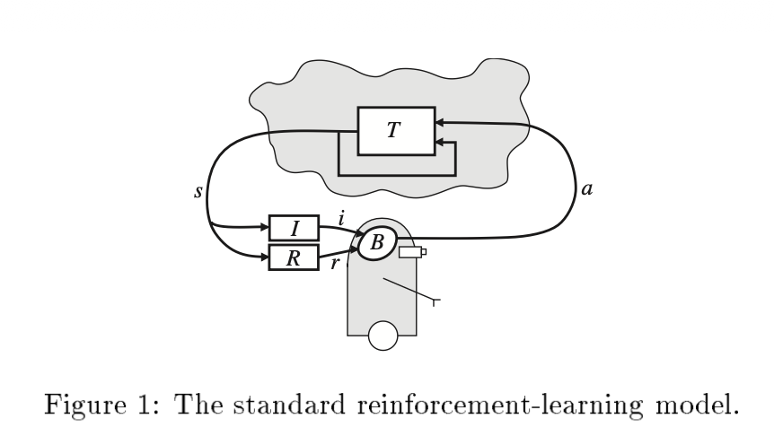
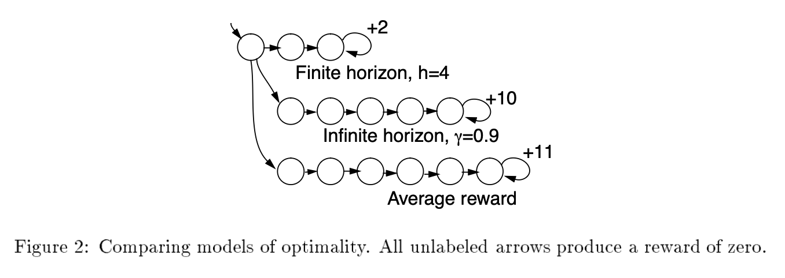

# Reinforcement Learning Foundations: MDPs, Value Functions, and Core Algorithms

---

## Table of Contents

- [Reinforcement Learning Foundations: MDPs, Value Functions, and Core Algorithms](#reinforcement-learning-foundations-mdps-value-functions-and-core-algorithms)
  - [Table of Contents](#table-of-contents)
  - [1. What Problem Does Reinforcement Learning Solve?](#1-what-problem-does-reinforcement-learning-solve)
  - [2. Markov Decision Processes: The Formal Framework](#2-markov-decision-processes-the-formal-framework)
    - [2.1 Definition](#21-definition)
    - [2.2 Policies and the Objective](#22-policies-and-the-objective)
    - [2.3 Value Functions and the Bellman Equations](#23-value-functions-and-the-bellman-equations)
    - [2.4 The Q-Function: Making Actions Explicit](#24-the-q-function-making-actions-explicit)
    - [2.5 A Worked Example: Grid World](#25-a-worked-example-grid-world)
  - [3. Dynamic Programming: Solving MDPs with a Known Model](#3-dynamic-programming-solving-mdps-with-a-known-model)
    - [3.1 Value Iteration](#31-value-iteration)
    - [3.2 Policy Iteration](#32-policy-iteration)
    - [3.3 Value Iteration vs. Policy Iteration](#33-value-iteration-vs-policy-iteration)
  - [4. From Known Models to Unknown: The RL Dichotomy](#4-from-known-models-to-unknown-the-rl-dichotomy)
  - [5. Q-Learning](#5-q-learning)
    - [5.1 Why Learn $Q^*$ Instead of $V^*$?](#51-why-learn-q-instead-of-v)
    - [5.2 The Q-Learning Algorithm (Deterministic Case)](#52-the-q-learning-algorithm-deterministic-case)
    - [5.3 How Q-Values Propagate: A Worked Example](#53-how-q-values-propagate-a-worked-example)
    - [5.4 Convergence of Q-Learning (Deterministic Case)](#54-convergence-of-q-learning-deterministic-case)
    - [5.5 Extension to Nondeterministic MDPs](#55-extension-to-nondeterministic-mdps)
    - [5.6 Exploration Strategies for Q-Learning](#56-exploration-strategies-for-q-learning)
    - [5.7 Improving Training Efficiency](#57-improving-training-efficiency)
    - [5.8 SARSA: The On-Policy Alternative](#58-sarsa-the-on-policy-alternative)
    - [5.9 Double Q-Learning: Correcting Overestimation Bias](#59-double-q-learning-correcting-overestimation-bias)
  - [6. Temporal Difference Learning](#6-temporal-difference-learning)
    - [6.1 TD(0): One-Step Temporal Differences](#61-td0-one-step-temporal-differences)
    - [6.2 The Adaptive Heuristic Critic](#62-the-adaptive-heuristic-critic)
    - [6.3 TD($\\lambda$): Multi-Step Temporal Differences](#63-tdlambda-multi-step-temporal-differences)
    - [6.4 On-Policy vs. Off-Policy Learning](#64-on-policy-vs-off-policy-learning)
  - [7. The Big Picture: Connecting the Algorithms](#7-the-big-picture-connecting-the-algorithms)
  - [Sources and Further Reading](#sources-and-further-reading)

---

## 1. What Problem Does Reinforcement Learning Solve?

Imagine building an autonomous agent — a robot navigating a warehouse, a program playing backgammon, an elevator controller deciding which floors to visit. The agent perceives the state of its environment, takes actions that change that state, and receives scalar reward signals indicating how good the resulting situation is. Its goal: learn a strategy for choosing actions that maximizes cumulative reward over time.

This is the **reinforcement learning** (RL) problem. It differs from supervised learning in three fundamental ways:

- **No labeled examples.** The agent is never told which action is correct. It receives only a numerical reward after each action, and must figure out which actions deserve credit for eventual success — the **temporal credit assignment** problem.
- **The agent's actions shape its data.** In supervised learning, the training set is given. In RL, the agent's choices determine which states it visits and which rewards it observes. This creates a tension between **exploration** (trying new actions to discover their value) and **exploitation** (choosing actions already known to yield high reward).
- **Sequential consequences.** Each action affects not just the immediate reward but also the future state of the environment — and therefore all future rewards. A move that looks bad now might position the agent for a large payoff later.

The standard RL interaction loop (following Kaelbling et al., 1996) works as follows. At each discrete time step $t$:

1. The agent observes the current state $s_t$ of the environment.
2. The agent selects an action $a_t$.
3. The environment transitions to a new state $s_{t+1}$ and emits a scalar reward $r_t$.
4. The agent uses $\langle s_t, a_t, r_t, s_{t+1} \rangle$ to update its strategy.



*Fig. 1: The standard reinforcement learning interaction model. The environment's transition function $T$ receives action $a$ and produces the next state $s$. The agent's behavior function $B$ receives observation $i$ (from the identification function $I$) and reward $r$ (from the reward function $R$), and selects the next action. [Kaelbling et al., 1996, Figure 1]*

The agent's strategy is called a **policy**, denoted $\pi$: a mapping from states to actions, $\pi : S \to A$. The goal is to learn an **optimal policy** $\pi^*$ that maximizes the agent's long-run cumulative reward from any starting state.

The key insight of RL is that this problem has rich mathematical structure — formalized by **Markov decision processes** — that enables powerful algorithms. When the model of the environment is known, classical dynamic programming finds optimal policies exactly. When the model is unknown, the agent must learn from experience, and algorithms like Q-learning and TD methods accomplish this with provable convergence guarantees.

This document builds the full story: the formal framework (MDPs), the theory of optimal behavior (Bellman equations), exact solution methods when the model is known (value iteration, policy iteration), and learning algorithms when it is not (Q-learning, temporal difference methods).

---

## 2. Markov Decision Processes: The Formal Framework

Before designing algorithms, we need a precise mathematical model of the environment. The dominant framework in RL is the **Markov decision process** (MDP), introduced by Bellman (1957) and developed extensively in operations research. MDPs capture everything we need: states, actions, probabilistic transitions, and rewards.

### 2.1 Definition

A (finite) Markov decision process consists of four components:

- A finite set of **states** $S$, representing all possible configurations of the environment.
- A finite set of **actions** $A$, representing the choices available to the agent.
- A **transition function** $T : S \times A \to \Delta(S)$, where $\Delta(S)$ denotes the **probability simplex** over $S$ — the set of all probability distributions over states. $T(s, a, s')$ gives the probability of transitioning to state $s'$ when the agent takes action $a$ in state $s$. This satisfies $\sum_{s' \in S} T(s, a, s') = 1$ for all $s, a$.
- A **reward function** $R : S \times A \to \mathbb{R}$, where $R(s, a)$ gives the expected immediate reward for taking action $a$ in state $s$. Note that the reward depends on the action, not just the state — different actions from the same state can yield different rewards. (Some textbooks use $R(s)$ or $R(s, a, s')$; these are equivalent in expressiveness. We use $R(s, a)$ throughout.)

  **A practical warning:** the reward function is hand-designed, and the agent's learned behavior is extremely sensitive to it. All the algorithms in this document are *solvers* — they find the optimal policy *for the reward function you give them*. If the reward poorly captures the desired behavior (e.g., the step cost is too large relative to the goal reward, or a shortcut through a penalty zone turns out to be "worth it"), the agent will learn a perfectly optimal solution to the wrong problem. In practice, designing a good reward function (**reward shaping**) is often harder than choosing the right algorithm.

The defining property is the **Markov property**: the transition probabilities and expected rewards depend only on the current state $s$ and the chosen action $a$, not on the history of states and actions that preceded them. Formally:

$$P(s_{t+1} = s' \mid s_t, a_t, s_{t-1}, a_{t-1}, \ldots) = P(s_{t+1} = s' \mid s_t, a_t) = T(s_t, a_t, s')$$

This is a strong assumption, but it is what makes the problem tractable. It says the current state is a sufficient statistic for predicting the future — all relevant history is encoded in $s_t$. When this assumption fails (the agent can't fully observe the state), the problem becomes a partially observable MDP (POMDP), which we address in the companion document, *RL in Practice: Exploration, Generalization, and Scaling*.

An intuitive way to see the agent-environment interaction in an MDP is through this dialogue (following Kaelbling et al., 1996):

> **Environment:** You are in state 65. You have 4 possible actions.  
> **Agent:** I'll take action 2.  
> **Environment:** You received a reward of 7. You are now in state 15. You have 2 possible actions.  
> **Agent:** I'll take action 1.  
> **Environment:** You received a reward of −4. You are now in state 65. You have 4 possible actions.  
> **Agent:** I'll take action 2.  
> **Environment:** You received a reward of 7. You are now in state 44. You have 3 possible actions.  
> ...

Notice two things: (1) the same state-action pair can produce different outcomes on different occasions — action 2 from state 65 led to state 15 the first time and state 44 the second — and (2) the agent is never told which action would have been best, only what reward it actually received.

### 2.2 Policies and the Objective

A **policy** specifies how the agent selects actions. In general, a policy can be **stochastic**: $\pi : S \to \Delta(A)$, where $\pi(a \mid s)$ gives the probability of choosing action $a$ in state $s$. A **deterministic** policy is the special case where all probability mass is on a single action: $\pi(s) = a$, mapping each state to exactly one action. We will see shortly that optimal policies can always be chosen to be deterministic (Section 2.3), so deterministic policies $\pi : S \to A$ are the primary focus — but the stochastic formulation matters for exploration strategies like $\epsilon$-greedy (Section 5.6) and for on-policy methods like SARSA (Section 5.8).

But what does it mean for one policy to be "better" than another? We need to formalize the agent's objective — the quantity it seeks to maximize. There are three standard models, each capturing a different relationship between the agent and the future.

**Finite-horizon model.** The agent optimizes its expected total reward over the next $h$ steps:

$$\mathbb{E}\left[\sum_{t=0}^{h-1} r_t\right]$$

This is appropriate when the agent's lifetime is known (e.g., a system with a hard deadline). An important subtlety: the optimal policy under this model is generally **non-stationary** — the best action depends on how many steps remain. With 100 steps left, it might be worth taking a costly exploratory detour; with 2 steps left, it is not.

**Infinite-horizon discounted model.** The agent optimizes the expected sum of all future rewards, with future rewards geometrically discounted by a factor $\gamma \in [0, 1)$:

$$\mathbb{E}\left[\sum_{t=0}^{\infty} \gamma^t r_t\right]$$

The discount factor $\gamma$ controls the agent's time preference. When $\gamma = 0$, only the immediate reward matters (the first reward enters with weight $\gamma^0 = 1$; all subsequent rewards are multiplied by $\gamma^t = 0$). As $\gamma \to 1$, the agent cares increasingly about the distant future. The discount factor can be interpreted several ways: as an interest rate (a reward now is worth more than the same reward later), as a probability of surviving to the next step (at each step, the agent "dies" with probability $1 - \gamma$), or simply as a mathematical device to ensure the infinite sum converges. This last point is crucial — with bounded rewards $|r_t| \leq c$, the sum is bounded by the geometric series: $\left|\sum_{t=0}^{\infty} \gamma^t r_t\right| \leq c \sum_{t=0}^{\infty} \gamma^t = \frac{c}{1 - \gamma}$, since $\sum \gamma^t = 1/(1-\gamma)$ for $\gamma < 1$.

The discounted model has two decisive advantages over the finite-horizon model: it admits **stationary** optimal policies (the best action in state $s$ does not depend on the time step), and it is more mathematically tractable. For these reasons, it is the dominant model in the RL literature and the one we focus on throughout these notes.

**Average-reward model.** The agent optimizes its long-run average reward per step:

$$\lim_{h \to \infty} \frac{1}{h}\,\mathbb{E}\left[\sum_{t=0}^{h-1} r_t\right]$$

The $1/h$ factor does not drive this to zero, because the sum in the numerator also grows with $h$ — the agent keeps collecting rewards at every step. If the agent earns roughly $r$ per step, the sum grows as $\approx hr$, and the ratio settles to $r$: the average reward per step.

A policy maximizing this quantity is called **gain optimal**. For communicating MDPs (where every state is reachable from every other under some policy), the average-reward formulation arises as the limiting case of the discounted model as $\gamma \to 1$ (Bertsekas, 1995). Its weakness is that it ignores **transient behavior** — the early phase before the system settles into its long-run pattern. Two policies with the same long-run average are considered equally good even if one accumulates far more reward in its first hundred steps.



*Fig. 2: A start state with three action choices leading to cyclic reward structures. The optimal action differs under finite-horizon, infinite-horizon discounted, and average-reward criteria. [Kaelbling et al., 1996, Figure 2]*

The choice of optimality criterion matters — the same MDP can have different optimal policies under different criteria. In Kaelbling et al.'s example, a start state with three action paths yields optimal actions of "first," "second," and "third" under finite-horizon ($h=5$), discounted ($\gamma = 0.9$), and average-reward criteria respectively.

For the remainder of these notes, we work with the **infinite-horizon discounted model** with discount factor $\gamma \in [0, 1)$.

### 2.3 Value Functions and the Bellman Equations

Given a policy $\pi$ and a discount factor $\gamma$, we can quantify how good it is to be in any state $s$ by computing the expected cumulative discounted reward from that state onward. This is the **state-value function** for policy $\pi$:

$$V^\pi(s) = \mathbb{E}\left[\sum_{t=0}^{\infty} \gamma^t r_t \;\middle|\; s_0 = s,\; \pi\right]$$

where the expectation is over the stochastic transitions $T$ and the rewards, and the agent follows policy $\pi$ at every step.

This value function satisfies a recursive relationship. To derive it, start from the definition and split the sum into the $t=0$ term and the rest:

$$V^\pi(s) = \mathbb{E}\Big[\underbrace{\gamma^0 r_0}_{t=0} + \underbrace{\gamma^1 r_1 + \gamma^2 r_2 + \cdots}_{t \geq 1} \;\Big|\; s_0 = s,\; \pi\Big]$$

The first term $r_0$ is the immediate reward from taking action $\pi(s)$ in state $s$. Its expectation is just $R(s, \pi(s))$, so we can pull it out:

$$= R(s, \pi(s)) + \mathbb{E}\Big[\gamma^1 r_1 + \gamma^2 r_2 + \gamma^3 r_3 + \cdots \;\Big|\; s_0 = s,\; \pi\Big]$$

Every term in the remaining sum carries at least one factor of $\gamma$. Factor it out:

$$= R(s, \pi(s)) + \gamma \,\mathbb{E}\Big[\underbrace{\gamma^0 r_1 + \gamma^1 r_2 + \gamma^2 r_3 + \cdots}_{\text{discounted rewards from } t=1 \text{ onward}} \;\Big|\; s_0 = s,\; \pi\Big]$$

The expression inside the expectation is exactly the definition of $V^\pi$ — but starting from state $s_1$ instead of $s_0$. So the expectation equals $V^\pi(s_1)$, averaged over all possible next states $s_1 = s'$ weighted by the transition probabilities $T(s, \pi(s), s')$:

**Result: the Bellman equation for a fixed policy $\pi$**

$$V^\pi(s) = R(s, \pi(s)) + \gamma \sum_{s' \in S} T(s, \pi(s), s') \, V^\pi(s'), \quad \forall s \in S$$

The value of being in state $s$ under policy $\pi$ equals the immediate reward from following $\pi$, plus the discounted expected value of the next state (also under $\pi$). Since the policy is fixed, there is no "max" — each equation has exactly one action plugged in, making the right-hand side a *linear* combination of the $V$ values. This gives us a system of $|S|$ linear equations in $|S|$ unknowns, which can be solved directly. To see this concretely, consider three states $s_1, s_2, s_3$ in a deterministic chain leading to a goal (reward 100 on entering the goal, 0 elsewhere, $\gamma = 0.9$), with a fixed policy that moves right at each state:

$$V^\pi(s_1) = 0 + 0.9 \cdot V^\pi(s_2)$$
$$V^\pi(s_2) = 0 + 0.9 \cdot V^\pi(s_3)$$
$$V^\pi(s_3) = 100 + 0.9 \cdot V^\pi(\text{goal})$$

Three equations, three unknowns. Since $V^\pi(\text{goal}) = 0$ (an **absorbing state** — once entered, every action loops back to itself with zero reward, so no future reward is possible), we solve from the end: $V^\pi(s_3) = 100$, $V^\pi(s_2) = 90$, $V^\pi(s_1) = 81$. This direct solvability depends on the policy being fixed. The Bellman *optimality* equation (below) introduces a $\max$ over actions, making the system nonlinear and requiring iterative algorithms instead.

An optimal policy $\pi^*$ is one that maximizes $V^\pi(s)$ simultaneously for every state $s$:

$$\pi^* = \arg\max_\pi V^\pi(s), \quad \forall s \in S$$

A foundational result in MDP theory (Bellman, 1957) guarantees that for the infinite-horizon discounted model, such a policy always exists, it is **deterministic** (maps states to single actions, not distributions), and it is **stationary** (does not depend on the time step). Its value function, denoted $V^*(s)$, represents the best possible value of each state — the value achieved when $\pi^*$ is followed at every step. $V^*(s)$ is the unique solution to the **Bellman optimality equation**:

**Result: the Bellman optimality equation for $V^*$**

$$V^*(s) = \max_{a \in A} \left[ R(s, a) + \gamma \sum_{s' \in S} T(s, a, s') \, V^*(s') \right], \quad \forall s \in S$$

$$\underbrace{V^*(s)}_{\substack{\text{optimal value} \\ \text{of state } s}} = \max_{a} \Bigg[ \underbrace{R(s,a)}_{\substack{\text{immediate} \\ \text{reward}}} + \gamma \underbrace{\sum_{s'} T(s,a,s')\,V^*(s')}_{\substack{\text{expected optimal value} \\ \text{of next state}}} \Bigg]$$

What does this say? For each state $s$ individually, the equation tries every available action $a$ and picks the one that maximizes the immediate reward $R(s, a)$ plus the discounted expected value of the resulting next state. The $\max$ is over the actions at *that particular state* — not a single global choice. Crucially, the $V^*(s')$ on the right-hand side already assumes optimal play from $s'$ onward, so the optimal action at $s$ implicitly depends on optimal actions at all reachable future states. Since there is one such equation per state, the full system simultaneously determines the best action for every state, which is exactly what an optimal policy is.

Unlike the Bellman equation for a fixed policy (which is linear and directly solvable), the $\max$ here makes the system nonlinear — the same reason we needed iterative algorithms rather than Gaussian elimination, as noted above.

Once $V^*$ is known, the optimal policy follows immediately — just pick the action that achieves the $\max$ at each state:

$$\pi^*(s) = \arg\max_{a \in A} \left[ R(s, a) + \gamma \sum_{s' \in S} T(s, a, s') \, V^*(s') \right]$$

Why does this matter? The Bellman equation converts the infinite-horizon optimization problem — which involves an infinite sequence of decisions — into a system of equations relating the values of neighboring states. This **recursive structure** is the foundation for every algorithm in this document.

### 2.4 The Q-Function: Making Actions Explicit

The value function $V^*(s)$ tells us the value of being in a state under optimal play. But to *use* it for action selection, the agent must evaluate $R(s, a) + \gamma \sum_{s'} T(s, a, s') V^*(s')$ for each candidate action — which requires knowing $T$ and $R$. This is fine in the dynamic programming setting (Section 3), where the model is given, but in the RL setting the agent typically doesn't have access to the model and must learn from experience alone.

The **action-value function** (or **Q-function**) resolves this by making the value a function of both state *and* action — precomputing the model-dependent calculation so the agent doesn't need $T$ or $R$ at decision time:

$$Q^*(s, a) = R(s, a) + \gamma \sum_{s' \in S} T(s, a, s') \, V^*(s')$$

$Q^*(s, a)$ is the expected discounted cumulative reward of taking action $a$ in state $s$, then acting optimally thereafter. The relationship to $V^*$ is immediate:

$$V^*(s) = \max_{a \in A} Q^*(s, a)$$

and the optimal policy becomes simply:

$$\pi^*(s) = \arg\max_{a \in A} Q^*(s, a)$$

To summarize how these three objects relate: $V^*(s)$ gives the value of state $s$ assuming optimal play from the start — including the first action. $Q^*(s, a)$ gives the value of state $s$ if you take a specific action $a$ first — which may or may not be optimal — and then act optimally thereafter. $\pi^*(s)$ is the action where these two agree: the first action that *is* the optimal one, i.e., the $a$ for which $Q^*(s, a) = V^*(s)$.

This is the key insight: **once the agent has $Q^*$, selecting optimal actions is a simple lookup** — pick the action with the highest Q-value in the current state. No explicit access to $T$ or $R$ is needed at decision time. And crucially, the agent can *learn* $Q^*$ without ever having $T$ or $R$ as explicit functions: Q-learning (Section 5) builds up $Q^*$ iteratively from observed transitions $\langle s, a, r, s' \rangle$. The model's influence is baked into the learned Q-values through experience, but the agent never constructs or stores $T$ or $R$ themselves.

We can also write a **Bellman equation for $Q^*$** by substituting the relationship $V^*(s') = \max_{a'} Q^*(s', a')$:

**Result: the Bellman optimality equation for $Q^*$**

$$Q^*(s, a) = R(s, a) + \gamma \sum_{s' \in S} T(s, a, s') \max_{a' \in A} Q^*(s', a')$$

This recursive equation expresses each Q-value in terms of the Q-values of successor states. It will be the direct foundation of the Q-learning update rule.

### 2.5 A Worked Example: Grid World

To ground these definitions concretely, consider a simple grid world adapted from Mitchell (1997), Chapter 13. The environment is a $2 \times 3$ grid (two rows, three columns) with the goal state $G$ in the top-right corner:

```
+------------+------------+------------+
|  top-left  |  top-ctr   |     G      |
|  V* = 0    |  V* = 0    |  V* = 0    |
| (dead end) | (dead end) | (goal,     |
|            |            |  absorbing)|
+------------+------------+------------+
|  bot-left  |  bot-ctr   |  bot-right |
|  V* = 81   |  V* = 90   |  V* = 100  |
|     →      |     →      |     ↑      |
+------------+------------+------------+

Optimal policy: bot-left → bot-ctr → bot-right → G
```

The bottom row connects left-to-right, and the bottom-right cell can move up into $G$. The top-left and top-center cells are **absorbing dead ends**: once the agent enters them, it stays there with zero reward forever (no outgoing transitions). Their optimal values are therefore 0. The immediate reward is 100 for any action leading into the goal state $G$, and 0 everywhere else. With $\gamma = 0.9$:

- $V^*(G) = 0$ (absorbing state — no future reward after arrival).
- $V^*(\text{bottom-right}) = 100$ (one step from $G$, immediate reward 100).
- $V^*(\text{bottom-center}) = 90$ (two steps from $G$: reward $0 + 0.9 \times 100 = 90$).
- $V^*(\text{bottom-left}) = 81$ (three steps: $0 + 0.9 \times 0 + 0.9^2 \times 100 = 81$).

The Q-values for each state-action pair equal the immediate reward plus $\gamma$ times $V^*$ of the resulting state. The optimal policy follows the highest Q-values, directing the agent along the shortest path to $G$.

```python
import numpy as np

gamma = 0.9
V_star = {"G": 0, "top-left": 0, "top-center": 0,
          "bot-right": 100, "bot-center": 90, "bot-left": 81}

Q_bot_center_right = 0 + gamma * V_star["bot-right"]    # = 90
Q_bot_center_left  = 0 + gamma * V_star["bot-left"]      # = 72.9
Q_bot_center_up    = 0 + gamma * V_star["top-center"]    # = 0

print(f"Q(bot-center, right) = {Q_bot_center_right}")  # 90.0
print(f"Q(bot-center, left)  = {Q_bot_center_left}")    # 72.9
print(f"Q(bot-center, up)    = {Q_bot_center_up}")      # 0.0
print(f"Best action: right (max Q = {max(Q_bot_center_right, Q_bot_center_left, Q_bot_center_up)})")
```

The agent in the bottom-center cell chooses "right" because $Q(\text{bot-center}, \text{right}) = 90$ is the largest Q-value. It doesn't need to simulate the environment or plan ahead — the Q-value already summarizes the entire future.

---

## 3. Dynamic Programming: Solving MDPs with a Known Model

If the agent knows the transition function $T$ and reward function $R$ — i.e., it has a complete model of the environment — it can compute the optimal policy exactly using dynamic programming. These algorithms are not "learning" in the RL sense (the agent never interacts with the environment), but they form the conceptual and mathematical foundation for the learning algorithms that follow.

### 3.1 Value Iteration

Value iteration finds the optimal value function $V^*$ by iteratively applying the Bellman optimality equation as an update rule. The idea is simple: start with an arbitrary guess for $V$, then repeatedly refine it until convergence.

**Algorithm: Value Iteration**

> Initialize $V(s)$ arbitrarily for all $s \in S$.
>
> Repeat until convergence:
>
> $\quad$ For each $s \in S$:
>
> $\qquad Q(s, a) := R(s, a) + \gamma \sum_{s' \in S} T(s, a, s') \, V(s'), \quad \forall a \in A$
>
> $\qquad V(s) := \max_{a \in A} Q(s, a)$

Each iteration applies what is called a **full backup**: for every state, the update uses information from *all* possible successor states, weighted by their transition probabilities. This contrasts with the **sample backups** used in model-free methods (Section 5), which use a single observed transition.

**Why does it converge?** The Bellman optimality equation defines $V^*$ as a fixed point of the operator $\mathcal{T}$ defined by $(\mathcal{T}V)(s) = \max_a [R(s,a) + \gamma \sum_{s'} T(s,a,s') V(s')]$. This operator is a **contraction mapping** with contraction factor $\gamma$ under the max-norm: for any two value functions $V_1, V_2$,

$$\|\mathcal{T}V_1 - \mathcal{T}V_2\|_\infty \leq \gamma \|V_1 - V_2\|_\infty$$

By the Banach fixed-point theorem, repeated application of a contraction mapping converges to the unique fixed point, which is $V^*$. The error decreases by at least a factor of $\gamma$ per iteration. This contraction-by-$\gamma$ mechanism is the same force that drives convergence of Q-learning (Section 5.4) — there it operates on individual sample updates rather than full sweeps, but the core argument is identical.

**When to stop.** A natural stopping criterion uses the **Bellman residual**: if the maximum change in $V$ between two successive iterations is less than $\epsilon$, then the greedy policy derived from the current $V$ is guaranteed to have value within $2\gamma\epsilon / (1 - \gamma)$ of optimal at every state (Williams & Baird, 1993). In practice, the greedy policy often becomes optimal long before the value function has fully converged.

**Complexity.** Each iteration costs $O(|A| \cdot |S|^2)$ time — for each of the $|S|$ states and $|A|$ actions, we sum over $|S|$ successor states. When the transition function is sparse (each action leads to a constant number of next states with nonzero probability), this drops to $O(|A| \cdot |S|)$. The number of iterations is polynomial in $|S|$ and the magnitude of the largest reward for a fixed $\gamma$, but grows as $O(\text{poly}(1/(1-\gamma)))$ — convergence slows as the agent cares more about the distant future.

### 3.2 Policy Iteration

Policy iteration takes a different approach: instead of working with the value function directly, it alternates between evaluating the current policy and improving it.

**Algorithm: Policy Iteration**

> Initialize policy $\pi_0$ arbitrarily.
>
> Repeat:
>
> $\quad$ **Policy evaluation:** Compute $V^{\pi}$, the value function of the current policy $\pi$, by solving the system of $|S|$ linear equations:
>
> $$V^\pi(s) = R(s, \pi(s)) + \gamma \sum_{s' \in S} T(s, \pi(s), s') \, V^\pi(s'), \quad \forall s \in S$$
>
> $\quad$ **Policy improvement:** For each state $s$, set:
>
> $$\pi'(s) := \arg\max_{a \in A} \left[ R(s, a) + \gamma \sum_{s' \in S} T(s, a, s') \, V^\pi(s') \right]$$
>
> $\quad$ If $\pi' = \pi$, stop (the policy is optimal). Otherwise, set $\pi := \pi'$ and repeat.

The **policy evaluation** step fixes the policy and asks: "how good is each state under this fixed behavior?" Since the policy is fixed, there is no "max" — the Bellman equation becomes a system of linear equations in $|S|$ unknowns, which can be solved directly (e.g., by Gaussian elimination in $O(|S|^3)$ time).

The **policy improvement** step asks, for each state: "is there an action better than the one the current policy prescribes?" If switching to a different action increases the expected return, the policy is updated. The **policy improvement theorem** guarantees that the new policy $\pi'$ is strictly better than $\pi$ (has higher $V$ at every state), unless $\pi$ is already optimal.

**Why does it terminate?** There are at most $|A|^{|S|}$ distinct deterministic policies. Each improvement step strictly increases the value function (unless already optimal). Since the number of policies is finite and each is strictly better than its predecessor, the algorithm must terminate.

**Complexity.** Per-iteration cost is $O(|A| \cdot |S|^2 + |S|^3)$ — the $|S|^3$ comes from solving the linear system in policy evaluation. This is more expensive per iteration than value iteration. However, policy iteration typically converges in far fewer iterations. In practice, neither algorithm dominates the other universally.

### 3.3 Value Iteration vs. Policy Iteration

| | Value Iteration | Policy Iteration |
|---|---|---|
| **Per-iteration cost** | $O(\vert A \vert \cdot \vert S \vert^2)$ | $O(\vert A \vert \cdot \vert S \vert^2 + \vert S \vert^3)$ |
| **Number of iterations** | More (converges slowly) | Fewer (converges fast) |
| **Update mechanism** | Refines $V$ directly | Solves for exact $V^\pi$, then improves $\pi$ |
| **Stopping** | $V$ nearly converged (Bellman residual) | $\pi$ unchanged |

**Modified policy iteration** (Puterman & Shin, 1978) bridges the gap: instead of solving the linear system exactly during policy evaluation, it runs a few iterations of value-iteration-style updates with the policy held fixed. This is cheaper than exact evaluation but more directed than pure value iteration, and is often the best practical choice.

Both algorithms require the full model — $T$ and $R$ — and iterate over the entire state space. This is feasible for small MDPs, but the **curse of dimensionality** makes it impractical for real-world problems: backgammon has roughly $10^{20}$ states, a robotic arm with continuous joint angles has an uncountably infinite state space, and even a modest Atari game has $\sim 10^{9}$ distinct screen configurations. No algorithm that sweeps over every state on every iteration can scale to these problems. For problems where the model is unknown or the state space is too large to enumerate, we need a fundamentally different approach.

---

## 4. From Known Models to Unknown: The RL Dichotomy

The dynamic programming methods of Section 3 are elegant but make a strong assumption: the agent knows $T(s, a, s')$ and $R(s, a)$. In most real-world problems — a robot navigating uncertain terrain, a program learning to play a game — this is unrealistic. The agent doesn't know what will happen when it takes an action; it must actually try it and observe the result.

This gives rise to two broad strategies:

- **Model-free methods:** Learn a policy (or value function) directly from experience, without ever constructing a model of $T$ and $R$. The agent interacts with the environment, observes transitions $\langle s, a, r, s' \rangle$, and updates its estimates online. Q-learning and TD methods fall here.

- **Model-based methods:** Learn approximate models $\hat{T}$ and $\hat{R}$ from experience, then use dynamic programming (or planning) on the learned model to derive a policy. Dyna and prioritized sweeping fall here; we cover these in the companion document.

Model-free methods are the heart of classical RL theory and the focus of the rest of this document. Their appeal is directness — they converge to optimal policies without ever needing to build or store a model. Their cost is sample inefficiency: they make less use of each experience than model-based methods, and therefore require more experience to converge.

The conceptual bridge between the DP algorithms we've seen and the model-free algorithms we're about to see is the **sample backup**. In value iteration, the update for state $s$ uses all possible successor states, weighted by their transition probabilities — a **full backup**:

$$V(s) \leftarrow \max_a \left[ R(s,a) + \gamma \sum_{s'} T(s,a,s') V(s') \right]$$

A **sample backup** replaces the expectation over all possible $s'$ with a single observed sample. The agent takes action $a$ in state $s$, observes the resulting $r$ and $s'$, and updates:

$$Q(s, a) \leftarrow Q(s, a) + \alpha \left[ r + \gamma \max_{a'} Q(s', a') - Q(s, a) \right]$$

The sample is noisy (it's one draw from the transition distribution), but by averaging over many samples, the noise cancels and the estimate converges. This is the Q-learning update, which we now develop carefully.

---

## 5. Q-Learning

Q-learning (Watkins, 1989) is the most important model-free RL algorithm. It learns the optimal action-value function $Q^*$ directly from experience, without knowing or learning the transition and reward functions. Once $Q^*$ is learned, the optimal policy is simply $\pi^*(s) = \arg\max_a Q^*(s, a)$.

### 5.1 Why Learn $Q^*$ Instead of $V^*$?

Recall from Section 2.4 that an agent with $V^*$ still needs the model ($T$ and $R$) to select actions — it must evaluate $R(s, a) + \gamma \sum_{s'} T(s, a, s') V^*(s')$ for every candidate action. An agent with $Q^*$ just takes $\arg\max_a Q^*(s, a)$ — a simple lookup, no model required.

But here is the crucial question: $Q^*$ is *defined* in terms of $T$ and $R$, so how does the agent obtain it without knowing them? The answer is that Q-learning never evaluates the definition. Instead, it learns $Q^*$ values incrementally from observed transitions $\langle s, a, r, s' \rangle$ — each real-world experience nudges the estimates closer to the true $Q^*$. The model's influence is captured implicitly through the agent's accumulated experience, not through explicit computation. This is the algorithm we develop next.

### 5.2 The Q-Learning Algorithm (Deterministic Case)

We begin with the simplest case: a deterministic MDP, where each state-action pair $(s, a)$ leads to a single next state $s' = \delta(s, a)$ — here $\delta : S \times A \to S$ is the deterministic transition function, the special case of $T$ where all probability mass is on a single successor — with a fixed reward $r = r(s, a)$. The Bellman equation for $Q^*$ in the deterministic case (from Section 2.4) simplifies to:

$$Q^*(s, a) = r(s, a) + \gamma \max_{a' \in A} Q^*(s', a')$$

This recursive equation is the foundation of the learning rule. The agent maintains a table $\hat{Q}(s, a)$ — its current estimate of $Q^*$ — initialized to arbitrary values (zero is a common choice). After each transition $\langle s, a, r, s' \rangle$, it updates:

**The Q-learning update rule (deterministic case)**

$$\hat{Q}(s, a) \leftarrow r + \gamma \max_{a' \in A} \hat{Q}(s', a')$$

The right-hand side is the agent's best current estimate of what $Q^*(s, a)$ should be: the observed immediate reward $r$, plus the discounted value of the best action from the next state $s'$ (estimated using the current $\hat{Q}$ table).

**Algorithm: Q-Learning (Deterministic MDP)**

> Initialize $\hat{Q}(s, a) = 0$ for all $s \in S$, $a \in A$. (The table has an entry for every state-action pair from the start. Zero initialization is a neutral default — the $\max_{a'}$ over unvisited entries returns 0, so untried actions don't artificially inflate or deflate the bootstrap target. Initializing to high values instead creates optimistic estimates that encourage exploration — see "optimism in the face of uncertainty" in the companion document.)
>
> Observe the current state $s$.
>
> Repeat forever:
>
> $\quad$ Select an action $a$ (using some exploration strategy).
>
> $\quad$ Execute $a$; observe immediate reward $r$ and next state $s'$.
>
> $\quad$ Update: $\hat{Q}(s, a) \leftarrow r + \gamma \max_{a'} \hat{Q}(s', a')$
>
> $\quad$ $s \leftarrow s'$

**What does the Q-table actually represent?** Each entry $\hat{Q}(s, a)$ is the agent's current *estimate* of the full recursive value — the total discounted reward from taking action $a$ in state $s$ and then acting optimally forever. But the agent doesn't compute this recursion directly. It starts with all zeros and incrementally nudges entries closer to the true values, one real transition at a time. The right-hand side of the update, $r + \gamma \max_{a'} \hat{Q}(s', a')$, is a one-step sample of the recursive value: the immediate reward plus the current best estimate of everything that follows.

Despite the dense notation, the actual code is remarkably simple — the entire update is one line:

```python
Q[s][a] += alpha * (r + gamma * max(Q[s2]) - Q[s][a])
```

That's the Bellman equation, Q-learning update, and TD error all in one expression. The **TD error** is the parenthesized quantity — the difference between what we *observed* and what we *currently believe*:

- **What we observed** (one real step): `r + gamma * max(Q[s2])` — "I got reward `r`, and from here the best I can do is `max(Q[s2])`."
- **What we currently believe**: `Q[s][a]` — "I thought this (s, a) pair was worth this much."

The update just nudges the estimate a fraction (`alpha`) of the way toward the observation. A large TD error means the estimate is stale and needs a big correction; a near-zero TD error means the estimate already agrees with the one-step sample.

This means that with zero initialization, **nothing meaningful happens until the agent first discovers a nonzero reward**. Before that, `max(Q[s2])` is 0 for every successor state, so every update just says "this step cost me $-0.1$, so adjust slightly downward" — there is no directional signal pulling the agent toward any particular state. The agent is effectively wandering randomly. Only once it stumbles into a reward (or penalty) can that signal propagate backward through subsequent updates to inform earlier states. This is the fundamental exploration challenge: the agent must *find* reward before it can *learn from* reward.

### 5.3 How Q-Values Propagate: A Worked Example

To see this propagation in action, return to the grid world from Section 2.5 with all Q-values initialized to zero and the only nonzero reward being 100 for entering goal state $G$.

Initially, every entry in the Q-table is zero — the agent knows nothing:

| | left | right | up | down |
|---|---|---|---|---|
| bot-left | 0 | 0 | 0 | 0 |
| bot-center | 0 | 0 | 0 | 0 |
| bot-right | 0 | 0 | 0 | 0 |

**Episode 1:** The agent wanders randomly. No Q-values change (every update computes $r + \gamma \max_{a'} \hat{Q}(s', a') = 0 + 0.9 \times 0 = 0$) until it happens to execute the transition into $G$, receiving reward 100:

$$\hat{Q}(\text{bot-right}, \text{up}) \leftarrow 100 + 0.9 \times \max_{a'} \hat{Q}(G, a') = 100 + 0 = 100$$

| | left | right | up | down |
|---|---|---|---|---|
| bot-left | 0 | 0 | 0 | 0 |
| bot-center | 0 | 0 | 0 | 0 |
| bot-right | 0 | 0 | **100** | 0 |

Only one table entry is nonzero after the entire first episode.

**Episode 2:** The agent again wanders randomly. If it passes through bot-right, the nonzero Q-value there doesn't help yet (it's already set). But when it visits bot-center and moves right to bot-right, it can now pick up that value:

$$\hat{Q}(\text{bot-center}, \text{right}) \leftarrow 0 + 0.9 \times \max_{a'} \hat{Q}(\text{bot-right}, a') = 0 + 0.9 \times 100 = 90$$

| | left | right | up | down |
|---|---|---|---|---|
| bot-left | 0 | 0 | 0 | 0 |
| bot-center | 0 | **90** | 0 | 0 |
| bot-right | 0 | 0 | **100** | 0 |

**Episode 3:** Similarly, when bot-left moves right to bot-center:

$$\hat{Q}(\text{bot-left}, \text{right}) \leftarrow 0 + 0.9 \times 90 = 81$$

| | left | right | up | down |
|---|---|---|---|---|
| bot-left | 0 | **81** | 0 | 0 |
| bot-center | 0 | **90** | 0 | 0 |
| bot-right | 0 | 0 | **100** | 0 |

The information propagates backward from the goal, one state per episode. After enough episodes, the "frontier" of nonzero Q-values reaches the entire state space, eventually converging to the true $Q^*$ values shown in Section 2.5.

```python
import numpy as np

states = ["bot-left", "bot-center", "bot-right", "top-left", "top-center", "G"]
actions = ["left", "right", "up", "down"]
gamma = 0.9

Q = {(s, a): 0.0 for s in states for a in actions}

transitions = {
    ("bot-right", "up"): ("G", 100),
    ("bot-center", "right"): ("bot-right", 0),
    ("bot-left", "right"): ("bot-center", 0),
}

for s, a in [("bot-right", "up"), ("bot-center", "right"), ("bot-left", "right")]:
    s_next, r = transitions[(s, a)]
    Q[(s, a)] = r + gamma * max(Q[(s_next, a2)] for a2 in actions)
    print(f"Q({s}, {a}) <- {r} + {gamma} * {max(Q[(s_next, a2)] for a2 in actions):.1f} = {Q[(s, a)]:.1f}")
```

Output: Q-values of 100.0, 90.0, and 81.0 propagate backward from the goal — exactly the $V^*$ values we computed earlier.

**Connection to value iteration.** This backward propagation should feel familiar — it is the same mechanism as value iteration (Section 3.1). Both propagate value information backward through the Bellman equation from rewarding states. The difference is how they get the successor information. Value iteration has full access to $T$ and $R$, so each sweep updates *every* state simultaneously using the known transition probabilities. Q-learning has no model — it updates one state-action pair at a time using whatever transition the agent actually experiences in the real environment. Each real-world step is effectively a single sample drawn from the transition distribution $T(s, a, \cdot)$ that the agent doesn't have written down. Over many visits to the same $(s, a)$, these samples average out to the true expectation that value iteration would compute directly. Q-learning is, in this sense, value iteration performed one sample at a time, with the environment itself serving as the model.

### 5.4 Convergence of Q-Learning (Deterministic Case)

Does Q-learning actually converge to $Q^*$? Yes — under conditions that are surprisingly mild.

**Theorem (Convergence of Q-learning, deterministic MDP).** *(Following Mitchell, 1997, Theorem 13.1.)* Consider a Q-learning agent in a deterministic MDP with bounded rewards ($|r(s, a)| \leq c$ for all $s, a$). The agent uses the update rule $\hat{Q}(s, a) \leftarrow r + \gamma \max_{a'} \hat{Q}(s', a')$, initializes $\hat{Q}(s, a)$ to arbitrary finite values, and uses a discount factor $\gamma \in [0, 1)$. If each state-action pair is visited infinitely often, then $\hat{Q}_n(s, a) \to Q^*(s, a)$ as $n \to \infty$ for all $s, a$.

The proof is elegant and reveals the mechanism that drives convergence.

**Proof.** Define $\Delta_n = \max_{s, a} |\hat{Q}_n(s, a) - Q^*(s, a)|$ as the maximum absolute error across all table entries after $n$ updates. We show that each update can only *reduce* the maximum error (by a factor of $\gamma$).

Consider any entry $\hat{Q}_n(s, a)$ that gets updated on iteration $n+1$. Writing $s' = \delta(s, a)$:

$$|\hat{Q}_{n+1}(s, a) - Q^*(s, a)| = \left| \left(r + \gamma \max_{a'} \hat{Q}_n(s', a')\right) - \left(r + \gamma \max_{a'} Q^*(s', a')\right) \right|$$

The $r$ terms cancel:

$$= \gamma \left| \max_{a'} \hat{Q}_n(s', a') - \max_{a'} Q^*(s', a') \right|$$

Now we use the fact that for any two functions $f_1, f_2$: $|\max_x f_1(x) - \max_x f_2(x)| \leq \max_x |f_1(x) - f_2(x)|$. Applying this:

$$\leq \gamma \max_{a'} |\hat{Q}_n(s', a') - Q^*(s', a')|$$

This is the maximum error over actions at the specific next state $s'$. But $\Delta_n$ is the maximum error over *all* states and *all* actions — which is at least as large as the max at any single state. So:

$$\leq \gamma \,\Delta_n$$

So every updated entry has error at most $\gamma \Delta_n$. Crucially, no update can *increase* the maximum error above $\Delta_n$: the updated entry's error is at most $\gamma \Delta_n < \Delta_n$, while un-updated entries retain their old error $\leq \Delta_n$. Therefore, once every state-action pair has been updated at least once (which need not happen in a single synchronous sweep — the agent visits pairs one at a time in arbitrary order), the maximum error across all entries is at most $\gamma \Delta_n$. Since each pair is visited infinitely often, there are infinitely many such complete rounds. After $k$ complete rounds, $\Delta \leq \gamma^k \Delta_0$. Since $\gamma < 1$, this converges to 0. $\blacksquare$

**What does this tell us?** The discount factor $\gamma$ is literally the convergence rate — smaller $\gamma$ means faster convergence but more myopic behavior. The proof also reveals why Q-learning works even though the table is bootstrapping off its own (inaccurate) estimates: each update mixes an error-prone estimate ($\max_{a'} \hat{Q}(s', a')$, entering with weight $\gamma < 1$) with an error-free observation ($r$, entering with weight $1$). Over time, the ground truth "wins."

Note the convergence condition requires visiting every state-action pair infinitely often. A purely greedy agent that always picks $\arg\max_a \hat{Q}(s, a)$ will generally fail this condition — it will never revisit state-action pairs it currently considers suboptimal. This is why exploration is essential, which we discuss briefly in Section 5.6 and in depth in the companion document.

### 5.5 Extension to Nondeterministic MDPs

Real environments are typically stochastic: the same action from the same state can produce different next states and different rewards. In this setting, the deterministic update rule $\hat{Q}(s, a) \leftarrow r + \gamma \max_{a'} \hat{Q}(s', a')$ fails to converge — it keeps overwriting $\hat{Q}(s,a)$ with different values from different stochastic outcomes.

The fix is to use a **learning rate** $\alpha$ that blends the new estimate with the old one, rather than replacing outright:

**The Q-learning update rule (nondeterministic case)**

$$\hat{Q}(s, a) \leftarrow (1 - \alpha_n)\,\hat{Q}(s, a) + \alpha_n \left[ r + \gamma \max_{a'} \hat{Q}(s', a') \right]$$

where $\alpha_n$ is a decaying learning rate. A common choice is $\alpha_n = 1 / (1 + \text{visits}_n(s, a))$, where $\text{visits}_n(s, a)$ counts how many times the pair $(s, a)$ has been visited up to iteration $n$.

The new estimate $r + \gamma \max_{a'} \hat{Q}(s', a')$ is a single noisy sample of $Q^*(s, a)$. By blending it gradually with the running average, the noise cancels over many visits. Setting $\alpha_n = 1$ recovers the deterministic rule. Rearranging gives an equivalent and more common form:

$$\hat{Q}(s, a) \leftarrow \hat{Q}(s, a) + \alpha_n \left[ r + \gamma \max_{a'} \hat{Q}(s', a') - \hat{Q}(s, a) \right]$$

The bracketed quantity — the gap between the new sample and the current estimate — is the **prediction error**: how much better (or worse) the observed transition was compared to what the agent expected. Each update nudges $\hat{Q}$ by $\alpha_n$ times this error. This is the form used throughout the rest of these notes.

**Theorem (Convergence of Q-learning, nondeterministic MDP).** *(Watkins & Dayan, 1992.)* If each state-action pair is visited infinitely often, $0 \leq \alpha_n < 1$, and the learning rate schedule satisfies:

$$\sum_{i=1}^{\infty} \alpha_{n(i, s, a)} = \infty \quad \text{and} \quad \sum_{i=1}^{\infty} \alpha_{n(i, s, a)}^2 < \infty$$

where $n(i, s, a)$ is the iteration of the $i$-th visit to $(s, a)$, then $\hat{Q}_n(s, a) \to Q^*(s, a)$ as $n \to \infty$ with probability 1, for all $s, a$.

The two conditions on $\alpha$ are the standard **Robbins-Monro conditions** from stochastic approximation theory. They capture a tension: the learning rate must decay, but not too fast.

- **$\sum \alpha = \infty$ (decay slowly enough).** As shown above, each update shifts $\hat{Q}$ by $\alpha_n$ times the prediction error. If the learning rates sum to a finite number, the total amount of correction the agent can ever make is bounded — and if the initial Q-values are far from $Q^*$, that budget may not be enough. The infinite sum guarantees the agent always has enough "learning capacity" remaining to fully correct its estimates, no matter how wrong they started.

- **$\sum \alpha^2 < \infty$ (decay fast enough).** In a stochastic environment, each update carries noise — the same $(s, a)$ pair produces different rewards and next states on different visits. The $\alpha$ coefficient controls how much this noise affects the running estimate. Since each update adds $\alpha_i \times \text{noise}_i$ to the estimate, and scaling a random variable by $\alpha$ scales its variance by $\alpha^2$ (because $\text{Var}(\alpha X) = \alpha^2 \text{Var}(X)$), the cumulative noise variance after $k$ visits is proportional to $\sum_{i=1}^{k} \alpha_i^2$. If this sum is infinite (e.g., constant $\alpha$), the noise never dies down and the estimates oscillate forever. Making $\sum \alpha^2$ finite ensures the accumulated noise variance stays bounded and the estimates converge.

The schedule $\alpha_n = 1/(1 + \text{visits}_n(s,a))$ satisfies both: it behaves like $1/k$ for the $k$-th visit to each pair, and the harmonic series diverges ($\sum 1/k = \infty$) while its squares converge ($\sum 1/k^2 = \pi^2/6 < \infty$). A constant learning rate $\alpha_n = c$ fails the second condition ($\sum c^2 = \infty$), which is why constant-rate Q-learning oscillates around $Q^*$ rather than converging to it — though in practice the oscillation is often small enough to be acceptable (see the companion document, Section 2.5).

### 5.6 Exploration Strategies for Q-Learning

The convergence theorems require that every state-action pair is visited infinitely often. A purely greedy agent — always choosing $\arg\max_a \hat{Q}(s, a)$ — will overcommit to actions that look good early on, potentially never discovering actions with higher true value. Some form of exploration is required.

We treat exploration in depth in the companion document, but the most common practical strategy deserves mention here because it is inseparable from Q-learning in practice.

**$\epsilon$-greedy exploration.** With probability $1 - \epsilon$, take the greedy action $\arg\max_a \hat{Q}(s, a)$. With probability $\epsilon$, take a uniformly random action. This ensures every action is tried occasionally. A decreasing schedule for $\epsilon$ (high early, low late) shifts the agent from exploration to exploitation as learning progresses.

**Boltzmann (softmax) exploration.** Choose action $a$ with probability proportional to $\exp(\hat{Q}(s, a) / \tau)$, where $\tau > 0$ is a **temperature** parameter:

$$P(a \mid s) = \frac{\exp(\hat{Q}(s, a) / \tau)}{\sum_{a' \in A} \exp(\hat{Q}(s, a') / \tau)}$$

High temperature $\tau$ gives nearly uniform random action selection (exploration). Low temperature concentrates probability on the highest-Q action (exploitation). Unlike $\epsilon$-greedy, this method is more likely to explore promising alternatives than clearly hopeless ones.

An important property of Q-learning is that it is **off-policy**: it learns about the optimal policy even while following a different, exploratory policy. To see why, look at the update target: $r + \gamma \max_{a'} \hat{Q}(s', a')$. The $\max$ asks "what is the value of the *best* action from $s'$?" — not "what action did the agent *actually take* from $s'$?" So even if the agent chose a random exploratory action from $s'$, the update ignores that and uses the best action's value instead. The exploration strategy affects which state-action pairs get visited (and therefore *how fast* the agent converges), but not *what it converges to* — the target is always $Q^*$, regardless of how the agent behaves.

A concrete example: suppose the agent is in state $s$, takes action $a$, receives reward $r = 5$, and lands in state $s'$ where the Q-values are $\hat{Q}(s', A) = 50$ and $\hat{Q}(s', B) = 80$. The agent's $\epsilon$-greedy exploration happens to pick action $A$ from $s'$. Q-learning's update for the previous transition uses $\max(50, 80) = 80$:

$$\hat{Q}(s, a) \leftarrow \hat{Q}(s, a) + \alpha\left[5 + \gamma \cdot 80 - \hat{Q}(s, a)\right]$$

It doesn't matter that the agent actually took $A$ (worth 50) — the update evaluates $s'$ by the best available action ($B$, worth 80). SARSA, by contrast, would use 50 here, since it uses the value of the action the agent *actually took*. This difference is the heart of on-policy vs. off-policy learning, explored in depth in Section 5.8.

### 5.7 Improving Training Efficiency

Vanilla Q-learning can be painfully slow. In the grid world example, information propagates backward from the goal at a rate of one state per episode. Several techniques accelerate this.

**Reverse-chronological replay.** Instead of updating states in the order they were visited, store the entire episode trajectory and replay the updates in reverse order. If the agent visited states $s_1, s_2, \ldots, s_k, G$ during an episode, updating in reverse ($s_k, s_{k-1}, \ldots, s_1$) propagates the goal information all the way back to $s_1$ in a single pass. The cost is storing the trajectory.

**Experience replay.** Store past transitions $\langle s, a, r, s' \rangle$ in a buffer and periodically retrain on them. Even though the transition was observed in the past, re-applying the update rule can change $\hat{Q}(s, a)$ if the downstream Q-values $\hat{Q}(s', a')$ have since been updated. This works precisely *because* Q-learning is off-policy: the update rule uses $\max_{a'} \hat{Q}(s', a')$, which depends only on the stored transition, not on the policy that generated it. Old experience remains valid regardless of how much the agent's behavior has changed since. Experience replay is especially valuable when real-world experience is expensive (a physical robot takes seconds per action, but replaying stored transitions costs microseconds). It later became a cornerstone of deep RL: DQN (Mnih et al., 2015) combined experience replay with neural network function approximation to achieve human-level Atari play, as discussed in the companion document.

These strategies foreshadow the model-based methods (Dyna, prioritized sweeping) covered in the companion document, which take this idea further by using a learned model to generate simulated experience.

### 5.8 SARSA: The On-Policy Alternative

Q-learning learns $Q^*$ regardless of the agent's behavior — it is **off-policy**. But what if we want to learn the value of the policy we're *actually following*, exploration included? This matters whenever the agent's exploratory behavior will persist during deployment (e.g., safety-critical systems where some randomness is maintained), or when function approximation makes off-policy learning unstable (the "deadly triad" discussed in the companion document, *RL in Practice*, Section 4.3).

**SARSA** (State-Action-Reward-State-Action; Rummery & Niranjan, 1994) does exactly this. After observing a transition $\langle s_t, a_t, r_t, s_{t+1} \rangle$, the agent selects its next action $a_{t+1}$ according to its current policy (e.g., $\epsilon$-greedy), then updates:

**Result: the SARSA update rule**

$$Q(s_t, a_t) \leftarrow Q(s_t, a_t) + \alpha \left[ r_t + \gamma \, Q(s_{t+1}, a_{t+1}) - Q(s_t, a_t) \right]$$

Compare with Q-learning:

$$Q(s_t, a_t) \leftarrow Q(s_t, a_t) + \alpha \left[ r_t + \gamma \max_{a'} Q(s_{t+1}, a') - Q(s_t, a_t) \right]$$

$$\underbrace{Q(s,a)}_{\text{updated entry}} \;\leftarrow\; Q(s,a) + \alpha\Big[\; r + \gamma\;\underbrace{Q(s', a')}_{\substack{\text{SARSA: action} \\ \text{actually taken}}} \;-\; Q(s,a) \;\Big] \quad\text{vs.}\quad \alpha\Big[\; r + \gamma\;\underbrace{\max_{a'} Q(s', a')}_{\substack{\text{Q-learning: best} \\ \text{possible action}}} \;-\; Q(s,a) \;\Big]$$

The only difference is the bootstrap target: SARSA uses $Q(s_{t+1}, a_{t+1})$ — the value of the action the agent *actually takes* next — while Q-learning uses $\max_{a'} Q(s_{t+1}, a')$ — the value of the *best* action. In code, the entire distinction is one line:

```python
# Both: take action, observe transition
a = epsilon_greedy(Q, s)
s2, r = env.step(s, a)

# Q-learning (off-policy): "what's the BEST I could do from s2?"
td_target = r + gamma * np.max(Q[s2])

# SARSA (on-policy): "what will I ACTUALLY do from s2?"
a2 = epsilon_greedy(Q, s2)
td_target = r + gamma * Q[s2][a2]

# Same update rule in both cases
Q[s][a] += alpha * (td_target - Q[s][a])
```

Q-learning's `max` assumes optimal play from $s'$ onward — but the agent won't actually play optimally, because it'll keep exploring with probability $\epsilon$. The update values $s'$ as if the agent will always pick the best action, when in reality it sometimes picks randomly. SARSA closes this gap: by using the Q-value of the action the agent *will actually take* (including random exploratory ones), its estimates reflect the true behavior policy. This seemingly small difference has profound consequences.

**Algorithm: SARSA**

> Initialize $Q(s, a)$ for all $s, a$ (e.g., to 0).
>
> Observe state $s$. Choose action $a$ from $Q$ using policy (e.g., $\epsilon$-greedy).
>
> Repeat:
>
> $\quad$ Execute $a$; observe reward $r$ and next state $s'$.
>
> $\quad$ Choose $a'$ from $Q(s', \cdot)$ using policy (e.g., $\epsilon$-greedy).
>
> $\quad$ Update: $Q(s, a) \leftarrow Q(s, a) + \alpha \left[ r + \gamma \, Q(s', a') - Q(s, a) \right]$
>
> $\quad$ $s \leftarrow s'$; $\quad a \leftarrow a'$

The name "SARSA" comes from the quintuple $(s, a, r, s', a')$ used in each update. Notice the algorithm must select $a'$ *before* updating — it needs to know which action will actually be taken from $s'$ in order to compute the target.

**Why the distinction matters: the cliff-walking example.** Consider a grid world with a cliff along the bottom edge (following Sutton & Barto, 2018). Stepping into the cliff yields a large negative reward ($-100$) and resets the agent to the start. There are two paths to the goal: a "safe" path along the top (longer but far from the cliff) and an "optimal" path along the bottom edge (shorter but adjacent to the cliff).

Under $\epsilon$-greedy exploration, the agent occasionally takes random actions. Q-learning learns the optimal path — walk along the cliff edge — because its update uses $\max_{a'} Q(s', a')$, which reflects the value of *optimal future play*. It doesn't "know" that during training, the agent will sometimes stumble randomly into the cliff. The Q-values converge to the values of the optimal deterministic policy, but the agent's *actual performance during training* suffers from repeated cliff falls caused by $\epsilon$-random steps.

SARSA, by contrast, learns the value of the policy it's actually following — *including* the exploration. It "sees" that in cliff-adjacent states, there is an $\epsilon$ probability of randomly stepping into the cliff on the next move. It therefore assigns lower values to cliff-edge states and learns to route along the safer top path. The SARSA Q-values converge to the values of the $\epsilon$-greedy policy, not the optimal deterministic policy.

```python
import numpy as np

np.random.seed(0)

ROWS, COLS = 4, 12
START, GOAL = (3, 0), (3, 11)
CLIFF = {(3, c) for c in range(1, 11)}
ACTIONS = [(-1, 0), (1, 0), (0, -1), (0, 1)]  # up, down, left, right

def step(s, a_idx):
    nr, nc = s[0] + ACTIONS[a_idx][0], s[1] + ACTIONS[a_idx][1]
    nr, nc = max(0, min(ROWS - 1, nr)), max(0, min(COLS - 1, nc))
    s_next = (nr, nc)
    if s_next in CLIFF:
        return START, -100
    return s_next, -1

def eps_greedy(Q, s, eps):
    return np.random.randint(4) if np.random.random() < eps else np.argmax(Q[s])

def run(use_sarsa, episodes=500, alpha=0.5, gamma=0.99, epsilon=0.1):
    Q = {(r, c): np.zeros(4) for r in range(ROWS) for c in range(COLS)}
    rewards = []
    for _ in range(episodes):
        s, total = START, 0
        a = eps_greedy(Q, s, epsilon)
        for _ in range(500):
            s2, r = step(s, a)
            total += r
            a2 = eps_greedy(Q, s2, epsilon)
            target = Q[s2][a2] if use_sarsa else np.max(Q[s2])
            Q[s][a] += alpha * (r + gamma * target - Q[s][a])
            s, a = s2, a2
            if s == GOAL:
                break
        rewards.append(total)
    return Q, rewards

for name, sarsa in [("SARSA", True), ("Q-Learning", False)]:
    Q, rewards = run(sarsa)
    # Extract greedy path
    s, path = START, [START]
    for _ in range(50):
        s2, _ = step(s, np.argmax(Q[s]))
        path.append(s2)
        if s2 == GOAL: break
        s = s2
    bottom = sum(1 for p in path if p[0] == 3)
    print(f"{name:11s} | Avg reward (last 50 ep): {np.mean(rewards[-50:]):7.1f} | "
          f"Greedy path length: {len(path):2d} | Bottom-row steps: {bottom}")
```

```
SARSA       | Avg reward (last 50 ep):   -23.4 | Greedy path length: 18
Q-Learning  | Avg reward (last 50 ep):   -47.9 | Greedy path length: 14
```

SARSA takes the longer, safer route (18 steps, avoids the cliff edge) and accumulates far more reward during training ($-23$ vs $-48$) because it rarely falls off the cliff. Q-learning learns the shorter optimal path (14 steps along the cliff edge), but during training with $\epsilon = 0.1$, random exploration occasionally steps into the cliff ($-100$ penalty), dragging down its average reward.

Which algorithm is "better"? It depends on whether you care about **online performance** (reward accumulated *during* training, with exploration active — SARSA wins) or the **final policy** (the greedy policy extracted after training — Q-learning wins, since its greedy policy is truly optimal). In safety-critical domains where the exploration policy will be used in deployment, SARSA's conservatism is a feature, not a limitation.

**Convergence.** SARSA converges to $Q^\pi$ (the Q-function for the policy being followed) under the same Robbins-Monro conditions required by Q-learning ($\sum \alpha = \infty$, $\sum \alpha^2 < \infty$) and the requirement that all state-action pairs are visited infinitely often (Singh et al., 2000). If the exploration policy gradually becomes greedy ($\epsilon \to 0$), SARSA converges to $Q^*$ — but only in the limit, as the policy it evaluates converges to the optimal policy.

### 5.9 Double Q-Learning: Correcting Overestimation Bias

Standard Q-learning uses $\max_{a'} Q(s', a')$ as its bootstrap target. When Q-values contain estimation errors — as they always do during learning — this maximum is a **biased overestimate** of the true value.

**Why the max is biased.** Suppose state $s'$ has three actions with true Q-values all equal to 0, but the current estimates contain noise: $\hat{Q}(s', a_1) = +2$, $\hat{Q}(s', a_2) = -1$, $\hat{Q}(s', a_3) = +1$. The true maximum is 0, but $\max_a \hat{Q}(s', a) = +2$. This is not bad luck — it is systematic. For any collection of random variables with zero-mean noise, $\mathbb{E}[\max_i X_i] \geq \max_i \mathbb{E}[X_i]$ (a consequence of Jensen's inequality applied to the convex $\max$ function). This is the **maximization bias**.

In practice, overestimation compounds across Bellman backups: inflated values at one state propagate to its predecessors, which become inflated themselves. This can slow convergence and, with function approximation, cause divergence (Thrun & Schwartz, 1993; van Hasselt, 2010).

**The fix: decouple selection from evaluation.** Double Q-learning (van Hasselt, 2010) maintains two independent Q-tables, $Q_A$ and $Q_B$. On each update, one table selects the best action and the other evaluates it:

**Result: the Double Q-Learning update rule**

> With probability 0.5, update $Q_A$:
>
> $$Q_A(s, a) \leftarrow Q_A(s, a) + \alpha \left[ r + \gamma \, Q_B\!\left(s',\; \arg\max_{a'} Q_A(s', a')\right) - Q_A(s, a) \right]$$
>
> Otherwise, update $Q_B$:
>
> $$Q_B(s, a) \leftarrow Q_B(s, a) + \alpha \left[ r + \gamma \, Q_A\!\left(s',\; \arg\max_{a'} Q_B(s', a')\right) - Q_B(s, a) \right]$$

The key insight: $Q_A$ selects the action ($\arg\max_{a'} Q_A$), but $Q_B$ evaluates it. Since the noise in $Q_A$ and $Q_B$ is independent (they were updated on different transitions), the action that happens to have high noise in $Q_A$ is unlikely to also have high noise in $Q_B$. The overestimation bias is eliminated in expectation.

For action selection during the episode, the agent can use either table or their average: $\arg\max_a [Q_A(s, a) + Q_B(s, a)]$.

Double Q-learning converges to $Q^*$ under the same conditions as standard Q-learning (van Hasselt, 2010). In practice, it often converges *faster* because it avoids the cascading overestimation that can slow standard Q-learning. The computational cost is essentially double the memory (two tables instead of one) with no meaningful increase in per-step computation.

The Double Q-learning principle extends beyond the tabular setting: **Double DQN** (van Hasselt et al., 2016) applies the same idea to deep Q-networks by using the online network to select actions and the target network to evaluate them, yielding significant improvements in Atari game performance. This is covered in the companion document.

---

## 6. Temporal Difference Learning

Q-learning is a specific instance of a broader class of algorithms called **temporal difference** (TD) methods (Sutton, 1988). The core idea unifying all TD methods is simple: learn by reducing the discrepancy between the agent's estimates at successive time steps. When the agent's prediction of future reward changes after seeing one more step of reality, that change is informative — it tells the agent how to adjust its earlier prediction.

### 6.1 TD(0): One-Step Temporal Differences

The simplest TD method, **TD(0)**, learns the state-value function $V^\pi$ for a given policy $\pi$. After observing a transition $\langle s, a, r, s' \rangle$ under policy $\pi$, it updates:

$$V(s) \leftarrow V(s) + \alpha \left[ r + \gamma V(s') - V(s) \right]$$

The quantity $\delta = r + \gamma V(s') - V(s)$ is called the **TD error**. It measures the discrepancy between the agent's current estimate $V(s)$ and the improved one-step estimate $r + \gamma V(s')$. If the agent's value estimates are already correct ($V = V^\pi$), then the expected TD error is zero — the estimate and the one-step sample agree on average.

TD(0) can be understood as a sample-based version of the value-iteration backup. In value iteration, the update for state $s$ averages over all possible next states $s'$, weighted by $T(s, \pi(s), s')$. TD(0) uses a single sample: the actual next state $s'$ observed from the real environment. The sample is noisy, but over many visits to $s$, the noise averages out.

**Convergence.** TD(0) converges to $V^\pi$ under the same conditions required by Q-learning: all states must be visited infinitely often, and the learning rate schedule must satisfy the Robbins-Monro conditions ($\sum \alpha = \infty$, $\sum \alpha^2 < \infty$). Sutton (1988) proved convergence for $\lambda = 0$ under these conditions; Dayan (1992) extended the result to general $\lambda$.

**Relationship to Q-learning.** Q-learning is essentially TD(0) applied to the action-value function $Q$ instead of the state-value function $V$, with the added twist that the bootstrap target uses $\max_{a'} Q(s', a')$ (the value of the best action) rather than $Q(s', \pi(s'))$ (the value of the action the policy actually selects). This "max" is what makes Q-learning an **off-policy** method: it learns about the optimal policy regardless of the exploration policy being followed.

### 6.2 The Adaptive Heuristic Critic

Before Q-learning unified value estimation and policy derivation into a single procedure, the **adaptive heuristic critic** (AHC) architecture (Barto, Sutton & Anderson, 1983) separated them into two components:

- A **critic** that uses TD(0) to learn the value function $V^\pi$ of the current policy.
- An **actor** that uses the critic's **TD error** $\delta_t = r_t + \gamma V(s_{t+1}) - V(s_t)$ as an internal reinforcement signal to improve the policy. The TD error is positive when the transition went better than expected and negative when worse, so it tells the actor which actions to reinforce. Each state is treated as an independent bandit problem, with the TD error serving as the reward signal.

The AHC is conceptually an adaptive version of policy iteration: the critic performs (approximate) policy evaluation, then the actor performs policy improvement. In the idealized alternating version (fix the actor, let the critic converge; then fix the critic, let the actor improve), convergence to the optimal policy follows from the same argument that guarantees policy iteration terminates (Section 3.2): each improvement step strictly increases the value function, and there are finitely many deterministic policies.

In practice, Q-learning is preferred to AHC because it avoids the need to coordinate learning rates between two components (Kaelbling et al., 1996). The AHC is historically important, however, as the architecture behind some of the earliest successful RL systems, including the pole-balancing controller of Barto et al. (1983).

### 6.3 TD($\lambda$): Multi-Step Temporal Differences

TD(0) looks only one step ahead: it adjusts $V(s)$ based on $r + \gamma V(s')$, where $s'$ is the immediate next state. But why stop at one step? We could base the update on two steps of observed reward:

$$V^{(2)}(s_t) = r_t + \gamma r_{t+1} + \gamma^2 V(s_{t+2})$$

or $n$ steps:

$$V^{(n)}(s_t) = r_t + \gamma r_{t+1} + \cdots + \gamma^{n-1} r_{t+n-1} + \gamma^n V(s_{t+n})$$

or even the full Monte Carlo return ($n \to \infty$, using only observed rewards with no bootstrapping from $V$):

$$V^{(\infty)}(s_t) = r_t + \gamma r_{t+1} + \gamma^2 r_{t+2} + \cdots$$

Each of these is a valid target for updating $V(s_t)$. Short lookaheads are low-variance (they rely heavily on the current estimate $V$, which is deterministic) but high-bias (that estimate may be wrong). Long lookaheads are low-bias (they use more real rewards) but high-variance (more stochastic transitions compound). This is a classic bias-variance tradeoff.

**TD($\lambda$)** blends all these lookahead distances using a parameter $\lambda \in [0, 1]$ (Sutton, 1988). The **$\lambda$-return** is a geometrically weighted average of the $n$-step returns:

$$V^\lambda(s_t) = (1 - \lambda) \sum_{n=1}^{\infty} \lambda^{n-1} V^{(n)}(s_t)$$

The factor $(1 - \lambda)$ normalizes the geometric weights to sum to 1. When $\lambda = 0$, all weight is on the 1-step return — this is TD(0). When $\lambda = 1$, the weights decay slowly enough that the result is equivalent (up to normalization) to using the full Monte Carlo return.

Computing the $\lambda$-return as defined above requires waiting until the end of the episode to know all future rewards. The **eligibility trace** mechanism makes TD($\lambda$) implementable online — updating estimates at every step, without waiting.

**Eligibility traces.** Each state $s$ maintains an eligibility $e(s)$ that tracks how recently and frequently it has been visited:

$$e(s) \leftarrow \begin{cases} \gamma \lambda \, e(s) + 1 & \text{if } s = s_t \text{ (the current state)} \\ \gamma \lambda \, e(s) & \text{otherwise} \end{cases}$$

The update rule then applies the TD error $\delta_t = r_t + \gamma V(s_{t+1}) - V(s_t)$ to *all* states, weighted by their eligibility:

$$V(s) \leftarrow V(s) + \alpha \, \delta_t \, e(s), \quad \forall s \in S$$

When a reward is received, it doesn't just update the immediately preceding state — it propagates backward through the eligibility trace to all recently visited states. States visited long ago (low eligibility) get small updates; recently visited states (high eligibility) get large ones.

The parameter $\lambda$ controls the trace decay rate. With $\lambda = 0$, only the current state has nonzero eligibility (pure TD(0)). With $\lambda = 1$, the trace decays only by $\gamma$, and rewards propagate far into the past.

To see eligibility traces in action, consider a simple five-state chain where the agent receives a reward only at the terminal state. With TD(0), only the state immediately before the terminal gets updated per episode. With TD($\lambda$), the reward propagates backward through all recently visited states in a single episode:

```python
import numpy as np

states = list(range(5))  # 0 -> 1 -> 2 -> 3 -> 4 (terminal)
V = np.zeros(5)
gamma, lam, alpha = 0.9, 0.8, 0.5

for episode in range(3):
    e = np.zeros(5)  # eligibility traces
    trajectory = [(0, 0), (1, 0), (2, 0), (3, 10)]  # (state, reward) — reward 10 at terminal
    for t, (s, r) in enumerate(trajectory):
        s_next = s + 1
        V_next = V[s_next] if s_next < 4 else 0
        delta = r + gamma * V_next - V[s]  # TD error
        e[s] += 1  # accumulating trace
        for s_i in states[:4]:
            V[s_i] += alpha * delta * e[s_i]
            e[s_i] *= gamma * lam  # decay
    print(f"Episode {episode+1}: V = [{', '.join(f'{v:.2f}' for v in V[:4])}]")
```

After just one episode, all four non-terminal states receive meaningful value updates — the eligibility trace propagates the terminal reward backward through the entire chain. With TD(0), only state 3 would be updated in the first episode, state 2 in the second, and so on.

**Effect on convergence speed.** TD($\lambda$) with $\lambda > 0$ often converges considerably faster than TD(0), because reward information propagates backward through multiple states in a single episode rather than one state at a time (Dayan, 1992). The cost is additional computation: every step requires updating the eligibility of all states, rather than just the current one. In practice, this is manageable because most eligibilities are negligibly small and can be truncated.

TD($\lambda$) can also be combined with Q-learning to update Q-values for states visited more than one step ago (Peng & Williams, 1994), yielding a family of algorithms parametrized by $\lambda$ that interpolate between one-step Q-learning ($\lambda = 0$) and Monte Carlo methods ($\lambda = 1$).

### 6.4 On-Policy vs. Off-Policy Learning

An important distinction in TD methods is whether the agent learns about the policy it is currently following or about the optimal policy:

- **On-policy** methods (e.g., SARSA from Section 5.8, TD($\lambda$) for $V^\pi$) learn the value of the policy being executed. The update uses the action the agent actually takes in the next state. If the agent explores (takes random actions), the learned values reflect that exploration — which is why SARSA avoids the cliff edge in the example from Section 5.8.

- **Off-policy** methods (e.g., Q-learning, Double Q-learning) learn the value of the optimal policy while following a different (potentially exploratory) behavior policy. The update uses $\max_{a'} Q(s', a')$ regardless of which action the agent actually selected.

Q-learning's off-policy nature is a major advantage: it can learn $Q^*$ while exploring freely. The agent's behavior during learning doesn't affect the values it converges to — only the speed of convergence. The trade-off between on-policy and off-policy learning is illustrated concretely by the SARSA vs. Q-learning cliff-walking comparison in Section 5.8.

---

## 7. The Big Picture: Connecting the Algorithms

The algorithms in this document form a coherent progression:

$$\text{Bellman equations} \xrightarrow{\text{known model}} \text{DP (VI, PI)} \xrightarrow{\text{sample from environment}} \text{TD / Q-learning}$$

| Algorithm | Requires Model? | Learns $V$ or $Q$? | Full or Sample Backup? | On/Off-Policy? |
|---|---|---|---|---|
| Value Iteration | Yes | $V^*$ | Full | N/A |
| Policy Iteration | Yes | $V^\pi \to V^*$ | Full | N/A |
| TD(0) | No | $V^\pi$ | Sample | On-policy |
| Q-learning | No | $Q^*$ | Sample | Off-policy |
| SARSA | No | $Q^\pi$ | Sample | On-policy |
| Double Q-learning | No | $Q^*$ | Sample | Off-policy |
| TD($\lambda$) | No | $V^\pi$ | Sample (multi-step) | On-policy |

All of these algorithms share the same fundamental idea: iteratively refine value estimates by reducing the discrepancy between the value of a state and the value of its successors (the Bellman equation). The differences lie in:

1. **Where the successor information comes from** — a known model (DP) or observed samples (TD/Q-learning).
2. **How many successors are considered** — all of them (full backup) or one sampled transition (sample backup).
3. **What value is being estimated** — the value of the current policy ($V^\pi$) or the optimal value ($V^*$ or $Q^*$).

What these methods *don't* address is how to handle large or continuous state spaces (where tabular representations are infeasible), how to balance exploration and exploitation efficiently, how to leverage learned models to accelerate learning, or how to scale Q-learning to high-dimensional inputs using deep neural networks. These are the subjects of the companion document, *RL in Practice: Exploration, Generalization, and Scaling*.

---

## Sources and Further Reading

- **Mitchell, T. M.** (1997). *Machine Learning*, Chapter 13: Reinforcement Learning. McGraw-Hill. — The primary source for the Q-learning presentation, convergence proofs, and grid world examples in these notes.
- **Kaelbling, L. P., Littman, M. L., & Moore, A. W.** (1996). Reinforcement Learning: A Survey. *Journal of Artificial Intelligence Research*, 4, 237–285. — The primary source for the MDP formulation, optimality criteria, dynamic programming algorithms, TD($\lambda$), and the model-free vs. model-based dichotomy.
- **Bellman, R. E.** (1957). *Dynamic Programming*. Princeton University Press. — Original source for the Bellman equations and the existence of optimal stationary policies.
- **Watkins, C.** (1989). *Learning from Delayed Rewards*. PhD Thesis, King's College, Cambridge. — Introduced Q-learning.
- **Watkins, C. & Dayan, P.** (1992). Q-learning. *Machine Learning*, 8, 279–292. — Convergence proof for Q-learning in nondeterministic MDPs.
- **Sutton, R. S.** (1988). Learning to Predict by the Methods of Temporal Differences. *Machine Learning*, 3, 9–44. — Introduced the TD($\lambda$) family of algorithms and proved convergence for $\lambda = 0$.
- **Sutton, R. S. & Barto, A. G.** (2018). *Reinforcement Learning: An Introduction* (2nd ed.). MIT Press. — The standard modern textbook; excellent for deeper treatment of all topics in these notes.
- **Rummery, G. A. & Niranjan, M.** (1994). On-line Q-learning Using Connectionist Systems. Technical Report CUED/F-INFENG/TR 166, Cambridge University. — Introduced the SARSA algorithm.
- **Singh, S., Jaakkola, T., Littman, M. L., & Szepesvári, C.** (2000). Convergence Results for Single-Step On-Policy Reinforcement-Learning Algorithms. *Machine Learning*, 38, 287–308. — Formal convergence proof for SARSA.
- **van Hasselt, H.** (2010). Double Q-learning. *Advances in Neural Information Processing Systems*, 23. — Introduced Double Q-learning to address maximization bias.
- **Bertsekas, D. P.** (1995). *Dynamic Programming and Optimal Control* (Vols. 1–2). Athena Scientific. — Comprehensive treatment of value iteration, policy iteration, convergence theory, and the relationship between discounted and average-reward formulations.
- **Puterman, M. L.** (1994). *Markov Decision Processes: Discrete Stochastic Dynamic Programming*. Wiley. — Definitive reference on MDP theory and algorithms.
