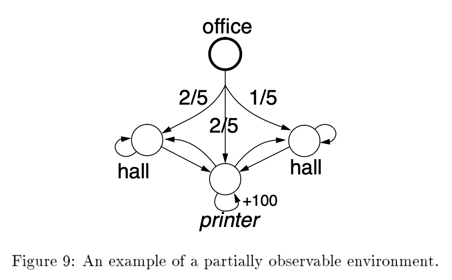
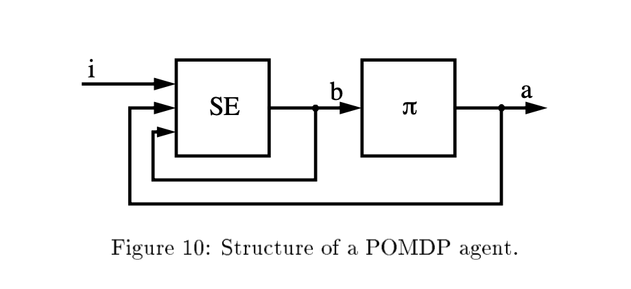

# Reinforcement Learning in Practice: Exploration, Generalization, and Scaling

---

## Table of Contents

- [Reinforcement Learning in Practice: Exploration, Generalization, and Scaling](#reinforcement-learning-in-practice-exploration-generalization-and-scaling)
  - [Table of Contents](#table-of-contents)
  - [1. Beyond Tabular Q-Learning: Three Obstacles](#1-beyond-tabular-q-learning-three-obstacles)
  - [2. Exploration vs. Exploitation](#2-exploration-vs-exploitation)
    - [2.1 The $k$-Armed Bandit Problem](#21-the-k-armed-bandit-problem)
    - [2.2 Formally Justified Approaches](#22-formally-justified-approaches)
    - [2.3 Practical Exploration Strategies](#23-practical-exploration-strategies)
    - [2.4 Exploration in the Multi-State Setting](#24-exploration-in-the-multi-state-setting)
    - [2.5 Practical Hyperparameter Schedules](#25-practical-hyperparameter-schedules)
    - [2.6 Practical Convergence Monitoring](#26-practical-convergence-monitoring)
  - [3. Model-Based Methods: Learning Faster with a Model](#3-model-based-methods-learning-faster-with-a-model)
    - [3.1 Certainty Equivalence: The Naive Approach](#31-certainty-equivalence-the-naive-approach)
    - [3.2 Dyna: Interleaving Real and Simulated Experience](#32-dyna-interleaving-real-and-simulated-experience)
    - [3.3 Prioritized Sweeping: Directing Computation Where It Matters](#33-prioritized-sweeping-directing-computation-where-it-matters)
    - [3.4 The Model-Free vs. Model-Based Trade-Off](#34-the-model-free-vs-model-based-trade-off)
  - [4. Generalization: Function Approximation for Large State Spaces](#4-generalization-function-approximation-for-large-state-spaces)
    - [4.1 State Discretization: Making Tabular Methods Work with Continuous Spaces](#41-state-discretization-making-tabular-methods-work-with-continuous-spaces)
    - [4.2 How Function Approximation Integrates with Q-Learning](#42-how-function-approximation-integrates-with-q-learning)
    - [4.3 The Convergence Problem](#43-the-convergence-problem)
    - [4.4 Deep Q-Networks (DQN): Stabilizing Neural Q-Learning](#44-deep-q-networks-dqn-stabilizing-neural-q-learning)
    - [4.5 Approaches to Generalization](#45-approaches-to-generalization)
    - [4.6 Hierarchical Methods](#46-hierarchical-methods)
  - [5. Partial Observability](#5-partial-observability)
    - [5.1 The Problem: Perceptual Aliasing](#51-the-problem-perceptual-aliasing)
    - [5.2 Coping Strategies](#52-coping-strategies)
  - [6. Applications: Where RL Meets the Real World](#6-applications-where-rl-meets-the-real-world)
    - [6.1 TD-Gammon: A Landmark Success](#61-td-gammon-a-landmark-success)
    - [6.2 Robotics and Control](#62-robotics-and-control)
  - [7. The Big Picture: A Practical Roadmap](#7-the-big-picture-a-practical-roadmap)
  - [Sources and Further Reading](#sources-and-further-reading)
    - [Primary sources](#primary-sources)
    - [Exploration](#exploration)
    - [Model-based methods](#model-based-methods)
    - [Function approximation and deep RL](#function-approximation-and-deep-rl)
    - [Generalization and hierarchical methods](#generalization-and-hierarchical-methods)
    - [Partial observability](#partial-observability)
    - [Applications](#applications)

---

## 1. Beyond Tabular Q-Learning: Three Obstacles

The companion document, *RL Foundations*, developed the theory of MDPs, the Bellman equations, and model-free algorithms like Q-learning and TD($\lambda$). These algorithms have provable convergence guarantees — but those guarantees rest on assumptions that rarely hold in practice:

1. **Every state-action pair must be visited infinitely often.** In large or continuous state spaces, most state-action pairs will never be visited even once. The agent needs an intelligent strategy for deciding *where to look* — the **exploration** problem.

2. **The value function is stored as a lookup table.** A table with one entry per state-action pair is infeasible when the state space is large (a backgammon board has $\approx 10^{20}$ states) or continuous (a robot's joint angles are real-valued). The agent needs a compact function approximator that **generalizes** from visited states to unvisited ones.

3. **Model-free methods are sample-inefficient.** Q-learning uses each experience exactly once: it observes a transition, updates one table entry, and discards the data. When real-world experience is expensive (a physical robot takes seconds per action), we want to extract more value from each experience — by learning and using a **model** of the environment.

This document addresses each of these obstacles, building on the same MDP framework and notation established in the companion notes.

---

## 2. Exploration vs. Exploitation

Every RL agent faces a dilemma: should it exploit what it already knows (choose the action with the highest estimated value) or explore alternatives (try actions whose values are uncertain, in hope of finding something better)? Too much exploitation locks the agent into a suboptimal policy — it never discovers the truly best actions. Too much exploration wastes time on actions that are clearly inferior.

This tension is not unique to RL — it appears throughout statistics, economics, and clinical trial design — but in RL it is especially acute because the agent's exploration choices affect which data it collects, which in turn affects what it can learn.

### 2.1 The $k$-Armed Bandit Problem

The simplest setting that captures the exploration-exploitation tradeoff is the **$k$-armed bandit problem** (Berry & Fristedt, 1985). The agent faces $k$ slot machines (each called a "one-armed bandit"). On each of $h$ turns, it pulls one arm and receives a stochastic reward. Arm $i$ pays off 1 with unknown probability $p_i$ and 0 otherwise; payoffs are independent across pulls. The agent wants to maximize its total reward over all $h$ pulls.

This is a single-state RL problem: there is no state transition — the environment is always in the same state, and the agent's only decision is which arm to pull. Yet even this minimal setting is rich enough to illustrate the core issues.

If the agent knew the $p_i$ values, the solution would be trivial: always pull the arm with the highest $p_i$. The difficulty is that the $p_i$ are unknown and must be estimated from experience. Pulling a suboptimal arm costs a turn that could have been spent on the best arm (opportunity cost), but it also provides information that may be valuable for future decisions.

The optimal strategy depends on the horizon $h$. With many pulls remaining, the agent can afford to explore widely — the information gained will pay dividends over many future pulls. With few pulls remaining, the cost of exploration is high relative to its benefit, and the agent should exploit.

### 2.2 Formally Justified Approaches

For the simple bandit problem, there exist provably optimal strategies, though they don't scale to the general multi-state RL setting.

**Bayesian dynamic programming.** If the agent has a prior over the unknown $p_i$ (e.g., each $p_i \sim \text{Uniform}(0,1)$ independently), it can compute an optimal exploration strategy using backward induction over **belief states** (Berry & Fristedt, 1985). A belief state summarizes the agent's experience: $\{n_1, w_1, \ldots, n_k, w_k\}$, where $n_i$ is the number of times arm $i$ has been pulled and $w_i$ is the number of payoffs. With uniform priors, the posterior probability that arm $i$ pays off is $\hat{p}_i = (w_i + 1) / (n_i + 2)$ (a Beta posterior). The value function over belief states can be computed recursively. With memoization over the sufficient statistics $(n_i, w_i)$, the cost is polynomial in the horizon $h$ but grows exponentially in the number of arms $k$ — making the approach feasible only for problems with few arms and moderate horizons.

**Gittins allocation indices.** Gittins (1989) showed that under the discounted reward criterion, the optimal strategy for the $k$-armed bandit has a remarkably simple form: compute an **index** $I(n_i, w_i)$ for each arm based on its history, and always pull the arm with the highest index. The index simultaneously captures both the expected reward and the information value of pulling the arm. Published tables of index values exist for common discount factors. The elegance of this result is striking — it decomposes a $k$-dimensional optimization into $k$ independent one-dimensional problems. Unfortunately, no analog of Gittins indices has been found for the general delayed-reward setting.

### 2.3 Practical Exploration Strategies

The formally optimal methods above do not extend to full MDPs with multiple states and delayed reward. In practice, RL systems use heuristic exploration strategies. While none are provably optimal in the general case, several work well empirically and have deep intuitive justifications.

**Greedy (pure exploitation).** Always choose the action with the highest estimated value: $a = \arg\max_a \hat{Q}(s, a)$. This is the baseline against which we measure exploration strategies. Its failure mode is well understood: if the agent's early estimates are inaccurate (as they always are), it may lock onto a suboptimal action and never try the alternatives. The true best action, having never been tried (or tried only unluckily), gets "starved" of data.

**$\epsilon$-greedy.** With probability $1 - \epsilon$, take the greedy action; with probability $\epsilon$, take a uniformly random action. This guarantees that every action is tried occasionally, satisfying the visitation requirements of the Q-learning convergence theorem. A common practice is to start with a large $\epsilon$ (e.g., 0.5) and decay it toward zero as learning progresses, gradually shifting from exploration to exploitation.

The weakness of $\epsilon$-greedy is that it explores *blindly*: when it does explore, it is equally likely to try a promising alternative and a clearly hopeless one. It makes no use of the agent's uncertainty about different actions.

**Boltzmann (softmax) exploration.** Choose action $a$ in state $s$ with probability:

$$P(a \mid s) = \frac{\exp(\hat{Q}(s, a) / \tau)}{\sum_{a'} \exp(\hat{Q}(s, a') / \tau)}$$

where $\tau > 0$ is a **temperature** parameter. At high temperature ($\tau \to \infty$), the distribution is nearly uniform — pure exploration. At low temperature ($\tau \to 0$), it concentrates on the highest-$Q$ action — pure exploitation. Unlike $\epsilon$-greedy, Boltzmann exploration preferentially tries actions with higher estimated values, avoiding wasted trials on clearly bad alternatives.

In practice, $\tau$ is decreased over time ("cooling"), analogous to simulated annealing. The method can converge slowly if action values are close together, and requires careful tuning of the cooling schedule.

**Optimism in the face of uncertainty.** Initialize Q-values or value estimates to optimistically high values. The agent greedily selects the most promising-looking action, and when the actual reward disappoints, it revises the estimate downward and naturally moves on to the next most promising action. Untried actions retain their optimistic initial values, ensuring they will eventually be tried. This approach is simple and requires no explicit randomization. It is used in several practical RL systems including Dyna's exploration bonus (Sutton, 1990) and the prioritized sweeping algorithm (Moore & Atkeson, 1993).

**Interval estimation (upper confidence bound).** For each action $a_i$, maintain statistics: $n_i$ trials, $w_i$ successes. Compute the upper bound of a confidence interval on the success probability, and choose the action with the highest upper bound (Kaelbling, 1993). Formally, choose:

$$a = \arg\max_i \left( \hat{p}_i + z_{\alpha/2} \sqrt{\frac{\hat{p}_i(1 - \hat{p}_i)}{n_i}} \right)$$

where $\hat{p}_i = w_i / n_i$ and $z_{\alpha/2}$ is the normal critical value. The parameter $\alpha$ controls the width of the interval: smaller $\alpha$ means wider intervals and more exploration. This approach exploits **second-order information** (how certain the agent is about each action's value), not just the point estimates. Actions with few trials have wide confidence intervals and high upper bounds, so they will be tried. As data accumulates, the intervals narrow and the agent converges to the truly best action.

The more widely-cited **UCB1** algorithm (Auer, Cesa-Bianchi & Fischer, 2002) replaces the Wald interval with a simpler exploration bonus derived from Hoeffding's inequality: choose $a = \arg\max_i \left( \hat{\mu}_i + \sqrt{2 \ln t \,/\, n_i} \right)$, where $t$ is the total number of pulls so far. UCB1 achieves **logarithmic cumulative regret** — the gap between the agent's total reward and the reward it would have earned by always pulling the best arm grows only as $O(\ln t)$, which is provably optimal up to constant factors. The intuition is the same as interval estimation: the $\sqrt{\ln t / n_i}$ term is large for under-explored arms and shrinks as $n_i$ grows, naturally balancing exploration and exploitation without any tunable parameter.

```python
import numpy as np

np.random.seed(42)
k = 5
true_probs = [0.1, 0.5, 0.3, 0.8, 0.2]
n_pulls = 500

wins = np.zeros(k)
trials = np.zeros(k)
rewards_over_time = []

for t in range(n_pulls):
    ucb = np.array([
        (wins[i] / trials[i] + 1.96 * np.sqrt(wins[i]/trials[i] * (1 - wins[i]/trials[i]) / trials[i]))
        if trials[i] > 1 else float('inf')
        for i in range(k)
    ])
    arm = np.argmax(ucb)
    reward = np.random.binomial(1, true_probs[arm])
    wins[arm] += reward
    trials[arm] += 1
    rewards_over_time.append(reward)

print(f"Trials per arm: {trials.astype(int)}")
print(f"Estimated probs: {(wins / np.maximum(trials, 1)).round(3)}")
print(f"True best arm: 3 (p=0.8), most pulls on arm: {np.argmax(trials)}")
```

The code requires at least two trials before computing a confidence interval (`trials[i] > 1`); with only one trial, $\hat{p} \in \{0, 1\}$ and $\hat{p}(1 - \hat{p}) = 0$, collapsing the interval to a point and eliminating the exploration bonus. Until an arm has two trials, it retains the optimistic default of $+\infty$. The interval estimation agent quickly identifies the best arm and concentrates its pulls there, while giving each arm enough trials to distinguish it.

### 2.4 Exploration in the Multi-State Setting

All of the above strategies were described for single-state bandits, but they transfer directly to the multi-state delayed-reward setting by treating each state as hosting its own bandit problem. In Q-learning, for example, the $\epsilon$-greedy or Boltzmann strategies are applied to the Q-values for the current state.

However, the multi-state setting introduces a complication: exploration is not just about trying different actions in the current state, but about *visiting different states*. An agent that explores actions locally but never ventures into distant regions of the state space may miss entire parts of the optimal policy. This is where model-based methods (Section 3) and intelligent exploration heuristics like "optimism in the face of uncertainty" become especially important.

When the environment is **non-stationary** (the transition probabilities or rewards change over time), exploration must continue indefinitely — the agent needs to notice when the world has changed. Ad-hoc strategies adapt naturally: keep $\epsilon$ from reaching zero, or decay the statistics in interval estimation so old data is gradually forgotten.

### 2.5 Practical Hyperparameter Schedules

The convergence guarantees for Q-learning and SARSA require specific properties of the learning rate $\alpha$ and exploration rate $\epsilon$ (see the Robbins-Monro conditions in the companion document, Section 5.5), but the theory says nothing about *which* specific schedules work well in finite-time practice. This section bridges that gap.

**Learning rate $\alpha$ decay.** The Robbins-Monro conditions ($\sum \alpha = \infty$, $\sum \alpha^2 < \infty$) ensure convergence but leave wide latitude in the schedule. Common practical choices:

- **Visit-based:** $\alpha(s, a) = 1 / (1 + \text{visits}(s, a))$. Each state-action pair decays independently. Pairs visited often stabilize quickly; rarely-visited pairs remain receptive to new information. This is the theoretically cleanest option and directly satisfies the Robbins-Monro conditions.
- **Linear decay:** $\alpha_t = \alpha_0 - (\alpha_0 - \alpha_{\min}) \cdot t / T$, decaying from an initial $\alpha_0$ (e.g., 0.5) to a floor $\alpha_{\min}$ (e.g., 0.01) over $T$ episodes. Simple and effective; the floor prevents the rate from reaching zero before sufficient learning has occurred.
- **Constant:** $\alpha_t = c$ for all $t$. Violates $\sum \alpha^2 < \infty$, so convergence is not formally guaranteed — the Q-values will oscillate around $Q^*$ with residual variance proportional to $\alpha$. Despite this, constant rates are widely used in practice because they track non-stationary environments and are simpler to tune. Typical values: $\alpha \in [0.01, 0.5]$.

**Exploration $\epsilon$ schedule.** For $\epsilon$-greedy:

- Start with $\epsilon$ high (e.g., 1.0 — fully random) to ensure broad state-space coverage early on.
- Decay linearly or exponentially toward a small floor (e.g., $\epsilon_{\min} = 0.01$) over a fixed number of episodes.
- The floor should remain nonzero: in stochastic environments, zero exploration can cause the agent to settle on a suboptimal policy if early estimates were unlucky.

```python
import numpy as np

def epsilon_schedule(episode, total_episodes, eps_start=1.0, eps_end=0.01,
                     decay_fraction=0.8):
    """Linear ε-decay: explore heavily early, exploit late."""
    decay_episodes = int(total_episodes * decay_fraction)
    if episode >= decay_episodes:
        return eps_end
    return eps_start - (eps_start - eps_end) * episode / decay_episodes

# Typical schedule for a 10,000-episode run
for ep in [0, 1000, 4000, 8000, 9999]:
    print(f"Episode {ep:5d}: ε = {epsilon_schedule(ep, 10000):.3f}")
# Output: 1.000 → 0.876 → 0.506 → 0.010 → 0.010
```

**Tuning priority.** Getting the exploration schedule right matters more than fine-tuning the learning rate. If the agent never visits good states — because exploration is too narrow or stops too early — no learning rate will help. A practical workflow: (1) start with generous exploration ($\epsilon = 1.0$, slow decay), (2) verify the agent visits the relevant parts of the state space, (3) then tune $\alpha$ for convergence speed. When systematic tuning is needed, random search over log-spaced ranges (e.g., $\alpha \in \{0.01, 0.05, 0.1, 0.5\}$, $\epsilon_{\text{decay}} \in \{0.5T, 0.8T, 0.95T\}$) is more efficient than grid search, since most hyperparameter landscapes have **low effective dimensionality** — only one or two hyperparameters actually drive performance, and random search explores each individual dimension more thoroughly than a grid with the same budget (Bergstra & Bengio, 2012).

### 2.6 Practical Convergence Monitoring

The theoretical convergence guarantees (Section 5.4 of the companion document) say Q-learning converges given infinite visits to every state-action pair — but they say nothing about *when to stop* in a finite training run. Unlike supervised learning, RL has no train/validation split and no clean notion of "overfitting" — the agent is learning the environment, not generalizing to unseen data. The practical risk is *under-exploration* (stopping before the agent has found the optimal route), not overfitting. Common stopping heuristics:

- **Return plateau.** Track the average episodic return (or steps-to-goal) over a rolling window. When the moving average stabilizes within some tolerance for $N$ consecutive episodes, the policy is unlikely to improve further. This is the most widely used criterion and the easiest to implement.
- **Value stability.** Monitor $\max_{s,a} |Q_{\text{new}}(s,a) - Q_{\text{old}}(s,a)|$ across episodes. When the largest Q-value change drops below a threshold $\epsilon$, the value function has settled. This is the Q-learning analogue of the Bellman residual stopping criterion used in value iteration (companion document, Section 3.1).
- **Policy stability.** If the greedy policy $\pi(s) = \arg\max_a Q(s,a)$ hasn't changed at any state for $N$ episodes, the agent has converged *behaviorally* — even if the Q-values are still being refined. Policy often stabilizes before values do.

A useful diagnostic is to track $V^*(s_{\text{start}}) = \max_a Q(s_{\text{start}}, a)$ over training. This single number measures how far the reward signal has propagated from the goal back to the starting state. If you can compute the true optimal value (e.g., via value iteration on a known model), the gap between your estimate and the true value directly measures remaining suboptimality. In most real problems you can't compute the true value, but the trajectory of $V^*(s_{\text{start}})$ still reveals whether learning has plateaued.

---

## 3. Model-Based Methods: Learning Faster with a Model

Model-free methods like Q-learning are guaranteed to find the optimal policy, but they are wasteful with experience. Each real-world transition $\langle s, a, r, s' \rangle$ updates a single Q-table entry and is then effectively discarded. In a toy grid world this hardly matters — environment steps are just array lookups. But in many real settings, each interaction is genuinely expensive:

- **Robotics:** every step means physically moving hardware, consuming time, and risking damage.
- **Healthcare:** each "step" is a treatment decision for an actual patient.
- **Autonomous driving:** real interactions mean real miles, fuel, and safety risk.

In these domains, an algorithm that needs hundreds of thousands of real transitions to converge is impractical. The core motivation for model-based RL is **sample efficiency** — squeezing more learning out of each precious real experience.

**Model-based methods** take a different approach: learn an approximate model of the environment ($\hat{T}$ and $\hat{R}$), then use that model to plan. The model can be "consulted" many times between real-world actions, generating simulated experience that is vastly cheaper than the real thing. This makes model-based methods more **sample-efficient** (fewer real-world steps to convergence), at the cost of more computation per step. The trade-off is essentially: *think cheaply instead of acting expensively*.

### 3.1 Certainty Equivalence: The Naive Approach

The simplest model-based strategy: explore the environment to learn $\hat{T}$ and $\hat{R}$ (by counting transitions and averaging rewards), then solve the estimated MDP using value iteration or policy iteration to obtain a policy.

This has three problems (Kaelbling et al., 1996):

- It makes an arbitrary division between a "learning phase" (gather data) and an "acting phase" (use the policy). How should the agent explore during the learning phase? Random exploration can be exponentially inefficient in environments with bottleneck states — Whitehead (1991) showed an environment where random exploration takes $O(2^n)$ steps to reach the goal even once, whereas intelligent exploration needs only $O(n^2)$.
- It fails to interleave learning and acting. A more practical variant, **online certainty equivalence**, continually updates the model and recomputes the optimal policy at every step. This uses data effectively but is computationally demanding — it solves a full MDP at every time step.
- If the environment changes, a policy computed from old data may become suboptimal without the agent ever noticing.

The more practical model-based algorithms below address these issues by interleaving model learning, planning, and acting.

To see *why* certainty equivalence is so expensive, consider what its online variant does after every single real step — it re-solves the entire estimated MDP from scratch:

```
after each real step:
    for iteration in range(until_convergence):   # outer loop: repeat until stable
        for s in ALL states:                     # inner loop: sweep every state
            for a in ALL actions:
                Q[s][a] = R̂(s,a) + γ * Σ T̂(s,a,s') * max_a' Q(s',a')
```

This is exhaustive and exact, but the nested loops make it impractical for large state spaces — on our 6×6 grid that's 144 state-action pairs per sweep, but a real problem with millions of states makes full sweeps impossible. Dyna (below) replaces this full solve with a handful of random model lookups — far cheaper per step, at the cost of only *incrementally* improving Q-values rather than solving to convergence.

### 3.2 Dyna: Interleaving Real and Simulated Experience

Sutton's **Dyna** architecture (1990, 1991) occupies a middle ground between model-free learning and full certainty equivalence. The "model" here is surprisingly simple: a lookup table that stores every real transition the agent has observed. Each time the agent takes action $a$ in state $s$ and lands in $s'$ with reward $r$, it records the entry $(s, a) \mapsto (s', r)$. That's the entire model — no probability distributions, no function approximation, just a dictionary of past experience.

Dyna simultaneously:

1. Uses real experience to update Q-values directly (like Q-learning).
2. Stores the transition in the model (add an entry to the dictionary).
3. Uses the model to generate $k$ additional "simulated" updates per real step — by randomly sampling stored transitions and applying the same Q-learning update as if the agent had just experienced them again.

**Algorithm: Dyna**

> Given an experience tuple $\langle s, a, r, s' \rangle$ from the real environment:
>
> 1. **Direct (model-free) update:** apply the standard Q-learning sample backup using the *actual* observed transition:
>
> $\qquad Q(s, a) \leftarrow Q(s, a) + \alpha \left[ r + \gamma \max_{a'} Q(s', a') - Q(s, a) \right]$
>
> 2. **Update the model:** store the transition $(s, a) \mapsto (s', r)$ in the dictionary.
>
> 3. **Simulated (model-based) updates:** Repeat $k$ times:
>    - Choose a previously-visited state-action pair $(s_k, a_k)$ at random.
>    - Look up the stored transition: $(s'_k, r_k) = \text{model}(s_k, a_k)$.
>    - Apply the same Q-learning update: $Q(s_k, a_k) \leftarrow Q(s_k, a_k) + \alpha \left[ r_k + \gamma \max_{a'} Q(s'_k, a') - Q(s_k, a_k) \right]$
>
> 4. **Act:** Choose the next action from $s'$ using the Q-values (with exploration).
>
> This is the key insight of Dyna: step 1 is standard model-free Q-learning (learning from real experience), while step 3 uses the learned model to generate additional "imagined" experience for the same kind of update. The real and simulated updates are identical in form — the only difference is where the transition comes from.

The parameter $k$ controls the computation-per-step budget. With $k = 0$, the simulated-update loop never executes and Dyna reduces to standard Q-learning — the model is still built, but never consulted. With large $k$, the agent performs extensive "mental simulation" between each real-world action.

**Why does random replay help?** At first glance, randomly picking from all past transitions seems wasteful. If the agent just reached the goal, why replay a transition from far away where nothing interesting happened? The answer is that not every replay needs to be useful — with $k = 50$, even a few replays that land near recently-updated states will propagate value one step further back. Over multiple real steps, this creates a wave of value propagation that spreads far faster than waiting for the agent to physically revisit each state. The model also grows richer with every real step (more dictionary entries), so simulated updates become more useful over time as the agent has explored more of the environment.

That said, random selection *is* suboptimal — many of those $k$ replays do land on states where nothing has changed and produce near-zero updates. This motivates **prioritized sweeping** (Section 3.3), which directs replays to states where value has recently changed.

The code below demonstrates Dyna on a 6×6 grid. The agent starts at bottom-left `(5,0)` and must reach the goal at top-right `(0,5)`. Two trap cells at `(1,4)` and `(1,5)` carry a −10 penalty, forcing the agent to learn a safe route around them rather than simply beelining toward the goal.

```python
import numpy as np

np.random.seed(0)
ROWS, COLS = 6, 6
GOAL = (0, 5)                             # top-right corner
TRAPS = {(1, 4), (1, 5)}                  # danger zone: −10 penalty
# Each action is a (Δrow, Δcol) offset.  Row 0 is the top of the grid,
# so "up" decreases the row index and "down" increases it.
ACTIONS = [(-1,0),(1,0),(0,-1),(0,1)]      # up, down, left, right
gamma, alpha = 0.95, 0.1

def step(s, a):
    """Take action a (index into ACTIONS) from state s (row, col).
    Returns (next_state, reward). Rewards: +10 goal, −10 trap, −0.1 otherwise.
    Moves that would leave the grid are clipped to the boundary."""
    nr, nc = s[0]+ACTIONS[a][0], s[1]+ACTIONS[a][1]
    nr, nc = max(0,min(ROWS-1,nr)), max(0,min(COLS-1,nc))
    s2 = (nr, nc)
    if s2 == GOAL:   return s2, 10.0
    if s2 in TRAPS:  return s2, -10.0
    return s2, -0.1

def run_dyna(k_sim, episodes=80):
    """Run Dyna-Q on the 6x6 grid. k_sim=0 reduces to plain Q-learning."""
    Q = np.zeros((ROWS, COLS, 4))          # Q-table: one value per (row, col, action)
    model = {}                              # learned model: (s, a) -> (s', r)
    visited = []                            # list of (s, a) pairs seen so far
    for ep in range(episodes):
        s = (5, 0)                          # start bottom-left
        for _ in range(200):
            # ε-greedy action selection (ε = 0.1)
            a = np.argmax(Q[s]) if np.random.random() > 0.1 else np.random.randint(4)
            s2, r = step(s, a)

            # Step 1: direct Q-learning update (real experience)
            Q[s][a] += alpha * (r + gamma * np.max(Q[s2]) - Q[s][a])

            # Step 2: store transition in the model
            model[(s, a)] = (s2, r)
            if (s, a) not in visited: visited.append((s, a))

            # Step 3: k_sim simulated updates from the model (Dyna's key idea)
            for _ in range(k_sim):
                si, ai = visited[np.random.randint(len(visited))]
                s2i, ri = model[(si, ai)]
                Q[si][ai] += alpha * (ri + gamma * np.max(Q[s2i]) - Q[si][ai])

            s = s2
            if s == GOAL: break
    return Q

for k in [0, 5, 50]:
    Q = run_dyna(k)
    print(f"k={k:2d}: V(start) = {np.max(Q[5,0]):.2f},  V(near goal) = {np.max(Q[0,4]):.2f}")
```

With $k=0$ (pure Q-learning), 80 episodes is far too few for value estimates to propagate across the grid. With $k=50$, the same 80 episodes of real experience produce accurate values everywhere — each real step triggers 50 simulated updates that spread information through the model.

**A note on reward design.** The agent's behavior is entirely shaped by the reward values we chose — and it is surprisingly sensitive to them. In the code above, the goal reward (+10) dwarfs the step cost (−0.1), so the agent is strongly motivated to reach the goal even if it takes a long path. But change the balance and the behavior shifts dramatically: make traps only mildly negative (say −1 instead of −10) and the agent may learn to cut *through* a trap cell if the shortcut saves enough step costs to offset the penalty. Make the step cost too large relative to the goal reward and the agent may prefer to stay in place rather than risk accumulating penalties on the way. The algorithm finds the optimal policy *for the reward function you give it* — getting the reward right is often harder than choosing the algorithm.

### 3.3 Prioritized Sweeping: Directing Computation Where It Matters

Dyna's weakness is that its simulated updates are chosen randomly — it may waste computation updating states whose values haven't changed, while neglecting states where new information has arrived. **Prioritized sweeping** (Moore & Atkeson, 1993) — independently developed as **Queue-Dyna** (Peng & Williams, 1993) — fixes this by directing computation to the most "interesting" parts of the state space.

The key idea: when a state's value changes significantly, the states that *lead to* it (its predecessors) likely need updating too. Prioritized sweeping maintains a priority queue of states, ordered by how much their values are expected to change.

**Algorithm: Prioritized Sweeping**

Note: the algorithm below is written in terms of $V(s)$ rather than $Q(s,a)$. This is a natural choice because the priority queue operates on *states* — when a state's value changes, its predecessor *states* need updating. Using Q would require queueing individual $(s,a)$ pairs ($|S| \times |A|$ entries instead of $|S|$). The two are equivalent: step 2 below computes $V(s)$ by taking the best action from $s$, i.e. $V(s) = \max_a Q(s,a)$. (The $\max$ makes this implicitly $V^*$; plain $V^\pi$ without a $\max$ would be the value under a specific policy — see the companion document, Sections 2.2–2.4.)

> In addition to the model ($\hat{T}$, $\hat{R}$), maintain:
> - For each state $s'$: its set of **predecessor pairs** — all $(s, a)$ such that $\hat{T}(s, a, s') > 0$.
> - A **priority queue** of states, initially all zero.
>
> After a real-world transition, update the model. Then repeat $k$ times (or until the queue is empty):
>
> Pop the state $s$ with the highest priority from the queue.
>
> 1. Record $V_{\text{old}} = V(s)$.
>
> 2. Update: $V(s) := \max_a \left[ \hat{R}(s, a) + \gamma \sum_{s'} \hat{T}(s, a, s') V(s') \right]$
>
> 3. Compute $\Delta = |V_{\text{old}} - V(s)|$.
>
> 4. For each predecessor pair $(\bar{s}, \bar{a})$ with $\hat{T}(\bar{s}, \bar{a}, s) > 0$: if $\Delta \cdot \hat{T}(\bar{s}, \bar{a}, s) > \text{current priority of } \bar{s}$, promote $\bar{s}$'s priority to $\Delta \cdot \hat{T}(\bar{s}, \bar{a}, s)$.
>
> 5. Reset $s$'s priority to 0.

When the agent discovers something surprising — finding a goal for the first time, or encountering an unexpected transition — the affected state gets a large value change, which triggers a cascade of priority promotions among its predecessors. Computation flows backward along the most relevant paths. When the world is "boring" (transitions match expectations), little computation is wasted.

**Empirical comparison.** On a 3,277-state grid world (Kaelbling et al., 1996), the results are dramatic. Here, a **backup** is a single Q-value update — one application of the Bellman equation to one $(s, a)$ entry ("backing up" value from successor states to the current state). Q-learning performs one backup per real step; Dyna performs $1 + k$ backups per real step (one real, $k$ simulated).

| Algorithm | Steps to convergence | Backups to convergence |
|---|---|---|
| Q-learning | 531,000 | 531,000 |
| Dyna ($k = 200$) | 62,000 | 3,055,000 |
| Prioritized sweeping ($k = 200$) | 28,000 | 1,010,000 |

Dyna needs **8.5× fewer real-world steps** than Q-learning, at the cost of about 6× more computation. This is exactly the "think cheaply instead of acting expensively" trade-off: if each real step is a robot moving or a patient receiving treatment, 6× more CPU time is a bargain for 8.5× fewer real interactions. Prioritized sweeping does even better on both axes — about **half the real steps of Dyna** and **one-third the computation** — because it directs its simulated backups where they'll have the most impact rather than picking randomly.

### 3.4 The Model-Free vs. Model-Based Trade-Off

| | Model-Free (Q-learning) | Model-Based (Dyna, PS) |
|---|---|---|
| **Sample efficiency** | Low — each experience used once | High — model enables reuse |
| **Computation per step** | Low | Higher (scales with $k$) |
| **Memory** | $O(\vert S \vert \cdot \vert A \vert)$ for Q-table | Plus $O(\vert S \vert^2 \cdot \vert A \vert)$ for model |
| **Model bias** | None — learns from real data only | Errors in $\hat{T}, \hat{R}$ can mislead |
| **Best when** | Computation limited, experience cheap | Experience expensive, computation cheap |

The choice between model-free and model-based methods depends on the application. For a simulated environment where experience is free, Q-learning's simplicity wins. For a physical robot where each step costs time and risk, the sample efficiency of model-based methods is decisive.

---

## 4. Generalization: Function Approximation for Large State Spaces

All algorithms discussed so far store value functions as tables: one entry for every state (or state-action pair). This is feasible only when the state space is small enough to enumerate. For most real problems — robotic control with continuous joint angles, game playing with combinatorial board states, scheduling with exponential state spaces — tabular methods are impossible.

Before reaching for function approximation, there is a simpler first option: **discretize** the continuous space into bins and apply standard tabular algorithms. When that fails (too many dimensions, or the required resolution explodes the state count), function approximation becomes necessary. We cover both approaches below, starting with the simpler one.

### 4.1 State Discretization: Making Tabular Methods Work with Continuous Spaces

When the state space is continuous — joint angles, velocities, positions — tabular methods require a preliminary step: partition the continuous space into a finite set of **bins**, mapping each continuous state to a discrete bin index. This converts the continuous MDP into an approximate discrete MDP, allowing standard algorithms (value iteration, policy iteration, SARSA, Q-learning) to run unchanged.

**Uniform binning.** Divide each state dimension into equally-spaced bins. For a state with $d$ features and $b$ bins per feature, this creates $b^d$ discrete states — an exponential blowup. A 4-dimensional state (like CartPole) with 10 bins per dimension yields $10^4 = 10{,}000$ states; 20 bins yields $160{,}000$. The curse of dimensionality limits uniform binning to low-dimensional problems.

**Non-uniform binning.** Not all state dimensions are equally important, and within a dimension some regions need finer resolution than others. In a pole-balancing task, the pole angle near vertical requires fine resolution (small differences determine whether the pole is recoverable), while extreme angles are all equally "bad" and can be binned coarsely. Assign more bins to the dimensions and regions where the optimal action changes most rapidly.

**Clamping.** Continuous state features may have unbounded or very wide ranges (e.g., angular velocity). Before binning, **clamp** each feature to a finite interval $[\text{lo}, \text{hi}]$, chosen to cover the states the agent actually encounters. Values outside this range map to the boundary bins. Without clamping, extreme values create sparsely-visited bins that waste capacity.

**The discretization trade-off.** Coarser bins produce fewer states (faster convergence, less memory) but introduce **state aliasing**: distinct continuous states that map to the same bin must share a single Q-value, potentially making the optimal policy unrepresentable. Finer bins reduce aliasing but increase the state space, slowing convergence and requiring more data to populate the Q-table adequately.

```python
import numpy as np

def discretize_state(state, bins_per_dim, clip_ranges):
    """Convert a continuous state vector to a discrete bin-index tuple.

    Args:
        state: continuous state vector (e.g., [cart_pos, cart_vel, pole_angle, pole_vel])
        bins_per_dim: number of bins for each dimension
        clip_ranges: (low, high) clamp range for each dimension

    Returns:
        Tuple of bin indices, usable as a dictionary key for a Q-table.
    """
    discrete = []
    for val, n_bins, (lo, hi) in zip(state, bins_per_dim, clip_ranges):
        clipped = np.clip(val, lo, hi)
        scaled = (clipped - lo) / (hi - lo)          # map to [0, 1]
        bin_idx = int(np.clip(scaled * n_bins, 0, n_bins - 1))
        discrete.append(bin_idx)
    return tuple(discrete)

# CartPole-v1: 4D continuous state → discrete bins
# More bins on angle/velocity (policy-sensitive), fewer on position (less critical)
cartpole_bins = [3, 3, 8, 5]
cartpole_clips = [(-2.4, 2.4), (-3.0, 3.0), (-0.21, 0.21), (-3.5, 3.5)]

examples = [
    np.array([ 0.01, -0.5,  0.05,  0.8]),   # near-center, slight tilt
    np.array([ 0.01, -0.5,  0.051, 0.8]),   # almost identical — same bin
    np.array([ 0.01, -0.5,  0.15,  2.5]),   # large tilt, fast rotation
]

print(f"Total discrete states: {np.prod(cartpole_bins)} "
      f"(bins per dim: {cartpole_bins})")
for s in examples:
    print(f"  {s} → bin {discretize_state(s, cartpole_bins, cartpole_clips)}")
```

The first two continuous states differ by only 0.001 in pole angle and map to the same bin — discretization has erased that distinction. Whether this matters depends on whether the optimal action differs between those two states. The third state, with a large tilt and fast angular velocity, maps to a clearly different bin. Tuning the bin counts is an empirical process: start coarse, increase resolution in dimensions where the agent's performance is sensitive, and verify that the Q-table is adequately populated (too many bins with zero visits indicates the resolution is too fine for the available training data).

### 4.2 How Function Approximation Integrates with Q-Learning

The discretization approach above works, but it has a fundamental limitation: each bin is independent. Visiting state $(0.01, -0.5, 0.05, 0.8)$ teaches the agent nothing about nearby states like $(0.02, -0.5, 0.05, 0.8)$ — even though the right action is almost certainly the same. Function approximation solves this by replacing the lookup table with a smooth function that *generalizes* across similar states: learning about one state automatically improves estimates for its neighbors.

The modification to Q-learning is conceptually straightforward. Replace the Q-table with a parameterized function $\hat{Q}(s, a; \mathbf{w})$ — a neural network, for example, with weights $\mathbf{w}$. After each transition $\langle s, a, r, s' \rangle$, compute the TD target:

$$y = r + \gamma \max_{a'} \hat{Q}(s', a'; \mathbf{w})$$

Then update $\mathbf{w}$ to reduce the error between $\hat{Q}(s, a; \mathbf{w})$ and $y$. With a neural network, this is a standard gradient descent step:

$$\mathbf{w} \leftarrow \mathbf{w} + \alpha \left[ y - \hat{Q}(s, a; \mathbf{w}) \right] \nabla_{\mathbf{w}} \hat{Q}(s, a; \mathbf{w})$$

(This is standard gradient descent on the MSE loss $\frac{1}{2}[y - \hat{Q}]^2$, with the chain rule expanded out. The $[y - \hat{Q}]$ factor is the TD error; $\nabla_\mathbf{w}\hat{Q}$ is the gradient of the network output with respect to its weights. Note that $y$ is treated as a **fixed target** — we don't differentiate through it, even though it depends on $\mathbf{w}$. This deliberate choice is a source of instability discussed in Section 4.3.)

The core algorithm is unchanged — the same TD error drives learning in both cases. The difference is how Q-values are stored and how updates propagate:

| | **Tabular** | **Function Approximation** |
|---|---|---|
| **Representation** | One entry per $(s, a)$ pair | Parameterized function $\hat{Q}(s,a;\mathbf{w})$ |
| **Storage** | $O(\|S\| \times \|A\|)$ | $O(\|\mathbf{w}\|)$ — typically much smaller |
| **Update rule** | $Q[s][a]$ += $\alpha \cdot \text{TD error}$ | $\mathbf{w}$ += $\alpha \cdot \text{TD error} \cdot \nabla_\mathbf{w}\hat{Q}$ |
| **Generalization** | None — each entry is independent | Automatic — similar states share parameters |
| **Convergence** | Guaranteed (Sections 5.4–5.5 of companion doc) | Not guaranteed in general (Section 4.3) |

The update rule is the key line: in the tabular case, only $Q[s][a]$ changes and all other entries are untouched. With function approximation, the weight update $\Delta\mathbf{w}$ shifts the Q-estimates for *every* state-action pair simultaneously — that's both the source of generalization (nearby states improve together) and the source of instability (fixing one estimate can break another).

It's worth pausing to recall what the TD target $y = r + \gamma \max_{a'} \hat{Q}(s', a')$ actually represents. It's the agent's best current estimate of the full recursive value of $(s, a)$ — not just the next step, but all future steps, recursively discounted. The immediate reward $r$ is ground truth (observed), while $\max_{a'}\hat{Q}(s', a')$ is the agent's estimate of everything from $s'$ onward, assuming optimal play. In both the tabular and function approximation cases, the Q-values answer the same question — "what's the value of each action from this state?" — they just store the answer differently. The table has a separate slot for every $(s, a)$; the network computes it on the fly from the state input. So $\max_{a'} Q(s', a')$ in the tabular case becomes "take the max over the network's output vector for input $s'$" — same math, different representation.

There are several ways to structure the network:

- **State-action input, scalar output:** The network takes $(s, a)$ as input and outputs $\hat{Q}(s, a)$. This generalizes over both states and actions, but finding the optimal action requires a separate forward pass for *each* action — expensive when $|A|$ is large.
- **State input, one output per action:** The network takes $s$ as input and has $|A|$ output units, one for each action. A single forward pass produces all action values; the optimal action is just $\arg\max$ over the output vector. **This is by far the most common architecture** — it's what DQN and most deep RL methods with discrete actions use. Its main limitation is that it requires a finite, enumerable action space (for continuous actions, policy gradient and actor-critic methods are used instead).
- **Separate network per action:** Each action has its own network mapping states to Q-values. Simple but can't share learned features across actions, so rarely used in practice.

### 4.3 The Convergence Problem

In tabular Q-learning, updating the Q-value for $(s, a)$ changes *only* that table entry. The convergence proof (companion document, Section 5.4) relies on this. Recall the key idea: define the maximum error across all entries as $\Delta_n = \max_{s,a} |\hat{Q}_n(s,a) - Q^*(s,a)|$. Each Q-learning update mixes an error-free observation ($r$, entering with weight 1) with an error-prone bootstrap estimate ($\max_{a'}\hat{Q}(s',a')$, entering with weight $\gamma < 1$). Because $\gamma < 1$ shrinks the bootstrap error, the updated entry's error is at most $\gamma \Delta_n$ — strictly less than the worst-case error before the update. No other entries are affected, so the maximum error across the whole table can only decrease. This is the **contraction property**: each complete round of updates shrinks the worst-case error by at least a factor of $\gamma$, guaranteeing convergence to $Q^*$.

With function approximation, this argument breaks down. Updating $\mathbf{w}$ to fit $(s, a)$ better may worsen the Q-estimates for entirely different state-action pairs — the weight change "leaks" to other entries through the shared parameters. An update that reduces error at $(s, a)$ might increase error at $(s_3, a_2)$ by even more, so the maximum error across all entries can *grow*. The contraction property is gone, and with it the convergence guarantee.

The consequences can be severe:

- **Divergence.** Boyan and Moore (1995) demonstrated simple MDPs where value iteration with function approximation diverges — the value estimates grow without bound, even though tabular value iteration converges instantly. The mechanism is exactly the "leaking" described above: each update intended to fix one state's estimate destabilizes others, and the errors compound faster than they're corrected.

- **Systematic overestimation.** Thrun and Schwartz (1993) identified a subtler failure mode arising from the $\max$ operator in the Bellman update. With a Q-table, each entry's error is independent. But with function approximation, the estimates carry correlated noise — the approximator is slightly wrong everywhere. The $\max$ operator picks the *highest* of these noisy estimates, which is biased upward (the maximum of several noisy guesses tends to be an overestimate, for the same reason that the tallest person in a random group is probably above-average height). This overestimation feeds into the next round of updates as the bootstrap target, inflating the next round's estimates, which inflates the round after that — a positive feedback loop that can push values far above their true optimal.

These failures are instances of what Sutton and Barto (2018, Ch. 11) call the **deadly triad** — three ingredients that are each useful on their own but become unstable when combined:

1. **Function approximation** — instead of storing a separate value for every state, we use a parameterized function (like a neural network) that generalizes across states. This is essential for large state spaces, but it means updating one state's value changes the estimates for *other* states too. An update that helps one state can hurt another, and we have no control over which states are affected.

2. **Bootstrapping** — instead of waiting until the end of an episode to see the true total reward, we update our estimate using *another estimate*: the TD target $r + \gamma \max_{a'} \hat{Q}(s', a')$. The $\max_{a'}\hat{Q}(s', a')$ part is our own guess about the best future value from $s'$ — it could be wrong. This is what makes TD learning fast (we learn after every step, not just at episode end), but it means errors in our estimates feed directly into our updates. If $\max_{a'}\hat{Q}(s', a')$ is too high, the update pushes $\hat{Q}(s, a)$ too high as well.

3. **Off-policy learning** — the agent learns about one policy (the optimal policy, via the $\max$ operator) while following a different policy (the exploratory $\epsilon$-greedy policy). This is powerful because it lets the agent explore freely while still learning the optimal values. But it creates a mismatch: the states the agent *visits* (under the exploratory policy) are not the same states it *cares about* (under the optimal policy). The function approximator gets trained on the distribution of states the agent actually sees, which may not cover the states that matter most for the optimal policy.

Any two of the three can coexist safely:

| Combination | Example | Why it's stable |
|---|---|---|
| Function approx + off-policy, **no bootstrap** | Monte Carlo methods | Updates use true observed returns, not estimates — no error propagation |
| Bootstrap + off-policy, **no function approx** | Tabular Q-learning | Each entry is independent — fixing one can't break another |
| Function approx + bootstrap, **no off-policy** | On-policy TD (SARSA) with a neural net | The training distribution matches the policy being evaluated — no mismatch |

It is specifically the combination of all three that creates the instability demonstrated by Boyan and Moore: the function approximator generalizes errors across states (1), bootstrapping propagates those errors into future updates (2), and the distribution mismatch from off-policy learning means the approximator is being trained on the "wrong" states (3). Each ingredient amplifies the damage caused by the other two.

**When does it work?** Despite these negative results, function approximation succeeds spectacularly in some applications — most famously Tesauro's TD-Gammon (see Section 6.1). Several factors seem to matter:

- **Training on empirical trajectories** (states the agent actually visits) rather than uniform samples across the state space. Sutton (1996) showed this avoids many of the pathological cases identified by Boyan and Moore.
- **Weak generalization** that doesn't change distant estimates too aggressively. Tile coding (CMAC) has this property; deep neural networks do not, which is one reason they require additional stabilization techniques.
- **The SARSA alternative.** The SARSA algorithm (developed in detail in the companion document, Section 5.8) uses the TD target $r + \gamma \hat{Q}(s', a')$ — the Q-value of the action actually taken — instead of $r + \gamma \max_{a'} \hat{Q}(s', a')$. Being on-policy, SARSA avoids the instability caused by the $\max$ operator and has better theoretical guarantees with function approximation (Rummery & Niranjan, 1994). The off-policy $\max$ also introduces overestimation bias (Section 5.9 of the companion document), which compounds under function approximation; Double Q-learning addresses this directly.

Formal results by Gordon (1995) and Tsitsiklis and Van Roy (1996) identify classes of function approximators that guarantee convergence with TD methods, though not necessarily to the optimal values. Baird's (1995) **residual gradient** technique provides guaranteed convergence to local optima by directly minimizing the Bellman residual error. The key difference from standard TD: where TD treats the bootstrap target $r + \gamma V(s')$ as a fixed quantity and only differentiates through $V(s)$, residual gradient methods differentiate through *both* sides of the Bellman equation — including the target's dependence on $\mathbf{w}$ via $V(s'; \mathbf{w})$. This makes the objective a true gradient of a well-defined loss function, guaranteeing convergence at the cost of slower learning (the two gradient terms partially cancel). In practice, residual gradient methods are rarely used directly because the slower convergence typically offsets the stability guarantee, but the underlying idea — treating the Bellman equation as a loss function to be minimized by gradient descent — reappears in modern approaches like fitted Q-iteration and the loss functions used in DQN (Section 4.4).

### 4.4 Deep Q-Networks (DQN): Stabilizing Neural Q-Learning

The convergence issues described above plagued neural Q-learning for over a decade after Lin's (1991) initial experiments. Mnih et al. (2013, 2015) achieved a breakthrough with the **Deep Q-Network** (DQN), which learned to play Atari 2600 games at superhuman levels from raw pixel input. DQN is standard Q-learning with a neural network function approximator plus two stabilization techniques that directly address the problems identified in Section 4.3.

**Target network.** Instead of computing the bootstrap target using the same network being trained — which creates a feedback loop where the targets shift with every gradient step — DQN uses a separate **target network** with frozen weights $\mathbf{w}^-$:

$$y = r + \gamma \max_{a'} \hat{Q}(s', a'; \mathbf{w}^-)$$

The target weights $\mathbf{w}^-$ are copied from the online weights $\mathbf{w}$ every $C$ steps (e.g., $C = 10{,}000$) and held fixed between copies. This gives the online network a stable regression target to fit for $C$ steps, preventing the "chasing a moving target" instability. The trade-off: staleness. Between copies, the targets are computed from an outdated network. In practice, the stability benefit far outweighs the staleness cost.

**Experience replay buffer.** DQN stores transitions $(s, a, r, s')$ in a large circular buffer (typically $10^5$–$10^6$ transitions). Instead of updating on the most recent transition — which is temporally correlated with the previous one — it samples random **minibatches** from the buffer for each gradient step. This serves three purposes: (1) it breaks temporal correlation between consecutive updates, (2) each transition can be reused in many updates (improving sample efficiency, as in the model-based methods of Section 3), and (3) the training distribution is smoothed over a wide range of past experience rather than being dominated by the agent's current policy.

Together, these two techniques address the core obstacles from Section 4.3: the target network prevents the feedback loop between changing targets and changing predictions, while experience replay prevents correlated, non-stationary training data from destabilizing gradient descent.

**The DQN algorithm**

> Initialize online network $\hat{Q}(\cdot;\mathbf{w})$ and target network $\hat{Q}(\cdot;\mathbf{w}^-)$ with $\mathbf{w}^- = \mathbf{w}$.
>
> Initialize replay buffer $\mathcal{D}$ (empty, capacity $N$).
>
> For each episode:
>
> $\quad$ Observe state $s$.
>
> $\quad$ Repeat:
>
> $\qquad$ Choose $a$ via $\epsilon$-greedy on $\hat{Q}(s, \cdot; \mathbf{w})$.
>
> $\qquad$ Execute $a$; observe $r, s'$. Store $(s, a, r, s')$ in $\mathcal{D}$.
>
> $\qquad$ Sample minibatch $\{(s_j, a_j, r_j, s_j')\}$ from $\mathcal{D}$.
>
> $\qquad$ Compute targets: $y_j = r_j + \gamma \max_{a'} \hat{Q}(s_j', a'; \mathbf{w}^-) \cdot \mathbf{1}[s_j' \text{ is non-terminal}]$.
>
> $\qquad$ Gradient step on $\mathbf{w}$ to minimize $\sum_j (y_j - \hat{Q}(s_j, a_j; \mathbf{w}))^2$.
>
> $\qquad$ Every $C$ steps: $\mathbf{w}^- \leftarrow \mathbf{w}$.

**Rainbow DQN and its components.** Hessel et al. (2018) combined six extensions of DQN — each addressing a specific limitation — into a single agent called **Rainbow**. An ablation study showed that removing any single component degraded performance, confirming that each contributes independently. The components and their roles:

| Component | What it changes | Why it helps |
|---|---|---|
| **Double DQN** (van Hasselt et al., 2016) | Uses online network to select actions, target network to evaluate: $y = r + \gamma \, \hat{Q}(s', \arg\max_{a'} \hat{Q}(s', a'; \mathbf{w}); \mathbf{w}^-)$ | Reduces overestimation bias (same principle as tabular Double Q-learning — see companion document, Section 5.9) |
| **Dueling networks** (Wang et al., 2016) | Splits the network into a value stream $V(s)$ and an advantage stream $A(s,a)$: $Q(s,a) = V(s) + A(s,a) - \frac{1}{\vert A \vert}\sum_{a'} A(s,a')$ | Learns state values separately from action advantages; useful when many actions have similar values. The mean-subtraction term resolves an **identifiability problem**: without it, $V$ and $A$ are not uniquely recoverable from $Q$ (adding a constant to $V$ and subtracting it from $A$ gives the same $Q$). |
| **Prioritized replay** (Schaul et al., 2016) | Samples transitions with probability proportional to their TD error $|\delta|$ | Focuses learning on surprising or high-error transitions |
| **Multi-step returns** | Uses $n$-step bootstrap target: $y = \sum_{k=0}^{n-1} \gamma^k r_{t+k} + \gamma^n \max_{a'} \hat{Q}(s_{t+n}, a'; \mathbf{w}^-)$ | Propagates reward information faster (same idea as TD($\lambda$) from the companion document); Rainbow uses $n = 3$ |
| **Noisy nets** (Fortunato et al., 2018) | Adds learnable noise to network parameters, replacing $\epsilon$-greedy | Exploration adapts to the task; the network learns where uncertainty matters |
| **Distributional RL / C51** (Bellemare et al., 2017) | Learns the full return distribution, not just $\mathbb{E}[Q(s,a)]$ | Preserves richer information; improves stability and representation learning |

Each of these components can be applied independently — Double DQN alone, for example, is a drop-in replacement for standard DQN that simply changes the target computation. The full Rainbow agent demonstrated state-of-the-art performance on the Atari benchmark, substantially outperforming any individual component.

### 4.5 Approaches to Generalization

**Neural networks** are the most common function approximator in modern RL. Lin (1991) used backpropagation networks for Q-learning; Tesauro (1992, 1995) used them for learning backgammon value functions; Crites and Barto (1996) used them for elevator scheduling. The key challenges are training instability (as discussed above) and the need for careful architecture and hyperparameter tuning.

**Tile coding / CMAC** (Albus, 1981) partitions the state space into overlapping tiles at multiple resolutions. The value of a state is the sum of weights associated with the tiles that cover it. This provides local generalization (nearby states share tiles) without the pathologies of global function approximators. Watkins (1989) used CMAC for Q-learning.

**Adaptive resolution / decision trees.** Chapman and Kaelbling's G-learning algorithm (1991) starts by treating the entire environment as a single state, then progressively splits the state space based on which input features cause statistically significant differences in Q-values. This builds a decision tree that partitions the state space at exactly the granularity needed — fine-grained where the optimal action depends on subtle distinctions, coarse where it doesn't. Moore's PartiGame algorithm (1994) applies a similar multi-resolution idea to continuous state spaces using kd-trees.

### 4.6 Hierarchical Methods

Another strategy for scaling to large state spaces is to decompose the problem into a hierarchy of simpler subproblems. The **gated behaviors** architecture (Kaelbling et al., 1996) provides a general framework: a collection of low-level behaviors (each mapping states to primitive actions) and a gating function that selects which behavior to execute based on the current state.

**Feudal Q-learning** (Dayan & Hinton, 1993) organizes learning into a master-slave hierarchy. The master receives external rewards and issues commands to the slave. The slave receives internal rewards (from the master) for executing commands correctly, and learns a mapping from commands and states to primitive actions. The master learns which commands to issue. This decomposes a large learning problem into two smaller ones. For example, in a multi-room navigation task, the master might learn to issue commands like "go to door B" based on which room contains the goal, while the slave learns how to navigate to specific doors using primitive movement actions. The master's state space is small (which room am I in, which room is the goal), and the slave's task is simple (reach a nearby subgoal) — even though the combined problem has a large flat state space.

**Compositional Q-learning** (Singh, 1992) chains elemental behaviors temporally: the agent first learns individual skills (reach a subgoal), then learns to sequence them (achieve subgoals in the right order). This temporal decomposition is especially effective when the overall task has natural subgoal structure — for instance, an assembly robot might learn "pick up bolt," "align bolt with hole," and "tighten" as separate skills, then learn the correct order to assemble a product.

These hierarchical methods typically introduce slight sub-optimality (the hierarchy constrains the space of policies the agent can learn), but gain enormous efficiency — both in learning time and in the ability to scale to state spaces that would overwhelm flat Q-learning.

---

## 5. Partial Observability

All algorithms presented so far assume the agent can perfectly observe the true state of the environment at each time step. This is the Markov assumption: the current observation is a sufficient statistic for the future. In many real-world problems — a robot with limited sensors, a card game with hidden information, a medical treatment where the patient's internal state is unobservable — this assumption fails. The agent's observations provide only partial, noisy information about the true state.

When the Markov property is violated, the standard RL algorithms lose their convergence guarantees. The resulting problem is a **partially observable Markov decision process** (POMDP).

### 5.1 The Problem: Perceptual Aliasing

Consider a simple example from Kaelbling et al. (1996): an agent in an office wants to reach a printer. After leaving the office, it finds itself in one of two hallway locations that *look identical* ("hall") but require different actions to reach the printer. The agent cannot distinguish between these two states — they are **perceptually aliased**.



*Fig. 1: A partially observable environment with four states. From the office, the agent transitions to hall-left (probability 2/5), hall-right (2/5), or the printer (1/5). Both hall states look identical to the agent but require different actions. [Kaelbling et al., 1996, Figure 9]*

If the agent treats the two hall states as identical (ignoring partial observability), it cannot learn different actions for them. Any deterministic policy that maps the observation "hall" to a single action will sometimes go the wrong way. Q-learning can oscillate in this setting, and the optimal deterministic observation-based policy may perform far worse than necessary — in this example, a deterministic memoryless policy that maps "hall" to a single action will choose correctly for one of the two aliased states and incorrectly for the other, leading to many unnecessary trips back to the office and substantially more expected steps than a policy that could distinguish the two states.

### 5.2 Coping Strategies

There are several approaches to dealing with partial observability, forming a spectrum from simple heuristics to formally optimal (but computationally intractable) solutions.

**Ignore it.** Treat observations as states and apply standard Q-learning. This works when the Markov violation is mild — Q-learning is robust to small deviations from the Markov assumption. But it can fail completely on environments with severe perceptual aliasing.

**Stochastic policies.** Instead of deterministic observation-to-action mappings, allow the policy to randomize. In the printer example, a deterministic policy must commit to one direction from the ambiguous "hall" observation, so it reaches the printer immediately half the time and must backtrack through the office the other half. A stochastic policy can do better by tuning the mixing probability $p$ (go east) to minimize expected steps. The resulting optimization yields $p^* = 2 - \sqrt{2} \approx 0.586$ — the agent goes east slightly more often than west, balancing the two aliased situations. (The derivation sets up the expected steps to the printer as a function of $p$ using the transition probabilities from the figure, differentiates, and solves the resulting quadratic.) Jaakkola, Singh, and Jordan (1995) developed algorithms for finding locally-optimal stochastic policies in general POMDPs, though the global optimum remains NP-hard to compute.

**Finite history windows.** Base decisions on the last $n$ observations (and possibly actions), not just the current one. The idea is to restore the Markov property by construction: define the agent's "state" as the tuple $(o_{t-n+1}, a_{t-n+1}, \ldots, o_{t-1}, a_{t-1}, o_t)$. If the window is long enough, different underlying states that produce the same single observation will produce different observation histories, disambiguating them. In the printer example, a window of length 2 would distinguish "office → hall" (just left the office) from "hall → hall" (tried a direction and ended up back in a hall state), potentially resolving the aliasing.

The trade-off is that the effective state space grows exponentially with the window length: with $|O|$ possible observations and $|A|$ actions, a window of length $n$ creates up to $(|O| \cdot |A|)^n$ extended states, most of which may never be visited. Lin and Mitchell (1992) used a fixed-width window for pole-balancing. McCallum (1995) developed the **utile suffix memory**, which learns a variable-width window that captures just enough history to distinguish states that need different actions — avoiding the exponential blowup by only extending history where it changes the optimal action.

**Recurrent networks.** Use a recurrent neural network to learn Q-values. The network's hidden state serves as a learned memory that can, in principle, retain whatever history is needed. Several researchers (Lin & Mitchell, 1992; Schmidhuber, 1991) have used this approach successfully on simple problems, though convergence to local optima is a concern on more complex ones.

**Full POMDP solution.** The most principled approach uses hidden Markov model techniques to learn a model of the environment including the hidden state, then solves the resulting POMDP exactly.

The key concept is the **belief state** $b$ — a probability distribution over the true states of the environment, representing the agent's uncertainty about where it really is. The belief state is updated using Bayes' rule after each observation:

$$b(s') \propto O(s', o') \sum_s T(s, a, s') \, b(s)$$

where $O(s', o')$ is the probability of observing $o'$ in state $s'$.

To see belief updates concretely, return to the printer example. Suppose the agent starts in the office (known), takes action "go to hallway," and observes "hall." The prior belief is $b(\text{office}) = 1$. After the transition, the agent is in hall-left with probability 2/5 and hall-right with probability 2/5 (and reached the printer with probability 1/5, but conditioned on observing "hall" we exclude that). Normalizing over the two hall states that produce observation "hall":

$$b(\text{hall-left}) = \frac{2/5}{2/5 + 2/5} = 0.5, \qquad b(\text{hall-right}) = 0.5$$

Now suppose the agent takes action "go east" and still observes "hall" (it didn't reach the printer or office). Only hall-right transitions to the printer when going east; hall-left transitions to the office. If the observation is still "hall," the belief concentrates further based on which states are consistent with that observation and transition — the belief state tracks the agent's evolving uncertainty.

The agent's problem is now to find a policy mapping belief states to actions. This can be formulated as a continuous-state MDP over the belief space, but it is computationally intractable in general — the optimal POMDP value function is piecewise-linear and convex over the belief simplex, and the number of pieces can grow exponentially with the planning horizon (Cassandra, Kaelbling & Littman, 1994).



*Fig. 2: Structure of a POMDP agent. A state estimator (SE) computes the belief state $b$ from the previous belief, the last action $a$, and the current observation $i$. A policy $\pi$ maps the belief state to an action. [Kaelbling et al., 1996, Figure 10]*

In practice, POMDP solutions are limited to small problems due to their computational cost. The approaches described above (stochastic policies, history windows, recurrent networks) represent practical compromises that sacrifice formal optimality for tractability.

> **Practical note — how real systems handle partial observability.** Most real-world RL problems *are* partially observable (noisy sensors, hidden variables, incomplete information), but practitioners rarely formalize them as POMDPs. Instead, the dominant strategies are:
>
> - **History stacking.** Feed the last $n$ observations as input. DQN on Atari is the canonical example: a single video frame doesn't reveal ball velocity, so the network receives the last 4 frames stacked together — a finite history window. Simple, effective, and by far the most common approach.
> - **Recurrent / attention-based networks.** Use an LSTM or Transformer whose hidden state learns to retain whatever history matters. This is standard in robotics (noisy sensors), games with hidden information (poker, StarCraft with fog of war), and dialogue systems (where the "state" is the full conversation). The network decides what to remember, rather than the designer choosing a fixed window.
> - **Full POMDP methods** see use in a few niche domains where the state space is small enough to be tractable: medical treatment planning, spoken dialogue management, and simple robot navigation with a handful of discrete states.
>
> The pattern is clear: rather than solving the POMDP exactly, practitioners restore (approximate) observability by giving the agent more history, and let the function approximator figure out what to remember. Less principled, but far more scalable.

---

## 6. Applications: Where RL Meets the Real World

The algorithms and ideas in these notes are not purely theoretical — they have been applied to a range of real problems. Two applications are particularly instructive because they illustrate how the challenges of exploration, generalization, and partial observability play out in practice.

### 6.1 TD-Gammon: A Landmark Success

Tesauro's TD-Gammon (1992, 1995) used temporal difference learning with a neural network function approximator to learn to play backgammon at a near-world-class level. The program trained by playing $\sim$1.5 million games against itself, using a three-layer neural network to approximate the value function (probability of winning given the current board position).

Several aspects of this success are striking:

- **No explicit exploration was used.** The system always chose the greedy action (the move leading to the board position with the highest estimated win probability). This worked because backgammon's inherent stochasticity (dice rolls) provides natural exploration — regardless of the policy, all states are occasionally visited.
- **The state space is enormous** ($\approx 10^{20}$ states), making tabular methods impossible. Function approximation was essential, and it worked — despite the theoretical concerns about convergence with neural networks.
- **Hand-crafted features helped.** The basic version (raw board encoding only) played respectably. The full version, augmented with expert-designed board features, competed with the world's best human players.

Despite its success, TD-Gammon's approach has not been reliably replicated in other domains. The combination of inherent stochasticity (making greedy exploration sufficient) and the smooth structure of the backgammon value function (making neural network approximation effective) may be unusually favorable.

### 6.2 Robotics and Control

RL has been applied to a variety of robotic tasks, where the cost of real-world experience dominates:

- **Devil-stick juggling** (Schaal & Atkeson, 1994): A robot learns to juggle a devil-stick in a 6-dimensional state space with $<$200ms per control decision. After about 40 learning attempts, the robot juggles for hundreds of hits — faster than most humans learn the task. The system used a model-based approach (locally weighted regression to learn the dynamics, then a form of local dynamic programming to improve the policy).
- **Box-pushing** (Mahadevan & Connell, 1991): A mobile robot learns to push large boxes using Q-learning with state clustering to handle a higher-dimensional input than tabular methods would allow. The learned policy matched the performance of a hand-programmed controller.
- **Elevator dispatching** (Crites & Barto, 1996): Q-learning with neural network function approximation was applied to a 4-elevator, 10-floor scheduling problem ($10^{22}$ states in the simplest formulation). The learned controller reduced squared passenger wait time by $\sim$7% compared to the best existing algorithm and by $>$50% compared to the standard industry algorithm.

These applications highlight a recurring theme: successful RL in practice typically requires not just the core algorithms, but also careful engineering of state representations, reward functions, exploration strategies, and function approximation architectures.

---

## 7. The Big Picture: A Practical Roadmap

The obstacles to practical RL — exploration, generalization, sample efficiency, partial observability — are interrelated, and no single algorithm addresses all of them. Here is a summary of when to reach for which tool:

| Challenge | Solution Approach | Key Algorithms |
|---|---|---|
| How to explore | Bandit strategies applied per-state | $\epsilon$-greedy, Boltzmann, UCB, optimism |
| Tuning schedules | Decay $\alpha$ and $\epsilon$ with theory-informed schedules | Visit-based decay, linear decay, $\epsilon$-floor |
| Sample efficiency | Learn and exploit a model | Dyna, prioritized sweeping |
| Continuous states (low-dim) | Discretize into bins | Uniform/non-uniform binning, clamping |
| Large/continuous states | Function approximation | Neural networks, tile coding, decision trees |
| Stable neural Q-learning | Target networks + experience replay | DQN, Double DQN, Rainbow |
| Hierarchical structure | Decompose into sub-problems | Feudal Q-learning, compositional Q-learning |
| Hidden state | Maintain belief state or memory | Stochastic policies, history windows, POMDPs |

The algorithms covered in these two documents span the full arc from classical dynamic programming to modern deep RL. DQN and its extensions (Section 4.4) demonstrate that the foundational ideas — Q-learning, experience replay, temporal difference bootstrapping — scale to high-dimensional problems when combined with the right stabilization techniques.

The other major branch of modern deep RL — **policy gradient methods** and **actor-critic architectures** — is not covered here but deserves a brief orientation. Where the value-based methods in these notes learn $Q^*$ or $V^*$ and derive a policy from them, policy gradient methods parameterize the policy directly as $\pi_\theta(a \mid s)$ and optimize $\theta$ by gradient ascent on the expected return. This is essential for **continuous action spaces** (e.g., robotic torque control), where $\arg\max_a Q(s, a)$ has no closed form, and for problems requiring **stochastic policies** (e.g., rock-paper-scissors). Actor-critic methods combine both ideas: a critic learns a value function, and an actor uses it to compute low-variance policy gradients. Key algorithms include REINFORCE (Williams, 1992), A3C (Mnih et al., 2016), PPO (Schulman et al., 2017), and SAC (Haarnoja et al., 2018). These methods build on the same TD and value-function foundations established in the companion document.

The theoretical challenges identified throughout — convergence with function approximation, the exploration-exploitation tradeoff, partial observability — remain among the most active research areas in machine learning.

---

## Sources and Further Reading

### Primary sources

- **Kaelbling, L. P., Littman, M. L., & Moore, A. W.** (1996). Reinforcement Learning: A Survey. *Journal of Artificial Intelligence Research*, 4, 237–285. — The primary source for the exploration strategies, Dyna, prioritized sweeping, generalization methods, hierarchical RL, and POMDPs in these notes.
- **Mitchell, T. M.** (1997). *Machine Learning*, Chapter 13: Reinforcement Learning. McGraw-Hill. — Source for the function approximation discussion and the relationship to dynamic programming.
- **Sutton, R. S. & Barto, A. G.** (2018). *Reinforcement Learning: An Introduction* (2nd ed.). MIT Press. — The standard modern textbook; comprehensive treatment of all topics in these notes, including the deadly triad (Ch. 11) and deep RL extensions.

### Exploration

- **Berry, D. A. & Fristedt, B.** (1985). *Bandit Problems: Sequential Allocation of Experiments*. Chapman and Hall. — Comprehensive treatment of the multi-armed bandit problem and the Bayesian DP solution.
- **Gittins, J. C.** (1989). *Multi-armed Bandit Allocation Indices*. Wiley. — The original proof that index policies are optimal for discounted bandit problems.
- **Kaelbling, L. P.** (1993). Learning to Achieve Goals. *Proceedings of IJCAI*. — Introduced the interval estimation approach to exploration.
- **Auer, P., Cesa-Bianchi, N., & Fischer, P.** (2002). Finite-time Analysis of the Multiarmed Bandit Problem. *Machine Learning*, 47(2–3), 235–256. — Introduced UCB1 and proved logarithmic regret bounds for upper confidence bound strategies.
- **Bergstra, J. & Bengio, Y.** (2012). Random Search for Hyper-Parameter Optimization. *JMLR*, 13, 281–305. — Shows random search is more efficient than grid search for hyperparameter tuning.

### Model-based methods

- **Sutton, R. S.** (1990). Integrated Architectures for Learning, Planning, and Reacting Based on Approximating Dynamic Programming. *Proceedings of ICML*. — Introduced the Dyna architecture.
- **Sutton, R. S.** (1991). Dyna, an Integrated Architecture for Learning, Planning, and Reacting. *SIGART Bulletin*, 2(4), 160–163. — Extended description of the Dyna framework.
- **Whitehead, S. D.** (1991). A Complexity Analysis of Cooperative Mechanisms in Reinforcement Learning. *Proceedings of AAAI*. — Demonstrated exponential inefficiency of random exploration in bottleneck environments.
- **Moore, A. W. & Atkeson, C. G.** (1993). Prioritized Sweeping: Reinforcement Learning with Less Data and Less Real Time. *Machine Learning*, 13, 103–130. — Introduced prioritized sweeping.
- **Peng, J. & Williams, R. J.** (1993). Efficient Learning and Planning within the Dyna Framework. *Adaptive Behavior*, 1(4), 437–454. — Independently developed Queue-Dyna (equivalent to prioritized sweeping).

### Function approximation and deep RL

- **Lin, L.-J.** (1991). Programming Robots Using Reinforcement Learning and Teaching. *Proceedings of AAAI*. — Early use of neural network function approximation and experience replay for Q-learning.
- **Tesauro, G.** (1995). Temporal Difference Learning and TD-Gammon. *Communications of the ACM*, 38(3), 58–68. — The landmark application of TD learning with neural networks to backgammon.
- **Boyan, J. & Moore, A.** (1995). Generalization in Reinforcement Learning: Safely Approximating the Value Function. *NIPS 7*. — Key negative results on function approximation with RL.
- **Baird, L. C.** (1995). Residual Algorithms: Reinforcement Learning with Function Approximation. *Proceedings of ICML*. — Introduced the residual gradient technique for stable TD learning with function approximation.
- **Gordon, G. J.** (1995). Stable Function Approximation in Dynamic Programming. *Proceedings of ICML*. — Identified classes of function approximators (averagers) that guarantee convergence with TD methods.
- **Thrun, S. & Schwartz, A.** (1993). Issues in Using Function Approximation for Reinforcement Learning. *Proceedings of the Fourth Connectionist Models Summer School*. — Identified the systematic overestimation bias of the max operator with function approximation errors.
- **Tsitsiklis, J. N. & Van Roy, B.** (1996). An Analysis of Temporal-Difference Learning with Function Approximation. Technical Report LIDS-P-2322, MIT. — Convergence results for TD methods with linear function approximation.
- **Sutton, R. S.** (1996). Generalization in Reinforcement Learning: Successful Examples Using Sparse Coarse Coding. *NIPS 8*. — Showed that training on empirical trajectories avoids many function approximation pathologies.
- **Albus, J. S.** (1981). *Brains, Behavior, and Robotics*. Byte Books. — Introduced CMAC (tile coding) for function approximation.
- **Mnih, V. et al.** (2015). Human-level Control through Deep Reinforcement Learning. *Nature*, 518, 529–533. — Introduced the DQN algorithm with target networks and experience replay.
- **van Hasselt, H., Guez, A., & Silver, D.** (2016). Deep Reinforcement Learning with Double Q-learning. *Proceedings of AAAI*. — Extended Double Q-learning to deep networks (Double DQN).
- **Wang, Z. et al.** (2016). Dueling Network Architectures for Deep Reinforcement Learning. *Proceedings of ICML*. — Introduced the dueling architecture separating value and advantage streams.
- **Schaul, T. et al.** (2016). Prioritized Experience Replay. *Proceedings of ICLR*. — Sampling transitions proportional to TD error for more efficient replay.
- **Bellemare, M. G., Dabney, W., & Munos, R.** (2017). A Distributional Perspective on Reinforcement Learning. *Proceedings of ICML*. — Introduced C51, learning the full return distribution rather than just its expectation.
- **Fortunato, M. et al.** (2018). Noisy Networks for Exploration. *Proceedings of ICLR*. — Learnable noise in network parameters as an alternative to $\epsilon$-greedy exploration.
- **Hessel, M. et al.** (2018). Rainbow: Combining Improvements in Deep Reinforcement Learning. *Proceedings of AAAI*. — Unified six DQN extensions into a single agent with ablation analysis.

### Generalization and hierarchical methods

- **Chapman, D. & Kaelbling, L. P.** (1991). Input Generalization in Delayed Reinforcement Learning: An Algorithm and Performance Comparisons. *Proceedings of IJCAI*. — G-learning: adaptive state-space splitting using decision trees.
- **Moore, A. W.** (1994). The PartiGame Algorithm for Variable Resolution Reinforcement Learning in Multidimensional State-Spaces. *NIPS 6*. — Multi-resolution state-space partitioning using kd-trees.
- **Singh, S. P.** (1992). Transfer of Learning by Composing Solutions of Elemental Sequential Tasks. *Machine Learning*, 8, 323–339. — Compositional Q-learning: chaining elemental behaviors temporally.
- **Dayan, P. & Hinton, G. E.** (1993). Feudal Reinforcement Learning. *NIPS 5*. — Hierarchical master-slave decomposition of the RL problem.

### Partial observability

- **Lin, L.-J. & Mitchell, T. M.** (1992). Memory Approaches to Reinforcement Learning in Non-Markovian Domains. Technical Report CMU-CS-92-138. — Finite history windows and recurrent networks for partially observable environments.
- **Schmidhuber, J.** (1991). Reinforcement Learning in Markovian and Non-Markovian Environments. *NIPS 3*. — Recurrent network approaches to POMDPs.
- **Cassandra, A. R., Kaelbling, L. P., & Littman, M. L.** (1994). Acting Optimally in Partially Observable Stochastic Domains. *Proceedings of AAAI*. — Computational complexity of exact POMDP solutions.
- **Jaakkola, T., Singh, S. P., & Jordan, M. I.** (1995). Reinforcement Learning Algorithm for Partially Observable Markov Decision Problems. *NIPS 7*. — Algorithms for finding locally-optimal stochastic policies under partial observability.
- **McCallum, R. A.** (1995). Instance-Based Utile Distinctions for Reinforcement Learning with Hidden State. *Proceedings of ICML*. — Variable-length history windows that adapt to the needed memory depth.

### Applications

- **Schaal, S. & Atkeson, C. G.** (1994). Robot Juggling: Implementation of Memory-Based Learning. *IEEE Control Systems Magazine*, 14(1), 57–71. — Model-based RL for devil-stick juggling with fast learning.
- **Mahadevan, S. & Connell, J.** (1991). Automatic Programming of Behavior-Based Robots Using Reinforcement Learning. *Proceedings of AAAI*. — Q-learning with state clustering for robot box-pushing.
- **Crites, R. H. & Barto, A. G.** (1996). Improving Elevator Performance Using Reinforcement Learning. *NIPS 8*. — Neural Q-learning for elevator dispatching in a $10^{22}$-state problem.
